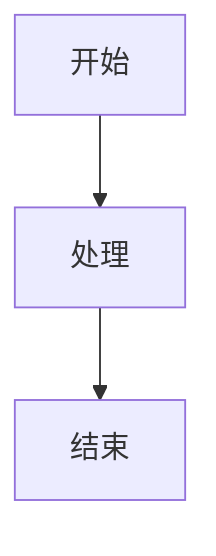

# cFireworks 技术博客编辑指南

## 博客定位

**受众**：中文技术社区的开发者、技术爱好者

**核心价值**：深入浅出地探究前沿技术，提供有独立见解的实践分享

**重点领域**：AI Agent、LLM、RAG、MCP、Skills Protocol、代码沙箱、开发者工具

## 内容风格

### 语言风格

- **轻松可读**：避免过度学术化的语言，用日常对话的方式解释技术
- **深入浅出**：从实际问题出发，逐步深入技术细节
- **有干货**：每篇文章至少包含一个可实践的技术点或代码示例
- **有独立见解**：不做简单的新闻转述，要有自己的分析和思考

### 必须避免

❌ 空洞的营销文案（如「革命性」「颠覆性」「改变世界」）  
❌ 纯翻译的外文文章（可以参考，但要加入自己的理解）  
❌ 纯新闻转述（没有分析和见解）  
❌ 过时的技术内容（优先关注最新发展）  
❌ 纯代码堆砌（代码要有清晰的讲解）

### 推荐元素

✅ **对比表格**：清晰展示不同方案的优劣  
✅ **架构示意图**：用 Mermaid 或 SVG 图解技术架构  
✅ **代码示例**：实际可运行的代码片段  
✅ **实践案例**：真实的应用场景和解决方案  
✅ **延伸思考**：技术背后的设计理念和未来趋势

## 文章结构模板

### 标准长文结构（2000-4000字）

```markdown
---
title: 文章标题（清晰、有吸引力）
date: YYYY-MM-DD HH:MM:SS
categories:
  - 主分类
tags:
  - 标签1
  - 标签2
  - 标签3
---

## 开场（100-200字）
- 用一个引人入胜的场景或问题开头
- 简明扼要说明本文要解决什么问题
- 一句话概括核心观点

<!-- more -->

## 问题/背景（500-800字）
- 详细描述问题或技术背景
- 用对比表格或列表展示现状
- 引出「为什么需要新方案」

## 解决方案/技术分析（1000-1500字）
- 分点讲解技术方案
- 包含架构图和代码示例
- 用子标题组织内容

### 子主题 1
- 技术细节
- 代码示例

### 子主题 2
- 实现机制
- 示意图

## 实践建议（500-800字）
- 针对不同角色（开发者/企业/用户）的建议
- 可操作的步骤或清单
- 避坑指南

## 未来展望（300-500字）
- 技术发展趋势
- 潜在应用场景
- 开放性思考

## 结语（100-200字）
- 呼应开头
- 一句话总结
- 行动号召

---

## 扩展阅读
- 相关文档链接
- 延伸资源

## 讨论
引导读者参与讨论
```

### 快讯/短文结构（500-1000字）

```markdown
---
title: 简短标题
date: YYYY-MM-DD HH:MM:SS
categories:
  - 技术快讯
tags:
  - 标签
---

## 核心信息
- 新闻/技术要点
- 简要分析

## 为什么重要
- 影响和意义
- 个人观点

## 延伸
- 相关链接
```

## 技术要素规范

### 代码块

```python
# 所有代码块必须标注语言
# 包含必要的注释
def example_function():
    """清晰的文档字符串"""
    pass
```

### 示意图

优先使用 Mermaid 语法：



复杂图表可以使用 SVG，放在 `source/images/` 目录。

### 对比表格

| 维度 | 方案 A | 方案 B |
|------|-------|-------|
| 性能 | ⭐⭐⭐ | ⭐⭐⭐⭐⭐ |
| 易用性 | ⭐⭐⭐⭐ | ⭐⭐ |

### 图片规范

- 截图和配图放在 `source/images/YYYY-MM/` 目录
- 文件名使用小写字母和连字符：`architecture-diagram.png`
- 图片宽度不超过 1200px
- 使用 WebP 或 PNG 格式

## 发布流程

### 1. 创建新文章

```bash
# 方式一：手动创建
# 在 source/_posts/ 目录创建新的 .md 文件

# 方式二：使用 Hexo 命令
npx hexo new post "文章标题"
```

### 2. Front Matter 规范

```yaml
---
title: 文章标题
date: 2026-09-30 18:00:00  # 北京时间
updated: 2026-09-30 20:00:00  # 可选，更新时间
categories:
  - 主分类  # 只选一个主分类
tags:
  - 标签1
  - 标签2
  - 标签3  # 3-5个标签
description: 文章摘要（用于SEO和社交分享）
---
```

### 3. 本地预览

```bash
# 安装依赖（首次）
npm install

# 启动本地服务器
npx hexo server

# 浏览器访问 http://localhost:4000
```

### 4. 提交发布

```bash
# 提交到 Git
git add source/_posts/你的文章.md
git commit -m "新文章：文章标题"
git push

# GitHub Actions 会自动构建并部署
```

### 5. 验证部署

- 推送后等待 2-5 分钟
- 访问 https://cfireworks.github.io 查看更新

## 质量检查清单

发布前请确认：

- [ ] 标题清晰有吸引力，不超过 30 字
- [ ] Front Matter 信息完整正确
- [ ] 文章结构完整（开场、主体、结语）
- [ ] 至少包含 1 个代码示例或架构图
- [ ] 所有外部链接可访问
- [ ] 图片已优化，加载速度快
- [ ] 中文标点符号正确（，。！？）
- [ ] 代码块有语言标注
- [ ] 本地预览无格式错误
- [ ] 文章字数在 800-4000 字之间

## 分类和标签规范

### 主要分类

- **AI Agent**：Agent 架构、实现、应用
- **LLM 应用**：大语言模型的实践应用
- **RAG 技术**：检索增强生成相关
- **开发工具**：效率工具、开发环境
- **架构设计**：系统设计、技术架构
- **技术快讯**：业界新闻和快讯

### 常用标签

技术类：`AI Agent`, `LLM`, `RAG`, `MCP`, `Skills`, `Prompt Engineering`, `Vector DB`, `沙箱`, `安全`

工具类：`Cursor`, `GitHub Copilot`, `VS Code`, `Docker`, `Kubernetes`

语言类：`Python`, `TypeScript`, `Go`, `Rust`

## 写作技巧

### 1. 开场吸引注意力

❌ 差：「今天我们来介绍一下 XXX 技术」  
✅ 好：「当你第 100 次重复同样的代码审查时，有没有想过让 AI 来做这件事？」

### 2. 用具体例子而非抽象概念

❌ 差：「这个技术有很多优点」  
✅ 好：「使用这个技术后，我们的查询速度从 2 秒降到 200ms」

### 3. 技术深度与可读性平衡

- 避免一次性抛出太多概念
- 用类比和比喻解释复杂概念
- 先讲「是什么、为什么」，再讲「怎么做」

### 4. 数据和案例支撑观点

- 引用基准测试数据
- 分享真实项目经验
- 对比不同方案的实际效果

## 更新记录

- **2026-09-30**：初始版本，定义博客风格和流程
