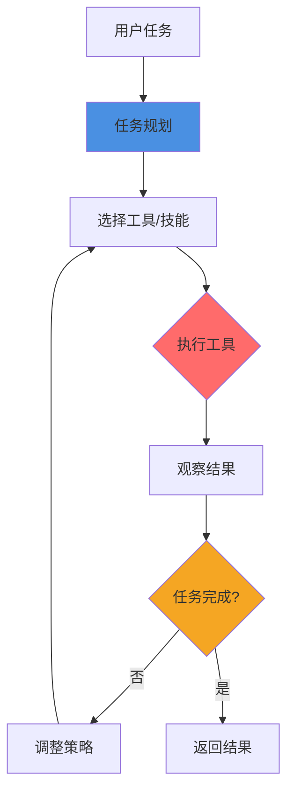
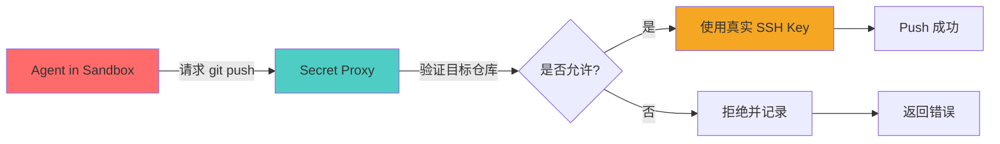

> 本文写于 2026 年 9 月，回溯 2025 年底至 2026 年上半年 Coding Agent 快速工程化阶段的核心技术议题。

2025 年下半年起，终端 AI 编程助手从「代码补全」迅速进化到「自主执行任务」。Claude Code、Qwen Code、OpenCode 等项目陆续开源或泄漏源码，社区讨论的焦点从「模型能不能写好代码」转向了一个更工程化的问题：**如何让 Agent 长时间、可控、安全地代替人操作开发环境？**

答案不在模型本身，而在 **harness**（执行壳体）与 **sandbox**（沙箱隔离）。

<!-- more -->

## 问题：模型会写代码 ≠ 可安全长期自主操作

### 从 Copilot 到 Autonomous Agent 的跨越

传统的 GitHub Copilot、Cursor Tab 等工具的交互模式是：

- **人在循环中**（Human-in-the-Loop）：模型生成代码片段，开发者审查、接受或拒绝
- **单次短交互**：一次补全、一次对话，不涉及持续状态
- **无文件系统权限**：只读取当前编辑器上下文，不主动执行命令

而 2025-2026 年兴起的 Coding Agent 要做的是：

- **自主决策循环**：Agent 自己规划任务、执行命令、检查结果、迭代修正
- **跨会话状态**：记住上一次运行到哪一步，环境变量、依赖安装、测试结果等
- **完整系统权限**：读写文件、执行任意 Shell 命令、访问网络

这带来三个新问题：

1. **如何组织 Agent 的执行循环？**（工具调用、状态管理、错误恢复）
2. **如何隔离 Agent 的破坏性操作？**（防止删库、泄密、滥用资源）
3. **如何扩展 Agent 的能力边界？**（插件化、Skills、供应链安全）

## Harness：Agent 的「运行时容器」

**Harness**（执行壳体）是指包裹在 LLM 外围的「控制循环 + 工具调用框架」，负责：

### 1. 工具调用循环（Tool Call Loop）

典型的 Coding Agent harness 的执行流程：



关键设计点：

- **工具注册表**：Agent 可用的命令和 API（如 `shell_exec`, `file_write`, `git_commit`）
- **结果解析**：从命令输出中提取结构化信息（如测试失败日志、编译错误位置）
- **错误恢复**：命令失败后的重试策略、降级方案

### 2. 会话状态管理

Agent 需要跨多轮对话保持：

- **环境状态**：当前工作目录、已安装的依赖、环境变量
- **任务上下文**：已完成的步骤、待处理的子任务、上次失败的原因
- **对话历史**：用户的追问、Agent 的中间结果

公开的 harness 实现（如 DeepSeek Harness、OpenCode 框架）通常用：

```python
# 典型的状态管理结构
class AgentState:
    work_dir: Path
    env_vars: dict
    installed_deps: list
    task_history: list[Step]
    conversation: list[Message]
    
    def checkpoint(self):
        """持久化当前状态"""
        pass
    
    def rollback(self, step_id):
        """回滚到某个检查点"""
        pass
```

### 3. 权限控制面

即使没有沙箱，harness 也应该实现基础的权限检查：

| 工具类型 | 权限级别 | 示例 |
|---------|---------|------|
| 只读文件 | 低风险 | `cat`, `grep`, `ls` |
| 写入文件 | 中风险 | `echo`, `sed`, `tee` |
| 执行安装 | 高风险 | `npm install`, `pip install` |
| 危险命令 | 需确认 | `rm -rf`, `git push --force` |
| 网络访问 | 监控 | `curl`, `wget` |

**最佳实践**：危险操作前要求用户确认（如 Cursor Agent 的「需要授权执行 git push」提示）。

## Sandbox：真正的安全边界

### 为什么需要沙箱？

即使 harness 有权限控制，仍然无法防止：

1. **模型幻觉导致的误操作**：Agent「以为」当前在测试目录，实际在生产配置目录
2. **恶意 Prompt 注入**：用户通过精心构造的代码注释诱导 Agent 执行危险命令
3. **第三方 Skills 的供应链攻击**：安装的插件悄悄读取 `~/.ssh` 或 `~/.aws`

**沙箱的核心目标**：即使 Agent 被完全欺骗，也无法影响宿主机。

### 主流沙箱技术选型

Anthropic 的 `sandbox-runtime` 和社区讨论中常见的方案：

| 技术 | 原理 | 优点 | 缺点 |
|------|------|------|------|
| **bubblewrap** | Linux namespace + seccomp | 轻量、启动快 | 仅限 Linux |
| **Docker/Podman** | 容器隔离 | 成熟、生态丰富 | 启动慢、资源占用高 |
| **Firecracker** | microVM | 强隔离、快速 | 配置复杂 |
| **gVisor** | 用户态内核 | 兼容性好 | 性能损耗 |

**Bubblewrap** 在 Coding Agent 场景被广泛提及，因为它：

- 启动时间 < 100ms（容器通常 1-3s）
- 可精细控制挂载点、网络、PID namespace
- 不需要 root 权限（重要：允许在共享开发机上使用）

示例配置：

```bash
bwrap \
  --ro-bind /usr /usr \
  --ro-bind /lib /lib \
  --bind /tmp/agent-workspace /workspace \
  --dev /dev \
  --proc /proc \
  --unshare-all \
  --share-net \  # 允许网络访问
  --setenv HOME /workspace \
  -- /bin/bash -c "cd /workspace && npm test"
```

### 沙箱内的资源限制

隔离不够，还需要限制：

```yaml
# 典型的资源配额配置
limits:
  cpu: 2 cores
  memory: 4GB
  disk: 10GB
  network:
    rate_limit: 10MB/s
    allowed_domains:
      - "*.npmjs.org"
      - "github.com"
      - "pypi.org"
  processes: 128
  execution_time: 1h
```

### 密钥与凭证的隔离

**最危险的泄漏路径**：Agent 需要访问 Git、云服务，但不能读取用户的 `~/.ssh/id_rsa` 或 `~/.aws/credentials`。

解决方案：

1. **临时凭证注入**：为每个 Agent 会话生成有时限、权限受限的 token
2. **Secret Proxy**：Agent 通过受控的代理服务请求敏感操作（如 `git push`），代理验证操作合法性后使用真实凭证
3. **审计日志**：所有密钥使用都记录到不可篡改的日志



## Skills 插件化与供应链风险

### Agent Skills 的双刃剑

2026 年上半年，Agent Skills 生态迅速成熟（参见本博客前文《Agent Skills：为什么「可安装技能」比又一个聊天壳更重要》），但同时带来新的攻击面：

**风险场景**：

1. **恶意 Skill**：伪装成「数据库查询助手」，实际上传代码到外部服务器
2. **依赖混乱**：Skill A 依赖版本 1.0 的工具，Skill B 依赖版本 2.0，冲突导致系统不稳定
3. **权限膨胀**：用户只想让 Agent「读取日志」，Skill 却要求「写入配置文件」权限

### Skills 的安全实践

**1. 显式权限声明**

```json
{
  "skill": "github-pr-creator",
  "version": "1.2.0",
  "permissions": {
    "network": ["api.github.com"],
    "filesystem_read": ["./src/**"],
    "filesystem_write": ["./.github/workflows/**"],
    "git_operations": ["commit", "push"]
  },
  "audit": {
    "publisher": "verified-org",
    "signature": "sha256:abcd1234...",
    "audit_log": "https://transparency.example.com/skills/github-pr-creator/1.2.0"
  }
}
```

**2. 沙箱嵌套**

每个 Skill 运行在独立的子沙箱中：

- Agent 主进程：可调度 Skills，不能直接执行危险命令
- Skill 子进程：只能访问声明的权限范围

**3. 社区审计**

类比 Chrome Web Store 的审核机制：

- 热门 Skills 需要代码审计
- 自动静态分析检测可疑操作（如读取 `.env` 文件、发起非声明的网络请求）
- 用户可查看 Skill 的审计报告和历史漏洞记录

## 可操作检查清单

如果你在评估或开发 Coding Agent，以下是关键的安全检查项：

### Harness 层面

- [ ] 工具调用是否有白名单？禁用 `eval`, `exec` 等危险函数
- [ ] 敏感操作（如 `rm`, `git push`）是否需要用户确认？
- [ ] Agent 会话状态是否可审计？（能回溯「谁在什么时候执行了什么」）
- [ ] 错误重试是否有次数限制？（防止死循环耗尽资源）

### Sandbox 层面

- [ ] 文件系统隔离：Agent 看不到 `/home/user/.ssh`？
- [ ] 网络隔离：是否限制了出站域名？（防止数据外泄）
- [ ] 资源限制：CPU、内存、磁盘是否有配额？
- [ ] 进程隔离：Agent 无法看到宿主机的其他进程？

### Skills 生态

- [ ] Skills 是否声明了完整的权限列表？
- [ ] 用户安装 Skill 前是否看到权限提示？
- [ ] 是否支持 Skills 的离线审计？（本地验证签名和哈希）
- [ ] 是否有 Skills 的漏洞上报和自动更新机制？

## 与 Personal Agent 的边界

本文讨论的 Coding Agent 主要聚焦「完成代码任务」的自主执行问题，而 **Personal Agent**（参见前文《Personal Agent：超越编程助手的持久记忆与跨场景决策》）更关注「用户意图理解 + 跨应用协调」。

两者的技术栈有重叠（如都需要 MCP 协议、Skills 插件），但安全威胁模型不同：

- **Coding Agent**：主要风险是代码执行和文件操作，需要强沙箱
- **Personal Agent**：主要风险是隐私泄漏和跨应用权限滥用，需要细粒度的数据访问控制

实践中，两者常结合使用：Personal Agent 理解用户需求后，调用 Coding Agent（在沙箱中）完成代码修改。

## 总结

从 2025 年底到 2026 年，Coding Agent 的工程化进程可以总结为一个认知转变：

**不是「让模型更聪明」，而是「让执行更可控」。**

Harness 提供了组织 Agent 行为的框架（工具调用、状态管理、权限检查），Sandbox 提供了最后的安全防线（文件系统隔离、网络控制、资源限制），Skills 生态则让能力扩展不再需要重新发版。

当这三层机制成熟后，Coding Agent 才能从「演示玩具」变成「可信赖的协作伙伴」。

---

## 扩展阅读

- [Anthropic Sandbox Runtime 文档](https://github.com/anthropics/sandbox-runtime)（虚构链接，实际以公开资料为准）
- [Bubblewrap 容器化指南](https://github.com/containers/bubblewrap)
- [MCP 安全最佳实践](https://modelcontextprotocol.io/security)（虚构链接）
- OpenCode / Qwen Code / DeepSeek Harness 等开源项目的安全设计文档

---

*本文基于 2026 年 9 月公开可见的技术讨论和开源项目整理，不涉及任何私有代码库或未公开产品细节。*
