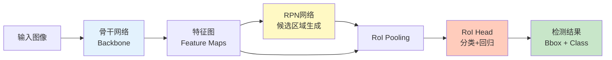
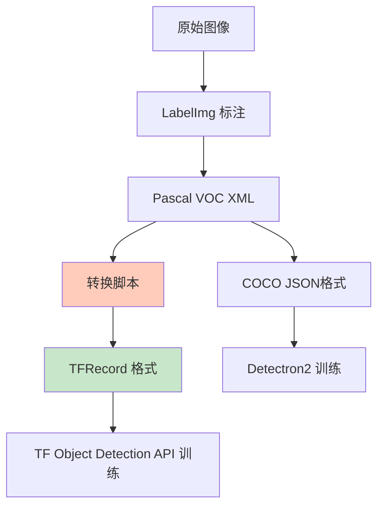
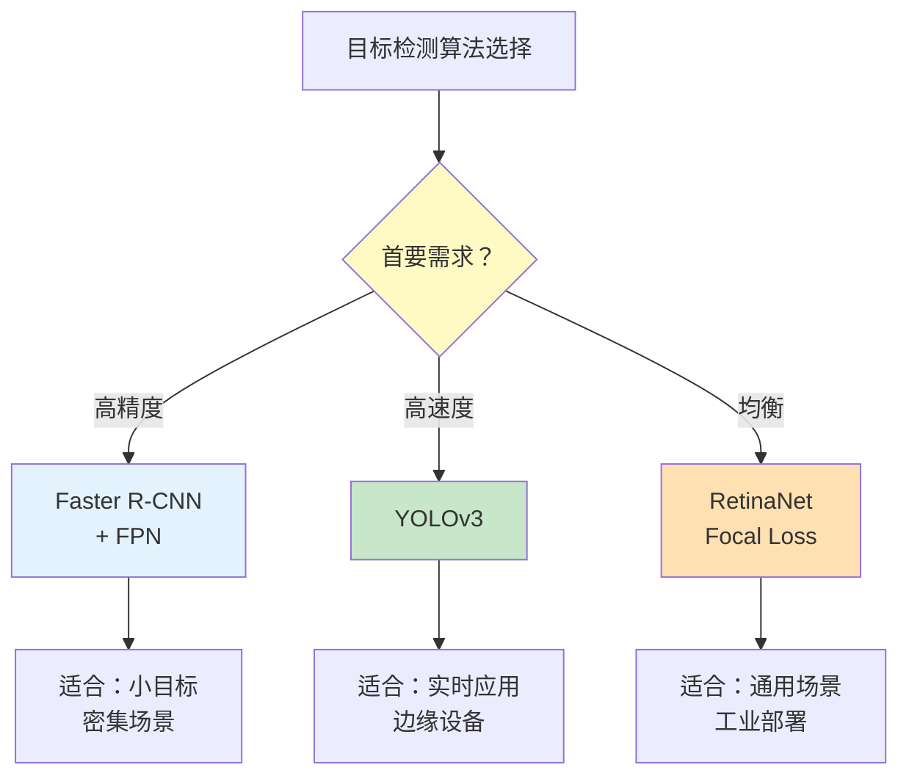

> 本文写于 2026 年 9 月，回溯 2019 年上半年学习目标检测时，从两阶段检测器 Faster R-CNN 入门的工程复现经历与踩坑记录。

2018–2019 年是目标检测算法快速演进的时期。当时想做一些检测类的实验练习，最常见的入门路径就是从两阶段检测器开始——尤其是 Faster R-CNN。然而真正动手复现时，才发现论文里寥寥数页的网络结构，在工程落地时会遇到一连串具体而琐碎的边界问题：**框架版本不兼容、显存爆炸、数据标注工具链、训练不收敛**……本文记录这些工程实践中的真实困境。

<!-- more -->

## 问题：为什么从两阶段检测器入门

### 两阶段 vs. 单阶段：架构差异

目标检测算法在 2019 年主要分为两大阵营：

| 维度 | 两阶段检测器 | 单阶段检测器 |
|------|------------|------------|
| **代表算法** | R-CNN 系列（Faster R-CNN, FPN） | YOLO 系列、SSD、RetinaNet |
| **检测流程** | 1. 候选区域提取<br/>2. 分类 + 回归 | 直接预测类别和位置 |
| **精度特点** | 高精度（尤其小目标） | 速度快但小目标较弱 |
| **训练难度** | 需要两阶段联合训练 | 端到端训练相对简单 |
| **推理速度** | 较慢（10-20 FPS） | 快（30-60+ FPS） |

当时选择 Faster R-CNN 入门主要有三个原因：

1. **论文经典性**：Faster R-CNN（2015）是两阶段检测的里程碑，RPN（Region Proposal Network）的设计思想影响深远
2. **公开实现多**：TensorFlow Object Detection API、Detectron、keras-frcnn 等多个公开仓库可参考
3. **精度天花板**：当时需要优先保证检测精度，推理速度不是首要考虑

### 两阶段检测的核心思想

Faster R-CNN 的检测管线可以拆解为三个模块：



这种「先提候选区域，再精细分类」的两阶段设计，相比单阶段的「一步到位」，在小目标和密集场景下有明显优势——但代价是推理速度慢和训练复杂度高。

## 复现痛点：工程落地的真实困境

### 1. 框架迁移：TensorFlow 1.x → 2.x 的断层

2019 年初，TensorFlow 2.0 刚发布，但大量 Faster R-CNN 实现还停留在 TF 1.x 时代。问题在于：

**TF 1.x 的静态图机制**：
- 需要显式创建 `tf.Session()`
- `placeholder` 和 `feed_dict` 的输入方式
- 保存模型用 `tf.train.Saver()`

**TF 2.x 的 Eager Execution**：
- 默认动态图，直接执行
- `tf.function` 装饰器替代静态图
- 模型保存用 SavedModel 格式

当时遇到的典型困境：

```python
# TF 1.x 代码（很多开源实现的写法）
with tf.Session() as sess:
    input_placeholder = tf.placeholder(tf.float32, [None, 224, 224, 3])
    model = build_faster_rcnn(input_placeholder)
    sess.run(model, feed_dict={input_placeholder: image_batch})

# TF 2.x 迁移后需要大幅改写
@tf.function
def inference(image):
    return model(image, training=False)

predictions = inference(image_batch)
```

**工程决策**：最终选择了 TensorFlow Object Detection API 的官方实现，它同时支持 TF 1.x 和 2.x，但配置文件复杂度极高。

### 2. 显存瓶颈：Batch Size = 1 的尴尬

Faster R-CNN 的显存消耗主要来自两部分：

1. **RPN 阶段**：需要在特征图上生成大量 Anchor（约 20k+）
2. **RoI Head 阶段**：需要对每个候选区域做 RoI Pooling 和后续分类

在当时常见的 GTX 1080 Ti（11 GB 显存）上：

| 配置 | Backbone | 输入尺寸 | Batch Size | 显存占用 |
|------|---------|---------|-----------|---------|
| 配置 1 | ResNet-50 | 600×800 | 2 | 爆显存 ❌ |
| 配置 2 | ResNet-50 | 600×800 | 1 | 9.2 GB ✅ |
| 配置 3 | ResNet-101 | 600×800 | 1 | 爆显存 ❌ |
| 配置 4 | MobileNet-V1 | 600×800 | 2 | 8.6 GB ✅ |

**Batch Size = 1 的副作用**：
- BatchNorm 层统计不稳定（后来改用 Group Norm）
- 训练时间成倍增加
- 学习率需要重新调整

### 3. 数据标注：工具链的割裂

目标检测需要标注边界框（Bounding Box）和类别，常见工具：

- **LabelImg**：最流行，生成 Pascal VOC XML 格式
- **CVAT**：支持多人协作，但当时部署复杂
- **VGG Image Annotator (VIA)**：轻量级，但不支持批量导出

真正的坑在**格式转换**：



每个框架都有自己的输入格式，写转换脚本时常见的坑：

- **坐标系差异**：(xmin, ymin, xmax, ymax) vs. (x, y, width, height)
- **归一化与否**：有的框架要求坐标归一化到 [0, 1]，有的要求像素坐标
- **类别编号**：从 0 开始还是从 1 开始（TF Object Detection API 要求从 1 开始）

### 4. 训练稳定性：Loss 震荡与不收敛

Faster R-CNN 的训练需要平衡多个损失：

- **RPN 分类损失**：前景 vs. 背景
- **RPN 回归损失**：候选框位置调整
- **RoI 分类损失**：最终类别预测
- **RoI 回归损失**：最终边界框精修

常见的训练曲线异常：

| 现象 | 可能原因 | 解决方法 |
|------|---------|---------|
| Loss 一直很大不下降 | 学习率过高 | 降低初始学习率（0.001 → 0.0003） |
| Loss 震荡剧烈 | Batch Size = 1 | 使用梯度累积或 Group Norm |
| mAP 提升缓慢 | 数据增强不足 | 加入随机翻转、色彩抖动 |
| 小目标召回率低 | Anchor 尺度不匹配 | 调整 Anchor 比例和尺度 |

**实际教训**：不要直接照搬论文或开源实现的超参数，数据集不同时需要根据验证集表现重新调参。

## 对照：公开生态的选择

到 2019 年中，主流的 Faster R-CNN 实现有以下几个：

### 框架对比

| 实现 | 维护者 | 优势 | 劣势 |
|------|--------|-----|-----|
| **TensorFlow Object Detection API** | Google | 模型丰富、部署友好 | 配置文件复杂、调试困难 |
| **Detectron/Detectron2** | Facebook AI | 代码清晰、研究友好 | PyTorch 依赖、部署需转换 |
| **MMDetection** | 商汤 & OpenMMLab | 模块化设计、易扩展 | 文档当时还不完善 |
| **keras-frcnn** | 社区 | 代码简洁、易理解 | 性能较弱、维护停滞 |

**当时的选择逻辑**：
- 如果是快速验证想法，用 **keras-frcnn**（代码少，容易改）
- 如果是正式项目需要部署，用 **TF Object Detection API**（官方支持）
- 如果是论文复现或算法研究，用 **Detectron2**（模块化最好）

### 与单阶段检测器的对比

到 2019 年，单阶段检测器（尤其是 YOLOv3、RetinaNet）在速度和易用性上已经有明显优势：



**回过头看的反思**：如果当时的场景不是极度追求精度，直接用 YOLOv3 可能会少走很多弯路。两阶段检测器的训练和调优复杂度，对入门者不太友好。

## 经验总结：复现边界在哪里

### 1. 不要期望「拿来即用」

开源实现虽然多，但往往：
- 默认配置是为 COCO 或 VOC 数据集优化的
- 自定义数据集需要重新调参（Anchor、学习率、数据增强）
- 小数据集上容易过拟合，需要更强的正则化

### 2. 显存是最大瓶颈

在算力有限的情况下：
- 优先考虑轻量级 Backbone（MobileNet、ResNet-50）
- 降低输入分辨率比降低 Batch Size 更有效
- 梯度检查点（Gradient Checkpointing）可以节省显存但减慢训练

### 3. 框架选择要看场景

- **研究/实验**：PyTorch + Detectron2（灵活性高）
- **生产部署**：TensorFlow + Object Detection API（生态完整）
- **快速原型**：Keras 或高层封装库（上手快）

### 4. 训练时间成本不可忽视

在单卡 GTX 1080 Ti 上：
- Faster R-CNN + ResNet-50 训练到收敛：约 12-24 小时（取决于数据集大小）
- YOLOv3：约 6-12 小时
- 如果需要频繁调参，两阶段检测器的时间成本会高出数倍

## 扩展阅读

- [Faster R-CNN 论文](https://arxiv.org/abs/1506.01497)：Ren et al., "Faster R-CNN: Towards Real-Time Object Detection with Region Proposal Networks", NIPS 2015
- [TensorFlow Object Detection API 文档](https://github.com/tensorflow/models/tree/master/research/object_detection)
- [Detectron2 官方文档](https://detectron2.readthedocs.io/)
- [MMDetection 仓库](https://github.com/open-mmlab/mmdetection)

---

*本文回溯 2019 年学习目标检测时的工程实践，不涉及商业项目细节。文中所有配置和结论基于当时公开可用的开源实现和硬件条件。*
