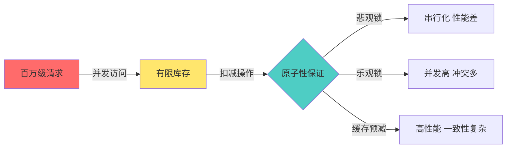
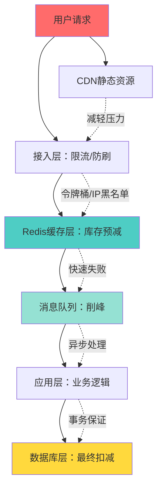

**写在前面**：这是一篇时间线回溯文章，记录 2020 年中从计算机视觉实验转向后端工程时，对高并发秒杀场景的工程边界理解。当年做过两套秒杀练习仓，但本文不展开具体实现，而是围绕公开知识体系——超卖防控、库存预减、消息队列削峰、数据库锁选型等——梳理设计决策清单。

<!-- more -->

## 一、问题边界：秒杀为何是高并发试金石

电商秒杀（Flash Sale）是典型的**瞬时高并发 + 强一致性**场景：

- **流量尖刺**：活动开始瞬间，请求量可能是平时的 100-1000 倍
- **库存稀缺**：商品数量有限（如 100 件），但请求量可能达到百万级
- **超卖零容忍**：售出数量绝不能超过库存，否则产生业务事故
- **用户体验敏感**：响应超过 3 秒用户就会流失，系统不能因流量崩溃

这四个约束构成了秒杀系统的**工程边界**：在保证不超卖的前提下，尽可能多地承接流量并快速响应。

### 核心矛盾



## 二、分层架构：流量控制的四道防线

秒杀系统不能简单地把所有请求直接打到数据库，需要建立**多层防护**：



### 第一层：CDN 静态化

- **目标**：秒杀页面的 HTML/CSS/JS/图片全部走 CDN
- **效果**：90% 的静态资源请求不到达源站
- **注意**：倒计时、库存数字等动态数据通过 AJAX 异步加载

### 第二层：接入层限流

常见策略：

1. **令牌桶算法**：控制单位时间内的请求总量
2. **IP/用户维度限流**：防止单个用户/IP 疯狂刷接口
3. **验证码**：在流量高峰时强制人机验证

### 第三层：Redis 库存预减

这是秒杀系统的**核心优化**：

- 在 Redis 中维护库存缓存（如 `stock:item_123 = 100`）
- 每次请求先用 `DECR` 命令原子性扣减缓存库存
- 如果返回值 < 0，说明库存不足，直接返回"已售罄"
- 优点：Redis 单线程模型天然保证原子性，QPS 可达 10 万+
- 缺点：需要处理缓存与数据库的一致性

### 第四层：消息队列削峰

通过 Redis 预减后的请求，进入**消息队列**（Kafka/RabbitMQ/RocketMQ）：

- **异步解耦**：前端快速返回"排队中"，后端慢慢处理
- **削峰填谷**：将瞬时 10 万 QPS 的流量，平滑到后端可承受的 5000 QPS
- **可靠性**：消息持久化，系统重启后可继续处理

## 三、数据库层：超卖防控的最后防线

即使前面做了库存预减，数据库层仍然要**保证最终一致性**，防止超卖。

### 方案对比

| 方案 | 实现 | 优点 | 缺点 | 适用场景 |
|------|------|------|------|----------|
| **悲观锁** | `SELECT ... FOR UPDATE` | 绝对不会超卖 | 串行化，性能差 | 库存极少时（如 < 10 件） |
| **乐观锁** | `WHERE stock > 0` + 版本号 | 并发高 | 高冲突时重试多 | 库存充足时 |
| **Redis 原子性** | `DECR` + 兜底校验 | 性能最优 | 需要保证缓存一致性 | 大部分秒杀场景 |

### 经典 SQL 实现（乐观锁）

```sql
-- 扣减库存，同时检查库存充足
UPDATE product 
SET stock = stock - 1, version = version + 1
WHERE id = 123 
  AND stock > 0 
  AND version = @old_version;

-- 如果影响行数为 0，说明库存不足或版本冲突，扣减失败
```

### 缓存一致性处理

Redis 库存与数据库库存的一致性是**难点**：

1. **初始化**：秒杀开始前，将数据库库存同步到 Redis
2. **预减容错**：Redis 扣减成功 ≠ 最终下单成功（可能支付超时、风控拦截）
3. **补偿机制**：定时任务将数据库库存回写到 Redis（处理异常情况）
4. **兜底校验**：数据库层仍要用乐观锁再次检查，Redis 只是提前过滤

## 四、关键决策清单

基于 2020 年的实践，总结以下决策点：

### 设计阶段

- [ ] **流量评估**：预估峰值 QPS，是否需要分布式架构？
- [ ] **库存规模**：库存量级决定锁策略（< 100 件可考虑悲观锁）
- [ ] **一致性要求**：是否允许短暂的缓存不一致？
- [ ] **技术栈选型**：Redis、消息队列、数据库版本是否支持所需特性？

### 实现阶段

- [ ] **接口幂等性**：防止用户重复提交（Token 机制或唯一约束）
- [ ] **限流粒度**：按 IP、用户 ID、设备指纹？
- [ ] **Redis 持久化**：AOF 或 RDB？容忍多少数据丢失？
- [ ] **消息队列顺序**：是否需要保证顺序消费？

### 测试阶段

- [ ] **压测验证**：使用 JMeter/Gatling 模拟真实流量
- [ ] **超卖测试**：并发 1000 线程扣减 100 库存，验证最终库存为 0
- [ ] **降级预案**：Redis 挂掉、消息队列堆积时的兜底方案
- [ ] **监控告警**：库存异常、响应时间超标、错误率飙升的告警

## 五、避坑指南

### 坑 1：Redis DECR 负数陷阱

```bash
# 错误写法：DECR 可以一直减到负数
DECR stock:item_123  # 可能返回 -1, -2, -3...

# 正确写法：先判断再扣减（使用 Lua 脚本保证原子性）
EVAL "
  local stock = redis.call('GET', KEYS[1])
  if tonumber(stock) > 0 then
    return redis.call('DECR', KEYS[1])
  else
    return -1
  end
" 1 stock:item_123
```

### 坑 2：数据库连接池耗尽

秒杀瞬间大量请求打到数据库，可能导致连接池耗尽：

- **方案**：通过消息队列控制消费速率，避免直接冲击数据库
- **配置**：合理设置连接池大小（推荐 `核心数 * 2 + 有效磁盘数`）

### 坑 3：缓存击穿

秒杀开始瞬间，如果 Redis 缓存失效，大量请求会同时打到数据库：

- **方案 1**：提前预热缓存，设置较长过期时间
- **方案 2**：使用分布式锁，只让一个请求去加载缓存
- **方案 3**：缓存永不过期，通过异步任务更新

## 六、技术选型参考

基于开源生态的常见组合：

### 经典栈（适合学习）

- **缓存**：Redis 5.0+（支持 Lua 脚本）
- **消息队列**：RabbitMQ（简单易用）
- **数据库**：MySQL 5.7+（InnoDB 行锁）
- **限流**：Guava RateLimiter / Nginx limit_req

### 生产级栈

- **缓存**：Redis Cluster（高可用）
- **消息队列**：Kafka / RocketMQ（高吞吐）
- **数据库**：MySQL 8.0 / TiDB（分布式事务）
- **限流**：Sentinel / Hystrix / 自研网关

## 结语

秒杀系统是高并发工程的**缩影**，它考验的不仅是技术选型，更是对分层设计、边界划分、一致性权衡的理解。2020 年那两套练习项目虽然简陋，但让我体会到：

> **真正的工程能力，不在于堆砌技术栈，而在于理解每一层的职责边界，以及边界之间如何协作、如何容错。**

这套思维方式，后来在实际业务中反复验证过：当流量来临时，架构分层清晰的系统往往能从容应对；而边界模糊的系统，则容易在某个薄弱环节崩溃。

---

## 扩展阅读

- [Redis 官方文档：DECR 命令与原子性](https://redis.io/commands/decr/)
- [RabbitMQ 核心概念：削峰填谷模式](https://www.rabbitmq.com/tutorials/tutorial-one-python.html)
- [MySQL InnoDB 锁机制详解](https://dev.mysql.com/doc/refman/8.0/en/innodb-locking.html)
- [CNCF 云原生架构：高可用设计模式](https://www.cncf.io/blog/)

---

*本文所有架构图使用 Mermaid 绘制。相关技术点均基于公开文档和开源社区最佳实践。*
