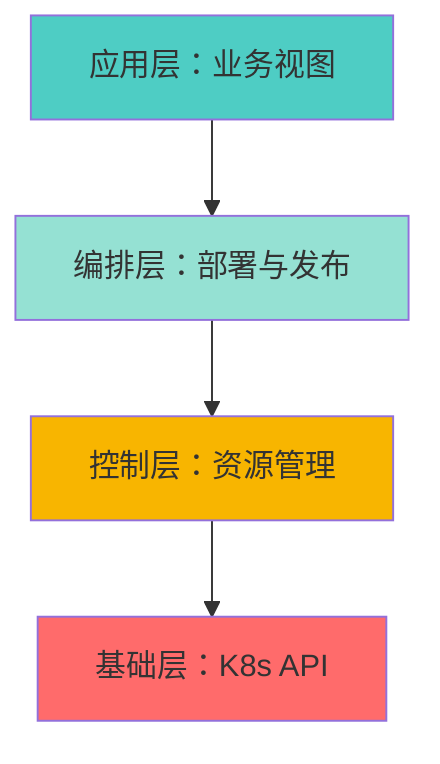
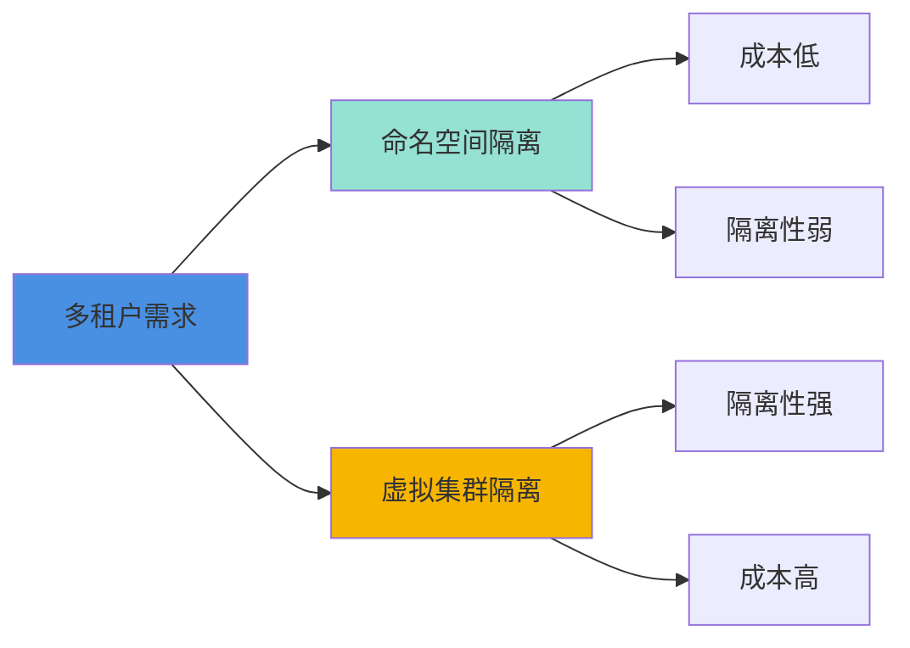

> 本文写于 2026 年 9 月，回溯 2022 年云原生平台建设的实践与思考。

2022 年前后，云原生运维平台进入了一个特殊的热潮期。不少团队都在思考：我们需不需要一个自己的 K8s 管理台？这个问题背后，是对「平台化」的向往，也是对工程复杂度的低估。

四年后回看，当时的很多选择和困境，依然值得今天的平台团队参考。

<!-- more -->

## 问题：为什么团队都想做「平台」

### 三个典型驱动力

2022 年前后，驱动团队自建运维平台的原因通常有三个：

1. **可见性焦虑**：Kubernetes 的 YAML 配置分散在各个 Git 仓库，没有统一的视图看到「我们到底有多少服务在跑」
2. **权限困境**：开发想要部署权限，运维担心误操作；kubectl 的权限模型太粗放，难以细粒度控制
3. **效率瓶颈**：每次发布都要手动 apply YAML，或者写一堆 CI/CD 脚本，缺乏标准化流程

这些需求本身是合理的。但问题在于，很多团队把「平台」理解为「一个好看的管理界面」，却忽略了平台背后的工程复杂度。

### 开源方案的参照系

当时国内外已经有不少开源的 K8s 管理方案：

- **Rancher / KubeSphere**：成熟的多集群管理平台，但部署复杂，对小团队来说「杀鸡用牛刀」
- **Kuboard / Pixiu**：国产化方向的轻量级方案，界面友好，但定制化能力有限
- **Serverless 思路**：如 laf 这样的「像写博客一样写后端」理念，试图屏蔽 K8s 的复杂性

每种方案都有自己的假设和权衡。自建平台的团队，往往是因为现有方案都无法完美契合自己的场景。

## 平台能力的分层模型

一个运维平台到底要做哪些事？可以分为四层：



### 1. 基础层：K8s API 的封装

最基础的工作是封装 Kubernetes API。这听起来简单，实际上有很多坑：

- **多集群管理**：不同环境（开发/测试/生产）的集群如何统一管理？
- **API 版本兼容**：K8s 版本迭代快，API 经常有 Breaking Changes
- **认证与授权**：如何安全地存储和使用 kubeconfig？

这一层的核心是**稳定性**和**安全性**，而不是功能丰富度。

### 2. 控制层：资源管理的抽象

这一层要解决的是「开发者不应该直接操作 Pod 和 Deployment」的问题：

```yaml
# 运维视角：K8s 资源
apiVersion: apps/v1
kind: Deployment
metadata:
  name: user-service
  namespace: production
spec:
  replicas: 3
  selector:
    matchLabels:
      app: user-service
  template:
    spec:
      containers:
      - name: app
        image: registry.example.com/user-service:v1.2.3
        resources:
          requests:
            memory: "256Mi"
            cpu: "200m"
          limits:
            memory: "512Mi"
            cpu: "500m"

---
# 业务视角：应用配置
application: user-service
environment: production
version: v1.2.3
instances: 3
resources:
  memory: 256Mi - 512Mi
  cpu: 200m - 500m
```

好的平台会提供一个「中间态」的抽象，让业务开发者只关心应用层配置，而不是底层的 K8s 资源细节。

### 3. 编排层：部署与发布流程

这一层是平台价值最集中的地方：

- **发布策略**：蓝绿部署、金丝雀发布、灰度发布
- **回滚机制**：一键回滚到上一个稳定版本
- **健康检查**：自动检测新版本的健康状态
- **通知集成**：发布成功/失败通知到飞书/钉钉/Slack

但这也是**工程量最大**的地方。一个完善的发布流程，涉及到：

- Deployment 滚动更新的监控
- Service / Ingress 的流量切换
- ConfigMap / Secret 的版本管理
- 数据库迁移的协调机制

### 4. 应用层：业务视图的呈现

最上层是面向业务的视图：

- **服务拓扑**：展示服务之间的调用关系
- **成本分析**：各个服务的资源消耗和成本
- **日志聚合**：统一的日志查询入口
- **监控告警**：与 Prometheus / Grafana 的集成

这一层看似简单，实际上需要整合大量的数据源和第三方系统。

## 权限与多租户：YAML 地狱之外的难题

### YAML 地狱的本质

「YAML 地狱」是 K8s 社区的老梗，但它的本质不是 YAML 语法复杂，而是**配置的语义理解成本高**。

一个简单的部署，可能需要配置：

- Deployment：应用的部署规格
- Service：服务暴露方式
- Ingress：外部访问路由
- ConfigMap：应用配置
- Secret：敏感信息
- HPA：自动扩缩容规则
- NetworkPolicy：网络隔离策略
- RBAC：权限控制

这 8 个 K8s 资源，每个都有几十个字段。一个经验丰富的运维工程师可以熟练配置，但对于业务开发者来说，这是一个巨大的学习负担。

### 权限模型的设计困境

K8s 原生的 RBAC 权限模型是基于「资源」和「动作」的：

```yaml
# K8s RBAC：给某个角色授予权限
apiVersion: rbac.authorization.k8s.io/v1
kind: Role
metadata:
  namespace: production
  name: developer
rules:
- apiGroups: ["apps"]
  resources: ["deployments"]
  verbs: ["get", "list", "watch", "update"]
```

但业务场景往往需要更细粒度的控制：

- **按应用分权**：开发 A 只能操作自己负责的服务，不能碰别人的
- **按环境分权**：可以随便操作开发环境，测试环境需要审批，生产环境只读
- **按操作分权**：可以查看日志，但不能修改配置；可以发布，但不能删除

这就需要在 K8s RBAC 之上，再做一层应用层的权限模型。

### 多租户的两种思路



**方案 1：命名空间隔离**

- 每个团队/项目分配一个 Namespace
- 通过 ResourceQuota 限制资源使用
- 通过 NetworkPolicy 限制网络访问

优点：实现简单，资源利用率高
缺点：隔离性弱，误操作可能影响其他租户

**方案 2：虚拟集群隔离**

- 每个租户一个独立的虚拟集群（如 vcluster）
- 完全的 API Server 隔离
- 租户感知不到共享底层集群

优点：隔离性强，安全性高
缺点：管理复杂度高，资源开销大

2022 年的多数团队选择了方案 1，因为成本和复杂度的考量。但随着安全要求的提升，方案 2 在 2024 年后开始流行。

## 运维 vs 产品化：无法避免的冲突

### 工程师的理想主义

做平台的工程师，往往有「完美主义」倾向：

- 界面要美观易用
- 功能要全面强大
- 架构要优雅可扩展
- 代码要整洁健壮

但现实是，平台的用户（业务开发者）并不关心这些。他们只关心：

- 能不能快速部署？
- 出问题了能不能快速回滚？
- 日志在哪里看？

### 产品化的代价

把运维工具「产品化」，意味着要投入大量精力在用户体验上：

| 工程导向 | 产品导向 |
|---------|---------|
| 提供 CLI 工具 | 提供 Web 界面 |
| 文档描述功能 | 界面引导操作 |
| 专业术语 | 业务语言 |
| 功能完备 | 简单易用 |

这两者的矛盾在于：**产品化需要的投入，往往超出运维团队的资源预算**。

一个典型的场景是：

1. 运维团队花 2 周做了一个「一键发布」功能
2. 业务团队反馈：「为什么要填这么多参数？」「能不能自动识别？」「能不能加个历史记录？」
3. 运维团队又花 2 周优化交互
4. 业务团队再反馈：「能不能加个回滚按钮？」「能不能看到发布进度？」
5. 循环往复...

最终的结果往往是：平台功能越来越多，但核心的稳定性和性能却被忽视了。

### 组织结构决定系统设计

这个困境的根源，在于**平台团队的定位不清晰**：

- 如果定位为「运维工具」，应该优先保证稳定性和可靠性，界面可以简陋
- 如果定位为「开发者平台」，应该有专职的产品经理和前端工程师，持续优化体验

很多团队陷入中间态：既想要好用，又不愿意投入足够的产品资源。

## 实践清单：如果重新做平台

四年后回看，如果让我重新设计一个运维平台，我会这样做：

### 前置决策清单

- [ ] **明确平台定位**：是内部运维工具，还是面向开发者的产品？
- [ ] **评估团队规模**：小于 20 人的团队，优先考虑成熟的开源方案
- [ ] **确定核心场景**：只做发布管理？还是包含监控、日志、告警？
- [ ] **明确资源投入**：能持续投入多少人力维护和迭代？

### 技术选型清单

- [ ] **不要重新造轮子**：优先基于 Kubernetes Dashboard / Rancher 等改造
- [ ] **API 优先**：先做好 API，界面可以后做
- [ ] **权限模型前置**：一开始就设计好权限体系，后期重构成本极高
- [ ] **日志与监控解耦**：不要自己做日志系统，集成现有的 ELK / Loki

### 产品原则清单

- [ ] **简单大于完美**：一个能用的 MVP 好过一个完美的 PPT
- [ ] **渐进式开放**：先服务核心团队，稳定后再推广
- [ ] **文档与培训**：界面再好也需要配套的使用文档
- [ ] **收集反馈机制**：定期收集用户反馈，而不是闭门造车

### 避坑指南

❌ **不要追求大而全**：先做好部署发布，再考虑其他功能
❌ **不要自己实现 K8s Operator**：除非你有非常特殊的需求
❌ **不要忽视安全**：审计日志、权限控制、密钥管理必须从第一天就考虑
❌ **不要低估前端复杂度**：一个好用的界面，工作量不亚于后端

## 尾声：平台的本质是服务意识

回顾 2022 年的那段平台建设经历，最大的感悟不是技术细节，而是**对「平台」的理解**。

平台不是一个炫酷的界面，也不是一堆强大的功能。平台的本质是**降低团队的协作成本**。

如果一个平台：

- 让业务开发者可以更快地部署和验证想法
- 让运维团队可以更安全地管理生产环境
- 让团队有统一的语言和流程来讨论问题

那么它就是成功的，即使界面简陋、功能有限。

反之，如果一个平台：

- 增加了额外的学习成本
- 引入了新的故障点
- 让问题排查变得更困难

那么它就是失败的，即使技术架构再优雅。

---

## 扩展阅读

- [Kubernetes 官方文档：多租户最佳实践](https://kubernetes.io/docs/concepts/security/multi-tenancy/)
- [CNCF 平台工程白皮书](https://www.cncf.io/blog/2023/05/17/cncf-platforms-white-paper/)
- [KubeSphere 架构设计文档](https://kubesphere.io/docs/v3.3/)
- [Rancher 权限管理指南](https://ranchermanager.docs.rancher.com/pages-for-subheaders/authentication-permissions-and-global-configuration)

---

*本文是「时间线回溯」系列 C 的第一篇，回顾职场中段的平台建设实践。所有示意图使用 Mermaid 绘制。*
