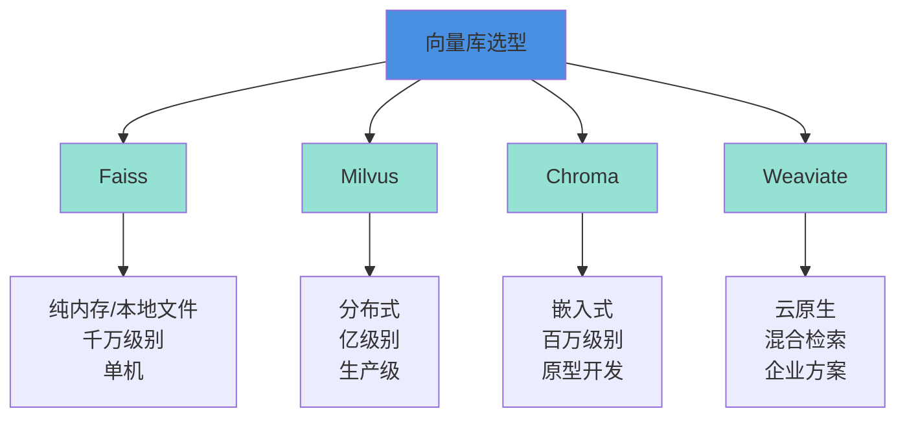

> 本文写于 2026 年 9 月，回溯 2023 年 5 月前后本地知识库热潮时期的技术实践与工程边界。

2023 年上半年，当 ChatGPT 的 API 调用费用让不少团队望而却步时，「把 6B-7B 的模型搬到本地」成了很多人的第一选择。那段时间，GitHub 上各种 `langchain-ChatGLM`、`ChatGLM-RAG`、`Chatchat` 类项目如雨后春笋。我们相信，只要有足够的文档喂给模型，就能得到一个「懂业务」的智能助手。

三年后回头看，那时我们踩过的坑、做过的权衡，恰好勾勒出了本地 RAG 系统的工程边界——也为今天理解 Coding Agent 的记忆层提供了对照。

<!-- more -->

## 问题：为什么要在本地跑知识库

### 三个核心驱动力

2023 年推动本地知识库落地的原因，今天看来依然清晰：

1. **成本考量**：OpenAI API 按 token 计费，企业文档动辄几十万字，每次检索都要消耗上下文，月度账单很容易上万
2. **数据安全**：金融、医疗、法务等行业的敏感文档不能上传到公有云
3. **响应速度**：网络延迟 + API 排队，实际体验常常要等 3-5 秒，本地推理虽慢但可控

当时的典型需求场景：

| 场景 | 文档量级 | 查询频率 | 典型方案 |
|------|---------|---------|---------|
| 企业内部知识库 | 1000-5000 份文档 | 每天 100-500 次 | ChatGLM-6B + Faiss |
| 客服问答系统 | 500-2000 份 FAQ | 每天 1000+ 次 | 本地 Embedding + Milvus |
| 技术文档助手 | 200-1000 份 API 文档 | 按需查询 | LangChain + Chroma |

### 当时的技术选型现实

2023 年可选的开源模型并不多：

- **ChatGLM-6B**：清华 & 智谱的 60 亿参数模型，中文友好，单卡 2080Ti 就能跑
- **LLaMA / Alpaca**：Meta 的基座模型，需要自己微调中文能力
- **Vicuna**：基于 LLaMA 的指令微调版本，但中文表现一般

绝大多数国内团队的第一选择是 ChatGLM-6B——不是因为它最好，而是因为它「刚好够用」且「装得进显卡」。

## 本地 RAG 管线：从文档到答案的五个环节

一个标准的本地 RAG 系统包含这些模块：


### 1. 文档解析：格式地狱的开始

最初大家都低估了「文档解析」的复杂度：

```python
# 天真的第一版
def parse_document(file_path):
    with open(file_path, 'r', encoding='utf-8') as f:
        return f.read()

# 然后发现...
# - PDF 有扫描版和文字版，扫描版需要 OCR
# - Word 文档有复杂表格和图片
# - Markdown 的代码块要不要保留
# - HTML 的标签要怎么处理
```

实际生产中常用的方案：

- **PDF**：PyMuPDF / pdfplumber（文字版），PaddleOCR / Tesseract（扫描版）
- **Word**：python-docx + mammoth（保留格式）
- **网页**：BeautifulSoup / Trafilatura（提取正文）

### 2. 文本分块：最影响效果的隐藏关键

这是整个管线最容易出问题的环节：

```python
# 错误的分块方式
chunks = text.split('\n\n')  # 按段落切分

# 问题：
# - 长段落（>1000字）会超过 embedding 模型的最大长度
# - 短段落（<50字）语义不完整，检索时噪音大
# - 跨段落的知识被割裂（例如：标题和正文分离）
```

当时社区总结出的经验是「**滑动窗口 + 语义边界**」：

```python
def chunk_text(text, chunk_size=500, overlap=50):
    """
    chunk_size: 500-800 字较合适（中文）
    overlap: 10%-20% 的重叠，避免边界信息丢失
    """
    sentences = split_sentences(text)  # 按句子切分
    chunks = []
    current_chunk = ""
    
    for sentence in sentences:
        if len(current_chunk) + len(sentence) < chunk_size:
            current_chunk += sentence
        else:
            chunks.append(current_chunk)
            # 保留最后 overlap 字符作为上下文
            current_chunk = current_chunk[-overlap:] + sentence
    
    return chunks
```

### 3. 向量化：Embedding 模型的选择困境

2023 年常见的中文 Embedding 模型：

| 模型 | 维度 | 优点 | 缺点 |
|------|------|------|------|
| text2vec-base-chinese | 768 | 开箱即用，中文优化 | 长文本效果一般 |
| M3E-base | 768 | 多语言支持，效果好 | 模型较大（400MB+） |
| GTE-large | 1024 | 效果最好 | 推理速度慢，需要GPU |

实际选型的工程权衡：

- **单机部署**：text2vec-base（CPU 就能跑，延迟 100ms 以内）
- **对效果要求高**：M3E 或 GTE（需要 GPU，延迟 50ms）
- **海量数据**：维度越低存储和检索越快，但效果有损

### 4. 向量库：性能与功能的平衡



当时的实践共识：

- **个人项目/PoC**：Chroma（一行代码启动，自带持久化）
- **小团队（<10万文档）**：Faiss（性能好，维护简单）
- **中大型企业**：Milvus（分布式，支持实时更新）

### 5. LLM 生成：Prompt 工程与幻觉对抗

检索到的文档如何喂给模型？经典的 Prompt 模板：

```python
prompt_template = """
基于以下参考资料回答问题。如果参考资料中没有相关信息，请明确说明"根据现有资料无法回答"。

【参考资料】
{retrieved_docs}

【问题】
{user_query}

【回答】
"""

# 但实际上需要处理：
# 1. retrieved_docs 总长度超过模型上下文怎么办？
# 2. 多个文档有冲突信息怎么办？
# 3. 模型忽略参考资料自己瞎编怎么办？
```

## 算力与显存：6B 模型的装机艺术

### 硬件配置与推理性能

2023 年跑 ChatGLM-6B 的典型配置：

| 硬件 | 量化精度 | 显存占用 | 推理速度 | 成本 |
|------|---------|---------|---------|------|
| RTX 2080Ti (11GB) | INT8 | ~6GB | 15-20 token/s | 二手 ¥2000 |
| RTX 3090 (24GB) | FP16 | ~13GB | 30-40 token/s | ¥10000+ |
| RTX 4090 (24GB) | FP16 | ~13GB | 50-60 token/s | ¥15000+ |
| 云服务器 T4 | INT8 | ~6GB | 10-15 token/s | ¥10/小时 |

实际部署的工程决策：

```python
# 显存不够？用量化
model = AutoModel.from_pretrained(
    "THUDM/chatglm-6b",
    trust_remote_code=True
).quantize(8)  # INT8 量化，显存减半，精度损失<5%

# 还不够？用 CPU
model = AutoModel.from_pretrained(
    "THUDM/chatglm-6b",
    trust_remote_code=True
).float()  # CPU 运行，但速度慢 10 倍

# 多个用户并发？用批处理 + 队列
from queue import Queue
request_queue = Queue()
batch_size = 4
```

### 成本对比：本地 vs 云端

一个真实的计算（2023 年中期）：

**场景**：100 人的公司，每天 500 次知识库查询

**方案 A - OpenAI API**
- 每次查询 ~3000 tokens（检索 2000 + 生成 1000）
- 500 次/天 × 30 天 = 15000 次/月
- 45M tokens × $0.002/1K ≈ $90/月 ≈ ¥650/月

**方案 B - 本地 ChatGLM-6B**
- 硬件成本：二手 3090 ¥12000（一次性）
- 电费：300W × 24h × 30 天 × ¥0.6/度 ≈ ¥130/月
- 人力维护：按 0.2 人天/月 ≈ ¥2000/月

**结论**：5-6 个月回本，但需要承担运维成本和技术风险。

## 常见的坑与失败模式

### 坑一：检索召回率低

**症状**：明明文档里有，但检索不出来

**原因**：

1. 用户提问和文档用词不匹配（用户说「登录」，文档写「身份认证」）
2. 分块把关键信息割裂（标题和内容分开了）
3. Embedding 模型对专业术语不敏感

**解决方向**：

- Query 改写（用 LLM 把口语问题改写成专业表述）
- 混合检索（向量检索 + BM25 关键词检索）
- 自定义 Embedding 微调（用业务语料微调）

### 坑二：生成答案不靠谱

**症状**：模型总是「发挥创造力」，不按检索到的内容回答

**原因**：

1. Prompt 约束不够强
2. 检索到的文档质量差（噪音大）
3. 模型本身能力不足

**解决方向**：

```python
# 强化 Prompt 约束
prompt = """
你是一个严格遵守参考资料的助手。
规则：
1. 只能基于【参考资料】回答
2. 如果资料中没有，必须说"无法回答"
3. 回答时必须引用资料来源（标注段落编号）

【参考资料】
[1] {doc1}
[2] {doc2}

【问题】{query}

请按规则回答：
"""
```

### 坑三：冷启动问题

**症状**：新系统上线，文档还没建索引，用户已经在等答案

**解决方向**：

- 预先建立高频 FAQ 的缓存
- 批量导入时显示进度和预计时间
- 支持增量更新（别每次都重建全部索引）

### 坑四：长尾查询无解

**症状**：80% 的常见问题答得好，但剩下 20% 完全答不上

**本质矛盾**：6B 模型的推理能力有限，复杂问题需要多步推理

**现实选择**：

- 接受局限，明确告知用户「复杂问题请联系人工」
- 混合方案：简单问题本地，复杂问题调 GPT-4 API

## 对照今天：Coding Agent 的记忆层

2023 年的本地 RAG 经验，在 2026 年的 Coding Agent 里有了新的体现：

| 2023 RAG | 2026 Coding Agent 记忆 |
|----------|----------------------|
| 文档分块 | 代码分块（函数/类级别） |
| Embedding 检索 | 语义搜索 + AST 解析 |
| 向量库 | Agent Memory Store |
| 上下文窗口限制 | 仍然是核心瓶颈，但窗口已扩大到 100K+ |
| Prompt 工程 | Skill Protocol + MCP |

核心矛盾依然是：**如何在有限的上下文窗口中放入最相关的信息**。

## 实践清单：2023 年的技术选型参考

如果今天你仍需要搭建一个本地知识库（例如企业内网隔离环境），可以参考：

**基础方案（适合 PoC 和小团队）**

- [ ] 模型：Qwen-7B / ChatGLM3-6B（比 2023 年的版本好太多）
- [ ] Embedding：bge-large-zh-v1.5（目前中文 SOTA）
- [ ] 向量库：Chroma / Faiss
- [ ] 框架：LangChain / LlamaIndex
- [ ] 硬件：单张 RTX 4090 或云服务器 A10

**进阶方案（适合生产环境）**

- [ ] 模型：Qwen-72B（如果有多卡） / Qwen-14B（单卡 A100）
- [ ] Embedding：GTE-large + 微调
- [ ] 向量库：Milvus 集群
- [ ] 框架：自研（LangChain 在生产环境坑多）
- [ ] 混合检索：向量 + BM25 + 知识图谱
- [ ] 监控：检索召回率、生成质量、用户反馈闭环

**今天不推荐的方案**

- ❌ ChatGLM-6B（已有更好的开源模型）
- ❌ Faiss 单机（数据量大了维护困难）
- ❌ 纯向量检索（加上关键词检索效果能提升 20%）

## 延伸阅读与参考资源

**开源项目（2023 年标志性项目）**

- [LangChain-Chatchat](https://github.com/chatchat-space/Langchain-Chatchat)：国内最早的开源本地知识库方案
- [ChatGLM-6B](https://github.com/THUDM/ChatGLM-6B)：当时的中文模型首选
- [Faiss](https://github.com/facebookresearch/faiss)：Meta 的向量检索库
- [Milvus](https://github.com/milvus-io/milvus)：开源向量数据库

**技术博客**

- [Pinecone：What is RAG?](https://www.pinecone.io/learn/retrieval-augmented-generation/)
- [LlamaIndex：Building RAG from Scratch](https://docs.llamaindex.ai/en/stable/understanding/putting_it_all_together/rag.html)

**工具与框架（2026 年仍在使用）**

- [Ollama](https://ollama.ai/)：本地模型管理工具（2023 年末开始流行）
- [text-generation-webui](https://github.com/oobabooga/text-generation-webui)：本地 LLM 的图形界面

---

## 写在最后

2023 年的本地 RAG 热潮，本质上是「算力民主化」的一次尝试——我们希望即使没有 OpenAI 的预算，也能拥有一个智能助手。

三年后的今天，商用 API 的成本已经降低了 80%，开源模型的能力提升了数倍，但「本地部署」的需求依然存在：数据安全、成本控制、定制化能力，这些根本矛盾并没有消失。

那些年我们在 6B 模型上做的工程优化、在分块策略上的反复实验、在显存和速度之间的艰难权衡——这些经验不仅适用于知识库，也适用于今天的 Coding Agent、多模态 Agent、以及未来任何需要「记忆」的 AI 系统。

**工程的本质，从来都是在约束中寻找最优解。**

---

*本文所有架构图使用 Mermaid 绘制，技术方案基于 2023 年的真实实践，部分工具版本信息已根据 2026 年现状更新。*
