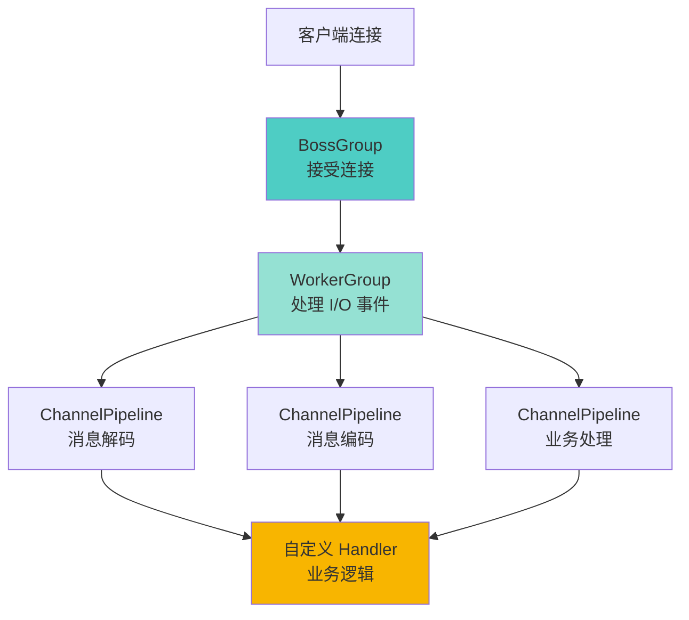

> 本文写于 2026 年 9 月，回溯 2020 年前后用 Netty 构建长连接聊天服务端的技术实践与工程边界。

2020 年前后，做过一段时间的局域网聊天和 Netty 服务端练习。那时研途末期刚转后端工程，WebSocket 聊天室、即时通讯服务端是很多后端开发者的练手项目。但当你真正动手，才发现「保持长连接」和「处理并发」背后，藏着从线程模型到协议设计的一整套工程边界。

六年后回看，当时踩过的坑、理解的模式，恰好是理解 IM 服务端、推送系统、长连接架构的基础课。

<!-- more -->

## 问题：为什么需要长连接

### 短连接的局限性

传统的 HTTP 请求是**短连接**模型：

1. 客户端发起请求 → 服务端响应 → 连接关闭
2. 下次需要数据时，重新建立连接

这种模式对「查询型」场景友好（查询用户信息、下单、支付），但对**实时消息推送**场景却很吃力：

| 场景 | 短连接方案 | 问题 |
|------|-----------|------|
| 聊天消息 | 客户端轮询（每秒请求一次） | 大量无效请求，服务端压力大 |
| 在线状态 | 定时上报 + 心跳 | 延迟高，状态不准确 |
| 消息推送 | 服务端主动推？ | HTTP 无法主动推送（需要 WebSocket） |

### 长连接的核心优势

长连接（TCP 持久连接 / WebSocket）解决了这些问题：

- **服务端主动推送**：不需要客户端轮询，消息到达即可推送
- **低延迟**：无需每次重新建立连接（省去三次握手）
- **状态保持**：连接本身就代表「在线」状态

但代价是：**服务端需要维护海量长连接**，这对线程模型、内存管理提出了挑战。

## 线程模型：从 BIO 到 Netty 的 Reactor

### BIO 的困境：一连接一线程

最早的 Java 网络编程是 BIO（Blocking I/O）模型：

```java
// BIO 伪代码
ServerSocket serverSocket = new ServerSocket(8080);
while (true) {
    Socket socket = serverSocket.accept(); // 阻塞等待连接
    new Thread(() -> {
        // 每个连接一个线程处理
        InputStream in = socket.getInputStream();
        byte[] data = new byte[1024];
        in.read(data); // 阻塞读取
        // 处理数据...
    }).start();
}
```

**问题**：

- 10000 个并发连接 = 10000 个线程
- 线程上下文切换开销巨大
- 大量线程处于阻塞状态（等待数据），资源浪费

### NIO 的改进：事件驱动 + 多路复用

Java NIO（Non-blocking I/O）引入了 `Selector` 机制：

```java
// NIO 伪代码
Selector selector = Selector.open();
ServerSocketChannel serverChannel = ServerSocketChannel.open();
serverChannel.configureBlocking(false);
serverChannel.register(selector, SelectionKey.OP_ACCEPT);

while (true) {
    selector.select(); // 阻塞，直到有事件
    Set<SelectionKey> keys = selector.selectedKeys();
    for (SelectionKey key : keys) {
        if (key.isAcceptable()) {
            // 接受新连接
        } else if (key.isReadable()) {
            // 读取数据
        }
    }
}
```

**核心思想**：一个线程管理多个连接，通过事件通知机制（epoll / kqueue）知道哪些连接有数据。

但**原生 NIO 很难用**：手动管理 ByteBuffer、处理半包/粘包、编写状态机…

### Netty 的封装：Reactor 模式 + 事件驱动

Netty 在 NIO 之上提供了优雅的封装：



**Netty 线程模型**：

- **BossGroup**：专门接受新连接（通常 1 个线程）
- **WorkerGroup**：处理已建立连接的读写事件（N 个线程，默认 CPU 核心数 × 2）
- **EventLoop**：每个线程绑定一个事件循环，顺序处理分配给它的连接

**关键特性**：

1. **单线程处理单连接**：避免锁竞争，保证消息顺序
2. **线程数可控**：不会因为 10000 个连接创建 10000 个线程
3. **异步非阻塞**：I/O 操作不会阻塞业务线程

## 协议与粘包：TCP 流式传输的陷阱

### TCP 粘包/拆包问题

TCP 是**面向流**的协议，不保证消息边界：

```
发送端：
  send("Hello")
  send("World")

接收端可能收到：
  "HelloWorld"    # 粘包
  "Hel" + "loWor" + "ld"  # 拆包
  "Hello" + "World"  # 正常（少见）
```

### 常见的解决方案

| 方案 | 原理 | 优缺点 |
|------|------|--------|
| **固定长度** | 每条消息固定 N 字节 | 简单，但浪费空间 |
| **分隔符** | 用 `\n` 或 `\0` 分隔 | 简单，但消息内容不能包含分隔符 |
| **长度前缀** | 消息头 4 字节表示长度 | **生产环境主流方案** |
| **自定义协议** | 完整的帧头（魔数、版本、长度、类型等） | 灵活强大，但复杂 |

### Netty 的编解码器

Netty 提供了开箱即用的解码器：

```java
// 长度前缀方案
pipeline.addLast(new LengthFieldBasedFrameDecoder(
    65536,  // 最大帧长度
    0,      // 长度字段偏移量
    4,      // 长度字段占用字节数
    0,      // 长度调整值
    4       // 跳过的字节数
));
pipeline.addLast(new LengthFieldPrepender(4)); // 编码时自动加长度

// 自定义协议解码
pipeline.addLast(new MyProtocolDecoder());
pipeline.addLast(new MyProtocolEncoder());
```

**一个典型的 IM 协议帧结构**：

```
+--------+--------+--------+--------+--------+--------+
| 魔数   | 版本   | 消息类型 | 长度   | 数据   | 校验和 |
| 2 字节 | 1 字节 | 1 字节 | 4 字节 | N 字节 | 4 字节 |
+--------+--------+--------+--------+--------+--------+
```


## 心跳与断线重连：保活机制的工程细节

### 为什么需要心跳

TCP 有 KeepAlive 机制，但**默认 2 小时才检测一次**，实际场景需要自己实现心跳：

1. **检测连接存活**：客户端/服务端是否真的还在线
2. **防止 NAT 超时**：移动网络、路由器会回收长时间无数据的连接
3. **快速发现掉线**：网络切换（WiFi → 4G）时，旧连接已断但 TCP 层未感知

### 心跳策略

| 策略 | 适用场景 | 示例间隔 |
|------|---------|---------|
| 客户端单向心跳 | 服务端主动推送 | 30-60 秒 |
| 双向心跳 | 需要双向检测 | 60-120 秒 |
| 空闲检测 | 有正常消息时不发心跳 | IdleStateHandler |

**Netty 的心跳实现**：

```java
// 服务端：空闲检测
pipeline.addLast(new IdleStateHandler(
    60,  // 读空闲（60 秒没收到消息）
    0,   // 写空闲（不检测）
    0    // 读写空闲（不检测）
));

pipeline.addLast(new ChannelInboundHandlerAdapter() {
    @Override
    public void userEventTriggered(ChannelHandlerContext ctx, Object evt) {
        if (evt instanceof IdleStateEvent) {
            IdleStateEvent e = (IdleStateEvent) evt;
            if (e.state() == IdleState.READER_IDLE) {
                // 60 秒没收到心跳，认为连接失效
                ctx.close();
            }
        }
    }
});

// 客户端：定时发送心跳
eventLoop.scheduleAtFixedRate(() -> {
    if (channel.isActive()) {
        channel.writeAndFlush(HeartbeatMessage.PING);
    }
}, 30, 30, TimeUnit.SECONDS);
```

### 断线重连

客户端需要处理重连逻辑：

```java
// 重连机制（指数退避）
private void reconnect(int attempt) {
    int delay = Math.min(2 << attempt, 60); // 最多等 60 秒
    scheduler.schedule(() -> {
        bootstrap.connect(host, port).addListener(future -> {
            if (future.isSuccess()) {
                attempt = 0; // 重置重试次数
            } else {
                reconnect(attempt + 1); // 继续重试
            }
        });
    }, delay, TimeUnit.SECONDS);
}
```

**重连优化**：

- **指数退避**：避免网络故障时疯狂重连
- **最大重试次数**：避免无限重连
- **重连前清理**：关闭旧连接，释放资源

## 房间与广播：群聊的内存模型

### 单播 vs 群播

| 场景 | 实现方式 | 复杂度 |
|------|---------|--------|
| 单聊（A → B） | 通过 userId 找到 Channel，直接发送 | 简单 |
| 群聊（A → 房间 100 人） | 遍历房间所有成员，逐个发送 | 需要维护房间成员表 |
| 广播（系统公告） | 遍历所有在线用户 | 慎用，性能瓶颈 |

### 内存管理：Channel 与用户的映射

```java
// 典型的映射关系
class ConnectionManager {
    // userId -> Channel（单聊）
    private final ConcurrentHashMap<String, Channel> userChannels = new ConcurrentHashMap<>();
    
    // roomId -> Set<Channel>（群聊）
    private final ConcurrentHashMap<String, Set<Channel>> roomChannels = new ConcurrentHashMap<>();
    
    // Channel -> userId（反查）
    private final Map<Channel, String> channelToUser = new ConcurrentHashMap<>();
    
    public void join(String userId, String roomId, Channel channel) {
        userChannels.put(userId, channel);
        channelToUser.put(channel, userId);
        roomChannels.computeIfAbsent(roomId, k -> ConcurrentHashMap.newKeySet()).add(channel);
    }
    
    public void sendToRoom(String roomId, Message msg) {
        Set<Channel> channels = roomChannels.get(roomId);
        if (channels != null) {
            for (Channel ch : channels) {
                ch.writeAndFlush(msg);
            }
        }
    }
}
```

**注意事项**：

- **线程安全**：多个 EventLoop 可能同时操作映射表
- **内存泄漏**：连接断开时，必须清理所有映射关系
- **弱一致性**：广播时新加入/离开的用户可能漏收消息

## 常见的坑与实践清单

### 坑一：忘记处理连接关闭

**症状**：内存持续增长，最终 OOM

**原因**：连接关闭时，未清理 `userChannels` 等映射关系

**解决**：

```java
@Override
public void channelInactive(ChannelHandlerContext ctx) {
    String userId = channelToUser.remove(ctx.channel());
    if (userId != null) {
        userChannels.remove(userId);
        // 从所有房间移除
        roomChannels.values().forEach(set -> set.remove(ctx.channel()));
    }
    ctx.fireChannelInactive();
}
```

### 坑二：在 EventLoop 中执行耗时操作

**症状**：消息延迟高，连接断开

**原因**：业务逻辑（数据库查询、RPC 调用）阻塞了 EventLoop

**解决**：

```java
// 错误：阻塞 EventLoop
public void channelRead(ChannelHandlerContext ctx, Object msg) {
    User user = database.query(userId); // 阻塞操作！
    ctx.writeAndFlush(user);
}

// 正确：异步执行
public void channelRead(ChannelHandlerContext ctx, Object msg) {
    CompletableFuture.supplyAsync(() -> database.query(userId))
        .thenAccept(user -> ctx.writeAndFlush(user));
}
```

### 坑三：发送消息不检查连接状态

**症状**：消息丢失，日志报错

**解决**：

```java
// 正确的发送方式
if (channel.isActive()) {
    channel.writeAndFlush(msg).addListener(future -> {
        if (!future.isSuccess()) {
            logger.error("发送失败", future.cause());
        }
    });
} else {
    logger.warn("连接已关闭，消息丢弃");
}
```

### 实践清单

**基础功能**：

- [ ] 使用 Netty 的 BossGroup / WorkerGroup 线程模型
- [ ] 自定义协议（至少包含：长度字段、消息类型）
- [ ] 粘包处理（LengthFieldBasedFrameDecoder）
- [ ] 心跳保活（IdleStateHandler + 定时任务）
- [ ] 断线重连（客户端指数退避）

**进阶优化**：

- [ ] 连接认证（防止非法连接）
- [ ] 消息确认机制（ACK / 重试）
- [ ] 流量控制（防止大消息压垮服务端）
- [ ] 集群支持（多节点消息路由，如 Redis Pub/Sub）
- [ ] 监控与日志（连接数、消息量、延迟监控）

## 对照今天：WebSocket 与现代 IM 架构

2020 年自己写 Netty 服务端，是为了理解底层原理。但今天的生产环境，架构已经复杂得多：

| 2020 单机 Netty | 2026 生产 IM 架构 |
|----------------|------------------|
| 单机维护连接 | 网关集群（接入层） |
| 内存存储用户/房间 | 分布式缓存（Redis） |
| 单机广播消息 | 消息队列（Kafka / RocketMQ） |
| 手动实现协议 | HTTP/2、gRPC、QUIC |
| 心跳保活 | 长连接网关 + 智能心跳 |

但**核心问题没变**：

- 如何高效管理海量长连接
- 如何保证消息顺序与可靠性
- 如何处理网络抖动与重连

那些在 Netty Demo 里踩过的坑，放到生产环境依然会遇到——只是规模更大、影响更严重。

## 扩展阅读

**Netty 官方资源**：

- [Netty User Guide](https://netty.io/wiki/user-guide-for-4.x.html)：官方入门教程
- [Netty in Action](https://www.manning.com/books/netty-in-action)：经典书籍（中文版：《Netty 实战》）

**IM 架构参考**：

- [Netty 实现高性能 IM](https://www.52im.net/thread-2043-1-1.html)：即时通讯网的系列文章
- [美团长连接网关实践](https://tech.meituan.com/2020/08/27/thrift-gateway.html)：生产级架构案例

**技术基础**：

- [Java NIO 原理](https://www.ibm.com/docs/en/sdk-java-technology/8)：理解 Netty 的前置知识
- [Reactor 模式](http://www.dre.vanderbilt.edu/~schmidt/PDF/Reactor.pdf)：事件驱动的设计模式

---

## 写在最后

2020 年的 Netty 练习，本质上是在理解**如何用有限的线程，服务无限的连接**。

BIO 时代，一个连接绑定一个线程，这是最直观的模型。但当并发上万，系统就崩溃了。

NIO 时代，一个线程管理多个连接，用事件驱动代替阻塞等待。但原生 API 太难用。

Netty 时代，提供了优雅的封装，让开发者专注于业务逻辑。但粘包、心跳、重连这些问题，依然需要自己处理。

六年后的今天，云原生 IM 有了更成熟的方案（WebSocket 网关、Service Mesh、Serverless），但如果你理解了 Netty 的 Reactor 模型、理解了 TCP 流式传输的陷阱、理解了心跳保活的必要性——你就理解了所有长连接架构的核心。

**工程的本质，永远是在约束中寻找最优解。**

---

*本文所有示意图使用 Mermaid 绘制，代码示例基于 Netty 4.x，技术讨论基于 2020 年前后的实践经验。*
