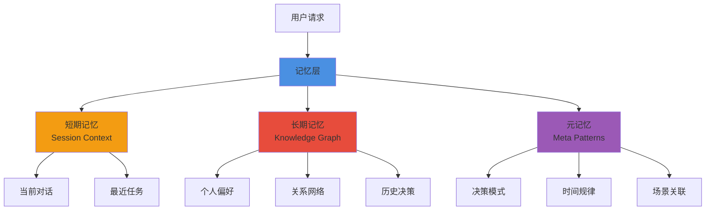
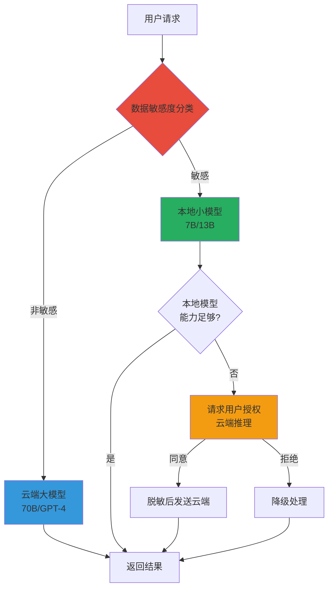

> 本文写于 2026 年 9 月，基于近年公开探索与业界同类项目回溯，非当年原文。讨论内容基于公开技术文献与开源生态，不涉及私有系统。

当我们谈论 AI Agent 时，2025-2026 年的焦点集中在 Coding Agent——Claude Code、Cursor Agent、Qwen Code 等工具在「写代码」场景表现出色。但还有另一个方向值得关注：**能否构建一个理解你、记住你、替你处理日常事务的长期伙伴？**

这类 Agent 通常被称为 Personal Agent 或「第二分身」。本文讨论它与 Coding Agent 的本质差异，以及记忆层、权限系统、本地化推理等核心技术挑战。

<!-- more -->

## 问题边界：Personal Agent 与 Coding Agent 的本质差异

### 两类 Agent 的能力矩阵

| 维度 | Coding Agent | Personal Agent |
|------|-------------|----------------|
| **任务类型** | 短期编程任务 | 长期、跨场景事务 |
| **记忆机制** | 单次会话上下文 | 持久化个人知识图谱 |
| **交互模式** | 用户主动请求 | 主动提醒、推荐、预判 |
| **决策权限** | 仅生成代码建议 | 可代理执行（在授权范围） |
| **适用场景** | 开发环境（IDE/终端） | 工作、生活全场景 |
| **生命周期** | 会话结束即遗忘 | 跨时间累积上下文 |

### 真实需求场景

想象这样的场景：

- **主动提醒**：早上 9 点，Agent 根据日历和邮件，提醒「今天有 3 个会议，其中技术评审会议需要准备的文档还在草稿状态」
- **偏好记忆**：你口述「帮我预约牙医」，Agent 记住你的常用诊所、医保信息、时间偏好，直接完成预约
- **知识过滤**：看到一篇论文链接，Agent 自动判断是否符合你的研究方向，归档到对应知识库

这些场景有共同特点：**跨时间、跨场景的记忆与决策**——这是 Coding Agent 的会话模型无法支撑的。

### 为什么 Coding Agent 的架构不适用

Coding Agent 的设计假设：

1. 任务边界清晰（「实现一个排序函数」「修复这个 bug」）
2. 上下文有限（当前文件、最近几次对话）
3. 用户全程在场（随时可以确认或纠正）
4. 无需长期记忆（下次打开 IDE 从零开始）

而 Personal Agent 需要打破这些假设：任务模糊、上下文无限、用户不在场、必须记住历史。

## 核心技术挑战一：持久化记忆层

### 记忆层的三个层次



**短期记忆**：当前会话的上下文，类似 Coding Agent 的 context window

**长期记忆**：持久化的个人知识图谱：
- 偏好：工作时段、通知风格、常用工具
- 关系：联系人、协作历史、交互频率
- 知识：项目背景、技术栈、文档归档

**元记忆**：从历史中学习的模式：
- 你倾向于拒绝哪类会议邀请
- 你在什么时间段专注度最高
- 你对哪类信息感兴趣

### 技术实现的三个难点

#### 1. 数据异构性

个人数据来源多样：

```yaml
# 异构数据源示例
data_sources:
  structured:
    - calendar_events      # iCal 格式
    - contacts            # vCard 格式
    - emails              # MIME 格式
  
  semi_structured:
    - chat_history        # JSON
    - browser_bookmarks   # HTML
    - code_commits        # Git log
  
  unstructured:
    - documents           # PDF/Markdown
    - meeting_notes       # 自然语言
    - voice_memos         # 音频转文本
```

每种数据需要不同的提取与索引策略。

#### 2. 增量更新 vs 全量重建

当你的偏好发生变化（比如从「喜欢早会」变成「讨厌早会」），记忆层如何更新？

- **全量重建**：每次变化都重新分析所有历史数据（成本高）
- **增量更新**：只更新相关部分（可能产生一致性问题）
- **时间衰减**：旧记忆逐渐降权（如何平衡新旧信息）

#### 3. 隐私与本地化

个人数据极度敏感，云端大模型的隐私风险不可接受。需要：

- 本地存储（加密数据库）
- 本地推理（7B-13B 本地模型）
- 选择性云端（仅非敏感任务可用云端大模型）

## 核心技术挑战二：权限与安全边界

### 自动执行的风险

Personal Agent 的价值在于「代理执行」，但这带来风险：

- 自动发送邮件（如果判断错误怎么办？）
- 创建日历事件（如果时间冲突怎么办？）
- 执行支付（如果被恶意利用怎么办？）

### 权限分级模型

```typescript
// 三级权限示例
const PermissionModel = {
  // 绿灯：可自动执行
  auto_execute: [
    'read_calendar',
    'search_email',
    'bookmark_article',
    'create_reminder',
    'fetch_weather'
  ],
  
  // 黄灯：需要确认
  require_confirmation: [
    'send_email',
    'create_event',
    'update_document',
    'share_file',
    'post_message'
  ],
  
  // 红灯：绝对禁止
  forbidden: [
    'delete_data',
    'transfer_money',
    'share_private_info',
    'modify_system_settings'
  ]
}
```

### 可解释性与可撤销性

**可操作的安全检查清单**：

- [ ] 每个自动操作都记录在操作日志中，可追溯
- [ ] 用户可以随时暂停 Agent 的所有主动行为
- [ ] 敏感操作提供「为什么 Agent 建议这样做」的解释
- [ ] 支持「撤销最近 N 次操作」功能
- [ ] 明确展示哪些数据被 Agent 访问过（数据访问日志）

## 核心技术挑战三：主动性与打扰的平衡

### 主动性的困境

一个好的 Personal Agent 不应该：

- **过度主动**：每 5 分钟弹一个通知（用户会关闭通知）
- **过度被动**：只有你问它才回答（那和搜索引擎有什么区别？）

需要的是**场景感知的主动性**。

### 场景感知规则引擎

| 场景 | Agent 行为 | 触发条件 |
|------|-----------|----------|
| 专注工作时段 | 静默模式，仅紧急事项 | 工作时段 + 专注状态检测 |
| 会议前准备 | 主动提醒准备材料 | 会议开始前 15 分钟 |
| 深夜工作邮件 | 次日汇总，不立即打扰 | 22:00-07:00 收到非紧急邮件 |
| 阅读相关论文 | 自动归档 + 每日摘要 | 检测到研究关键词匹配 |
| 长时间未处理任务 | 温和提醒（3 天后） | 任务创建 >3 天未完成 |

### 上下文感知的实现

如何判断「用户正在专注工作」？可能的信号：

- 日历上有「勿扰」标记的时间块
- 检测到用户在编辑器中活跃（近 30 分钟有输入）
- 特定应用处于全屏模式
- 用户主动设置了「专注模式」

```python
# 简化的上下文推理逻辑
def should_interrupt(event, user_context):
    # 紧急事项总是通知
    if event.priority == "urgent":
        return True
    
    # 专注时段不打扰
    if user_context.focus_mode:
        return False
    
    # 非工作时间降低打扰
    if not user_context.is_work_hours():
        return event.priority == "high"
    
    # 默认策略：批量处理
    return False  # 攒到每小时整点汇总
```

## 与 Coding Agent 生态的技术互鉴

### 可复用的基础设施

在探索 Personal Agent 的过程中，可以借鉴 Coding Agent 生态的成熟组件：

**MCP（Model Context Protocol）**：
- Anthropic 提出的标准化工具调用协议
- Personal Agent 同样需要连接日历、邮件、数据库等外部服务
- MCP Server 可以在两类 Agent 间复用

**沙箱与安全隔离**：
- `sandbox-runtime`、`bubblewrap` 等容器隔离技术
- Personal Agent 执行外部脚本或不可信插件时同样需要隔离
- 防止恶意代码访问个人敏感数据

**Skills / Plugin 系统**：
- 可组合的能力模块（类似 `agentskills`）
- Personal Agent 的「日历管理」「邮件摘要」「知识归档」都可以封装为 Skill
- 社区贡献的 Skill 可以复用

### 无法直接迁移的部分

但 Coding Agent 的核心设计**不适合** Personal Agent：

| Coding Agent 设计 | 为什么不适合 Personal Agent |
|------------------|---------------------------|
| 会话生命周期短 | 个人助手需要「一直在线」、跨会话记忆 |
| 单一垂直场景（代码） | 个人事务跨多个领域（工作、生活、学习） |
| 用户全程在场 | 需要在用户不在场时自主判断与行动 |
| 云端推理为主 | 隐私敏感，必须支持本地优先 |
| 任务边界清晰 | 个人需求模糊、需要主动澄清 |

## 本地推理的算力困境

### 隐私与能力的矛盾

要让 Personal Agent 真正保护隐私，就需要本地化推理。但：

- **7B/13B 模型**：能在消费级硬件运行，但推理能力有限
- **70B+ 模型**：能力接近云端大模型，但个人 GPU/M 芯片算力不够
- **如何平衡**：隐私保护 vs 智能水平

### 混合推理架构

一个可能的解决方案：



**关键设计**：

1. **数据分类器**：判断请求是否包含敏感信息（姓名、地址、账号等）
2. **能力评估**：本地模型先尝试，如果置信度低（<0.7）则请求升级
3. **用户授权**：明确告知「这个任务需要云端模型，需要发送以下数据」
4. **脱敏处理**：即使授权云端，也尽量脱敏（用代号替换真实姓名等）

## 未解决的问题与思考方向

### 1. 「理解」的边界

真正的 Personal Agent 应该能：

- **推断隐含意图**：「帮我安排下周」→ 知道你偏好上午、避开周五、每个会议至少间隔 1 小时
- **预测未来需求**：看到日历上的出差，提前准备行程信息、酒店预订、天气预警
- **学习决策模式**：连续拒绝 3 次类似会议后，自动过滤同类邀请

但这需要：

- 大量个人历史数据（至少数月）
- 持续的反馈与校正（用户纠正错误判断）
- 如何在本地小模型上实现这种推理能力？

### 2. 信任的建立

越智能的 Agent，用户越容易失去控制感。如何设计让用户「敢用」的系统？

- **透明度**：每个决策都能解释为什么这样做
- **控制权**：用户可以随时介入、暂停、回滚
- **边界清晰**：明确告知 Agent 能做什么、不能做什么
- **逐步授权**：从只读权限开始，逐步解锁更多能力

### 3. 跨平台与数据主权

个人数据散落在各个平台：

- 日历在 Google Calendar
- 邮件在 Outlook
- 聊天记录在微信/Slack
- 文档在云盘/Notion

如何让 Personal Agent 统一访问，同时保持用户对数据的控制权？

**可能的方向**：
- 本地数据中台（用户授权后同步各平台数据到本地）
- 联邦学习（在各平台本地训练，只同步模型参数）
- 标准化导出接口（类似 GDPR 的数据可携权）

## 技术参考与探索路径

### 相关技术关键词

**记忆层技术**：
- 向量数据库：Chroma、Qdrant、Weaviate
- 知识图谱：Neo4j、个人知识图谱建模
- 时间序列数据：事件流与状态机

**本地推理方案**：
- Ollama、llama.cpp（跨平台本地推理）
- MLX（Apple Silicon 优化）
- GGUF 量化格式（降低显存需求）

**权限与安全**：
- 浏览器扩展的权限模型（参考 Chrome Extensions API）
- OAuth 细粒度授权（Scope 最小化原则）
- 沙箱隔离（WebAssembly、gVisor）

**主动性触发**：
- 事件驱动架构（Kafka、RabbitMQ）
- 规则引擎（Drools、rete 算法）
- 时间序列预测（预判用户需求）

### 开源生态参考

- **MCP 协议**：Anthropic Model Context Protocol（工具调用标准）
- **Agent Skills**：可组合的能力模块生态
- **Coding Agent**：qwen-code、deepseek-harness（执行框架）
- **沙箱安全**：sandbox-runtime、bubblewrap（容器隔离）

## 结语

Personal Agent 与 Coding Agent 的差异，不在于「写代码 vs 管日程」这种表面功能，而在于**记忆的持久性、决策的自主性、场景的普适性**。

Coding Agent 是「你的编程工具」，Personal Agent 是「你的数字延伸」。

这条路还很长：记忆层的工程复杂度、权限系统的信任建立、本地推理的算力瓶颈、跨平台的数据整合，每个都是硬骨头。

但我相信，当我们谈论「AI 改变生活」时，不应该只是「生成一段代码」或「写一封邮件」，而是**真正拥有一个懂你、记得你、增强你的长期伙伴**。

---

## 延伸阅读

本文讨论的技术方向在 2025-2026 年业界有诸多探索，包括但不限于：

- **个人代理类项目**：近年涌现的 personal assistant / second-me 类探索（公开仓库可搜索）
- **记忆层研究**：MemGPT、LangChain Memory、个人知识图谱构建
- **本地推理方案**：Ollama 社区、Apple MLX 生态、量化模型研究
- **Agent 协议**：MCP、AG-UI、OpenClaw / ACP 等标准化尝试

*本文所有架构图使用 Mermaid 绘制。文中技术讨论基于公开文献与开源项目，不涉及未公开系统。*
