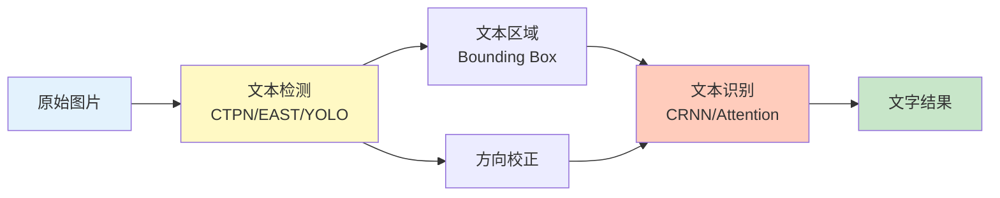
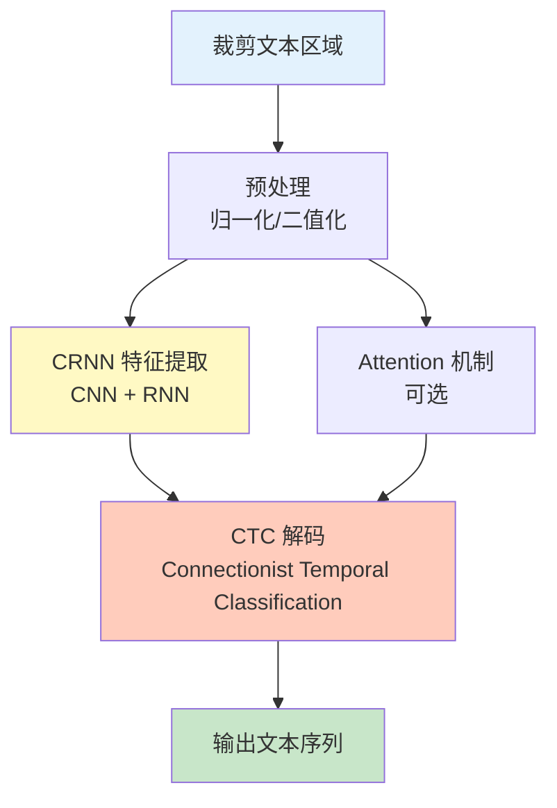

> 本文写于 2026 年 9 月，回溯 2019–2020 年间自然场景文字检测（Scene Text Detection）与中文 OCR 工具链的工程实践。

2019 年，当移动端文字识别需求开始从「扫描文档」扩展到「拍照识别街景招牌、产品标签、车牌」时，传统 OCR 技术遇到了新挑战。彼时深度学习已在 ImageNet 上证明了能力，CTPN、EAST、CRNN 等开源方案开始进入工程视野。回过头看，那段时间对照公开生态做的自然场景文字检测练习，恰好勾勒出**检测与识别分层、中文工具链搭建、模型训练与部署**的完整边界。

<!-- more -->

## 问题：为什么场景文字检测比文档OCR难

### 三个本质差异

传统文档 OCR（如发票、身份证）已经非常成熟，但自然场景文字检测面临完全不同的挑战：

1. **背景复杂**：文档是黑字白底，场景图片有建筑、树木、人群等干扰
2. **文本形态多样**：倾斜、弯曲、透视变形、艺术字体，不像文档只有规整横排
3. **分辨率与光照不稳定**：手机拍摄的角度、距离、光线都不可控

| 维度 | 文档OCR | 场景文字检测 |
|------|---------|------------|
| 背景 | 纯色，可控 | 复杂，不可控 |
| 文本排列 | 规整横排/竖排 | 倾斜、弯曲、任意角度 |
| 字体 | 印刷体为主 | 手写、艺术字、变形 |
| 光照 | 扫描仪均匀照明 | 室外强光/阴影，室内昏暗 |
| 分辨率 | 300 DPI 以上 | 手机拍摄，可能模糊 |

这些差异决定了**场景文字检测需要先定位文本区域，再做识别**，不能直接套用文档 OCR 的全图识别逻辑。

### 2019年的典型需求场景

当年常见的应用需求包括：

- **移动端扫描**：名片识别、证件识别、产品标签读取
- **智能相册**：照片中的文字搜索（如街景招牌、菜单、路标）
- **自动驾驶**：交通标志、车牌识别
- **工业质检**：产品编号、生产日期读取

## 检测与识别的分层架构

场景文字 OCR 系统的经典架构是**检测（Detection）+ 识别（Recognition）**两阶段：



### 检测阶段：找到文字在哪里

**主流方案对比（2019–2020）**：

| 方法 | 核心思想 | 优点 | 缺点 |
|------|---------|------|------|
| **CTPN** | 基于 Faster R-CNN，把文本行看作固定宽度的小框序列 | 对长文本行效果好 | 只能检测水平文本 |
| **EAST** | 全卷积网络直接回归文本框 | 速度快（单张图 ~20ms），支持倾斜文本 | 对小文本和密集文本效果一般 |
| **SegLink** | 分割 + 连接，把文字分割成小块再组合 | 处理长文本和曲线文本较好 | 实现复杂，速度慢 |
| **PixelLink** | 像素级分割 + 连接预测 | 对任意形状文本适应性强 | 训练数据要求高 |

当年的工程实践中，**EAST 是最常用的入门方案**——开源实现多、速度快、对倾斜文本支持好。如果需要处理更复杂的曲线文本（如弯曲的横幅），才会考虑 SegLink 或 PixelLink。

### 识别阶段：读出文字内容

检测出文本框后，需要识别框内的具体文字。主流方案：



**CRNN + CTC** 是 2019 年的主流选择：

- **CRNN（Convolutional Recurrent Neural Network）**：CNN 提取图像特征，RNN（通常是 LSTM）建模序列关系
- **CTC（Connectionist Temporal Classification）**：解决变长输入输出的对齐问题，不需要字符级标注

**Attention 机制**在 2019 年开始流行，能更好处理长文本和复杂场景，但训练难度更高。

## 中文特有的工程挑战

相比英文，中文场景文字检测有额外的复杂度：

### 挑战一：字符集巨大

- **英文**：26 个字母 + 10 个数字 + 少量符号 ≈ 100 个类别
- **中文**：常用汉字 3500 个，加上数字、英文、标点 ≈ 4000-6000 个类别

这导致：
1. **模型最后一层的分类器变大**：英文可能只需要 100 维输出，中文需要 6000 维
2. **训练数据需求增加**：每个字都需要足够样本，数据标注成本高
3. **长尾字符识别率低**：常见字如「的、是、有」容易学，生僻字如「兕、犇、麤」样本稀少

### 挑战二：竖排文本

中文有竖排书写习惯（古籍、招牌、对联），英文几乎没有：

- **检测阶段**：需要区分横排/竖排，避免错误合并（把竖排一列识别成多个横排短词）
- **识别阶段**：竖排文本的 CNN 特征提取方向与横排不同

工程上常见的做法是**训练两个识别模型**，或在检测后做**方向分类（0°/90°/180°/270°）**。

### 挑战三：中英混排与长度差异

中文场景图片常包含中英混排（如「Apple 苹果手机」），而：

- **中文字符是方块字**，宽高比接近 1:1
- **英文是拉丁字母**，宽高比可能 3:1 或更窄

这对 CRNN 的特征提取和 CTC 对齐都带来挑战，需要在数据增强时充分考虑。

## 数据集与训练策略

### 公开数据集（2019年可用）

| 数据集 | 语言 | 图片数 | 特点 |
|--------|------|--------|------|
| **ICDAR 2015** | 英文为主 | 1500 训练 + 500 测试 | 场景文字检测标准 benchmark |
| **ICDAR 2017 MLT** | 多语言（含中文） | 18000 张 | 9 种语言混合 |
| **COCO-Text** | 英文 | 63000 张 | 数据量大，但标注质量参差不齐 |
| **CTW（Chinese Text in the Wild）** | 中文 | 32000 张 | 清华大学发布，中文场景文字专用 |
| **RCTW-17** | 中文 | 12000 张 | 阿里发布，电商场景偏多 |

对于中文项目，**CTW 或 RCTW 是必用数据集**，但即便如此，某些领域（如手写快递单、艺术字海报）的泛化能力仍然不足。

### 数据增强的关键

由于场景文字的形态多样，数据增强至关重要：

```python
# 典型的数据增强策略（伪代码）
def augment_scene_text(image, bbox, text):
    # 1. 几何变换
    image = random_rotation(image, angle_range=(-15, 15))  # 模拟倾斜
    image = random_perspective(image)  # 模拟透视变形
    image = random_crop(image, bbox)  # 裁剪边界
    
    # 2. 颜色变换
    image = random_brightness(image, factor=(0.5, 1.5))
    image = random_contrast(image, factor=(0.5, 1.5))
    image = random_blur(image, kernel_size=(3, 7))  # 模拟模糊
    
    # 3. 噪声添加
    image = add_gaussian_noise(image)
    image = add_salt_pepper_noise(image)
    
    return image, bbox, text
```

特别要注意的是**模拟真实场景的光照和遮挡**：

- 强光过曝（文字边缘模糊）
- 阴影干扰（文字部分区域很暗）
- 部分遮挡（树叶、电线杆挡住文字）

### 训练的常见坑

**坑一：检测与识别模型的输入尺寸不匹配**

- 检测模型通常接受任意尺寸输入（如 EAST 可以处理 640x640 或 1280x720）
- 识别模型（CRNN）通常需要固定高度（如 32 像素高），宽度可变

**解决**：检测后裁剪的文本框需要 resize 到识别模型的输入尺寸，注意保持宽高比避免变形。

**坑二：CTC 解码时的重复字符问题**

CTC 的输出是「字符 + blank」的序列，例如「aabblannkkccdd」解码为「abcd」。但中文场景中，**真实文本可能有连续重复字**（如「洗洗更健康」），CTC 难以区分「重复字」和「CTC 重复」。

**解决**：使用 Attention 机制代替 CTC，或在后处理时结合语言模型纠错。

**坑三：训练数据与真实场景分布不一致**

公开数据集以街景为主，但实际应用可能是：

- 快递单（手写体为主）
- 产品包装（艺术字、反光）
- 夜间拍摄（光照极差）

**解决**：必须收集目标场景的真实数据，哪怕只有几百张，微调（fine-tune）的效果也会显著提升。

## 部署与性能优化

### 移动端部署的难题

2019–2020 年，在移动端部署深度学习模型仍是一大挑战：

| 平台 | 框架 | 典型方案 | 推理速度 |
|------|------|---------|---------|
| **Android** | TensorFlow Lite | EAST(检测) + CRNN(识别) | 单张图 500-800ms |
| **iOS** | Core ML | 同上 | 单张图 400-600ms |
| **服务端** | TensorFlow / PyTorch | 可用更大模型 | 单张图 100-200ms（GPU） |

**关键优化点**：

1. **模型量化**：FP32 → INT8，模型大小减半，速度提升 2-3 倍，精度损失 <2%
2. **模型裁剪**：去掉冗余层，EAST 可以从 ResNet-50 backbone 换成 MobileNetV2
3. **后处理优化**：NMS（非极大值抑制）在 CPU 上很慢，需要用 C++ 或 NEON 指令优化

### 实时性与准确率的权衡

```python
# 性能分级策略（伪代码）
def ocr_pipeline(image, mode='balanced'):
    if mode == 'fast':
        # 快速模式：小模型，低分辨率
        det_model = EAST_MobileNetV2
        rec_model = CRNN_Lite
        resize_to = (640, 640)
        # 预期：200ms，准确率 85%
    
    elif mode == 'balanced':
        # 平衡模式
        det_model = EAST_ResNet50
        rec_model = CRNN_Standard
        resize_to = (1280, 720)
        # 预期：500ms，准确率 92%
    
    elif mode == 'accurate':
        # 高精度模式：大模型，高分辨率
        det_model = PixelLink
        rec_model = Attention_OCR
        resize_to = (1920, 1080)
        # 预期：1500ms，准确率 95%
    
    return detect(det_model, image), recognize(rec_model, image)
```

在实际产品中，往往需要**根据用户需求动态切换模式**：

- 实时预览模式（快速模式，给用户框出文字位置）
- 拍照识别模式（平衡模式，给出识别结果）
- 重试/精细识别模式（高精度模式，用户点击「识别不准确，重试」时触发）

## 工程实践清单

基于上述经验，总结以下检查清单：

### 技术选型阶段

- [ ] 确认文本类型（横排/竖排/曲线/艺术字）
- [ ] 确认语言（纯中文 / 纯英文 / 中英混排）
- [ ] 确认部署环境（移动端 / 服务端 / 边缘设备）
- [ ] 确认性能要求（实时 <200ms / 离线 <2s）

### 数据准备阶段

- [ ] 选择基础数据集（中文选 CTW/RCTW，英文选 ICDAR）
- [ ] 收集目标场景数据（至少 500 张）
- [ ] 数据标注工具准备（检测用 labelImg，识别用自定义工具）
- [ ] 数据增强策略验证（检查增强后是否符合真实场景）

### 模型训练阶段

- [ ] 检测模型训练（先在 ICDAR 上预训练，再在目标数据上微调）
- [ ] 识别模型训练（注意中英字符集定义）
- [ ] 验证集评估（不能只看 loss，要看实际样本效果）
- [ ] 长尾字符专项测试（生僻字、数字串、符号）

### 部署优化阶段

- [ ] 模型转换（TensorFlow → TFLite，PyTorch → ONNX → Core ML）
- [ ] 量化测试（对比量化前后的精度损失）
- [ ] 推理速度测试（在真实设备上测试，不能只看理论值）
- [ ] 内存占用测试（避免 OOM）

### 产品化阶段

- [ ] 边界情况处理（空图、纯背景、无文字）
- [ ] 用户反馈机制（识别错误时收集样本）
- [ ] A/B 测试（对比不同模型/参数的效果）
- [ ] 持续迭代（根据用户数据定期更新模型）

## 延伸阅读与参考资源

### 经典论文

- **CTPN**: [Detecting Text in Natural Image with Connectionist Text Proposal Network](https://arxiv.org/abs/1609.03605) (ECCV 2016)
- **EAST**: [An Efficient and Accurate Scene Text Detector](https://arxiv.org/abs/1704.03155) (CVPR 2017)
- **CRNN**: [An End-to-End Trainable Neural Network for Image-based Sequence Recognition](https://arxiv.org/abs/1507.05717) (TPAMI 2017)
- **PixelLink**: [Detecting Scene Text via Instance Segmentation](https://arxiv.org/abs/1801.01315) (AAAI 2018)

### 开源实现

- [EAST 官方实现（TensorFlow）](https://github.com/argman/EAST)
- [CRNN PyTorch 实现](https://github.com/meijieru/crnn.pytorch)
- [PaddleOCR](https://github.com/PaddlePaddle/PaddleOCR) - 百度飞桨出品，2020 年后最成熟的中文 OCR 工具链
- [Tesseract OCR](https://github.com/tesseract-ocr/tesseract) - 老牌开源 OCR 引擎，仍可作为 baseline

### 数据集下载

- [ICDAR 2015 Dataset](https://rrc.cvc.uab.es/?ch=4)
- [CTW Dataset](https://ctwdataset.github.io/)
- [COCO-Text](https://bgshih.github.io/cocotext/)

### 工具与框架

- [LabelImg](https://github.com/tzutalin/labelImg) - 图像标注工具
- [TensorFlow Lite](https://www.tensorflow.org/lite) - 移动端部署框架
- [ONNX](https://onnx.ai/) - 模型转换中间格式

---

## 写在最后

2019–2020 年，当我们对照开源生态搭建自然场景文字检测工具链时，深刻体会到**检测与识别的分层边界、中文工程的特殊挑战、训练与部署的实际坑点**。这些经验不仅适用于 OCR，也推广到更广泛的视觉检测任务——**先定位目标区域，再做精细识别**，是许多两阶段视觉系统的共通模式。

七年后的今天，Transformer 架构已经统一了检测与识别（如 TrOCR），多模态大模型甚至可以端到端完成「图片 → 文字 + 理解」。但对于资源受限的边缘设备、对隐私敏感的本地部署场景，当年 CTPN + CRNN 的两阶段方案仍有其价值——**简单、可控、可解释**。

工程的迭代永远在继续，但底层的设计原则——**问题分解、模块化、权衡取舍**——始终如一。

---

*本文基于 2019–2020 年的工程实践回溯整理，技术细节已做泛化处理以聚焦通用方法论。*
