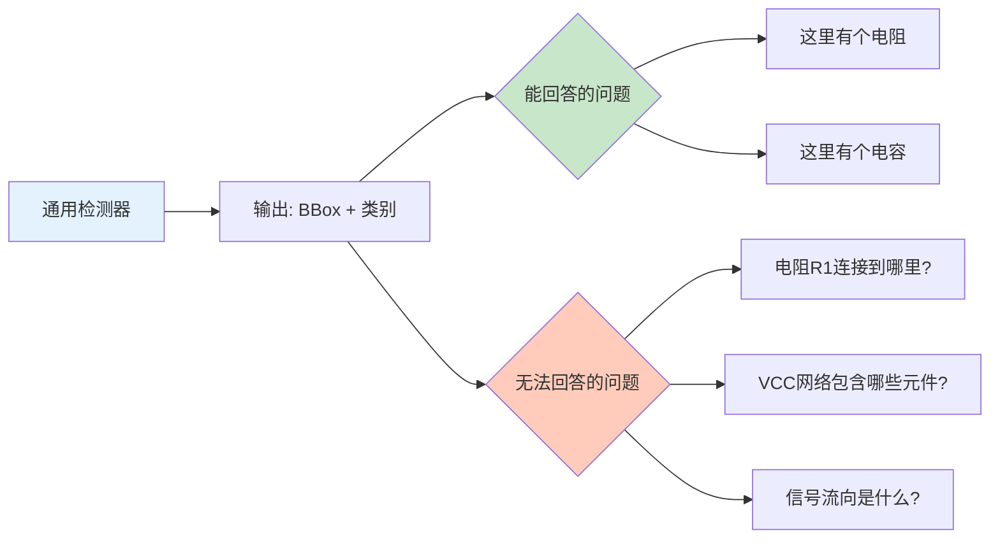
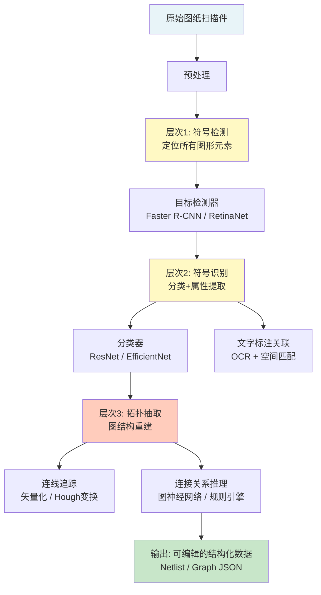
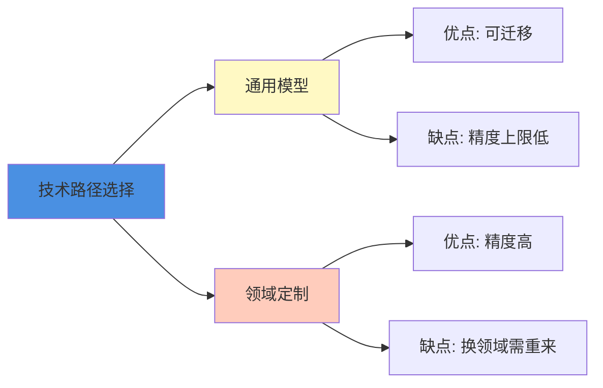

> 本文写于 2026 年 9 月，回溯 2019 年研途时期探索工程图纸视觉理解问题的技术边界与实践思考。

当计算机视觉遇到工程图纸——电路原理图、建筑蓝图、管线设计图——我们会发现，**自然场景检测的那套方法论开始失效**。这不是一个「把 YOLO 换成 Faster R-CNN」就能解决的问题，而是需要重新思考：什么是「理解」一张工程图纸。

<!-- more -->

## 问题定义：工程图纸 vs 自然场景图像

### 核心差异对比

| 维度 | 自然场景检测 | 工程图纸理解 |
|------|-------------|-------------|
| **视觉特征** | 纹理、颜色、光照 | 线条、符号、文字 |
| **目标密度** | 稀疏（图中几个物体） | 密集（数百个符号） |
| **尺度变化** | 大（近处vs远处） | 小（符号大小相对固定） |
| **关键信息** | 物体边界框 | 符号+连接关系 |
| **背景噪声** | 复杂背景 | 白/灰底，线条噪声 |
| **最终目标** | 识别物体类别 | 提取拓扑结构 |

**一个典型的电路原理图**可能包含：

- 200+ 个电阻、电容、晶体管等符号（小而密集）
- 数百条连线表达电气连接关系（拓扑比位置更重要）
- 标注文字与符号的对应关系（R1、C2、VCC 等）
- 层次化结构（模块、子电路）

### 为什么通用检测模型不够用

在 2019 年前后，我们尝试用 Faster R-CNN、YOLO 等经典检测器处理电路图时，发现了三个本质矛盾：

**1. 尺度矛盾**

```python
# 自然场景检测的假设
anchor_scales = [32, 64, 128, 256, 512]  # 适应近大远小

# 工程图纸的现实
symbol_sizes = [20, 22, 24, 18, 21]      # 符号大小几乎一致
                                          # 但数量极多，密集排列
```

通用检测器为多尺度设计的 FPN（特征金字塔）在这里变成了算力浪费。

**2. 连接关系盲区**



检测器给你一堆「孤立的符号」，但工程师需要的是「连接关系」——这需要额外的图结构提取。

**3. 文字与符号的耦合**

电路图中的 `R1`、`10kΩ` 这些文字标注不是独立的 OCR 任务，而是必须和对应的符号绑定。这种**空间关联推理**在目标检测范式里没有现成答案。

## 技术流水线：从像素到图结构的三个层次

工程图纸理解通常需要分层处理，每一层解决不同粒度的问题：



### 层次 1：符号检测——找到所有图形元素

**技术选型的工程权衡**：

| 方案 | 优点 | 缺点 | 适用场景 |
|------|------|------|---------|
| Anchor-based (Faster R-CNN) | 成熟稳定，精度高 | 速度慢，参数多 | 离线处理，对精度要求高 |
| Anchor-free (CornerNet) | 无需调anchor参数 | 密集小目标容易漏检 | 目标尺度变化大的场景 |
| 模板匹配 | 无需训练，可解释 | 泛化能力差，怕旋转变形 | 标准化图纸，符号库固定 |

在 2019 年的实践中，**Faster R-CNN + 多尺度训练**仍是工业界主流，但需要针对图纸特点做优化：

```python
# 针对密集小目标的优化策略
detection_config = {
    # 增加小尺度 anchor
    'anchor_scales': [8, 16, 32],
    'anchor_ratios': [0.5, 1.0, 2.0, 3.0],  # 长条形符号（如电阻）
    
    # 提高 NMS 阈值（允许更密集）
    'nms_threshold': 0.3,  # 标准是 0.5
    
    # 增加高分辨率输入
    'input_size': 1024,    # 标准是 600-800
}
```

### 层次 2：符号识别——这是什么元件

检测只给出「这里有个东西」，识别要回答「这是个电阻还是电容」。

**挑战**：工程符号的标准化与多样性并存

- **标准符号库**：IEEE、IEC 等标准定义了常见符号的绘制规范
- **变体问题**：不同 CAD 软件、不同年代的图纸，同一种元件的画法可能不同
- **手绘图纸**：扫描的手绘图存在形变、笔迹差异

```yaml
# 符号识别的数据现实
标准电阻符号:
  - 美国标准: 锯齿形波浪线
  - 国际标准: 矩形框
  - 手绘变体: 近似锯齿但不规则

电容符号:
  - 无极电容: 两条平行线
  - 有极电容: 一条直线+一条弧线
  - 可变电容: 添加箭头标注
```

**实用的策略**是分层分类：

1. **粗分类**：电阻类、电容类、半导体类、电源类
2. **细分类**：具体元件型号（结合文字标注）
3. **属性提取**：阻值、耐压、封装等（OCR + 空间关联）

### 层次 3：拓扑抽取——谁连到谁

这是整个流水线最困难的部分，也是工程价值的核心。

**技术路径分为两类**：

#### 路径 A：矢量化 → 连线追踪

```python
# 经典的图像处理流程
def extract_topology_classical(image, detected_symbols):
    # 1. 分离符号与连线
    symbol_mask = render_symbols(detected_symbols)
    line_image = image - symbol_mask  # 去除符号，保留连线
    
    # 2. 线条检测
    edges = canny_edge_detection(line_image)
    lines = hough_line_transform(edges)
    
    # 3. 连接关系推理
    graph = build_graph()
    for line in lines:
        # 判断线段端点是否连接到符号引脚
        connected_symbols = find_connected_symbols(line, detected_symbols)
        if len(connected_symbols) >= 2:
            graph.add_edge(connected_symbols[0], connected_symbols[1])
    
    return graph
```

**这种方法的坑**：

- 线条粘连、断裂（扫描件质量问题）
- 交叉连线的处理（谁和谁连？）
- 曲线、折线的追踪复杂度

#### 路径 B：端到端学习 → 图神经网络

近年来（2018-2019 年后）出现的新思路：把拓扑抽取建模为图学习问题。

```python
# 简化的 GNN 建模思路
class TopologyGNN(nn.Module):
    def __init__(self):
        self.node_encoder = SymbolEncoder()    # 编码符号特征
        self.edge_predictor = EdgeGNN()        # 预测连接关系
    
    def forward(self, symbols, spatial_layout):
        # 输入：检测到的符号 + 空间位置
        node_features = self.node_encoder(symbols)
        
        # 构建候选图（空间近邻）
        candidate_edges = spatial_neighbors(spatial_layout, k=5)
        
        # 预测哪些边是真实连接
        edge_probs = self.edge_predictor(node_features, candidate_edges)
        
        return edge_probs > threshold
```

**但 2019 年的现实是**：GNN 方法仍在学术探索阶段，工业界多数仍用传统图像处理 + 规则引擎。

## 数据与标注：工程图纸的隐形门槛

### 数据集的稀缺性

与 ImageNet、COCO 等通用数据集不同，工程图纸数据集面临三大困境：

1. **版权与保密**：企业的设计图纸是核心资产，不能公开
2. **领域分散**：电路图、建筑图、机械图各成体系，难以通用
3. **标准化程度**：学术界有小规模公开数据集（如 SESYD、FC_A 等），但样本量远不足以训练深度模型

```yaml
# 2019 年前后可用的公开数据集
SESYD (Symbols and Engineering Drawings):
  - 符号数量: ~1000 类
  - 图纸数量: ~数百张
  - 问题: 合成数据为主，真实扫描件少

FC_A (Floor Plan Analysis):
  - 建筑平面图数据集
  - 问题: 专注建筑领域，不含电路/管线

自建数据集:
  - 现实: 需要几百到上千张标注图纸
  - 成本: 每张图纸标注需要 2-4 小时（专业人员）
```

### 标注的复杂度

标注工程图纸不是「画个框+选个类别」那么简单：

```json
// 一个电阻符号的完整标注
{
  "symbol_id": "R1",
  "category": "resistor",
  "bbox": [120, 340, 180, 360],
  "rotation": 0,
  "pins": [
    {"id": 1, "position": [120, 350], "connected_to": ["VCC"]},
    {"id": 2, "position": [180, 350], "connected_to": ["C1_pin1"]}
  ],
  "attributes": {
    "value": "10kΩ",
    "ocr_bbox": [140, 365, 170, 375]
  },
  "connections": ["VCC", "C1"]
}
```

需要标注的信息包括：

- [ ] 符号类别与边界框
- [ ] 符号朝向（旋转角度）
- [ ] 引脚位置（每个符号可能有多个）
- [ ] 文字标注与符号的关联
- [ ] 连接关系（哪些符号之间有连线）

**标注工具的缺失**也是问题：LabelImg、CVAT 等通用工具无法处理「连接关系」这种图级标注。

## 工程边界与现实选择

### 三个核心权衡

**1. 通用性 vs. 领域深度**



- **通用模型**：希望一套方法处理电路图、建筑图、管线图
- **领域定制**：针对电路图深度优化，但换到建筑图就不适用

2019 年的现实是：**没有真正通用的方案**，每个垂直领域都需要专门的数据和调优。

**2. 端到端 vs. 模块化流水线**

| 方案 | 优点 | 缺点 | 2019 年成熟度 |
|------|------|------|--------------|
| 端到端深度学习 | 理论优雅，自动学习 | 数据需求大，可解释性差 | ★★☆☆☆ |
| 模块化流水线 | 每步可控，可调试 | 误差累积，工程复杂 | ★★★★☆ |

工业界倾向于模块化：检测、识别、拓扑各用最合适的算法，中间结果可检查和修正。

**3. 自动化程度 vs. 人工成本**

完全自动化的图纸理解在 2019 年仍是「理想」，实际落地往往采用**半自动模式**：

- 机器自动处理 80-90% 的标准符号和连线
- 人工校对复杂区域（密集交叉、手绘部分）
- 最终输出 Netlist 或结构化数据

### 可操作的工程检查清单

如果今天要启动一个工程图纸视觉理解项目，建议检查以下问题：

#### 需求澄清阶段

- [ ] 输入是什么？（标准 CAD 图 / 扫描件 / 手绘图 / 照片）
- [ ] 输出要到什么程度？（检测符号 / 提取 Netlist / 完整可编辑）
- [ ] 符号库是否固定？（标准库 / 企业内部标准 / 完全开放）
- [ ] 允许人工介入吗？（全自动 / 半自动校对）

#### 数据准备阶段

- [ ] 能获取多少标注数据？（几十张 / 几百张 / 几千张）
- [ ] 标注工具是否支持图结构标注？（不只是 BBox）
- [ ] 数据质量如何？（清晰电子图 / 模糊扫描件）
- [ ] 是否有合成数据方案？（CAD 软件导出 + 自动标注）

#### 技术选型阶段

- [ ] 采用端到端还是流水线？（优先考虑流水线）
- [ ] 检测器选型：精度优先（Faster R-CNN）还是速度优先（YOLO）
- [ ] 拓扑抽取：图像处理（稳定）还是 GNN（前沿）
- [ ] 是否需要在线服务？（服务器 GPU / 边缘设备）

#### 评估与迭代阶段

- [ ] 如何评估「拓扑抽取」的准确性？（符号准确率 / 连接准确率 / 图编辑距离）
- [ ] 误检的代价是什么？（漏检 > 误检 or 误检 > 漏检）
- [ ] 人工校对的效率是多少？（校对时间 vs 重新绘图时间）

## 延伸阅读与参考资源

### 学术论文与综述

- [Graphic Symbol Recognition: An Overview](https://hal.archives-ouvertes.fr/) - 经典的符号识别综述（涵盖文档图像分析的基础方法）
- [A Survey on Object Detection in Optical Remote Sensing Images](https://arxiv.org/abs/1908.03673) - 虽然是遥感领域，但密集小目标检测的问题类似

### 公开数据集

- [SESYD (System for Evaluation of Symbols and Engineering Drawings)](http://mathieu.delalandre.free.fr/projects/sesyd/) - 符号识别数据集
- [CVC-FP (Floor Plan Dataset)](http://dag.cvc.uab.es/resources/floorplans/) - 建筑平面图数据集

### 开源工具与框架

- [OpenCV](https://opencv.org/) - 图像处理基础库（Hough 变换、形态学操作）
- [Detectron2](https://github.com/facebookresearch/detectron2) - Facebook 的目标检测框架（2019 年发布）
- [DGL (Deep Graph Library)](https://www.dgl.ai/) - 图神经网络框架（用于拓扑建模）

### 工业应用参考

- CAD 软件的图纸导入功能（如 Altium Designer 的 DXF 导入）
- 在线 PCB 设计平台（如 EasyEDA）的元件识别
- 建筑行业的 BIM（Building Information Modeling）从图纸生成

## 总结

工程图纸视觉理解的边界，不在于「能不能检测出符号」，而在于：

1. **数据困境**：公开数据集稀缺，标注成本高，领域分散
2. **技术断层**：从像素到拓扑需要跨越「检测 → 图结构」的鸿沟
3. **工程权衡**：完全自动化仍不现实，半自动方案是当前最优解

2019 年时，我们曾期待深度学习能端到端解决这个问题。七年后回看，**模块化流水线 + 领域知识 + 适度人工**依然是工业界主流。这不是技术的失败,而是对问题复杂度的尊重。

当我们谈论「视觉理解」时，在自然场景中意味着「识别出猫和狗」，但在工程图纸中意味着「重建出一个可仿真、可编辑、可制造的结构化表达」——后者的难度,远不止一个数量级。

---

*本文基于 2019 年研途时期的技术探索整理,聚焦公开方法与通用问题,不涉及私有系统实现。文中 Mermaid 图表用于说明技术流程。*
