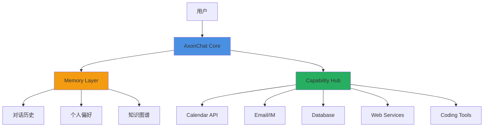
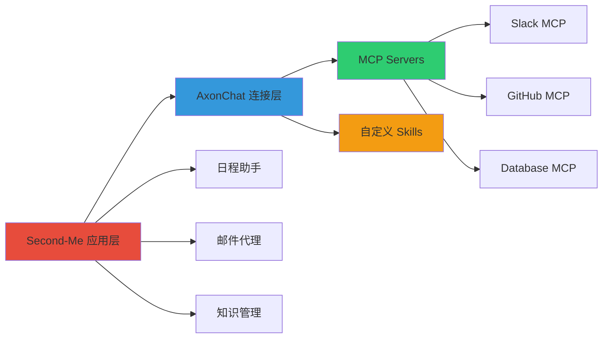
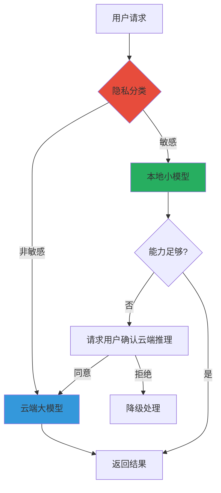

> 本文写于 2026 年 9 月，基于公开 GitHub 足迹回溯，非当年原文。本文仅讨论公开仓库 `Second-Me`、`AxonChat` 及相关开源项目的技术边界，不涉及私有系统与未公开产品细节。

当我们谈论 AI Agent 时，大多数人想到的是「终端里的编程助手」或「IDE 里的代码补全」。但还有另一个方向：**能否构建一个理解你、代表你、替你处理日常事务的「第二分身」？**

这个问题在 2026 年上半年驱动我创建了两个公开仓库：`AxonChat`（Go，2026-03）和 `Second-Me`（2026-08）。本文回溯这段探索的技术边界与思考。

<!-- more -->

## 问题定义：我们真正需要什么样的 Agent

### Coding Agent 的局限

在 2025-2026 年，Coding Agent 经历了爆发式发展。从 Claude Code、Cursor Agent 到 Qwen Code、OpenCode，这些工具在「写代码」这个垂直场景做得很好。但它们有一个共同特点：**任务驱动、会话型、无记忆延续**。

用一个对比表来看：

| 维度 | Coding Agent | Personal Agent（第二分身） |
|------|-------------|---------------------------|
| **任务类型** | 短期编程任务 | 长期、跨场景事务 |
| **记忆机制** | 单次会话上下文 | 持久化个人知识图谱 |
| **交互模式** | 用户主动请求 | 主动提醒、推荐 |
| **决策权限** | 仅生成代码建议 | 可代理执行（在授权范围） |
| **适用场景** | 开发环境 | 工作、生活全场景 |

### 真实需求场景

想象这样的场景：

- 早上 9 点，Agent 根据你的日历和邮件，提醒你「今天有 3 个会议，其中技术评审会议需要准备的文档还在草稿状态」
- 你口述「帮我预约牙医」，Agent 记住你的常用诊所、医保信息、时间偏好，直接完成预约
- 看到一篇论文链接，Agent 自动判断是否符合你的研究方向，归档到对应知识库

这不是 Coding Agent 能解决的——它需要**跨时间、跨场景的记忆与决策**。

## AxonChat：聊天之外的「连接层」设计

### 为什么叫 Axon（神经轴突）

选择 `AxonChat` 这个名字有特定含义：在神经科学中，轴突（Axon）负责传递信号。Agent 不应该只是一个「聊天框」，而应该是**连接你和各种服务、工具、数据源的神经网络**。

### 架构设计思路



核心设计原则：

1. **统一的 Memory Layer**：不是每次对话都从零开始，而是累积个人上下文
2. **可插拔的 Capability Hub**：连接各种外部服务（日历、邮件、数据库、API）
3. **权限分级系统**：哪些操作可以自动执行，哪些需要确认，哪些绝对禁止

### 技术栈选择：为什么用 Go

AxonChat 使用 Go 编写，主要考虑：

- **并发模型**：处理多个外部 API 调用、长连接会话时，goroutine 比 Python asyncio 更直观
- **部署便利**：单二进制文件，方便作为本地常驻服务
- **性能与资源**：作为「一直在后台运行」的 Agent，内存占用和启动速度很重要

```go
// 简化的核心结构示意（非完整代码）
type Agent struct {
    Memory      *MemoryStore
    Capabilities map[string]Capability
    LLMClient   *LLMClient
}

func (a *Agent) HandleRequest(ctx context.Context, input string) (string, error) {
    // 1. 从 Memory 加载相关上下文
    context := a.Memory.RetrieveContext(input)
    
    // 2. LLM 推理：需要调用哪些 Capability
    plan := a.LLMClient.Plan(input, context)
    
    // 3. 执行计划（可能需要用户确认）
    result := a.ExecutePlan(ctx, plan)
    
    // 4. 更新 Memory
    a.Memory.Update(input, result)
    
    return result, nil
}
```

## Second-Me：从工具到「分身」的产品化尝试

### 名字的含义

`Second-Me` 直译「第二个我」，但不是「复制人」，而是**你的数字延伸**——理解你的目标、偏好、工作方式，在你授权的范围内代表你行动。

### 与 AxonChat 的关系

如果把 AxonChat 看作「连接层基础设施」，Second-Me 是在此之上的**产品化封装**：



核心差异：

- **AxonChat**：技术框架，开发者可以基于它构建各种 Agent
- **Second-Me**：具体产品，面向个人用户的「数字分身」场景

### 关键技术挑战

#### 1. 个人知识图谱的构建

不同于企业知识库，个人知识图谱有独特的挑战：

- **数据异构**：邮件、聊天记录、文档、代码、浏览历史…… 每种数据结构不同
- **隐私敏感**：必须本地化存储与推理，不能依赖云端大模型
- **动态更新**：你的偏好和知识会变化，图谱要能演化

一个简化的知识图谱示例：

```yaml
# 个人偏好节点
preferences:
  work_hours: 09:00-18:00
  notification_style: minimal
  preferred_tools:
    - VSCode
    - Terminal
    - Chrome

# 关系人物节点
contacts:
  - name: 张三
    relation: 同事
    context: 后端开发，熟悉 K8s
    interaction_frequency: high
  
# 项目知识节点
projects:
  - name: papler-ops
    type: 运维平台
    tech_stack: [K8s, Go, React]
    last_active: 2022-11
    related_repos:
      - github.com/cFireworks/papler-ops
```

#### 2. 主动性与打扰的平衡

一个好的 Agent 不应该：

- **过度主动**：每 5 分钟弹一个通知
- **过度被动**：只有你问它才回答，那和搜索引擎有什么区别？

需要的是**场景感知的主动性**：

| 场景 | Agent 行为 | 触发条件 |
|------|-----------|----------|
| 工作时段 | 静默模式，仅紧急事项提醒 | 9:00-18:00 & 专注状态 |
| 会议前 | 主动提醒准备事项 | 会议开始前 15 分钟 |
| 深夜收到工作邮件 | 次日早晨汇总提醒，不立即打扰 | 22:00-07:00 |
| 检测到相关论文 | 自动归档，每日推送摘要 | 匹配研究关键词 |

#### 3. 权限与安全边界

哪些操作可以自动执行，哪些必须确认？

```typescript
// 权限分级示例
const permissions = {
  auto_execute: [
    'read_calendar',
    'search_email',
    'bookmark_article',
    'create_reminder'
  ],
  require_confirmation: [
    'send_email',
    'create_calendar_event',
    'execute_payment',
    'modify_code'
  ],
  forbidden: [
    'delete_data',
    'share_private_info',
    'auto_reply_sensitive_topic'
  ]
}
```

## 与 Coding Agent 生态的对照

### 可以借鉴的技术

在研究 Second-Me 的过程中，参考了不少 Coding Agent 项目（均为公开仓库）：

- **`qwen-code`**：终端 Agent 的交互模式设计
- **`analysis_claude_code`**：Claude Code 的架构逆向分析（社区研究）
- **`sandbox-runtime` / `bubblewrap`**：沙箱执行环境的安全隔离

从这些项目学到的关键点：

1. **Harness 模式**：标准化的 Agent 执行框架（参考 `deepseek-harness`）
2. **MCP 协议**：统一的工具调用接口（而不是每个 Agent 重新发明轮子）
3. **Skills 系统**：可组合的能力模块（类似 `agentskills`）

### 无法直接迁移的部分

但 Coding Agent 的很多设计**不适合** Personal Agent：

| Coding Agent 特点 | 为什么不适合 Personal Agent |
|------------------|---------------------------|
| 短会话生命周期 | 个人助手需要「一直在线」 |
| 单一场景（代码） | 个人事务跨多个领域 |
| 用户主动触发 | 需要主动提醒能力 |
| 云端推理 | 隐私敏感，需本地化 |

## 未解决的问题与思考

### 1. 「理解」的边界在哪里

一个真正的「第二分身」应该能：

- 理解你未明说的意图（「帮我安排下周」→ 知道你偏好的时间段、避开的冲突）
- 预测你的需求（看到日历上的出差，提前准备行程信息）
- 学习你的决策模式（拒绝过类似会议 3 次，自动过滤）

但现在的 LLM 做到这一点需要：

- 大量个人历史数据
- 持续的反馈与校正
- 如何在保护隐私的前提下，在本地完成这些推理？

### 2. 本地 LLM 的算力瓶颈

要让 Agent 真正「本地优先」（隐私考虑），就需要在个人设备上跑模型。但：

- 7B/13B 模型的推理能力有限
- 个人 GPU/M 系列芯片的算力不够支撑 70B+ 模型
- 如何在能力与隐私之间平衡？

一个可能的方案：**混合推理架构**



### 3. 信任与控制权的矛盾

越智能的 Agent，用户越容易失去控制感。如何设计「可解释 + 可撤销 + 可干预」的机制？

**可操作的设计检查清单**：

- [ ] 每个自动执行的操作都有日志可追溯
- [ ] 用户可以随时暂停 Agent 的主动行为
- [ ] 提供「为什么 Agent 做了这个决策」的解释
- [ ] 支持「撤销上一步操作」功能
- [ ] 明确告知哪些数据被 Agent 访问过

## 可复现的探索路径

如果你对这个方向感兴趣，以下是公开的参考资料：

### 相关公开仓库

1. **本项目仓库**（请自行搜索）：
   - `AxonChat`：连接层框架（Go）
   - `Second-Me`：产品化尝试

2. **Coding Agent 参考项目**（公开社区仓库）：
   - `qwen-code`：终端 Agent 实现
   - `analysis_claude_code`：Claude Code 架构分析
   - `deepseek-harness`：Agent 执行框架标准

3. **基础设施**：
   - `sandbox-runtime`、`bubblewrap`：沙箱安全隔离
   - MCP 协议：Anthropic Model Context Protocol
   - `agentskills`：可组合技能系统

### 技术关键词

- **Memory Layer**：向量数据库 + 知识图谱（可调研 Chroma、Qdrant、Neo4j）
- **本地推理**：Ollama、llama.cpp、MLX（Apple Silicon）
- **权限管理**：类似浏览器扩展的权限模型
- **主动性触发**：事件驱动架构 + 规则引擎

### 社区与讨论

- Anthropic MCP 社区：标准化工具调用协议
- OpenClaw / AG-UI：Agent 交互协议标准化尝试
- Cursor Skills / AgentSkills：技能生态探索

## 结语

从 `AxonChat` 到 `Second-Me`，这是一个从「Agent 连接层」到「个人数字分身」的探索。

与 Coding Agent 不同，Personal Agent 的挑战不在于「写得更快」，而在于**理解得更深、记得更久、决策更可信**。

这条路还很长。但我相信，当我们谈论「AI 改变生活」时，不应该只是「生成一段代码」或「写一封邮件」，而是**真正拥有一个懂你、代表你、增强你的数字延伸**。

---

*本文提到的所有仓库均为公开项目，可通过 GitHub 搜索访问。文中架构图使用 Mermaid 绘制。*
