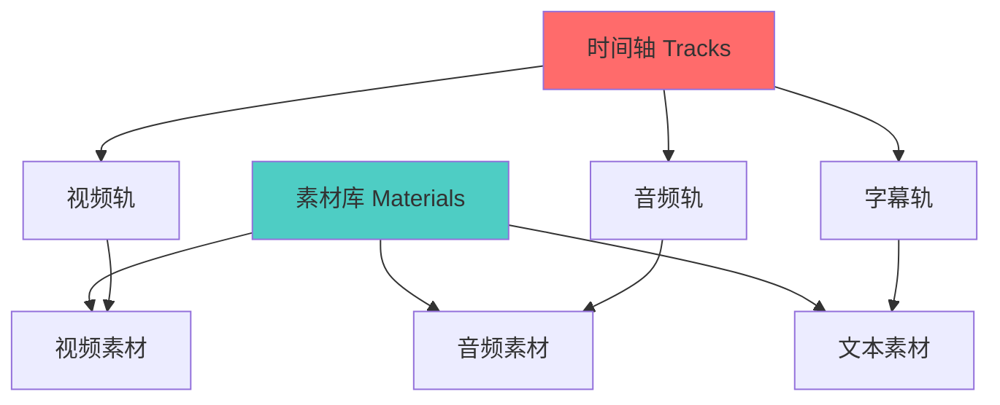

> 本文写于 2026 年 9 月，回溯 2025 年上半年探索短视频创作自动化时的技术思考与工程实践。

当我们谈论「AI 生成短视频」时，多数人想到的是「输入一句话，输出一个视频」。但在实际工程中，这个过程远比想象复杂：素材从哪来？时间轴如何编排？字幕、转场、特效如何协调？更重要的是，**如何让机器理解「一个好视频」的结构**？

2025 年上半年，在探索短视频创作自动化的过程中，我逐渐意识到：核心挑战不在于 AI 模型本身，而在于**草稿数据模型的设计与自动化能力的边界划分**。

<!-- more -->

## 问题：从手工剪辑到流水线自动化

### 传统视频创作的痛点

一个 3 分钟的短视频，熟练剪辑师需要 2-4 小时：

1. **素材整理**（30min）：分类、标记、去重
2. **粗剪**（60min）：选取片段、排序、卡点
3. **精修**（60min）：调色、字幕、转场、特效
4. **导出测试**（30min）：渲染、预览、调整

而在「AI 辅助创作」场景下，我们希望：

- **10 分钟完成粗剪**：AI 自动选取精彩片段并排序
- **5 分钟精修**：AI 推荐转场、自动生成字幕
- **一键导出**：直接渲染成品，无需反复调整

### 两种技术路径的分野

实现自动化有两种路径，差异巨大：

| 维度 | 导出草稿方案 | 直接渲染方案 |
|------|------------|------------|
| **实现难度** | 较低，复用现有编辑器 | 较高，需自建渲染引擎 |
| **用户控制** | 可二次编辑 | 黑盒输出 |
| **兼容性** | 依赖特定编辑器格式 | 跨平台 |
| **迭代速度** | 快速调整参数 | 渲染耗时长 |
| **商业化** | 绑定特定平台 | 独立产品 |

**本地优先 vs 云端**也是关键分歧点：

- **本地优先**：隐私保护、低延迟、离线可用，但设备性能限制明显
- **云端方案**：算力充足、模型迭代快，但传输耗时、成本高昂

本文聚焦**「导出草稿 + 本地优先」**路径，因为它更适合工程快速验证和用户二次编辑。

## 草稿数据模型：视频的「源代码」

### 剪映草稿格式剖析

市面上主流的短视频编辑器（如剪映、CapCut）都采用 **JSON 草稿文件**描述视频项目。这类草稿文件本质上是**时间线编排的数据结构**：

```json
{
  "version": "4.2.0",
  "materials": {
    "videos": [
      {
        "id": "video_001",
        "path": "/path/to/clip.mp4",
        "duration": 15000000,
        "metadata": {
          "width": 1920,
          "height": 1080,
          "fps": 30
        }
      }
    ],
    "audios": [...],
    "texts": [...]
  },
  "tracks": [
    {
      "type": "video",
      "segments": [
        {
          "material_id": "video_001",
          "target_timerange": {
            "start": 0,
            "duration": 5000000
          },
          "source_timerange": {
            "start": 3000000,
            "duration": 5000000
          },
          "transform": {
            "scale": 1.2,
            "position": [0, 100]
          }
        }
      ]
    }
  ]
}
```

### 核心概念：素材与轨道分离

草稿数据模型的关键设计是**「素材库 + 时间轴引用」**：



这种设计的优势：

1. **素材复用**：同一段视频可在多处引用，无需重复存储
2. **非破坏性编辑**：原始素材不变，所有操作都是引用和变换
3. **层级关系清晰**：轨道堆叠、时间对齐一目了然

### 时间单位的陷阱

注意草稿中的时间单位：多数编辑器使用**微秒（μs）**而非秒：

```python
# 常见错误
duration = 5  # 误以为是 5 秒

# 正确做法
duration = 5 * 1_000_000  # 5 秒 = 5,000,000 微秒
```

这是历史遗留设计，源于视频编解码器的时间基（timebase）通常是高精度分数（如 1/1000000）。

## 自动化能力边界：AI 能做什么，不能做什么

### 三层能力分级

我们可以将自动化能力分为三个层次：

| 层次 | 能力 | 技术难度 | 自动化程度 |
|------|-----|---------|-----------|
| **L1 基础操作** | 裁剪、拼接、变速、静音 | ⭐⭐ | 完全自动 |
| **L2 智能编排** | 精彩片段检测、BGM 匹配、节奏卡点 | ⭐⭐⭐⭐ | 半自动，需人工确认 |
| **L3 创意生成** | 故事线构建、情绪渲染、风格迁移 | ⭐⭐⭐⭐⭐ | AI 辅助，大量人工 |

### L1：确定性操作的自动化

这类操作可以用**规则引擎**实现，无需深度学习：

```python
# 自动静音片段检测
def detect_silence(audio_file, threshold=-40):
    """检测音频中的静音片段"""
    segments = []
    # 基于音量阈值的简单规则
    for chunk in audio_chunks:
        if chunk.db < threshold:
            segments.append(chunk.timerange)
    return segments

# 自动裁剪黑边
def crop_black_bars(video_file):
    """检测并裁剪视频黑边"""
    # 分析前 10 帧，检测纯黑区域
    black_regions = detect_black_regions(video_file)
    return calculate_crop_params(black_regions)
```

### L2：AI 驱动的智能编排

这层需要机器学习模型，但边界明确：

**精彩片段检测**：

```python
# 基于多模态特征的精彩度评分
class HighlightDetector:
    def score_segment(self, video_segment):
        features = {
            'visual_complexity': self.analyze_visual(video_segment),
            'audio_energy': self.analyze_audio(video_segment),
            'speech_presence': self.detect_speech(video_segment),
            'face_count': self.count_faces(video_segment),
            'motion_intensity': self.analyze_motion(video_segment)
        }
        # 加权组合
        score = (
            features['visual_complexity'] * 0.2 +
            features['audio_energy'] * 0.3 +
            features['speech_presence'] * 0.3 +
            features['face_count'] * 0.1 +
            features['motion_intensity'] * 0.1
        )
        return score
```

**BGM 节奏匹配**：


### L3：人机协作的创意层

这层无法完全自动化，需要保留人类决策点：

- **故事线构建**：AI 生成大纲，人工选择方向
- **情绪渲染**：AI 推荐色调、配乐，人工微调
- **风格迁移**：AI 提供多个版本，人工选择

**关键原则**：不要让 AI 替人做最终决策，而是**降低决策成本**。

## 失败模式与幂等性设计

### 常见失败场景

自动化流水线中，失败是常态而非异常：

1. **素材路径失效**：本地文件移动、重命名、删除
2. **格式不兼容**：编辑器版本升级导致草稿格式变化
3. **渲染超时**：长视频渲染卡住或崩溃
4. **中间态丢失**：部分操作成功、部分失败，状态不一致

### 幂等性保障

**幂等性（Idempotency）**：同一操作执行多次，结果与执行一次相同。

在视频流水线中实现幂等：

```python
class DraftGenerator:
    def generate_draft(self, input_materials, output_path):
        """生成草稿文件，支持断点续传"""
        
        # 1. 检查是否已有中间结果
        checkpoint = self.load_checkpoint(output_path)
        if checkpoint:
            print(f"从检查点恢复: {checkpoint['progress']}")
            materials = checkpoint['materials']
            progress = checkpoint['progress']
        else:
            materials = self.prepare_materials(input_materials)
            progress = 0
        
        # 2. 分步骤执行，每步保存检查点
        steps = [
            self.analyze_materials,
            self.detect_highlights,
            self.arrange_timeline,
            self.add_transitions,
            self.generate_subtitles
        ]
        
        for i, step in enumerate(steps[progress:], start=progress):
            try:
                materials = step(materials)
                self.save_checkpoint(output_path, {
                    'materials': materials,
                    'progress': i + 1
                })
            except Exception as e:
                print(f"步骤 {i} 失败: {e}")
                # 保留当前检查点，下次重试
                raise
        
        # 3. 最终生成草稿
        draft = self.finalize_draft(materials)
        self.write_draft(output_path, draft)
        self.clear_checkpoint(output_path)
        
        return draft
```

### 错误恢复策略

```python
# 素材路径失效时的降级方案
def resolve_material_path(material_id, draft_dir):
    """智能查找素材文件"""
    paths_to_try = [
        material_id,  # 绝对路径
        os.path.join(draft_dir, os.path.basename(material_id)),  # 同目录
        search_in_recent_imports(material_id),  # 最近导入记录
        prompt_user_to_locate(material_id)  # 最后手段：询问用户
    ]
    
    for path in paths_to_try:
        if os.path.exists(path):
            return path
    
    raise MaterialNotFoundError(material_id)
```

## 工程实践检查清单

在构建视频创作自动化系统时，以下是关键检查点：

### 数据层

- [ ] 草稿格式是否有版本号？能否向前兼容？
- [ ] 素材路径是否支持相对路径？
- [ ] 时间单位是否统一（微秒 vs 秒 vs 帧）？
- [ ] 是否有完整的元数据（分辨率、帧率、编码格式）？

### 自动化层

- [ ] 哪些操作是确定性的？哪些需要 AI？
- [ ] AI 模型的失败回退方案是什么？
- [ ] 用户在哪些环节可以介入和修正？
- [ ] 生成结果是否可复现（相同输入→相同输出）？

### 工程质量

- [ ] 是否支持断点续传？
- [ ] 是否有详细的日志和监控？
- [ ] 单元测试覆盖了关键路径吗？
- [ ] 性能瓶颈在哪里？如何优化？

### 用户体验

- [ ] 错误提示是否友好？用户能理解吗？
- [ ] 等待时间是否在可接受范围（<10 秒粗剪，<5 分钟渲染）？
- [ ] 用户能否预览中间结果？
- [ ] 撤销/重做逻辑是否完善？

## 对比：本地 vs 云端的工程权衡

| 维度 | 本地优先方案 | 云端方案 |
|------|------------|---------|
| **隐私** | 素材不离开本地 | 需上传至服务器 |
| **性能** | 受设备限制（低端机困难） | 算力充足，但传输耗时 |
| **成本** | 一次性购买或免费 | 按使用量收费 |
| **迭代** | 需用户更新软件 | 随时部署新模型 |
| **离线** | 完全可用 | 依赖网络 |
| **协作** | 难以多人编辑 | 天然支持云端协作 |

**实践建议**：

- **原型阶段**：本地优先，快速验证
- **规模化阶段**：混合架构（本地编辑 + 云端渲染）
- **企业场景**：私有化部署的云端方案

## 延伸思考：视频自动化的未来

### 从工具到智能体

当前的自动化还停留在「工具」层面：用户明确指令，系统执行。

未来可能出现「视频创作 Agent」：

```python
# 用户只需描述目标
agent.create_video(
    goal="制作一个 3 分钟的产品介绍视频",
    materials=["产品演示录屏.mp4", "用户访谈.mp4"],
    style="科技感、节奏明快",
    target_audience="年轻开发者"
)

# Agent 自主决策：
# 1. 分析素材，提取关键片段
# 2. 生成故事线大纲
# 3. 匹配 BGM 和转场
# 4. 生成字幕和解说词
# 5. 渲染成片，提交审核
```

### 技术演进方向

1. **多模态大模型**：理解视频内容的语义，而非仅分析像素和音频
2. **用户偏好学习**：记住用户的剪辑风格，越用越懂
3. **实时协作**：AI 与人类剪辑师并行工作，各取所长
4. **跨平台标准**：草稿格式走向开放标准，打破工具孤岛

## 结语

短视频创作自动化的本质，是**把创意留给人类，把重复留给机器**。

草稿数据模型是这个愿景的基础：它定义了「一个视频」的结构化表达，让自动化有了操作的抓手。而能力边界的划分、幂等性的保障、失败模式的处理，则决定了系统能否从实验室走向生产环境。

2025 年的探索让我明白：好的自动化工具不是替代人，而是**让人专注于最有价值的 20% 决策，自动化剩下 80% 的执行**。

---

## 扩展阅读

- [FFmpeg 官方文档](https://ffmpeg.org/documentation.html) - 视频处理的瑞士军刀
- [OpenTimelineIO](https://github.com/AcademySoftwareFoundation/OpenTimelineIO) - 时间线数据交换标准
- [MoviePy 文档](https://zulko.github.io/moviepy/) - Python 视频编辑库
- [DaVinci Resolve API](https://www.blackmagicdesign.com/developer/product/davinci-resolve) - 专业级编辑器的脚本接口

## 讨论

你在视频自动化中遇到过哪些坑？欢迎在 Issues 里分享经验。

---

*本文中的代码示例均为简化版本，实际生产环境需考虑更多边界情况。*
