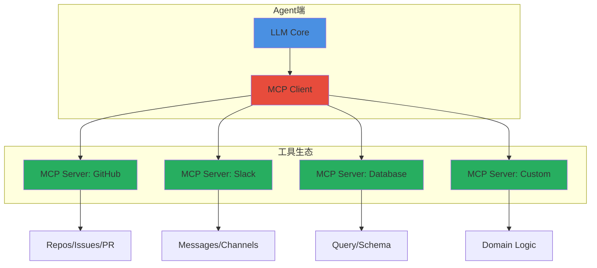
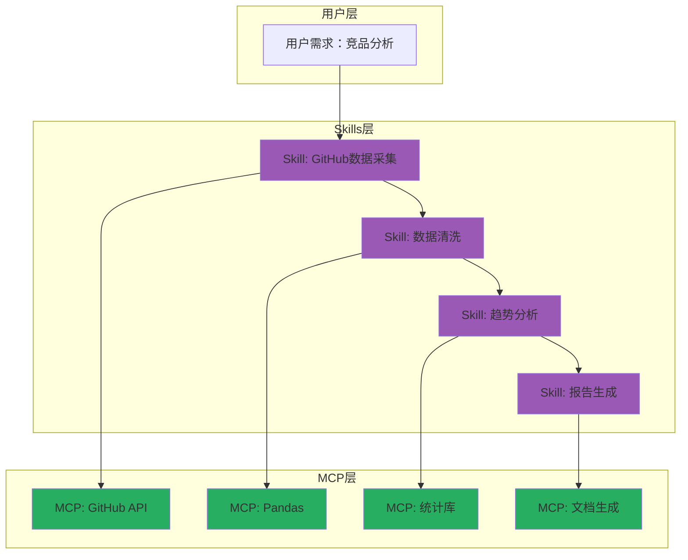

> 本文写于 2026 年 10 月，基于 2026 年上半年业界在 Agent 协议与技能系统的探索回溯。讨论内容基于公开技术文献与开源生态，不涉及私有系统细节。

当 AI Agent 从实验室走向生产环境，一个核心问题浮现：**如何让不同 Agent 共享能力，如何让能力模块可组合、可复用、可安全隔离？** 这不是单个产品的工程问题，而是整个 Agent 生态的基础设施挑战。本文讨论 MCP（Model Context Protocol）、Agent Skills、工具权限边界等关键技术议题，以及它们如何定义 Agent 的可组合能力边界。

<!-- more -->

## 问题域：Agent 能力扩展的三个困境

### 困境一：能力孤岛与重复建设

2025-2026 年，几乎每个 Agent 产品都在重复实现基础能力：

- 数据库连接（PostgreSQL、MySQL、MongoDB）
- API 调用（REST、GraphQL、gRPC）
- 文件操作（读写、搜索、索引）
- 消息通知（邮件、Slack、企业微信）

这带来三个问题：

1. **重复开发成本**：每个团队都要维护相同的工具集成
2. **质量参差不齐**：有的实现完善，有的仅满足 demo 需求
3. **用户学习成本**：切换 Agent 产品时配置和使用方式完全不同

| 维度 | 当前状态 | 理想状态 |
|------|---------|---------|
| 能力复用 | 各自实现，互不兼容 | 标准协议，一次开发 |
| 质量保障 | 依赖单一团队 | 社区审查与贡献 |
| 更新速度 | 跟随产品发版 | 独立更新，即时生效 |
| 用户迁移 | 重新配置所有工具 | 配置可携带 |
| 垂直深度 | 通用浅层集成 | 领域专家深度定制 |

### 困境二：能力发现与组合的复杂度

即使实现了工具调用，Agent 仍面临两个挑战：

**能力发现困难**：
- 用户不知道 Agent 能做什么
- Agent 不知道何时该用哪个工具
- 工具描述过于技术化，LLM 难以准确匹配

**能力组合爆炸**：
- 5 个工具就有 120 种排列组合
- 缺乏工作流级别的抽象
- 错误组合导致非预期结果

### 困境三：权限边界与安全隔离

Agent 调用外部工具的风险：

```yaml
# 真实场景的风险案例
风险场景:
  - 场景: 用户要求"清理临时文件"
    风险: Agent 误删重要数据
    根源: 文件操作权限过大

  - 场景: 用户要求"发邮件通知团队"
    风险: Agent 泄露敏感信息到错误收件人
    根源: 缺乏内容审查机制

  - 场景: 用户要求"执行数据库查询"
    风险: 注入攻击，DROP TABLE
    根源: 未做 SQL 安全检查

  - 场景: 用户要求"调用内部 API"
    风险: 超出权限范围的操作
    根源: 缺乏细粒度权限控制
```

## 解决方案一：MCP 协议的标准化尝试

### MCP 的核心设计

Anthropic 于 2025 年提出的 Model Context Protocol 试图解决「Agent 如何标准化调用外部能力」：



**关键设计原则**：

1. **协议标准化**：定义统一的工具描述格式（JSON Schema）
2. **能力声明**：MCP Server 主动声明自己能做什么
3. **上下文传递**：支持会话级别的状态保持
4. **安全边界**：Server 运行在独立进程，资源隔离

### MCP Server 的接口契约

一个标准 MCP Server 需要实现三个核心接口：

```typescript
// MCP Server 接口定义
interface MCPServer {
  // 工具能力列表
  tools: {
    name: string
    description: string
    inputSchema: JSONSchema
  }[]
  
  // 执行工具调用
  execute(toolName: string, args: any): Promise<{
    content: string | object
    isError?: boolean
  }>
  
  // 资源列表（可选）
  resources?: {
    uri: string
    name: string
    mimeType: string
  }[]
}

// 示例：GitHub MCP Server
const githubServer: MCPServer = {
  tools: [
    {
      name: "search_issues",
      description: "搜索 GitHub Issues，支持关键词、状态、标签过滤",
      inputSchema: {
        type: "object",
        properties: {
          repo: { type: "string", description: "仓库全名，如 owner/repo" },
          query: { type: "string", description: "搜索关键词" },
          state: { type: "string", enum: ["open", "closed", "all"] }
        },
        required: ["repo"]
      }
    },
    {
      name: "create_issue",
      description: "创建新 Issue，需要标题和描述",
      inputSchema: {
        type: "object",
        properties: {
          repo: { type: "string" },
          title: { type: "string" },
          body: { type: "string" },
          labels: { type: "array", items: { type: "string" } }
        },
        required: ["repo", "title"]
      }
    }
  ],
  
  async execute(toolName, args) {
    // 调用 GitHub API
    // 返回结构化结果
  }
}
```

### MCP 的边界与局限

MCP 解决了「如何调用」，但没有解决：

| 问题域 | MCP 覆盖范围 | 未解决的部分 |
|-------|------------|-------------|
| 工具调用协议 | ✅ 标准化接口 | ❌ 如何让 LLM 准确选择工具 |
| 能力描述 | ✅ JSON Schema | ❌ 语义层面的能力匹配 |
| 安全隔离 | ✅ 进程隔离 | ❌ 细粒度权限控制 |
| 状态管理 | ✅ 会话上下文 | ❌ 跨会话的持久化记忆 |
| 工作流编排 | ❌ 仅单工具调用 | ❌ 多工具组合与依赖管理 |
| UI 交互 | ❌ 纯文本返回 | ❌ Rich UI 组件 |

这些空白催生了更高层次的抽象：**Agent Skills 协议**。

## 解决方案二：Agent Skills 的可组合抽象

### Skills 相比 MCP 的增强

如果说 MCP 是「函数调用层」，Skills 就是「能力抽象层」：



**Skills 的核心增强**：

1. **语义触发**：用自然语言描述适用场景，而非技术参数
2. **工作流编排**：一个 Skill 可以组合多个 MCP 工具
3. **UI 组件**：定义交互式界面（表单、图表、确认框）
4. **权限模板**：预定义安全策略，用户一键授权
5. **可组合性**：Skills 之间可以互相调用

### Skill 定义示例

```yaml
# competitive_analysis.skill.yaml
skill:
  id: competitive-analysis-github
  name: "GitHub 竞品数据分析"
  version: 1.2.0
  
  # 语义触发条件
  triggers:
    semantic:
      - "分析竞争对手的开源项目"
      - "对比 GitHub 仓库的活跃度"
      - "研究类似项目的技术选型"
    
    keywords:
      - ["竞品", "GitHub"]
      - ["对比", "开源项目"]
  
  # 工作流定义
  workflow:
    steps:
      - name: fetch_repos
        mcp: github.search_repositories
        params:
          query: "${user_input.keywords}"
          sort: stars
          limit: 10
        output: raw_repos
      
      - name: fetch_details
        mcp: github.get_repo_details
        foreach: ${raw_repos}
        output: detailed_data
      
      - name: analyze_trends
        mcp: pandas.aggregate
        input: ${detailed_data}
        script: |
          df.groupby('language').agg({
            'stars': 'sum',
            'commits': 'count'
          })
        output: insights
      
      - name: generate_report
        mcp: markdown.render
        template: competitive_report
        input: ${insights}
        output: final_report
  
  # 权限声明
  permissions:
    required:
      - github.read_public
      - network.https
    optional:
      - github.read_private  # 需要用户额外授权
    
    safety:
      readonly: true
      rate_limit: 100/hour
  
  # UI 定义
  ui:
    input_form:
      - field: keywords
        type: text
        label: "竞品关键词（如 web-framework）"
        required: true
      
      - field: language
        type: select
        options: ["All", "Python", "JavaScript", "Go", "Rust"]
    
    output_view:
      type: dashboard
      components:
        - chart: bar
          data: ${insights.by_language}
        - table: sortable
          data: ${detailed_data}
        - download: markdown
          file: ${final_report}
```

### Skills 的安全边界设计

**三层权限模型**：

```typescript
// Skill 权限检查流程
class SkillExecutor {
  async execute(skill: Skill, context: ExecutionContext) {
    // 1. 静态权限检查
    await this.checkStaticPermissions(skill.permissions.required)
    
    // 2. 运行时权限提升
    if (skill.needsEscalation(context)) {
      const granted = await this.requestUserConfirmation({
        message: `Skill "${skill.name}" 需要以下额外权限：`,
        permissions: skill.permissions.optional,
        reason: skill.getEscalationReason(context)
      })
      if (!granted) throw new PermissionDeniedError()
    }
    
    // 3. 执行期沙箱隔离
    const sandbox = new SkillSandbox({
      allowedDomains: skill.permissions.network?.allowed_domains,
      fileSystem: {
        readOnly: skill.permissions.readonly,
        allowedPaths: skill.permissions.filesystem?.allowed_paths
      },
      timeout: skill.execution.timeout || 30000
    })
    
    return await sandbox.run(() => {
      return skill.workflow.execute(context)
    })
  }
}
```

**实际案例：数据库查询 Skill 的权限边界**

```yaml
# database_query.skill.yaml
permissions:
  required:
    - database.connect
  
  dynamic_checks:
    # SQL 语句检查
    - rule: no_write_operations
      pattern: "(DROP|DELETE|UPDATE|INSERT|TRUNCATE|ALTER)"
      action: require_confirmation
      message: "检测到写操作，需要确认"
    
    # 数据量限制
    - rule: result_size_limit
      condition: rows > 1000
      action: require_confirmation
      message: "查询结果超过 1000 行，是否继续？"
    
    # 敏感字段过滤
    - rule: sensitive_columns
      columns: ["password", "credit_card", "ssn"]
      action: mask_output
      masking: "***"
```

## 跨产品互操作：协议的生态价值

### 为什么标准协议重要

**单一产品视角 vs 生态视角**：

| 场景 | 封闭生态（各自实现） | 开放协议（MCP+Skills） |
|------|-------------------|---------------------|
| 用户切换 Agent | 重新配置所有工具 | 配置文件直接迁移 |
| 企业自建工具 | 为每个 Agent 产品重复开发 | 一次开发，所有 Agent 可用 |
| 社区贡献 | 依赖产品厂商接受 PR | 发布到 Skills Marketplace |
| 垂直领域 | 通用 Agent 能力有限 | 领域专家发布专业 Skills |
| 安全审计 | 黑盒，难以审查 | Skills 定义可审查 |

### 真实收益：Cursor、GitHub Copilot、Claude 的协议统一

假设这些产品都支持 MCP + Skills 协议：

```yaml
# ~/.agent-config/skills.yaml
# 用户的个人 Skills 配置，可在任何支持协议的 Agent 中使用

installed_skills:
  - id: github-analyzer
    version: 2.1.0
    config:
      default_org: mycompany
      access_token: ${GITHUB_TOKEN}
  
  - id: postgres-query
    version: 1.5.0
    config:
      connection_string: ${DB_URL}
      default_schema: public
  
  - id: slack-notifier
    version: 3.0.0
    config:
      workspace: myteam
      default_channel: "#dev"

workflows:
  daily-standup:
    trigger: cron(0 9 * * 1-5)
    skills:
      - github-analyzer:
          action: get_team_activity
          since: 24h
      - slack-notifier:
          message: "📊 团队昨日活动：${github_result}"
```

用户在 Cursor 中配置一次，在 Copilot 和 Claude 中自动生效。

### 与沙箱/个人代理的技术连接

在之前讨论的 **Personal Agent** 和 **沙箱安全** 系列中：

- **Personal Agent 的记忆层**可以封装为 Skill（记忆检索、偏好推断）
- **沙箱隔离技术**（bubblewrap、gVisor）是 Skills 执行的底层支撑
- **MCP 协议**让 Personal Agent 可以标准化调用日历、邮件、笔记等个人数据源

这些技术栈在 Agent 生态中是互补的：

```
┌─────────────────────────────────────┐
│        Agent 应用层                  │
│  (Coding Agent, Personal Agent)     │
└─────────────────┬───────────────────┘
                  │
┌─────────────────┴───────────────────┐
│       Skills 协议层                  │
│  (能力抽象、工作流编排、权限管理)      │
└─────────────────┬───────────────────┘
                  │
┌─────────────────┴───────────────────┐
│        MCP 协议层                    │
│  (工具调用标准化、上下文管理)          │
└─────────────────┬───────────────────┘
                  │
┌─────────────────┴───────────────────┐
│       沙箱执行层                     │
│  (进程隔离、资源限制、安全审计)        │
└─────────────────────────────────────┘
```

## 未解决的工程挑战

### 1. 能力发现的准确性

即使有语义描述，LLM 仍然会选错工具：

- 用户说「查一下数据」，Agent 不知道是查数据库还是查 API
- 用户说「分析趋势」，Agent 不知道用统计 Skill 还是 ML Skill

**可能的方向**：
- 基于历史成功率的推荐算法
- 用户可以手动固定某些场景的 Skill 选择
- Skill 之间声明互斥或依赖关系

### 2. Skills 的版本管理与兼容性

当一个 Skill 更新后：

- 旧的工作流会不会失效？
- 如何做向后兼容？
- 如何通知依赖该 Skill 的用户？

**借鉴软件包管理**：
- 语义化版本（SemVer）
- 兼容性测试套件
- 废弃 API 的迁移指南

### 3. 跨组织的 Skills 信任问题

企业内部 Skills vs 公开 Marketplace：

- 企业如何审查第三方 Skills？
- 如何防止 Skills 泄露敏感数据？
- 如何建立 Skills 的信誉体系？

**可能的机制**：
- Skills 代码必须开源可审查
- 沙箱强制隔离，禁止访问未声明的资源
- 社区评分 + 企业白名单机制

## 技术演进路径与时间线

### 2024-2025：协议萌芽期

- Anthropic 发布 MCP 协议
- OpenAI Plugin 系统的失败教训
- 各家 Agent 产品开始尝试标准化

### 2026 上半年：生态探索期（本文回溯时点）

- 多个 MCP Server 开源实现出现
- Agent Skills 概念被提出（多个团队独立探索）
- 首批跨产品的 Skills 案例

### 未来可能的方向

**短期（2026-2027）**：
- [ ] MCP 协议被主流 Agent 产品采纳
- [ ] 出现 Skills 的事实标准规范
- [ ] 首个 Skills Marketplace 上线

**中期（2027-2028）**：
- [ ] Skills 与容器技术深度融合（WASM、gVisor）
- [ ] 企业级 Skills 管理平台成熟
- [ ] Skills as Code 工作流普及

**长期愿景**：
- [ ] Agent 的价值从「模型能力」转向「Skills 生态」
- [ ] 出现专门的 Skills 开发者社区
- [ ] Skills 成为 Agent 的「App Store」

## 结语

Agent 协议与技能系统，本质上是在回答一个问题：**如何让 AI 能力从单点突破走向生态繁荣？**

MCP 解决了「如何调用」，Skills 解决了「如何组合」，而更高层次的挑战在于**如何让开发者、企业、用户都愿意在这个生态中贡献和消费能力**。

这不仅是技术问题，也是协议设计、社区治理、商业模式的综合挑战。但如果成功，我们将看到一个真正的 Agent 能力市场：就像智能手机的价值在于 App Store，Agent 的价值也将在于 Skills Marketplace。

---

## 延伸阅读

本文讨论的技术在 2026 年上半年处于快速演进期，相关资源：

- **MCP 协议**：[Model Context Protocol 官方文档](https://modelcontextprotocol.io/)
- **Agent Skills**：搜索 `agent-skills`、`llm-tools-protocol` 等关键词可找到多个开源探索
- **工具调用标准**：OpenAI Function Calling、Anthropic Tool Use 文档
- **沙箱隔离**：bubblewrap、gVisor、WebAssembly 安全模型
- **相关讨论**：GitHub 上搜索 `agent-capability-protocol`、`llm-plugin-standard` 等 topic

*本文所有架构图使用 Mermaid 绘制。讨论基于公开技术文献，不涉及未公开系统细节。*
