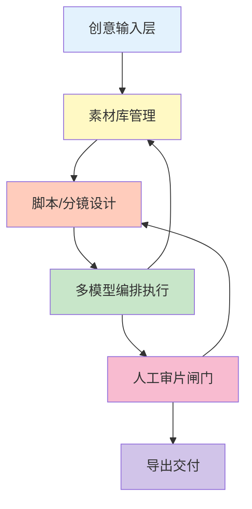
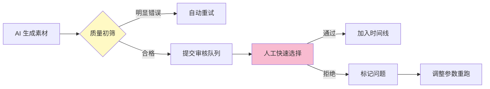

> 本文写于 2026 年 10 月，回溯 2025 年中在构建 AI 辅助创作系统时，对「创作工作室」这一通用抽象的工程思考。

当我们谈论「AI 生成视频」时，技术圈往往聚焦于单点突破：Sora 能生成 60 秒视频，Midjourney 产出精美插画，Eleven Labs 克隆真人声线。但在实际落地中，**单点能力无法直接交付成品**——从一个创意想法到最终可发布的视频，中间需要经过素材准备、脚本设计、多模型协同、人工审核、格式导出等一整套流程。

2025 年中，在前期探索[视觉检测场景](/2026/09/30/vision-detection-care-safety-engineering/)与[短视频自动化](/2026/09/30/video-creation-pipeline-automation/)后，我开始思考：能否抽象出一套**与具体业务解耦的「AI 创作工作室」架构**，让它既能承载 AI 视频生成，也能支持图文创作、音频合成等多种场景？

<!-- more -->

## 问题：从单点能力到完整交付的鸿沟

### 业界现状：工具碎片化

目前 AI 创作工具呈现明显的碎片化趋势：

| 工具类型 | 代表产品 | 擅长能力 | 缺失环节 |
|---------|---------|---------|---------|
| 视频生成 | Runway、Pika | 文生视频、图生视频 | 无分镜规划，难以多镜头组合 |
| 图像生成 | Midjourney、DALL-E | 高质量单帧 | 风格一致性难保证 |
| 音频合成 | Eleven Labs、Azure TTS | 声音克隆、情感表达 | 与视频时间轴的精确对齐 |
| 剪辑工具 | 剪映、CapCut | 时间线编辑 | AI 能力依赖接口，定制困难 |
| 工作流编排 | ComfyUI、Dify | 可视化串联模型 | 视频专用抽象不足 |

创作者往往需要在多个工具间切换：在 Midjourney 生成图片，导出后上传 Runway 生成动态，下载视频再导入剪映添加字幕和 BGM。这种「工具链拼接」既低效，又难以自动化。

### 核心矛盾

构建统一的 AI 创作工作室，面临三个本质矛盾：

1. **模型多样性 vs. 统一接口**：每个 AI 服务的调用方式、参数格式、计费逻辑各不相同
2. **创意灵活性 vs. 流水线固化**：创作是非线性的，但自动化需要明确的执行顺序
3. **质量把控 vs. 全自动化**：AI 生成结果不可控，但每步人工审核又失去了自动化意义

## 五层架构：创作工作室的抽象模型

基于实践经验，一个可落地的 AI 创作工作室应包含以下层次：



### 1. 素材库：统一的资产管理

不同于传统视频编辑器的「项目文件夹」，AI 创作需要更智能的素材管理：

```python
class MaterialLibrary:
    """统一素材库抽象"""
    
    def __init__(self):
        self.materials = {}  # {material_id: MaterialMeta}
        self.tags = {}       # {tag: [material_ids]}
        self.embeddings = {} # {material_id: vector}
    
    def add_material(self, file_path, metadata=None):
        """添加素材，自动提取元信息"""
        material_id = self.generate_id()
        
        # 自动分析素材
        meta = {
            'type': self.detect_type(file_path),  # video/image/audio/text
            'duration': self.extract_duration(file_path),
            'resolution': self.extract_resolution(file_path),
            'tags': self.auto_tag(file_path),     # AI 打标签
            'embedding': self.encode(file_path),  # 向量化，便于语义搜索
            'source': metadata.get('source', 'user_upload'),
            'created_at': time.time()
        }
        
        self.materials[material_id] = meta
        return material_id
    
    def search(self, query, modality='all', limit=10):
        """语义搜索：「夕阳下的城市」→ 返回相关素材"""
        query_embedding = self.encode_text(query)
        
        # 向量相似度检索
        candidates = []
        for mid, meta in self.materials.items():
            if modality != 'all' and meta['type'] != modality:
                continue
            similarity = cosine_similarity(query_embedding, meta['embedding'])
            candidates.append((mid, similarity))
        
        # 按相似度排序
        candidates.sort(key=lambda x: x[1], reverse=True)
        return [mid for mid, _ in candidates[:limit]]
```

**关键设计**：

- **多模态索引**：图片、视频、音频、文本统一管理
- **语义搜索**：用户可用自然语言查找素材，而非依赖文件名
- **自动标注**：接入 CLIP、ImageBind 等模型自动打标签
- **版本管理**：AI 生成的素材自动关联到原始提示词和参数

### 2. 脚本与分镜：从线性到非线性

传统视频脚本是线性文档，但 AI 创作中需要支持**动态生成与迭代**：

```json
{
  "script": {
    "title": "产品介绍视频",
    "scenes": [
      {
        "scene_id": "scene_01",
        "duration_range": [5, 10],
        "description": "展示产品外观，强调科技感",
        "shots": [
          {
            "shot_id": "shot_01_01",
            "type": "ai_generated",
            "prompt": "futuristic gadget, sleek design, dark background, studio lighting",
            "model": "runway_gen2",
            "reference_image": "material_001",
            "parameters": {
              "motion": "slow_rotation",
              "duration": 4
            }
          }
        ],
        "audio": {
          "narration": "这是我们的新产品，采用前沿设计",
          "bgm": "upbeat_tech_music",
          "sfx": ["whoosh", "beep"]
        }
      }
    ]
  },
  "metadata": {
    "target_duration": 120,
    "aspect_ratio": "16:9",
    "style": "modern_tech",
    "version": "0.3"
  }
}
```

**分镜设计的自动化支持**：

1. **时长预估**：根据旁白文字 + 镜头复杂度自动计算每个镜头的合理时长
2. **转场建议**：分析相邻镜头的风格差异，推荐淡入淡出或特效转场
3. **音画对齐**：检测旁白关键词，在画面中对应时刻插入强调元素
4. **多版本分支**：同一场景生成 3 个不同风格的镜头，留待后续选择

### 3. 多模型编排：异构服务的统一调度

AI 创作涉及十几种模型：文生图、图生视频、TTS、BGM 生成、字幕识别等。如何高效编排？

```python
class ModelOrchestrator:
    """多模型编排引擎"""
    
    def __init__(self):
        self.models = {}  # 注册的模型服务
        self.executors = ThreadPoolExecutor(max_workers=4)
        self.cache = {}   # 结果缓存
    
    def register_model(self, name, model_service):
        """注册模型服务（统一接口封装）"""
        self.models[name] = model_service
    
    async def execute_pipeline(self, script):
        """执行完整创作流水线"""
        tasks = self.parse_dependencies(script)
        
        # DAG 拓扑排序，确定执行顺序
        execution_order = self.topological_sort(tasks)
        
        results = {}
        for task in execution_order:
            # 检查是否可并行
            dependencies = [results[dep] for dep in task.depends_on]
            
            # 带重试的执行
            result = await self.execute_with_retry(
                task=task,
                inputs=dependencies,
                max_retries=3
            )
            
            results[task.id] = result
            
            # 关键检查点：质量门控
            if task.requires_review:
                await self.notify_for_review(task, result)
                # 阻塞等待人工确认
                approved = await self.wait_for_approval(task.id)
                if not approved:
                    return self.handle_rejection(task, result)
        
        return results
    
    def parse_dependencies(self, script):
        """解析任务依赖关系"""
        tasks = []
        for scene in script['scenes']:
            for shot in scene['shots']:
                if shot['type'] == 'ai_generated':
                    task = Task(
                        id=shot['shot_id'],
                        model=shot['model'],
                        params=shot['parameters'],
                        depends_on=shot.get('reference_image', [])
                    )
                    tasks.append(task)
        return tasks
```

**工程要点**：

- **依赖图管理**：自动识别「这个镜头需要前一个镜头的输出作为参考图」
- **并行调度**：无依赖的任务并发执行，缩短总耗时
- **失败重试**：AI 模型不稳定，需要指数退避重试
- **成本优化**：相同参数的请求做缓存，避免重复计费

### 4. 人工审片闸门：质量与效率的平衡

完全自动化在当前 AI 能力下不现实，**关键是把人工介入点设计得足够高效**：



**审片 UI 设计原则**：

1. **批量预览**：同时展示 3-5 个候选结果，快速横向对比
2. **快捷操作**：键盘快捷键（1-5 选择，X 拒绝，Space 重播）
3. **问题标注**：拒绝时快速标记原因（「人物形变」「色调不对」），用于优化提示词
4. **审核进度**：清晰显示「已审 15/40 个镜头，预计还需 8 分钟」

**自动初筛规则**：

```python
def auto_filter_bad_results(video_path):
    """AI 生成结果的自动质检"""
    issues = []
    
    # 1. 技术问题检测
    if has_artifacts(video_path):  # 明显的生成伪影
        issues.append('visual_artifacts')
    if is_blurry(video_path):      # 过度模糊
        issues.append('low_quality')
    if has_watermark(video_path):  # 水印检测
        issues.append('watermark')
    
    # 2. 内容安全检测
    if contains_nsfw(video_path):
        issues.append('nsfw_content')
    
    # 3. 需求匹配检测
    if not matches_prompt(video_path, original_prompt):
        issues.append('prompt_mismatch')
    
    return len(issues) == 0, issues
```

### 5. 导出交付：多格式适配

最后一步是把内部的「工作室项目」转换为可交付的成品：

```python
class Exporter:
    """导出适配器"""
    
    PRESETS = {
        'youtube_1080p': {
            'resolution': (1920, 1080),
            'fps': 30,
            'codec': 'h264',
            'bitrate': '8M',
            'audio_codec': 'aac',
            'audio_bitrate': '192k'
        },
        'instagram_reel': {
            'resolution': (1080, 1920),  # 竖屏
            'fps': 30,
            'codec': 'h264',
            'max_duration': 90,
            'bitrate': '5M'
        },
        'wechat_moment': {
            'resolution': (1280, 720),
            'fps': 24,
            'codec': 'h264',
            'max_size_mb': 25,
            'audio_codec': 'aac'
        }
    }
    
    def export(self, project, preset='youtube_1080p', output_path=None):
        """导出视频"""
        config = self.PRESETS[preset]
        
        # 1. 生成临时草稿（剪映格式或 FFmpeg 指令）
        draft = self.generate_draft(project, config)
        
        # 2. 调用渲染引擎
        video = self.render(draft, config)
        
        # 3. 质量检查
        if not self.verify_output(video, config):
            raise ExportError("渲染结果不符合规格")
        
        # 4. 保存并返回
        final_path = output_path or self.generate_filename(project, preset)
        shutil.move(video, final_path)
        
        return final_path
```

**业界对接**：

- **剪映开放平台**：生成剪映草稿 JSON，用户可进一步手动调整
- **FFmpeg 命令行**：渲染为通用 MP4，适配所有平台
- **云渲染服务**：对接 AWS MediaConvert、阿里云 MTS 等专业渲染

## 对比：业界工具的抽象差异

| 工具 | 素材库 | 脚本设计 | 模型编排 | 人工闸门 | 导出能力 |
|------|-------|---------|---------|---------|---------|
| **剪映专业版** | 本地文件 | 时间线编辑 | 插件接口（受限） | 全手工 | ★★★★★ 多格式 |
| **Runway Studio** | 云端托管 | 无（单镜头生成） | 内置模型 | 每步确认 | ★★★☆☆ MP4 |
| **ComfyUI** | 外部引用 | 工作流图 | ★★★★★ 节点编排 | 中间预览 | ★★☆☆☆ 原始输出 |
| **Dify / LangChain** | 无专用 | 对话流 | ★★★★☆ LLM 编排 | 日志审查 | ★☆☆☆☆ API 返回 |
| **理想的创作工作室** | ★★★★★ 语义检索 | ★★★★☆ 结构化脚本 | ★★★★★ 异构调度 | ★★★★☆ 快速审核 | ★★★★★ 全适配 |

**趋势观察**：

- **剪映正在 AI 化**：陆续接入智能字幕、智能配乐、AI 绘画等能力
- **Runway 在工程化**：从单点演示走向完整创作流程
- **ComfyUI 在视频化**：原本为图像设计，现在扩展到视频生成工作流
- **开源标准缺失**：目前没有统一的「AI 创作项目格式」，各家互不兼容

## 工程实践清单

在构建 AI 创作工作室时，建议关注以下要点：

### 架构设计

- [ ] 素材库是否支持多模态语义检索？
- [ ] 脚本格式是否结构化且可版本管理？
- [ ] 模型调用是否抽象为统一接口？
- [ ] 是否设计了清晰的人工审核流程？
- [ ] 导出是否支持主流平台的格式预设？

### 性能与成本

- [ ] 并行执行是否充分（避免串行等待）？
- [ ] 是否有结果缓存（相同参数不重复调用）？
- [ ] 失败重试是否有上限（防止成本失控）？
- [ ] 是否监控每个模型的调用成本？

### 用户体验

- [ ] 审片 UI 是否支持快捷键批量操作？
- [ ] 是否显示预计完成时间？
- [ ] 失败时是否提供可理解的错误信息？
- [ ] 是否支持从断点恢复（长流程中断后不从头开始）？

### 扩展性

- [ ] 新增模型服务是否只需实现统一接口？
- [ ] 脚本模板是否可复用（如「产品介绍模板」）？
- [ ] 是否支持自定义审核规则？
- [ ] 能否导出中间状态供其他工具使用？

## 延伸阅读

以下是相关领域的参考资源：

### 工作流编排

- [ComfyUI](https://github.com/comfyanonymous/ComfyUI) - 图形化 AI 工作流编排工具
- [LangGraph](https://github.com/langchain-ai/langgraph) - LLM 应用的状态图编排
- [Temporal](https://temporal.io/) - 分布式工作流引擎

### 视频工程

- [FFmpeg 官方文档](https://ffmpeg.org/documentation.html) - 视频处理基础设施
- [OpenTimelineIO](https://github.com/AcademySoftwareFoundation/OpenTimelineIO) - 时间线数据交换标准
- [MLT Framework](https://www.mltframework.org/) - 开源视频编辑框架

### AI 创作工具

- [Runway ML](https://runwayml.com/) - AI 视频生成平台
- [剪映开放平台](https://lv.ulikecam.com/docs/intro) - 剪映 API 与草稿格式文档
- [Stability AI](https://stability.ai/) - 图像与视频生成模型

### 多模态模型

- [ImageBind](https://github.com/facebookresearch/ImageBind) - Meta 的多模态嵌入模型
- [CLIP](https://github.com/openai/CLIP) - OpenAI 的视觉语言模型

## 结语

AI 创作工作室的核心价值，不在于某个单点模型的强大，而在于**把碎片化的能力编织成可靠的生产流程**。

素材库的语义检索让创意不受文件名限制，脚本的结构化设计让 AI 理解创作意图，多模型编排让异构服务协同工作，人工闸门让质量与效率平衡，格式导出让成品适配各类平台——这五层抽象共同构成了「从灵感到成片」的完整链路。

2025 年的探索让我意识到：好的工程抽象不是追求大而全，而是**在通用性和专用性之间找到最佳平衡点**。过于通用会失去领域优势，过于专用又难以复用。AI 创作工作室这个抽象，恰好在这个平衡点上——它既能承载视频、图文、音频等多种创作场景，又保留了各领域的专用优化空间。

---

*本文中的代码示例为简化版本，实际生产环境需考虑更多边界情况。部分技术细节已做泛化处理。*
