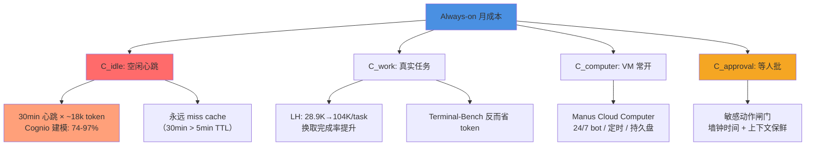

2026 年，个人 AI 助手从「对话回答」演进到「任务交付」，再到 **always-on agent**。产品宣传页上铺满了功能对照表：后台运行、定时任务、多 agent 协作、云端电脑。但对照表解释不了一个残酷的事实——为什么 Dots、Muse、Grok Bot 这样的 always-on 产品，与 OpenCode、Codex 这样的 coding session 之间，隔着的不是「跑久一点」，而是系统工程的鸿沟？

答案藏在第一性原理里。Always-on 卖的不是功能清单，而是 **可达性**（reachable）与 **责任归属**（accountability）。当我们把这个概念拆开，会发现四条裂缝：**单位**（Task vs Responsibility）、**时间**（成本函数与空转）、**空间**（长寿命电脑与可靠性上限）、**权限**（trifecta 与闸门机制）。每条裂缝背后，都是产品宣称与工程可实现性之间的张力。

<!-- more -->

## 一、对照表为什么不够

前作以产品对照表开篇：会话生命周期、是否常驻、独立电脑、定时触发、记忆持久化、对外发消息权限、多 agent、与编码关系。九个维度，三类产品（always-on、通用任务 agent、办公 agent），一张表看上去清晰。

但这张表回答不了三个问题：

1. **单位问题**：Dots 说「交给责任而非 prompt」，Grok Bot 说「有名字、有工作、上下文会积累」——但 Grok 的所有 Bot 共享一台云电脑（文件、浏览器会话、登录态），Dots 和 Muse 则每 agent 独立 VM。「责任」这个单位，在工程上究竟对应什么？session 可以很长，但 session 不是责任；Identity 可以命名，但身份不是凭证。
2. **成本问题**：always-on 的账单大头常不是干活本身，而是 **空闲心跳重发全量上下文**。Cognio 的建模（基于 OpenClaw 默认与 Anthropic 公开价格）显示：30 个 Opus 级 always-on 的心跳成本可建模到约 $4,644/月，其中 idle 可占 74–97%。这与「是否常驻后台」（对照表第二行）是同一件事吗？显然不是——常在线不等于必须主动打扰，但默认实现常把两者捆绑销售。
3. **能力问题**：Anthropic 的 computer-use 是 **动作原语**（截图、键鼠），OSWorld 2.0 基准上 SOTA 二进制完成率仍约 20.6%（Claude Opus 4.8），超长任务（>163 分钟）档完成率降到 **0**。「独立电脑/沙箱」（对照表第三行）描述的是配置，不是能力上限；computer-use 是 **如何动手**，always-on 是 **何时动手、在谁的机器上、用谁的凭证、失败如何审计、空闲如何计费**。

对照表的局限在于：它把 always-on 当作功能的累加，而不是 **系统属性**。LongHorizon-Harness 论文的核心命题是：agent 能力是 **model–harness 系统属性**，不是模型单独的属性。类似地，always-on 是 **调度–记忆–隔离–审批** 的系统属性，不是「会话 + 电脑 + 定时」勾选框的简单和。

下文从第一性出发，拆开四个维度：单位、时间、空间、权限。每个维度写清楚「产品宣称什么」「工程可实现什么」「裂缝在哪」「反例是什么」。

## 二、单位裂缝：从 Task 到 Responsibility 的不可互换性

### 2.1 四种候选单位

| 单位 | 产品语言 | 工程可实现性 | 裂缝 |
|------|----------|--------------|------|
| **Task** | 「帮我做完这件事」 | 队列 + 超时 + 提交工件；coding session 默认单位 | 做完即散；无法承载「持续负责」 |
| **Session** | 「这次对话里继续」 | 事件日志 / transcript；可 crash-resume | 会话可很长，但不是责任；context rot |
| **Responsibility** | 「Give it a responsibility」（Dots） | 目标 + 约束 + 审批策略 + 进度状态机；需显式持久化 | 产品好讲，工程要把「未确认的业务判断」挡在人这边 |
| **Identity** | Muse / Cue / Grok Bot 命名、记忆、邮件/电话 | 命名空间 + 记忆库 + 对外身份（邮箱/电话/钱包） | 身份易造；凭证与责任归属难造 |

### 2.2 工程可验证的最小单位仍是 Task

Dots 的文案说「交给责任而非单次 prompt」，Grok Bot 说「Bot 有名字、有工作、跨会话积累的上下文」。产品宣称的单位是 **Responsibility** 或 **Identity**。

但雷峰网实测办公 agent 场景（WorkBuddy、千问办公、豆包工作）给出反例：AI 接走执行后，同一张脏表（Q1 订单异常项是否计入总额？）三家算出三个总额，最高比最低多 57.7%——三家各自擅作主张且不问人。**判断、核对、背锅仍在人**；agent 交付的是「看起来已完成」的成品，但业务事实裁决（哪些订单算异常、口径如何定义）没有可验证的归属机制。

这暴露了 **Responsibility 的工程现实**：责任里夹着「业务口径判断」，而口径判断不能靠 LLM 自己说了算。工程可验证完成的单位，仍然是 **Task**（带审计状态、可回滚、有明确交付物）。Responsibility 是产品包装，Task 是可交付单元；中间的鸿沟是「谁来确认这件事做对了」。

### 2.3 Identity ≠ 凭证 ≠ 责任归属

Cue（Manus 2.0）的个人代理有邮箱、电话、钱包、电脑；Muse 可 remember/forget、发信前需确认；Grok Bot 多个 Bot 可命名、有各自记忆。Identity 的产品语言是「像人一样」。

但 Identity 易造（命名空间 + 记忆库 + 对外身份），**凭证与责任归属**难造：

- **凭证层**：Muse 的 Sentinel 机制把凭证与模型上下文隔离，agent 永不见表观密钥，所有 egress 与 connector 动作由 Sentinel 代为执行。这不是「给 agent 起个名字」能解决的。
- **责任归属**：Grok Bot 文档明确警告：同一账户下所有 Bot **共享一台云电脑**（文件、浏览器会话、登录态），**不要把不同 Bot 当作安全隔离边界**。多 Bot 协作的便利与隔离的可靠性是冲突的；Identity 的产品叙事掩盖了「谁背锅」的工程现实。

对比 Muse（每 agent 独立 Secure VM）与 Grok（账户共享电脑）：前者牺牲资源换隔离，后者牺牲隔离换协作便利。这是架构权衡，不是功能勾选。

### 2.4 小结

**论点**：产品宣称的单位往往是 Responsibility/Identity；工程可验证完成的单位仍是 Task（带审计状态）。  
**裂缝**：Responsibility 里夹着「业务口径判断」，Identity 的存在不等于凭证隔离与责任归属。  
**辩证**：足够好的企业知识库 + 人设规则可以把部分裁决编码进策略，责任可逐渐机器化——但这需要「可验证的裁判机制」（类似编译器/测试），办公场景尚缺此类裁判。

## 三、时间经济学：成本函数与「打扰」的解耦

### 3.1 可分解的成本函数

记一次 always-on 月成本近似为：

$$
C \approx C_{\text{idle}} + C_{\text{work}} + C_{\text{computer}} + C_{\text{approval-latency}}
$$

| 项 | 含义 | 实证/建模 |
|----|------|-----------|
| $C_{\text{idle}}$ | 定时心跳：重发 system+tools+skills+历史 | Cognio：OpenClaw 默认 30min 心跳、~18k–20k token 唤醒上下文；30 个 Opus 级 always-on 仅心跳可建模到 ~$4,644/月；idle 占 74–97% |
| $C_{\text{work}}$ | 真实任务轨迹 token | LongHorizon-Harness：OSWorld 2.0 上 Qwen 输出 token 从 28.9K→104K/任务换取完成率提升；Terminal-Bench 上反而可能少耗 token |
| $C_{\text{computer}}$ | VM/容器常开（CPU/盘）≠ token | Manus Cloud Computer：为 24/7 bot、定时任务、持久文件系统单独售卖 |
| $C_{\text{approval}}$ | 等人批：墙钟时间与上下文保鲜 | Muse/Dots/Grok：敏感动作闸门；「常在线」常变成「等人」 |

Cognio 研究页（建模非审计账单）对比 always-on 相对 on-demand：全员使用约 **3.8×**；低采用率可到 **~35×**。关键观察：**30 分钟心跳 vs 5 分钟 prompt cache TTL**，默认可能永远 miss cache（「最差区间」）。

### 3.2 常在线 ≠ 主动打扰（但默认耦合）

| 模式 | 行为 | 打扰性 | 成本特征 |
|------|------|--------|----------|
| Event-driven wake | 邮件/日历/Slack/webhook 触发 | 低–中（可过滤） | 有事件才付费 |
| Scheduled check-in | 工作日 9am 更新清单 | 可控 | 固定次数 |
| Heartbeat +「有没有事」 | 周期性全量上下文 | 中（若爱发消息） | **空转仍付全价** |
| Proactive research（只读） | Dots：空闲可读研究；写操作仍要权限 | 低（若不推送） | 研究本身耗 token |
| Proactive Memory intervention | 选择性注入提醒；可选择沉默 | 对用户可静默 | 多一个 memory agent 的调用 |

**Proactive Memory Agent**（arXiv:2607.08716）的 ablation 显示：**selective intervention** 优于 always-on injection、被动暴露全 bank、advisor-only。换句话说，always-on 不意味着「每次都把全量记忆塞进上下文」，而是 **按需干预**。

### 3.3 第一性推导：可达性 ≠ 话痨

产品为了「感觉活着」默认心跳+主动推送；工程正确的默认应是 **事件触发 + 沉默权 + 忙闲分离模型档位**。

Always-on 卖的是 **可达性**（reachable）：用户需要时 agent 能响应、能继续未完成的工作、能在用户离线时推进可自动化的部分。可达性不要求 agent 每 30 分钟醒来一次重发全量上下文，也不要求主动推送「我又想到一个主意」。

但默认实现常耦合「心跳 + 主动推送」，因为：
1. 心跳是保险——防止 agent 「死掉」后用户不知道；
2. 主动推送是「人格化」——让 agent 显得「活着」。

**辩证**：监控/抢单/客服 SLA 需要亚小时可达，心跳可能是必需成本（保险费）。个人单 agent 场景的心跳惩罚远小于企业多 agent 车队。但对个人 always-on 助手来说，**事件驱动 + 沉默权**应是第一性——用户明确配置「哪些事件唤醒」「哪些场景沉默」，而不是默认全开。

### 3.4 成本杠杆（Cognio 建模）

- 部门共享 agent（摊薄固定上下文）
- Quiet hours（下班时间不心跳）
- IsolatedSession（短任务用小模型，长任务才调大模型）
- 事件触发替代心跳
- 框架外硬预算封顶（超额暂停）

这些都是「解耦可达性与空转成本」的工程手段。

### 3.5 小结

**论点**：默认心跳式 always-on 是反模式；事件驱动 + 沉默权才是第一性。  
**裂缝**：产品把「常在线」与「心跳+主动推送」打包销售，但工程上可达性与打扰性是两个维度。  
**辩证**：企业场景（监控/SLA）可能需要心跳作保险；个人场景应优先事件触发。成本函数可分解，每一项有对应的杠杆。

## 四、空间与手：为什么需要长寿命电脑？Computer-use ≠ Always-on

### 4.1 长寿命电脑解决什么

Manus 官方博客对比很清楚（Cloud Computer vs temporary sandbox vs Desktop）：

| 环境 | 适合 | 不适合 |
|------|------|--------|
| Temporary sandbox | 一次性脚本/分析/建站 | 跨天状态、24/7 bot |
| Desktop / My Computer | 操作本机文件与应用 | 笔记本睡眠、断网 |
| Cloud Computer | 24/7 bot、定时、持久库、自托管 | （FAQ：目前 CLI-only，无图形桌面） |

物理直觉：笔记本会睡、会断网；「责任」若绑定本机进程，责任随合盖消失。长寿命 VM 提供 **持久文件系统 + 不关机的时钟 + 隔离边界**。

这是 always-on 的 **空间属性**：agent 需要一个「不会因用户关机而消失」的执行环境。

### 4.2 Computer-use 是动作原语，Always-on 是调度+审计

Anthropic computer use 文档描述的是：截图 + 键鼠等成员工具；**client-side agent loop**；安全建议包括专用 VM、少给敏感数据、域名 allowlist、人确认关键后果；并承认网页/图像中的指令可覆盖用户意图（prompt injection）。

**边界命题**：
- Computer-use = **如何动手**（感知-动作环）
- Always-on = **何时动手、在谁的机器上、用谁的凭证、失败如何审计、空闲如何计费**

可有 computer-use 而无 always-on（一次 OSWorld 评测轨迹）；可有 always-on 而无 GUI computer-use（纯 CLI Cloud Computer + cron）。

### 4.3 基准现实：长程桌面仍极难

**OSWorld 2.0**（108 个长程工作流；人类中位约 1.6 小时；Claude Opus 4.7 max thinking 平均约 318 tool calls）：

- Claude Opus 4.8 batched：二进制完成 **20.6%**，partial **54.8%**
- GPT-5.5：更省 token，二进制约 **14%** 附近平台
- 失败模式：丢约束、漏中途信息、该问不问、跳过验证、隐含状态恢复失败
- 超长任务：>163 分钟档，二进制完成率落到 **0**

OSWorld 1.0（对照）：369 任务；人类 ~72%，早期最佳模型约 12%。

**含义**：「会点鼠标」远不等于「能扛小时级工作流」。长寿命电脑是必要条件（状态不丢），但不是充分条件（状态对了也不一定做对）。

### 4.4 小结

**论点**：Computer-use 进步不会自动给出 always-on；OSWorld 分数上升主要改善「手」，不改善「班」。  
**裂缝**：产品宣传「有云电脑」，但电脑配置不等于可靠性。OSWorld 失败以状态与验证为主，不是「电脑性能不够」。  
**辩证**：更强模型可能减少审计轮次，从而降低 always-on 成本曲线（LH 论文：Opus 上 token 可降）——但绝对完成率仍然很低，改善是相对的。

## 五、权限与责任归属：从 Trifecta 推出闸门

### 5.1 第一性推导：指令与数据不可分

LLM **无法可靠区分「用户指令」与「内容中的指令」**（同一 token 流）。因此：

1. 若 agent 能读 **私有数据**，且
2. 会摄入 **不可信内容**（网页、邮件、issue、截图 OCR），且
3. 能 **外联/外发**（HTTP、邮件、PR、webhook），

则攻击者可诱导「读私有 → 外泄」。Simon Willison（2025-06-16）称之为 **lethal trifecta**；去掉任一腿即可切断该攻击类。Guardrail 产品常宣称「95%」——对 Web 安全来说不及格。

### 5.2 产品侧「答案」对照

| 机制 | 谁在做 | 第一性对应 |
|------|--------|------------|
| Approval / Auto-review / HITL | Dots、Grok Bot、Muse | 外联腿加闸；能力变「提议」 |
| Sentinel + 凭证 surrogate | Muse | 模型永不见表观密钥；egress 唯一权威在 Sentinel |
| 污点追踪（tainted egress） | Muse | 读过用户数据的进程失去 auto-allow |
| Dual LLM / 隔离不可信 | Willison 2023；CaMeL 等后续 | 拆开「读不可信」与「持工具」 |
| 共享电脑 vs 每 agent 电脑 | Grok 共享；Dots/Muse/Cue 偏独立 | **隔离边界**：共享则 Bot 间非安全边界 |

Muse 安全长文明确引用 lethal trifecta，并描述 defense-in-depth：runtime cell（隔离不可信输入）、Sentinel（凭证与 egress 外置）、污点追踪（读过私有数据的进程失去自动批准权）。

Anthropic computer use 文档同样要求：隔离环境、少给登录态、allowlist、人对金融/条款确认。

### 5.3 责任归属的残酷事实

雷峰网实测：AI 接走执行后，**判断、核对、背锅仍在人**；三家对「异常订单是否计入」各自擅作主张且不问人。  
→ Always-on 若放大「看起来已完成」的交付物，会 **放大虚假责任感**，而不是消灭责任。

**工程含义**：闸门不是可选的 UI 改进，而是「把不可自动化的决策拦在人这边」的必需机制。默认草稿、显式批准、能力绑定审批——这些都是把「agent 提议 → 人确认 → 审计记录 → 可追溯」这条链路强制化。

### 5.4 共享电脑的含义

Grok Bot 文档明确警告：同一账户下所有 Bot **共享一台云电脑**（文件、浏览器会话、登录态），**不要把不同 Bot 当作安全隔离边界**。

**含义**：
- Bot A 可以读到 Bot B 创建的文件。
- 浏览器登录态被所有 Bot 共享（Bot A 登录 GitHub，Bot B 也能用该登录态）。
- 若需要隔离，应使用不同账户或不同沙箱方案。

对比 Muse（每 agent 独立 Secure VM）与 Grok（账户共享电脑）：**隔离边界的选择是架构权衡**，不是「有没有电脑」的功能勾选。

### 5.5 小结

**论点**：Lethal trifecta 意味着：个人 always-on 助手在「邮箱+上网+可外发」默认配置下，安全上默认有罪，除非架构拆腿。  
**裂缝**：产品宣传「能发邮件、能上网、能帮你管理私人信息」，但这三者同时满足即构成 trifecta。  
**辩证**：模型抗注入 + classifier 集成可达「可接受残留风险」；绝对拆腿会废掉产品价值。Muse 的选择是 Sentinel（egress 外置）+ runtime cell（不可信隔离）+ 污点追踪，而不是禁止 agent 联网或禁止读私有数据。

## 六、Harness vs Model：增量主要在哪？反例是什么？

### 6.1 支持「增量主要在 harness」的证据

**LongHorizon-Harness**（arXiv:2608.01964，AMAP）：把长程执行改写成 **task-state management**；Manage–Execute–Audit；状态只接受环境审计事实；executor 每轮 fresh context。

| 设置 | 指标变化（论文报告） |
|------|----------------------|
| Qwen 3.7-Plus + Claude Code → +LH | WeaveBench PassRate **51.8% → 80.7%** |
| 同上 | Terminal-Bench 2.1 **69.7% → 77.2%** |
| 同上 | OSWorld 2.0 binary **2.8% → 8.3%** |
| Claude Opus 4.7 subset | binary **20.0/20.6% → 34.3/35.3%** |

结论句（论文）：agent 能力是 **model–harness 系统属性**；更强 harness 可抬高固定模型的任务级表现。

**SWE-agent**（arXiv:2405.15793）：专门 ACI（查看/编辑/搜索+lint guardrail）相对 shell-only 有大幅提升（Lite 上 GPT-4 Turbo **18% vs shell-only 11%** 等）。说明接口设计本身是能力。

**社区 harness 共识**：append-only log ≠ context window；termination/policy 在 harness，不在模型自觉。

### 6.2 反例：不全是 harness

1. **模型能力上限**：LH 论文自己写——分析类、视觉精度、算法题等类别，harness 增益小；审计不能发明模型没有的能力。OSWorld 上即使加 harness，绝对完成率仍极低。
2. **记忆/干预算法**：Proactive Memory 在固定 harness 上 +8.3pp（Terminal-Bench）——策略本身关键；且 **always inject 不如 selective**。
3. **Computer-use / GUI grounding**：Anthropic 文档列出点击精度、滚动、表格等限制；失败常在感知-动作，不在「有没有 cron」。
4. **Proactive 产品策略**：何时问人、何时沉默、何时只读研究——属产品+模型校准，不是纯循环工程。
5. **Continual Harness**（arXiv html 2605.09998）：在线改自己的 prompt/skills/memory——harness 与模型自适应纠缠。

### 6.3 辩证小结

**可写金句**：Always-on 的增量 **主要在 harness，但「主要」不是「全部」**；把模型奇点化或把 harness 万能化都会写歪。

相对 Claude Code / Codex / OpenHands / SWE-agent：**always-on 增量**主要落在——持久责任状态、调度/空闲策略、长寿命电脑、连接器鉴权持久化、send-on-behalf 闸门、多 bot 协调、跨会话记忆治理——这些大多不是「换一个更强 chat 模型」能自动获得的。

但记忆干预策略、GUI grounding、模型长程能力是一阶反例。Harness 是放大器，不是发明机。

## 七、品类光谱：办公 Agent 与 Always-on 的分水岭

### 7.1 能力重叠表（精简版）

| 能力 | Always-on 个人助手 | Manus/Cue | 办公三件套 |
|------|-------------------|-----------|------------|
| 定时/自动化 | 有 | Automations + Cloud Computer | 有 |
| 电脑/浏览器 | 云 VM / 共享电脑 | 云电脑 + Desktop + Remote | 本地沙箱/VM/内置浏览器（实现各异） |
| 多 agent | 有 | 组聊多代理 | 有 |
| 产品心智 | 「常驻同事/责任」 | 「能建能跑 + 身份化代理」 | 「把这份活交割完」 |
| 责任语言 | responsibility / goal | project / automation / Cue identity | 任务交付 + 企业上下文 |

### 7.2 分水岭不是功能，而是裁判机制与背锅合同

雷峰网拆解核心论点（2026-09-30）：

- 腾讯 WorkBuddy：平台底座（Skill/Expert/Connector）
- 阿里千问办公：钉钉入口与组织上下文
- 字节豆包工作：飞书上下文 + 电脑/浏览器身体 + 手机远程

「下沉的是技术，分家的是产品」——**编程 Agent 有编译器/测试作裁判；办公室没有**。三家对同一脏表给出三个总额，说明品类竞争在 **入口、上下文、执行身体、背锅合同**，不在 checkbox 功能表。

### 7.3 品类轴（连续而非三格）

1. **生命周期**：一次性 session → 可恢复 project → 常驻 responsibility  
2. **空间**：无状态沙箱 → 持久 VM → 本机接管  
3. **对外身份**：无 → 代理发信 → 独立邮箱/电话/钱包  
4. **组织嵌入**：个人 → 团队共享电脑 → 企业 IAM/连接器

Manus 在「通用任务 agent → 局部 always-on」光谱上滑动（Cloud Computer / Automations / Cue 身份），但官方叙事仍是 build/run，不是「个人超智能同事」（Muse 话术）。

### 7.4 小结

**论点**：办公 Agent 与 personal always-on 的分水岭不是「会不会用电脑」，而是「有没有编译器式裁判 + 谁背锅」。  
**裂缝**：能力重叠不意味着同品类；产品心智（同事 vs 交付）与裁判机制（编译器 vs 人肉核对）才是分水岭。  
**辩证**：企业工作流也可建 verifier（对账规则、强制人审节点），办公 Agent 可收敛到 coding-like——但目前尚缺。

## 八、失败模式与何时不该 Always-on

### 8.1 有害模式清单

| 模式 | 机制 | 证据 |
|------|------|------|
| **成本爆炸** | 心跳重送全上下文；低采用率惩罚最大 | Cognio；Anthropic 文档亦称 scheduled task 空闲仍送全上下文 |
| **权限过大** | trifecta 闭合；MCP 组合外包安全决策给用户 | Willison；GitHub MCP 等案例 |
| **虚假责任感** | 「报告已生成」掩盖未确认口径 | 雷峰网三总额；OSWorld「文件存在≠做对」 |
| **prompt injection 面扩大** | 常读邮件/网页/issue；后台无人盯 | Muse 红队与 bug bounty；Anthropic classifier |
| **状态腐烂 / goal drift** | 长轨迹丢失约束 | OSWorld 2.0 failure cases；LH 动机；Proactive Memory 的 behavioral state decay |
| **共享电脑串扰** | 多 bot 共享登录态与文件 | Grok Bot 文档明示 |

### 8.2 基准与论文中的「失败分数」

- OSWorld 2.0：SOTA binary **~20.6%**；超长档 **0%**  
- OSWorld 1.0：早期模型 **~12%** vs 人类 **~72%**  
- LH + Qwen 在 OSWorld 2.0 仍仅 **8.3%** binary——harness 有用但绝对水平仍低  
- Proactive Memory：always-on injection **不是**最优  

### 8.3 何时不该 Always-on（决策启发式）

1. 工作是 **突发、低频、可排队** → on-demand / 事件触发  
2. 价值不足以覆盖 **4×–15×** agent token 倍率（Anthropic 多 agent 研究量级，Cognio 引用）  
3. 必须闭合 trifecta 才能干活，又无法拆腿或上 Sentinel 级闸门  
4. 组织 **没有核对科目**（减负不可验证）却要自动外发/入账  
5. 只需「定时脚本」→ cron + 小模型，不必人格化 always-on  

### 8.4 小结

Always-on 不是银弹；成本、注入、虚假完成、状态腐烂都是真实风险。决策时需要权衡「可达性带来的价值」与「空转成本 + 安全风险 + 虚假责任感」。

## 九、可证伪主张（正方 + 反方）

### T1. 责任单位

**正方**：Always-on 的正确销售单位是 Responsibility，不是 Session；但责任中不可自动完成的部分是「业务事实裁决」。  
**反方**：足够好的企业知识库 + 人设规则可以把裁决编码进策略，责任可逐渐机器化。

### T2. 成本函数

**正方**：默认心跳式 always-on 是反模式；事件驱动 + 沉默权才是第一性。  
**反方**：监控/抢单/客服 SLA 需要亚小时可达；心跳是保险费。个人单 agent 场景惩罚远小于车队。

### T3. Computer-use ≠ Always-on

**正方**：Computer-use 进步不会自动给出 always-on；OSWorld 分数上升主要改善「手」，不改善「班」。  
**反方**：更强模型减少审计轮次，从而降低 always-on 成本曲线（LH：Opus 上 token 可降）。

### T4. Trifecta 默认有罪

**正方**：Lethal trifecta 意味着：个人 always-on 助手在「邮箱+上网+可外发」默认配置下，安全上默认有罪，除非架构拆腿。  
**反方**：模型抗注入 + classifier 集成可达「可接受残留风险」；绝对拆腿会废掉产品价值。

### T5. Harness 主要增量

**正方**：相对 Claude Code/Codex/OpenHands/SWE-agent，always-on 的产品增量 **主要** 在 harness（调度/电脑/闸门/记忆治理），但记忆干预策略与模型长程能力是一阶反例。  
**反方**：Cascade 等宣称同架构降 token（Manus 2.0 媒体数字 23.2%/28.2%/32%——二手来源，需谨慎）。

### T6. 共享电脑安全品类

**正方**：「每 agent 一台电脑」与「每用户共享一台电脑」是不同安全品类，不能都叫 always-on 就算了。  
**反方**：共享电脑 + 强审批 + 无外泄通道在威胁模型下可够用；独立 VM 贵且仍怕 connector 层。

### T7. 裁判机制分水岭

**正方**：办公 Agent 与 personal always-on 的分水岭不是「会不会用电脑」，而是「有没有编译器式裁判 + 谁背锅」。  
**反方**：企业工作流也可建 verifier（对账规则、强制人审节点），办公 Agent 可收敛到 coding-like。

### T8. 外置状态内核

**正方**：长程 harness 用「外置已审计状态 + fresh executor」是目前最可迁移的 always-on 内核；把对话窗口当状态机则会慢腐烂。  
**反方**：足够长上下文 + 好 compaction 可逼近；多角色 MEA 增加延迟与协调失败面。

## 十、结语：缺的是可运营 Runtime，不是更长 Prompt

从 OpenCode、Codex 这样的 coding session，到 Dots、Muse、Grok Bot 这样的 always-on agent，中间隔着的不是「更强的模型」或「更长的 context window」，而是 **可运营的 runtime**：

1. **状态外置**：责任/目标/决策日志持久化在会话之外，executor 轮次之间 fresh context；状态只接受环境审计事实。
2. **审批能力化**：对外副作用（发信/支付/发布）默认草稿 + 显式批准；能力绑定审批级别；凭证永不进模型。
3. **空闲策略**：事件触发 + 沉默权 + 忙闲分离模型档位；心跳不应是默认，可达性不等于话痨。
4. **隔离边界**：不可信输入标签 + runtime cell；共享电脑与独立 VM 的选择是安全品类差异，不是功能勾选。

这些都是 harness 层的系统工程，不是「再调一次 prompt」能解决的。LongHorizon-Harness 的 Manage–Execute–Audit、Proactive Memory 的 selective intervention、Muse 的 Sentinel + runtime cell、Grok Bot 的 Auto-review——这些机制共同指向一个洞见：**always-on 的增量主要在 harness，但 harness 不是万能的**。

产品对照表告诉你「有什么功能」，第一性原理告诉你「为什么这些功能不可互换、裂缝在哪、何时会失败」。对照表适合产品经理读一页；第一性适合工程师写深度。

当我们把责任、时间、空间、权限拆开，会发现 always-on 不是「coding agent 跑久一点」，而是「可达性 + 责任归属 + 成本可控 + 安全隔离」的系统属性。缺的不是更长 context，而是可运营 runtime。

## 成本分解示意（Mermaid）

**要点**：
- $C_{\text{idle}}$ 常是大头（74–97%），但可通过事件触发、quiet hours、便宜模型跑 idle path 等杠杆优化。
- $C_{\text{work}}$ 与 harness 设计相关（LH 的 MEA 可能增加 token，但换来完成率）。
- $C_{\text{computer}}$ 与 $C_{\text{idle}}$ 解耦（VM 按 CPU/盘计费，token 按调用计费）。
- $C_{\text{approval}}$ 是隐形成本：等人时上下文可能过期，需重新生成摘要。

## 延伸阅读

### 一手文献（优先）

**产品官方文档**：
- OpenAI Dots - [Features](https://chatgpt.com/features/dots/) · [Learn Docs](https://learn.chatgpt.com/docs/dots)
- Meta Muse - [Introducing Muse](https://about.fb.com/news/2026/09/introducing-muse-personal-ai-agent/) · [Security and Safety](https://research.meta.ai/blog/security-and-safety-for-ai-agents-our-approach-with-muse)
- Grok Bot - [Overview](https://docs.x.ai/grok-bot/overview) · [Skills, Routines and Automations](https://docs.x.ai/grok-bot/skills-routines-and-automations) · [Approvals, Security and Privacy](https://docs.x.ai/grok-bot/approvals-security-and-privacy)
- Manus - [Introducing Manus 2.0](https://manus.im/blog/introducing-manus-2-0) · [Cloud Computer](https://manus.im/blog/manus-cloud-computer)

**学术论文**：
- [LongHorizon-Harness: Advancing Long-Horizon Agents for Real-World Tasks](https://arxiv.org/abs/2608.01964) · [GitHub](https://github.com/AMAP-ML/LongHorizon-Harness)
- [Remember When It Matters: Proactive Memory Agent for Long-Horizon Agents](https://arxiv.org/html/2607.08716) · [GitHub](https://github.com/yifannnwu/proactive-memory-agent)
- [SWE-agent: Agent-Computer Interfaces Enable Automated Software Engineering](https://arxiv.org/abs/2405.15793)
- [OSWorld 2.0: The Next Generation Real Computer Environment for Multimodal Agents](https://arxiv.org/abs/2606.29537) · [Benchmark](https://osworld-v2.xlang.ai/)

**安全与工程**：
- Simon Willison - [The lethal trifecta for AI agents](https://simonwillison.net/2025/Jun/16/the-lethal-trifecta/)
- Martin Fowler - [Agentic AI Security](https://martinfowler.com/articles/agentic-ai-security.html)
- Anthropic - [Introducing computer use](https://www.anthropic.com/news/3-5-models-and-computer-use)

**成本建模**：
- Cognio - [AI Agent Token Costs](https://cognio.so/resources/guides/ai-agent-token-costs)（建模非审计账单；假设已公开）

**办公 Agent 拆解**：
- 雷峰网 - [WorkBuddy vs 千问办公 vs 豆包工作横评](https://www.leiphone.com/category/yanxishe/d4mykzxmMYWWwHNk.html)

### 开源项目
- [OpenCode](https://opencode.ai/)
- [OpenAI Codex](https://github.com/openai/codex)
- [OpenHands](https://github.com/All-Hands-AI/OpenHands)
- [Browser-use](https://github.com/browser-use/browser-use)

---

*本文基于 2026 年 10 月 1 日公开可见的产品文档、学术论文、官方博客与社区调研整理。数字来源已标注（Cognio 为建模、OSWorld 为基准、雷峰网为媒体横评）；不涉及任何未公开架构细节或编造 KPI。*
