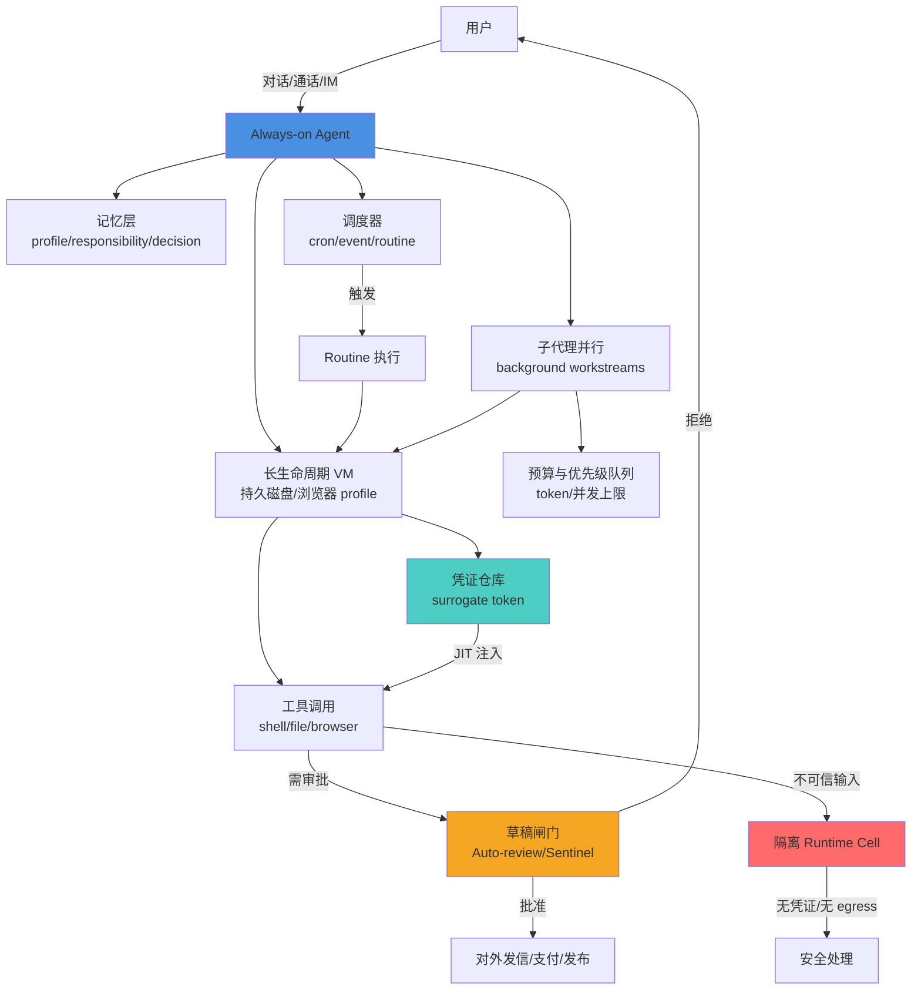

2025–2026 年，个人 AI 助手从「对话回答」演进到「任务交付」，再进一步到 **always-on agent**：常驻云端电脑、跨会话记忆、后台/定时/事件触发、多 Bot 协作，以及对外发信/支付等敏感动作的确认闸门。

但 always-on 不是把 OpenCode 或 Codex 这样的 coding agent 跑久一点就能实现的。核心差距在 **harness 层**：从「一次性会话」到「常驻同事」，缺的不是更强的单轮推理，而是持久记忆、调度、长生命周期沙箱、连接器鉴权持久化、send-on-behalf 闸门、子代理并行、不可信工具结果隔离，以及 always-on 成本预算。

<!-- more -->

## Always-on 不是同一品类

市面上有三类容易混淆的产品：

### 1. Personal always-on assistant

代表：OpenAI Dots、Meta Muse、xAI/Cursor Grok Bot

**一句话**：常在线个人助手，有独立或共享云电脑，工作可在你离线时继续，强调责任归属与审批。

- **Dots**：GPT-6 Astra 驱动，有云电脑与浏览器，可连接 Slack/Teams，可调度 Codex 完成编码任务；敏感操作需 Auto-review 批准。
- **Muse**：Meta 的个人代理，Secure VM + Sentinel 系统级隔离，凭证不进模型上下文；支持 WhatsApp/Muse app，发信/购买需确认。
- **Grok Bot**：xAI 与 Cursor 合作，具备 skills + routines（cron/事件），多 Bot 并行与群聊交接，24/7 常驻；重要提示——同一账户下所有 Bot **共享一台云电脑**（文件、浏览器会话、登录态），官方明确：**不要把不同 Bot 当作安全隔离边界**。

### 2. General / computer-use task agent

代表：Manus（及 Cue）

**一句话**：云端虚拟电脑上的通用任务执行；Manus 2.0 起补充 Automations、Cloud Computer、Cue 个人代理。

- Manus 原本偏「交付成品」而非「常驻同事」。
- Cue 是 Manus 2.0 引入的独立代理身份：每个代理有邮箱/电话/钱包/电脑，可组聊协作，更接近 always-on 的心智模型。
- 支持浏览器+文件系统+定时任务（Automations），Cascade harness 提供项目上下文。

### 3. Office / chat copilot → 办公 Agent

代表：WorkBuddy（腾讯）、千问办公（阿里）、豆包工作（字节）

**一句话**：偏办公交付与生态绑定（腾讯/钉钉/飞书）；部分具备定时、本地/云电脑、多 Agent，但产品心智仍更接近「把任务干完」而非「常驻同事」。

- **WorkBuddy**：全场景 AI 办公工作台，自然语言→自主规划执行→交付成果；本地文件、多任务并行、Skill/Connector、定时自动化；深度整合腾讯办公生态。
- **千问办公**：一站式 AI 生产力平台，钉钉/IM、Office、浏览器自动化、定时任务；强调企业上下文与知识库。
- **豆包工作**：独立办公 Agent 客户端，拆解任务、调用工具、电脑/浏览器操作；飞书深度整合；与编程产品线（TRAE）并行拆分。

这三类不是同一种产品——Always-on 强调「责任所有者 + 常驻身份」，Office Agent 强调「任务交付 + 生态绑定」。

## 产品对比表：会话、常驻、电脑、定时、记忆

| 维度 | Always-on （Dots / Muse / Grok Bot） | Manus（含 Cue） | 办公 Agent （WorkBuddy / 千问办公 / 豆包工作） |
|------|--------------------------------------|----------------|-----------------------------------------------|
| **会话生命周期** | 跨会话、跨端同一身份；工作在对话之间继续 | 任务/项目导向；可跨会话延续项目；Cue 为个人代理身份 | 任务/对话为主；项目空间可跨任务复用；偏「一次任务交付」 |
| **是否常驻后台** | 是：云端持续工作，设备关机不影响 | 任务可后台跑；Cloud Computer / Automations 强化常驻 | 部分：云端任务可关客户端继续；定时任务常见；不等于个人常驻同事 |
| **独立电脑/沙箱** | 是（Dots 云电脑；Muse Secure VM；Grok Bot 共享云电脑） | 是（云端环境 / Cloud Computer；Cue 每代理有电脑） | 混合：本地文件沙箱、云电脑或浏览器自动化不等价于「个人专用 VM」 |
| **定时/事件触发** | 是（Dots 可调度检查；Grok Bot routines；Muse 后台推进） | 是（Scheduled Tasks → Automations：邮件/日历/Slack 等事件） | 是（WorkBuddy/千问办公/豆包工作均宣传定时或周期性任务） |
| **记忆持久化** | 强：偏好、责任、跨通道上下文；可 forget / 私有笔记 | 项目上下文 + Cascade harness；Cue 身份化 | 企业/项目上下文、技能与知识库；个人长期画像相对弱于 always-on |
| **代表用户对外发消息权限** | 强闸门：Auto-review / Sentinel / 用户批准；默认草稿优先 | Cue：自有邮箱/电话；支付有预算；需确认类动作 | 连接器写操作存在；企业权限与审批因厂商而异；公开细节参差 |
| **多 agent / 子代理** | 是（Dots 后台 agents；Muse subagents/swarms；Grok Bot 多 Bot 协作） | 是（组聊多代理；Cascade 按需拉专长） | 是（多任务并行、工作小队/多 Agent；平台化 Skill） |
| **与 IDE/编码关系** | Dots 可联动 Codex；Grok Bot 可交工程任务；非纯 coding 产品 | 含代码/Game Dev；非 IDE 内嵌为主 | 与 CodeBuddy / Qoder / TRAE 等编程线并行拆分 |
| **典型交互** | 聊天/通话 + 云桌面/浏览器接管 + IM（Slack/Teams/WhatsApp） | Web/桌面/手机 + Studio 专业环境 + 远程电脑操控 | 桌面客户端 + 聊天下达任务 + 结果面板；生态 IM 入口 |

**核心结论**：Always-on 相对「一次性 coding session」多出来的，主要不是更强的单轮推理，而是 **harness 层**——持久记忆、调度、长生命周期沙箱、连接器鉴权持久化、send-on-behalf 闸门、子代理并行、不可信工具结果隔离，以及 always-on 成本预算。

## 落到 Harness：Coding Session 缺什么

### 开源/社区参照（coding / general agent harness）

| 项目 | 定位 | 与 always-on 的关系 |
|------|------|---------------------|
| **OpenCode** | 开源 AI coding agent（终端/IDE/桌面） | 强于会话内编码；缺常驻电脑、routines、send-on-behalf |
| **OpenAI Codex** | 终端 lightweight coding agent | Dots 可委派 Codex；本身仍是 coding session |
| **Claude Code** | Anthropic coding agent 产品线 | 被 LongHorizon-Harness 等论文当作后端 harness |
| **OpenHands** | 开源软件开发 agent 平台 | Docker 沙箱、可组合 workflow；更接近 outer-loop |
| **SWE-agent** | Agent-Computer Interface for SE | ACI 设计方法论；仍偏任务 episode |
| **Aider** | Git 中心 pair programming | 会话/提交粒度；无 always-on 调度 |
| **Browser-use** | 浏览器自动化 agent 库 | 提供 computer/browser 能力组件，非完整 always-on |

**Anthropic Computer Use（能力层）**：教模型像人一样用电脑（截图、键鼠）；OSWorld 上早期分数仍低——说明 **computer use ≠ always-on harness**。

从 OpenCode、Codex 这样的会话型 coding agent 到 Dots、Muse、Grok Bot 这样的 always-on，中间缺的不是「多跑几个循环」，而是以下 harness 能力。

## Harness 能力矩阵

图例：● 必需 / ◎ 强烈建议 / ○ 可选增强 / — 通常缺失于纯 coding session

| Harness 能力 | 纯 Coding Session （OpenCode/Codex 类） | Always-on 需要 | 产品侧参照 |
|--------------|----------------------------------------|----------------|------------|
| **Durable memory / profile** | ○ 会话摘要或项目笔记 | ● 跨会话偏好、责任、决策日志、可遗忘 | Dots memory；Muse remember/forget；Grok Bot per-Bot memory |
| **Routines / cron / event listeners** | — | ● 调度 + 窄事件匹配 + 失败策略 | Grok Bot routines；Manus Automations；Dots scheduled check-in |
| **Background subagents / parallel workstreams** | ◎ 多 session（OpenCode） | ● 并行流 + 交接 + 用户不充当路由器 | Dots background agents；Muse subagents；Grok Bot 多 Bot |
| **Long-lived sandbox / VM / desktop + browser** | ◎ 任务级容器 | ● 持久磁盘、会话 cookie、可接管桌面 | Muse Secure VM；Dots/Grok Bot cloud computer |
| **Connector / MCP auth persistence** | ○ 本地 env/token | ● OAuth/凭据仓、surrogate、轮换与撤销 | Muse authd；Dots plugins；Grok Bot connectors |
| **Send-on-behalf 草稿与确认闸门** | —（或仅 git push 确认） | ● 草稿默认 + Auto-review/Sentinel + 能力绑定批准 | 三家 always-on 均强调；Simon Willison lethal trifecta |
| **Wake / sleep、quiet routine、handoff** | — | ● 自主决定何时醒来；静默例行；人机桌面接管 | Dots wake；Grok Bot pause after absence；Take over |
| **Isolation（untrusted tool results）** | ○ 有限 | ● 不可信标签、runtime cell、凭证外置 | Muse runtime cell + classifiers；Dots Auto-review |
| **Cost / token budgeting for always-on** | ○ 单任务 budget | ● 例行用量、空闲研究预算、暂停策略 | Grok Bot usage / pause routines；Dots 独立额度表述 |

### 设计原则（工程可读）

1. **责任对象 vs 任务对象**：always-on 的一等公民是「ongoing responsibility」，coding agent 的一等公民是「this repo / this ticket」。
2. **默认草稿，显式放行**：发信、支付、对外发布必须经过非对话通道的确认 UI（Muse；Grok Bot；Dots）。
3. **凭证永不进模型**：surrogate token + JIT 注入（Muse 公开写得最细）。
4. **共享电脑 ≠ 多租安全边界**：Grok Bot 明确警告；多 Bot 协作便利与隔离冲突需产品级说明。
5. **调度要窄**：宽事件监听烧钱且放大 prompt injection 面（Grok Bot docs）。
6. **不可信输入标签**：工具/网页/邮件进入上下文时标记 untrusted，并与「致命三件套」设计对照。
7. **长程状态外置**：学术侧 LongHorizon-Harness 的 Manage–Execute–Audit 说明：把 task state 从执行轨迹里拆出来，是 long-horizon 可靠性关键。

## 若基于 OpenCode / Codex 做 Always-on：最小增量清单

假设你已有 OpenCode 或 Codex 这样会话型 coding agent，想升级为 always-on，以下是 5 条可操作步骤：

### 1. 持久身份与记忆层

在会话外增加 **profile + responsibility store**（偏好、进行中目标、决策日志、可遗忘 API）。不要只靠对话 transcript。

**可操作项**：

- 数据结构：`user_profile`（偏好、禁忌）+ `ongoing_responsibilities`（责任列表、状态、上次检查时间）+ `decision_log`（历史决策、结果、反馈）。
- API：`remember(key, value, scope)`、`forget(key)`、`recall(query)` 支持跨会话查询。
- 遗忘机制：用户可删除记忆；时间衰减策略（早期决策逐渐降权）。

参考：
- Dots 的 [memory docs](https://learn.chatgpt.com/docs/dots)
- Muse 的 [remember/forget 能力](https://www.meta.com/help/artificial-intelligence/1047255454427887/)
- 学术侧 [Proactive Memory Agent 论文](https://arxiv.org/html/2607.08716)

### 2. 调度器（cron + 窄事件）

把「成功跑通一次的 skill」升级为 **routine**；强制时区、缺失数据策略、幂等重试；默认禁止「监听所有消息」。

**可操作项**：

- 调度表达式：支持 cron（`0 9 * * 1-5` 工作日早 9 点）或事件触发（`on: new_email from: boss@example.com`）。
- 窄事件匹配：不允许 `on: any_message`；必须指定 sender / channel / keyword。
- 失败策略：重试次数、指数退避、失败 N 次后通知用户暂停。
- 幂等设计：同一事件触发多次不应产生重复副作用（如重复发信）。

参考：
- Grok Bot 的 [skills-routines-and-automations](https://docs.x.ai/grok-bot/skills-routines-and-automations)
- Manus 2.0 的 [Automations](https://manus.im/blog/introducing-manus-2-0)

### 3. 长生命周期执行面

从「每次任务新建容器」升级为可挂载 **持久工作区 + 浏览器 profile**；支持用户 **Take over / Return control**；与本地机权限分离。

**可操作项**：

- 持久磁盘：每个用户（或每个 agent 身份）有独立工作区，跨会话保留文件、git repo、环境变量。
- 浏览器 profile：保存登录态（cookies、localStorage），避免每次重新登录 GitHub/Gmail。
- 桌面接管：用户可「接管」agent 的云桌面进行调试，完成后「归还」；agent 继续在同一环境工作。
- 权限分离：云电脑的 SSH key / AWS credential 与本地机分离；agent 无法读取宿主机的 `~/.ssh`。

参考：
- Muse 的 [Secure VM](https://research.meta.ai/blog/security-and-safety-for-ai-agents-our-approach-with-muse)
- Grok Bot 的云电脑与本地执行权限分离（[overview](https://docs.x.ai/grok-bot/overview)）

### 4. 对外副作用闸门

所有 **send/post/pay/delete** 走草稿 + 独立审批通道（非聊天里口头「好的」）；引入 **Auto-review 规则**（Ask first / Allow automatically）；凭证与模型上下文隔离。

**可操作项**：

- 草稿默认：agent 准备发邮件/Slack/PR 时，先生成草稿，展示给用户，等待批准后再发送。
- 审批 UI：独立于聊天的审批界面（弹窗或通知），明确显示「将要做什么」「影响范围」「撤销成本」。
- Auto-review 规则：用户可配置「发给内部同事的消息自动批准」「涉及支付的必须手动确认」。
- 凭证外置：Slack token / GitHub token 存在独立的 credential store，agent 通过 surrogate token 请求操作，credential store 验证后代为执行。

参考：
- Dots 的 [Auto-review](https://learn.chatgpt.com/docs/dots)
- Muse 的 [Sentinel](https://research.meta.ai/blog/security-and-safety-for-ai-agents-our-approach-with-muse)
- Grok Bot 的 [approvals-security-and-privacy](https://docs.x.ai/grok-bot/approvals-security-and-privacy)
- Simon Willison 的 [The lethal trifecta](https://simonwillison.net/2025/Jun/16/the-lethal-trifecta/)

### 5. Always-on 预算与休眠

为 **proactive research / routines** 设 **token 与并发上限**；长时间无用户响应则 **pause routines**；子代理并行要有总预算与优先级队列。

**可操作项**：

- Token 预算：日/周 token 上限（如「proactive research 每天最多 50k tokens」）；超额后暂停非紧急任务。
- 并发限制：最多同时运行 N 个子代理（防止失控放大）；超出时进入队列。
- 休眠策略：用户 24 小时未互动 → 暂停空闲研究；用户 7 天未互动 → 暂停所有 routines；用户明确休假 → agent 进入低功耗模式。
- 优先级队列：用户主动请求 > 紧急事件触发 > 定时例行 > 空闲研究。

参考：
- Grok Bot 文档提及的 usage / pause routines
- Dots 宣传的空闲时 proactive research（但有独立额度表述）

### 可选第 6 条（强烈建议）：不可信工具结果隔离

邮件/网页/MCP 输出进入上下文时打 **`untrusted` 标签**，并默认切断「读私有数据 + 对外通信」的同时满足（对照 **lethal trifecta**）。

**可操作项**：

- 输入标签：来自外部的数据（网页内容、邮件正文、第三方 API 响应）标记 `untrusted`。
- 隔离 runtime：在独立 cell 里处理 untrusted 数据（Muse 的 runtime cell）；该 cell 无权访问凭证、无权发起对外通信。
- 致命三件套检测：同时满足「读私有数据」+「写入外部」+「不可信输入控制流」时强制审批。

参考：
- Muse 的 [runtime cell + classifiers](https://research.meta.ai/blog/security-and-safety-for-ai-agents-our-approach-with-muse)
- Simon Willison 的 [lethal trifecta](https://simonwillison.net/2025/Jun/16/the-lethal-trifecta/)（读私有数据 + 对外通信 + prompt injection）

## 安全要点：Auto-review / Sentinel / Lethal Trifecta

### Auto-review（Dots）

Dots 的 Auto-review 机制：

- **Ask first**（默认）：敏感操作前生成预览，等待用户批准。
- **Allow automatically**（可配置）：用户可将特定操作类型标记为「自动批准」（如「发给内部团队的 Slack 消息」）。
- **能力绑定**：不同能力有不同审批级别（如「读取文件」无需审批，「git push」需要审批，「发邮件给外部」强制审批）。

### Sentinel（Muse）

Muse 的 Sentinel 是独立于主 agent 的系统级隔离：

- **凭证不进模型上下文**：Slack token、Gmail OAuth 等凭证由 Sentinel 管理，agent 通过 surrogate token 请求操作。
- **Egress 控制**：agent 提出「发送邮件」请求 → Sentinel 验证合法性（收件人、内容、频率）→ Sentinel 代为执行。
- **Connector 动作审批**：所有 MCP connector 的写操作由 Sentinel 批准；agent 无法直接调用外部 API。

### Lethal Trifecta（Simon Willison）

Simon Willison 提出的「致命三件套」：

1. **读私有数据**（如用户邮件、Slack 私聊、本地文件）
2. **对外通信**（如发邮件、post 到外部 API、exfiltrate 数据）
3. **Prompt injection**（不可信输入控制 agent 行为）

当这三者同时满足时，攻击者可通过精心构造的网页/邮件诱导 agent 泄漏私有数据。

**防御**：

- 默认禁止「读私有数据 + 对外通信」同时满足。
- 若必须同时满足（如「读邮件后回复」），则对外通信必须经过草稿审批。
- 不可信输入（网页、邮件）在隔离环境处理，无权访问私有数据。

### Grok Bot 共享电脑 ≠ 安全边界

Grok Bot 文档明确警告：

> 同一账户下所有 Bot 共享一台云电脑（文件、浏览器会话、登录态）。**不要把不同 Bot 当作安全隔离边界**。

这意味着：

- Bot A 可以读到 Bot B 创建的文件。
- 浏览器登录态被所有 Bot 共享（如 Bot A 登录 GitHub，Bot B 也能用该登录态）。
- 若需要隔离，应使用不同账户或不同沙箱方案。

对比：Muse 的每个 agent 有独立 Secure VM；Cue 的每个代理有独立电脑。

## 架构示意（Mermaid）

**关键路径**：

1. **记忆层**：跨会话持久化用户偏好、责任列表、决策日志。
2. **调度器**：cron / 窄事件触发 routine。
3. **长生命周期 VM**：持久磁盘 + 浏览器 profile，支持 Take over / Return control。
4. **子代理并行**：后台 workstreams，用户不充当路由器。
5. **草稿闸门**：对外副作用（发信/支付/发布）必须经审批。
6. **隔离 Runtime Cell**：不可信输入（网页/邮件）在隔离环境处理，无凭证、无 egress。
7. **凭证仓库**：surrogate token + JIT 注入，凭证不进模型上下文。
8. **预算与优先级队列**：token / 并发上限，长时间无响应则休眠。

## 总结

从「一次性 coding session」到「always-on agent」的距离，主要不在模型能力（GPT-4 vs GPT-6），而在 **harness 层工程**：

1. **记忆**：从「对话 transcript」到「跨会话 profile + responsibility store + 可遗忘 API」。
2. **调度**：从「用户手动启动」到「cron + 窄事件 + 失败策略 + 幂等」。
3. **执行面**：从「临时容器」到「持久 VM + 浏览器 profile + Take over / Return control」。
4. **闸门**：从「口头确认」到「草稿默认 + Auto-review / Sentinel + 能力绑定审批」。
5. **隔离**：从「有限沙箱」到「不可信标签 + runtime cell + 凭证外置 + lethal trifecta 对照」。
6. **预算**：从「单任务 token 限制」到「例行用量 + 空闲研究预算 + 休眠策略 + 优先级队列」。

**诚实的说**：开源 coding harness 到 always-on 的鸿沟主要在 **产品与系统工程**，不在「再调一次 prompt」。Dots、Muse、Grok Bot 的核心壁垒不是模型，而是上述 6 层 harness 能力的成熟度与审批 UI 的用户体验。

当这些机制到位后，agent 才能从「会话助手」变成「常驻同事」——你可以放心离线睡觉，agent 在云端继续推进工作，第二天醒来看到草稿等待批准，而不是看到库被删、钱被花光、私有数据被泄漏。

---

## 延伸阅读

### 产品官方文档

- [OpenAI Dots - Features](https://chatgpt.com/features/dots/)
- [OpenAI Dots - Learn Docs](https://learn.chatgpt.com/docs/dots)
- [Meta Muse - Introducing Muse](https://about.fb.com/news/2026/09/introducing-muse-personal-ai-agent/)
- [Meta Muse - Security and Safety](https://research.meta.ai/blog/security-and-safety-for-ai-agents-our-approach-with-muse)
- [Grok Bot - Overview](https://docs.x.ai/grok-bot/overview)
- [Grok Bot - Skills, Routines and Automations](https://docs.x.ai/grok-bot/skills-routines-and-automations)
- [Grok Bot - Approvals, Security and Privacy](https://docs.x.ai/grok-bot/approvals-security-and-privacy)
- [Manus 2.0 - Introducing Manus 2.0](https://manus.im/blog/introducing-manus-2-0)
- [WorkBuddy - Docs Overview](https://www.workbuddy.cn/docs/workbuddy/Overview)
- [千问办公 - 产品页](https://www.aliyun.com/product/qwenwork)

### 学术与工程文献

- [LongHorizon-Harness: Advancing Long-Horizon Agents for Real-World Tasks](https://arxiv.org/abs/2608.01964)（arxiv）
- [Remember When It Matters: Proactive Memory Agent for Long-Horizon Agents](https://arxiv.org/html/2607.08716)（arxiv HTML）
- [SWE-agent: Agent-Computer Interfaces Enable Automated Software Engineering](https://arxiv.org/abs/2405.15793)（arxiv）
- [Anthropic: Introducing computer use](https://www.anthropic.com/news/3-5-models-and-computer-use)（官方博客）
- [Simon Willison: The lethal trifecta for AI agents](https://simonwillison.net/2025/Jun/16/the-lethal-trifecta/)（博客）

### 开源项目

- [OpenCode](https://opencode.ai/)
- [OpenAI Codex](https://github.com/openai/codex)
- [OpenHands (All-Hands-AI)](https://github.com/All-Hands-AI/OpenHands)
- [Browser-use](https://github.com/browser-use/browser-use)

---

*本文基于 2026 年 10 月 1 日公开可见的产品文档、学术论文、官方博客整理，不涉及任何未公开架构细节或编造 KPI。*
