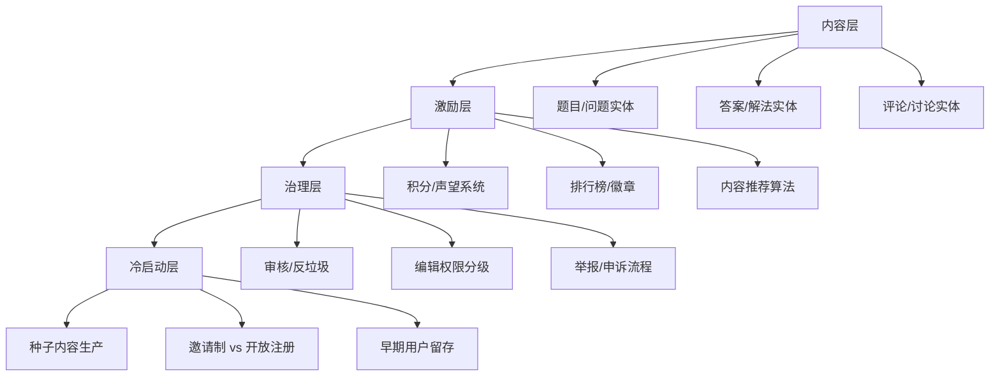
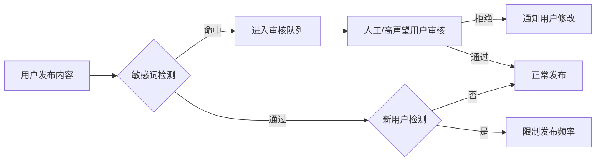

> 本文写于 2026 年 10 月，回溯 2022 年尝试构建开发者解题/讨论社区的产品实践与工程边界。

2022 年上半年，做过一次「给开发者一个解题与讨论空间」的尝试。那时算法竞赛社区、LeetCode 讨论区很热，技术博客平台也在寻找差异化路径，「问答 + 知识沉淀」模式看起来很有价值。但当你真正动手搭建一个 UGC 社区，才发现从内容结构化到冷启动激励，每一层都藏着难以绕过的产品边界。

四年后回看，当时踩过的坑、未解决的冷启动困境、以及 Stack Overflow 式社区为什么难以复制，依然是今天小团队做社区产品的参考样本。

<!-- more -->

## 问题：为什么需要「又一个」开发者社区

### 现有方案的三个断层

2022 年前后，技术内容平台已经很多：掘金、SegmentFault、知乎专栏、CSDN。但在「解题讨论」这个垂直场景下，依然存在断层：

1. **结构化缺失**：博客平台适合长文输出,但「一道题 + 多种解法对比 + 社区讨论」的结构难以承载
2. **激励错位**：点赞/收藏机制鼓励「10 万 +」爆款内容,但算法解题更需要「精准、可验证、可对比」的沉淀
3. **门槛矛盾**：Stack Overflow 的高门槛(声望系统、编辑审核)保证了质量,但也劝退了新手提问

这些断层促使很多团队思考:能不能做一个「低门槛提问 + 结构化答案 + 代码可运行验证」的混合体?

### 参照系:Stack Overflow 与国内社区

当时国内外已有的社区模式对比:

| 平台类型 | 代表 | 核心机制 | 适合场景 | 局限性 |
|---------|------|---------|---------|--------|
| 问答社区 | Stack Overflow | 声望系统 + 投票 + 赏金 | 通用编程问题 | 新手门槛高,中文内容少 |
| 算法刷题 | LeetCode / 洛谷 | OJ 判题 + 讨论区 | 竞赛题解 | 讨论区功能简陋,缺乏沉淀 |
| 技术博客 | 掘金 / Dev.to | 编辑器 + 标签 + 点赞 | 长文教程 | 难以承载「一题多解」结构 |
| 知识库 | Notion / 语雀 | 文档协作 + 结构化 | 团队知识沉淀 | 缺乏社区氛围,不适合陌生人协作 |

自建社区的团队,往往是想融合这些模式的优点:Stack Overflow 的问答结构 + LeetCode 的代码运行 + 掘金的低门槛编辑器。

## 社区产品的四层抽象

一个开发者社区到底要做哪些事?可以分为四层:

### 第一层:内容结构化

UGC 社区最核心的是内容模型。一个「解题社区」的基本实体关系:

**核心实体设计**:

- **Problem (题目)**:标题、描述、输入输出样例、难度标签、所属分类(动态规划/图论/字符串等)
- **Solution (解法)**:代码、语言标识、时间/空间复杂度、作者、投票数
- **Comment (讨论)**:针对题目或解法的评论、支持嵌套回复
- **Tag (标签)**:多维度标签体系(算法分类、难度、公司标签等)

**关键权衡**:

1. **题目来源**:是用户自由创建,还是管理员预设?前者内容丰富但质量难控,后者冷启动容易但扩展性受限
2. **解法排序**:按投票数、按时间、按复杂度?不同排序策略影响内容生态
3. **代码运行**:是否集成在线 Judge?需要沙箱隔离、多语言支持、性能监控,工程量巨大

### 第二层:激励机制

技术社区的激励设计比内容产品复杂得多,因为贡献者是「用爱发电」,需要精神激励替代物质回报。

**典型激励层级**:

| 激励类型 | 机制 | 适用场景 | 成本/风险 |
|---------|------|---------|---------|
| 即时反馈 | 点赞/感谢/收藏 | 普通内容 | 低成本,易被刷 |
| 社区声望 | 积分/等级/徽章 | 持续贡献者 | 需要防作弊,规则透明 |
| 内容曝光 | 首页推荐/周刊收录 | 高质量内容 | 需要编辑审核,有偏见风险 |
| 实际收益 | 赏金/打赏/悬赏 | 特定问题 | 涉及资金,合规成本高 |

**Stack Overflow 的声望系统借鉴**:

- **投票权分级**:新用户只能提问,15 声望后可投赞成票,125 声望后可投反对票
- **编辑权限**:2000 声望后可直接编辑他人问题,避免低质内容堆积
- **特权解锁**:声望越高,解锁的社区治理权限越多(关闭问题、删除内容等)

这套设计的核心逻辑:**把社区治理权下放给高贡献用户,形成自治生态**。但国内社区往往难以复制,因为中文用户更习惯「管理员管理」而非「社区自治」。

### 第三层:内容治理

UGC 社区最头疼的是垃圾内容、广告、灌水。传统方案有三种:

1. **人工审核**:成本高,响应慢,难以规模化
2. **算法过滤**:关键词黑名单、机器学习反垃圾,但误杀率高
3. **社区举报 + 投票**:用户举报后,高声望用户投票决定是否删除

**实践中的权衡**:

- **初期(< 1000 用户)**:管理员人工审核,确保内容质量,建立规范案例
- **成长期(1000 - 10000 用户)**:引入关键词过滤 + 用户举报,管理员复核
- **成熟期(> 10000 用户)**:社区自治投票,管理员只处理争议 case

**反垃圾的技术细节**:

### 第四层:冷启动困境

这是所有社区产品最难的部分。2022 年的尝试最终卡在这一层:**没有种子内容,新用户进来发现空荡荡,转身就走;没有用户,就没人生产内容,陷入死循环**。

**冷启动的三个阶段**:

1. **种子内容阶段(0 - 100 题)**:团队自己生产或爬取高质量题解,确保每个常见算法分类都有示例
2. **邀请制阶段(100 - 1000 用户)**:定向邀请算法竞赛选手、技术博主,给予「创始会员」标识
3. **开放注册阶段(> 1000 用户)**:内容密度达到阈值后开放,但保留「新用户审核」机制

**踩过的坑**:

- **过早开放注册**:内容不足时开放,导致大量用户流失,后续拉回成本极高
- **激励错位**:给「发帖数」奖励,结果引来大量灌水;应该奖励「被采纳答案数」或「高赞解法数」
- **技术壁垒**:代码运行沙箱、多语言支持的工程量被严重低估,导致核心功能延期

## 未完成的产品,完整的教训

2022 年的这次尝试最终没有持续下去,原因是多方面的:

**产品层面**:

- 冷启动失败,种子内容不足,未能吸引早期用户
- 激励机制设计过于复杂,新用户学习成本高
- 与主流平台(LeetCode、掘金)的差异化不够明显

**工程层面**:

- 代码运行沙箱的安全隔离、性能优化投入过大
- 内容审核系统从零搭建,关键词库、反垃圾策略迭代缓慢
- 实时通知、评论嵌套、Markdown 渲染等基础设施占用大量时间

**资源层面**:

- 小团队难以同时兼顾产品设计、后端开发、运营推广
- 社区产品需要持续的内容运营,而非「上线即完成」

但这些失败的经验,恰好是理解社区产品本质的切入点:**社区不是功能的堆砌,而是内容 - 用户 - 激励的生态闭环**。缺少任何一环,整个系统都无法运转。

## 延伸阅读

这些资料在今天依然有参考价值:

1. **Stack Overflow 的特权系统文档**:https://stackoverflow.com/help/privileges — 详细列出了不同声望等级的权限,是社区治理的经典案例
2. **LeetCode 的社区规范**:https://leetcode.com/discuss/general-discussion/1072290/LeetCode-Community-Guidelines — 内容规范、反垃圾策略的实践
3. **社区产品冷启动案例:Product Hunt 的早期策略**:https://www.lennysnewsletter.com/p/how-product-hunt-got-started — 邀请制 + 种子用户运营的典型案例
4. **反垃圾技术:Reddit 的 AutoModerator 设计**:https://www.reddit.com/r/AutoModerator/wiki/index — 开源的社区内容自动化审核工具

---

**系列文章**:

- [自建运维平台的产品与工程边界:K8s 管理台的理想与现实](/2026/09/30/k8s-platform-product-engineering-boundary/)
- [Serverless 与 K8s 的产品选择:laf 实践中的工程权衡]()
- 本篇:开发者社区的产品边界

**写于 2026-10,回溯 2022-05**
