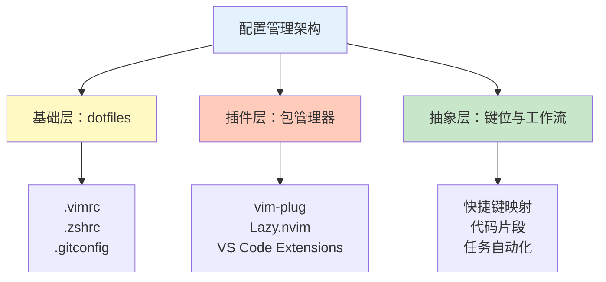

> 本文写于 2026 年 10 月，回溯 2022 年上半年对个人编辑器配置的系统性整理，以及从「私有仓库」到「公共抽象」的认知转变。

2022 年春天，在又一次换设备时重新配置开发环境后，我意识到一个问题：**编辑器配置不应该是散落在各处的脚本拼凑，而应该是可迁移、可版本化、可复用的基础设施**。那段时间系统梳理了 Vim、Neovim、VS Code 的配置管理哲学，研究了 dotfiles 工程化方案，最终形成了一套「配置即代码」的实践框架。本文回溯这段配置考古的过程，聚焦公共工具生态与工程边界。

<!-- more -->

## 问题：为什么编辑器配置需要工程化

### 痛点：环境迁移的隐性成本

在 2022 年之前，每次换机器或新建开发环境时，往往需要：

1. **手动安装插件**：记不清上次装了哪些插件，只能靠记忆或截图
2. **复制零散配置文件**：`.vimrc`、`.zshrc`、`settings.json` 散落在不同位置
3. **重复配置快捷键**：每次都要重新查文档，设置自定义键位
4. **依赖环境不一致**：插件版本不同，部分功能失效

这种「每次迁移都要重新配置半天」的状态，本质上是**缺乏配置的版本化管理和自动化部署**。

### 三个核心问题

| 问题维度 | 传统方式 | 工程化方式 |
|---------|---------|----------|
| **可迁移性** | 手动复制文件，依赖文档 | 一键脚本部署，跨平台适配 |
| **可追溯性** | 配置改动无记录 | Git 版本控制，变更历史可查 |
| **可共享性** | 个人配置散乱，难以复用 | 模块化抽象，团队可参考 |

工程化的本质，是把编辑器配置从「个人习惯的碎片」提升到「可维护的基础设施」。

## 配置管理的三层架构

### 层次划分



### 基础层：dotfiles 仓库

**核心思想**：把所有配置文件集中管理，通过符号链接（symlink）部署到系统目录。

**典型结构**：

```plaintext
dotfiles/
├── vim/
│   ├── vimrc
│   └── plugins.vim
├── zsh/
│   ├── zshrc
│   └── aliases.zsh
├── git/
│   └── gitconfig
├── vscode/
│   ├── settings.json
│   └── keybindings.json
└── install.sh  # 自动部署脚本
```

**部署脚本示例**（简化版）：

```bash
#!/bin/bash
# 符号链接到用户目录
ln -sf ~/dotfiles/vim/vimrc ~/.vimrc
ln -sf ~/dotfiles/zsh/zshrc ~/.zshrc
ln -sf ~/dotfiles/git/gitconfig ~/.gitconfig

# 安装 Vim 插件管理器
if [ ! -f ~/.vim/autoload/plug.vim ]; then
    curl -fLo ~/.vim/autoload/plug.vim --create-dirs \
        https://raw.githubusercontent.com/junegunn/vim-plug/master/plug.vim
fi

echo "Dotfiles deployed. Run 'vim +PlugInstall' to install plugins."
```

**关键设计原则**：

- **版本控制**：整个 dotfiles 目录用 Git 管理
- **跨平台兼容**：通过 `uname` 判断系统类型，加载对应配置
- **最小依赖**：部署脚本只依赖 shell 和 Git，不引入额外工具

### 插件层：包管理器的选择

不同编辑器有各自的插件生态，2022 年主流的插件管理器对比：

#### Vim / Neovim 插件管理器

| 工具 | 特点 | 适用场景 |
|------|------|---------|
| **vim-plug** | 简洁、启动快、支持延迟加载 | 通用首选，学习曲线平缓 |
| **Vundle** | 早期流行，但性能较差 | 已逐渐被 vim-plug 替代 |
| **Lazy.nvim** | Neovim 专用，性能极致优化 | 追求极致启动速度的 Neovim 用户 |
| **Packer.nvim** | Lua 编写，Neovim 生态友好 | 深度定制 Neovim 的进阶用户 |

**vim-plug 配置示例**：

```vim
call plug#begin('~/.vim/plugged')

" 文件树
Plug 'preservim/nerdtree'

" 模糊搜索
Plug 'junegunn/fzf', { 'do': { -> fzf#install() } }
Plug 'junegunn/fzf.vim'

" 语法高亮
Plug 'sheerun/vim-polyglot'

" Git 集成
Plug 'tpope/vim-fugitive'

" LSP 支持（Neovim）
Plug 'neovim/nvim-lspconfig'

call plug#end()
```

#### VS Code 扩展管理

VS Code 的扩展可以通过 **Settings Sync** 功能同步：

- **内置同步**：Settings Sync（登录 GitHub 或 Microsoft 账号）
- **配置文件管理**：`extensions.json` 记录扩展列表
- **命令行安装**：`code --install-extension <extension-id>`

**扩展列表管理**：

```bash
# 导出当前安装的扩展
code --list-extensions > extensions.txt

# 在新环境批量安装
cat extensions.txt | xargs -L 1 code --install-extension
```

**关键扩展（2022 年常用）**：

- **语言支持**：`ms-python.python`、`rust-lang.rust-analyzer`、`golang.go`
- **代码格式化**：`esbenp.prettier-vscode`、`ms-vscode.vscode-typescript-next`
- **版本控制**：`eamodio.gitlens`
- **远程开发**：`ms-vscode-remote.remote-ssh`

### 抽象层：键位哲学与工作流

**键位设计的两种流派**：

1. **Vim 流派**：模态编辑，hjkl 移动，组合命令链
2. **IDE 流派**：快捷键 + 鼠标，快速跳转，可视化操作

**跨编辑器的通用键位抽象**（个人实践）：

| 功能 | Vim / Neovim | VS Code | 设计原则 |
|------|--------------|---------|---------|
| 文件树切换 | `<Leader>e` | `Ctrl+B` | 左手操作，不离开主键盘区 |
| 模糊搜索文件 | `<Leader>f` | `Ctrl+P` | 高频操作，单键触达 |
| 全局搜索 | `<Leader>g` | `Ctrl+Shift+F` | 助记（g = grep） |
| 跳转定义 | `gd` | `F12` | Vim 原生，VS Code 保留默认 |
| 代码格式化 | `<Leader>p` | `Shift+Alt+F` | 助记（p = pretty） |

**Leader 键的选择**：

- **传统选择**：`,` 或 `\`（Vim 默认）
- **现代选择**：`<Space>`（空格，大拇指自然位置，不需移动手指）

```vim
" Vim 配置示例
let mapleader = " "

nnoremap <Leader>e :NERDTreeToggle<CR>
nnoremap <Leader>f :Files<CR>
nnoremap <Leader>g :Rg<CR>
nnoremap <Leader>p :Prettier<CR>
```

## 可迁移性：跨平台与团队协作

### 跨平台兼容的实现

不同操作系统的配置差异主要在：

1. **包管理器**：macOS 用 Homebrew，Linux 用 apt/yum
2. **路径差异**：Windows 用反斜杠，Unix 用斜杠
3. **终端模拟器**：macOS 用 iTerm2，Linux 用 GNOME Terminal

**条件加载示例**：

```bash
# .zshrc 中的跨平台判断
case "$(uname)" in
    Darwin)
        # macOS 特有配置
        export PATH="/opt/homebrew/bin:$PATH"
        ;;
    Linux)
        # Linux 特有配置
        export PATH="/usr/local/bin:$PATH"
        ;;
esac
```

### 团队协作的边界

编辑器配置的「个人性」与「团队规范」需要平衡：

**私有配置**（不应共享）：

- 个人键位偏好
- 主题与字体
- 本地路径设置

**团队规范**（应共享）：

- 代码格式化规则（`.editorconfig`）
- Lint 规则（`.eslintrc`、`.pylintrc`）
- Git 钩子（`.git/hooks`）

**推荐实践**：

```plaintext
项目根目录/
├── .editorconfig          # 团队共享
├── .eslintrc.json         # 团队共享
├── .prettierrc            # 团队共享
└── .vscode/
    ├── settings.json      # 团队推荐配置（不强制）
    └── extensions.json    # 推荐扩展列表
```

**`.editorconfig` 示例**：

```ini
root = true

[*]
charset = utf-8
end_of_line = lf
insert_final_newline = true
indent_style = space
indent_size = 2

[*.py]
indent_size = 4

[Makefile]
indent_style = tab
```

## 工程化清单

基于上述实践，总结配置工程化的检查清单：

### 初始化阶段

- [ ] 创建 dotfiles 仓库，初始化 Git
- [ ] 选择插件管理器（Vim 用 vim-plug，Neovim 可考虑 Lazy.nvim）
- [ ] 编写自动部署脚本（`install.sh`）
- [ ] 测试在全新环境下的部署流程

### 配置迁移阶段

- [ ] 整理现有配置文件（`.vimrc`、`.zshrc`、`.gitconfig`）
- [ ] 提取可复用的通用配置，剔除机器特定路径
- [ ] 分离敏感信息（如 Git 邮箱、API Token）到独立文件
- [ ] 添加 `.gitignore`，避免提交本地缓存

### 插件管理阶段

- [ ] 列出当前使用的所有插件
- [ ] 删除冗余或不再使用的插件
- [ ] 为每个插件添加注释，说明用途
- [ ] 设置插件延迟加载，优化启动速度

### 键位优化阶段

- [ ] 统计高频操作，为其分配单键或 Leader 组合键
- [ ] 避免与系统快捷键冲突（如 `Ctrl+S` 在终端可能冻结）
- [ ] 记录自定义键位到 README 或注释中
- [ ] 跨编辑器保持一致的助记逻辑

### 持续维护阶段

- [ ] 定期更新插件版本（每季度或每半年）
- [ ] 记录配置变更的原因（Git commit message）
- [ ] 备份旧版本配置（Git tag），便于回滚
- [ ] 清理不再使用的配置项和插件

## 工具生态的演进

2022 年到 2026 年，配置管理生态的变化：

| 工具/技术 | 2022 年状态 | 2026 年状态 |
|----------|------------|------------|
| **Neovim** | 0.7 版本，Lua 配置开始流行 | 0.10+，Lua 成为主流，内置 LSP 成熟 |
| **VS Code** | Settings Sync 内置但功能有限 | 云同步更完善，支持 Profile 切换 |
| **GitHub Codespaces** | 刚推出，使用门槛高 | 成为标准开发环境，配置自动同步 |
| **Lazy.nvim** | 刚发布，社区较小 | 成为 Neovim 最流行的插件管理器 |
| **Helix Editor** | 实验性项目 | 稳定可用，模态编辑的新选择 |

**趋势总结**：

1. **从 Vimscript 到 Lua**：Neovim 的 Lua 配置更易读、性能更好
2. **从本地到云端**：Codespaces 和 Gitpod 让配置自动跟随项目
3. **从手动到自动**：插件管理器的自动更新和懒加载成为标配
4. **从单一到组合**：不再追求「一个编辑器打天下」，而是场景化选择（终端用 Neovim，GUI 用 VS Code）

## 延伸阅读

### 经典资源

- [GitHub does dotfiles](https://dotfiles.github.io/) - 优秀 dotfiles 仓库集合
- [vim-plug 官方文档](https://github.com/junegunn/vim-plug) - 最流行的 Vim 插件管理器
- [Lazy.nvim](https://github.com/folke/lazy.nvim) - Neovim 现代化插件管理器
- [VS Code Settings Sync](https://code.visualstudio.com/docs/editor/settings-sync) - 官方同步文档

### 工具与框架

- [GNU Stow](https://www.gnu.org/software/stow/) - 优雅的符号链接管理工具
- [chezmoi](https://www.chezmoi.io/) - 跨机器 dotfiles 管理工具
- [EditorConfig](https://editorconfig.org/) - 跨编辑器代码风格统一

### 进阶主题

- [Neovim 从零开始配置指南](https://github.com/nvim-lua/kickstart.nvim) - 官方推荐的 Neovim Lua 配置起点
- [Awesome Neovim](https://github.com/rockerBOO/awesome-neovim) - Neovim 插件生态汇总
- [VS Code 扩展开发文档](https://code.visualstudio.com/api) - 自定义扩展开发

---

## 写在最后

2022 年那次系统性的配置整理，让我意识到**编辑器配置不仅是工具层面的优化，更是思维方式的具象化**。模块化的 dotfiles、可复用的插件配置、跨平台的兼容策略，这些工程实践的底层逻辑——**抽象、封装、复用**——与写代码时的设计原则一脉相承。

四年后的今天，Neovim 的 Lua 生态已经成熟，VS Code 的云同步更加完善，但配置管理的核心价值没有变：**让工具适应你的工作流，而不是被工具绑架**。好的配置应该是透明的，当你专注于编码时，它安静地提供支持；当你需要迁移时，它一键部署到位。

工程化的终极目标，是让重复劳动自动化，让创造性工作获得更多时间。编辑器配置如此，软件开发亦如此。

---

*本文基于 2022 年上半年的个人配置实践回溯整理，工具和版本号均为彼时真实情况。*
