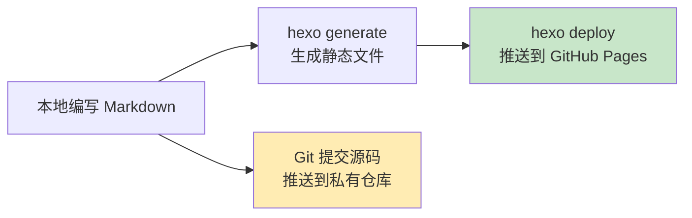

> 本文写于 2026 年 10 月，回溯 2019 年 5 月搭建个人博客时的技术选型、工程边界与基建决策。这是系列 G1「站点考古」的首篇，试图从时间线补文的角度，重新审视那些被遗忘的技术细节。

2019 年 5 月，研途二十出头，决定从零搭一个个人博客站。当时的需求很简单：**可以写技术笔记，能托管在 GitHub 上，尽量少折腾服务器**。静态站生成器成为自然的选择，而 Hexo 作为当时最流行的 Node.js 静态站方案，几乎是不假思索的决定。然而真正动手时才发现，从「安装 Hexo」到「稳定发布内容」之间，横亘着一系列具体而琐碎的工程边界问题：主题配置、部署流程、多设备同步、Markdown 渲染……本文记录这些基建细节，以及当年做出的权衡。

<!-- more -->

## 技术选型：静态站的基建边界

### 为什么选择静态站生成器

2019 年搭建个人博客，主流方案分为三类：

| 方案类型 | 代表产品 | 优势 | 劣势 |
|---------|---------|------|------|
| **动态 CMS** | WordPress、Typecho | 功能完整，插件生态丰富 | 需要服务器、数据库，运维成本高 |
| **静态站生成器** | Hexo、Jekyll、Hugo | 免服务器，托管 GitHub Pages 零成本 | 需要本地构建，动态功能受限 |
| **在线博客平台** | 简书、掘金、博客园 | 开箱即用，专注写作 | 内容不自主，平台规则受限 |

选择静态站生成器的核心原因有三点：

1. **零运维成本**：无需服务器、数据库，GitHub Pages 免费托管
2. **内容自主权**：Markdown 文件本地存储，不受平台约束
3. **技术栈友好**：作为工程背景的写作者，本地构建发布流程可接受

### Hexo vs. Jekyll vs. Hugo：2019 年的权衡

当时主流的静态站生成器对比：

| 维度 | Hexo | Jekyll | Hugo |
|------|------|--------|------|
| **语言** | Node.js | Ruby | Go |
| **构建速度** | 中等（500 篇约 10s） | 慢（500 篇约 30s） | 快（500 篇约 1s） |
| **主题生态** | 丰富（NexT 等成熟主题） | 丰富（GitHub 原生支持） | 较少（新兴社区） |
| **中文文档** | 完善 | 一般 | 较少 |
| **学习曲线** | 平缓 | 平缓 | 陡峭 |

最终选择 Hexo 的决定因素：

- **环境依赖简单**：本地已有 Node.js 环境，无需额外安装 Ruby 或 Go
- **NexT 主题**：当时最流行的 Hexo 主题，文档完善，配置项丰富
- **中文社区**：有大量中文教程和问题记录，踩坑成本低

## 基建实践：从安装到发布的工程清单

### 环境搭建与依赖管理

基础环境准备的完整清单：

```bash
# 1. Node.js 环境（通过 nvm 管理版本）
curl -o- https://raw.githubusercontent.com/nvm-sh/nvm/v0.35.3/install.sh | bash
nvm install --lts
nvm use --lts

# 2. 全局安装 Hexo CLI
npm install hexo-cli -g

# 3. 初始化博客项目
hexo init blog
cd blog
npm install

# 4. 本地预览
hexo server
```

**踩坑记录**：

- **nvm 版本锁定**：不同设备需统一 Node.js 版本（当时用 10.x LTS），避免插件兼容性问题
- **hexo-cli 全局依赖**：需在每台设备全局安装，否则 `hexo` 命令不可用
- **npm 镜像源**：国内网络环境建议配置淘宝镜像，避免依赖安装超时

### 主题选型：NexT 的配置边界

选择 [NexT](https://theme-next.js.org/) 主题后，核心配置项包括：

**基础配置**（`_config.yml`）：

```yaml
# 站点信息
title: 站点标题
subtitle: 副标题
description: SEO 描述
author: 作者名

# 部署配置
deploy:
  type: git
  repo: https://github.com/username/username.github.io.git
  branch: main
```

**主题配置**（`themes/next/_config.yml`）：

```yaml
# 主题方案（四选一）
scheme: Muse | Mist | Pisces | Gemini

# 菜单配置
menu:
  home: / || fa fa-home
  archives: /archives/ || fa fa-archive
  tags: /tags/ || fa fa-tags
  categories: /categories/ || fa fa-th

# 代码高亮
highlight:
  enable: true
  line_number: true
  auto_detect: false
```

**配置分层的工程边界**：

- 站点配置与主题配置分离，升级主题时不覆盖站点配置
- 主题配置文件不纳入 Git，通过文档记录自定义项
- 插件安装独立管理（`package.json`），避免全局污染

### 部署流程：GitHub Pages 的两阶段推送

Hexo 部署到 GitHub Pages 的核心痛点：**生成的静态文件与源码分离存储**。

标准流程拆解：



**双仓库策略**：

1. **公开仓库**（`username.github.io`）：托管生成的静态文件，用于 GitHub Pages 发布
2. **私有仓库**（`hexo-blog`）：托管 Hexo 源码、主题配置、Markdown 文件

**部署命令序列**：

```bash
# 生成并部署到 GitHub Pages
hexo clean
hexo generate
hexo deploy

# 提交源码到私有仓库
git add .
git commit -m "Add new post: xxx"
git push origin main
```

**多设备同步的工程约束**：

- 新设备首次使用：克隆私有仓库，执行 `npm install` 恢复依赖
- 主题子模块问题：NexT 主题若通过 Git 子模块安装，需单独处理 `.git` 文件夹
- CNAME 文件管理：在 `source/` 目录放置 `CNAME` 文件，避免每次部署后域名配置被重置

### 内容编写：Markdown 的渲染边界

Hexo 默认的 Markdown 渲染器（hexo-renderer-marked）存在功能限制，需安装增强插件：

**常见增强插件**：

| 插件 | 功能 | 安装命令 |
|------|------|---------|
| `hexo-renderer-markdown-it` | 更强大的 Markdown 渲染器 | `npm install hexo-renderer-markdown-it --save` |
| `hexo-math` | 数学公式支持（KaTeX） | `npm install hexo-math --save` |
| `hexo-prism-plugin` | 代码高亮增强 | `npm install hexo-prism-plugin --save` |

**Front Matter 规范**：

```yaml
---
title: 文章标题
date: 2019-05-06 12:00:00
updated: 2019-05-07 10:00:00
categories:
  - 分类名
tags:
  - 标签1
  - 标签2
---
```

**工程约束**：

- 文件命名统一用中划线分隔（`2019-05-06-post-title.md`）
- Front Matter 必须包含 `title` 和 `date`，否则构建报错
- 中文标签和分类需保证编码一致，避免生成页面乱码

## 工程反思：2019 年的技术债

### 未能解决的基建问题

回顾当年的搭建过程，有几个问题始终未找到优雅的解决方案：

1. **图片资源管理**：Markdown 中的图片路径硬编码，迁移或重构时容易失效
2. **构建速度瓶颈**：文章数量增长到几百篇后，`hexo generate` 耗时显著增加
3. **多人协作边界**：双仓库策略对单人友好，但难以扩展到多人协作场景
4. **主题版本锁定**：NexT 主题更新频繁，升级时配置迁移成本高

### 2026 年视角：静态站的演进

时隔七年，静态站生成器的技术格局已发生变化：

- **Vite + Vue/React**：现代前端框架替代传统模板引擎
- **Vercel、Netlify**：比 GitHub Pages 更强大的部署平台
- **CMS 集成**：Headless CMS（Contentful、Strapi）降低内容管理门槛

但 Hexo + GitHub Pages 的组合依然是**低成本、高自主权的经典方案**，适合技术背景的个人博客写作者。

## 延伸阅读

- [Hexo 官方文档](https://hexo.io/zh-cn/docs/)
- [NexT 主题配置指南](https://theme-next.js.org/docs/getting-started/)
- [GitHub Pages 官方文档](https://docs.github.com/en/pages)
- [Markdown 语法参考](https://www.markdownguide.org/basic-syntax/)

---

**后记**：这篇考古笔记是对 2019 年个人站搭建经历的复盘，也是时间线补文系列的起点。为什么要做时间线补文？这个问题本身或许值得单独成篇——留给系列 G2 继续探讨。
