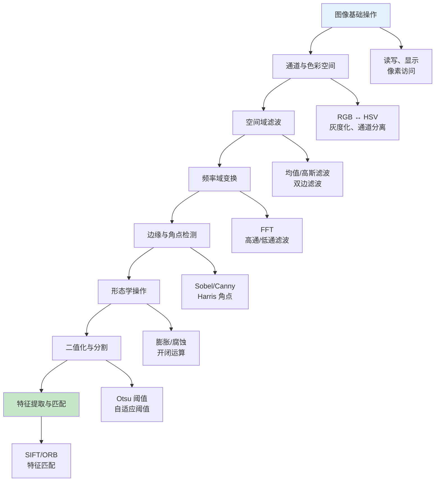
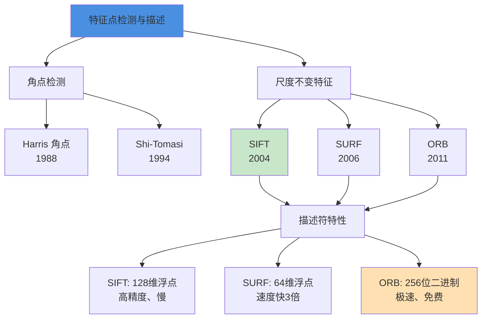
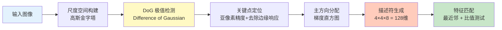

> 本文写于 2026 年 10 月，回溯 2019 年研途时期经典图像处理基础练习与传统特征方法的学习路径，以及它们在深度学习时代的工程边界。

2019 年，深度学习已经在 ImageNet、COCO 等基准上展现出压倒性优势，卷积神经网络（CNN）似乎正在取代传统特征的地位。但对于刚开始学习计算机视觉的人来说，**从最基础的像素操作、频率域变换、经典特征算子（SIFT、ORB）入手，仍是理解「什么是特征」的必经之路**。那段时间对照「图像处理 100 问」式的公开练习路线，从通道分离到边缘检测，从角点提取到特征匹配，在一个个小任务中搭建起对视觉算法的直觉——这种地基级的理解，即便在 2026 年多模态大模型时代，依然有其价值。

<!-- more -->

## 问题：深度学习时代为何还需要经典基础

### 三个误解与现实

**误解一：「CNN 已经端到端学习特征，不需要手工设计」**

**现实**：

- CNN 的卷积操作本质上是在学习**可调参数的滤波器**，理解传统滤波器（高斯、拉普拉斯、Sobel）有助于理解卷积核在做什么
- 数据预处理（去噪、增强、归一化）仍需要经典图像处理知识
- 小数据场景下，传统特征 + 浅层分类器可能比深度模型更稳定

**误解二：「SIFT/SURF 这些算法已经过时了」**

**现实**：

- 在需要**几何不变性**的场景（全景拼接、SLAM、三维重建），传统特征 + RANSAC 匹配仍是主流
- 深度特征（如 SuperPoint、D2-Net）虽然效果更好，但计算量大，边缘设备难以实时运行
- 理解 SIFT 的尺度空间、主方向计算，有助于理解特征金字塔（FPN）和注意力机制的设计

**误解三：「经典图像处理只是理论，没有工程价值」**

**现实**：

- 工业视觉（缺陷检测、条形码识别、文字分割）大量使用形态学、连通域分析等传统方法
- 医学影像、遥感影像处理对**可解释性**要求高，传统算法的物理意义清晰
- 实时性要求高的场景（如移动端 AR），轻量级传统算法仍有竞争力

### 对比：传统视觉 vs 深度学习的适用边界

| 维度 | 传统图像处理 + 特征 | 深度学习（CNN/Transformer） |
|------|---------------------|---------------------------|
| **数据需求** | 少量样本，甚至无监督 | 大量标注数据 |
| **可解释性** | 强（每步有明确物理意义） | 弱（黑盒模型） |
| **泛化能力** | 弱（对光照、尺度敏感） | 强（学习到鲁棒特征） |
| **计算资源** | CPU 可实时运行 | GPU 依赖强，移动端受限 |
| **开发周期** | 快（调参即可） | 长（需要训练、调优） |
| **适用场景** | 工业检测、几何匹配、小数据 | 语义理解、复杂场景、大规模应用 |

**结论**：不是「替代」关系，而是「互补」关系——理解传统方法的边界，才能更好地判断何时用深度学习，何时用传统管线。

## 练习路线：从像素到特征的阶梯

### 典型「100 问」式练习结构

公开的图像处理练习项目（如 Gasyori100knock、OpenCV 官方教程）通常按以下模块递进：



### 阶段一：通道操作与色彩空间（入门级）

**核心问题**：理解「颜色」在计算机中的表示方式

```python
# 典型练习任务
# 任务 1：RGB 通道分离与合并
def split_channels(image):
    b, g, r = cv2.split(image)
    # 可视化：把某个通道置零，观察效果
    
# 任务 2：RGB → HSV 转换
def rgb_to_hsv(image):
    hsv = cv2.cvtColor(image, cv2.COLOR_BGR2HSV)
    # 应用：根据色调（H）分割特定颜色物体
    
# 任务 3：灰度化（不同权重）
def grayscale_weighted(image):
    # 方法1：平均值 (R+G+B)/3
    # 方法2：加权 0.299*R + 0.587*G + 0.114*B （符合人眼感知）
    gray = cv2.cvtColor(image, cv2.COLOR_BGR2GRAY)
```

**工程要点**：

- HSV 色彩空间对**光照变化更鲁棒**，适合颜色分割（如绿幕抠图、交通灯检测）
- 灰度化不是简单平均，需要考虑人眼对绿色更敏感
- 某些算法（如边缘检测）只接受灰度图，预处理时需转换

### 阶段二：空间域滤波（核心技能）

**核心问题**：如何在保留信息的前提下去噪、增强

| 滤波器 | 核函数 | 作用 | 副作用 |
|--------|--------|------|--------|
| **均值滤波** | 全 1 矩阵归一化 | 去噪 | 边缘模糊 |
| **高斯滤波** | 高斯分布权重 | 平滑去噪 | 细节损失 |
| **中值滤波** | 取邻域中值 | 去除椒盐噪声 | 计算量大 |
| **双边滤波** | 空间 + 强度加权 | 保边去噪 | 速度慢 |
| **Sobel 算子** | 一阶导数 | 边缘检测 | 对噪声敏感 |
| **拉普拉斯算子** | 二阶导数 | 边缘增强 | 噪声放大 |

**典型任务**：

```python
# 任务：对比不同滤波器的去噪效果
import cv2
import numpy as np

# 添加高斯噪声
def add_gaussian_noise(image, sigma=25):
    noise = np.random.normal(0, sigma, image.shape)
    return np.clip(image + noise, 0, 255).astype(np.uint8)

# 对比去噪效果
noisy = add_gaussian_noise(clean_image)
result_mean = cv2.blur(noisy, (5, 5))           # 均值
result_gaussian = cv2.GaussianBlur(noisy, (5, 5), 0)  # 高斯
result_bilateral = cv2.bilateralFilter(noisy, 9, 75, 75)  # 双边

# 观察：双边滤波保留边缘最好，但速度最慢
```

**工程陷阱**：

- 滤波器尺寸（kernel size）过大会严重模糊图像
- 双边滤波虽然效果好，但在高分辨率图像上极慢（需要 O(n·k²)，k 是核尺寸）
- 在深度学习的数据增强中，**不要对标注目标区域施加过强滤波**，会导致标注框与模糊后内容不匹配

### 阶段三：频率域与边缘检测（理论进阶）

**核心问题**：理解「图像 = 不同频率的叠加」

```python
# 任务：频率域高通滤波（边缘增强）
def fft_high_pass(image, cutoff_radius=30):
    # 1. FFT 变换
    f = np.fft.fft2(image)
    fshift = np.fft.fftshift(f)  # 将零频分量移到中心
    
    # 2. 构建高通滤波器（去除低频 = 保留边缘）
    rows, cols = image.shape
    crow, ccol = rows // 2, cols // 2
    mask = np.ones((rows, cols), np.uint8)
    mask[crow - cutoff_radius:crow + cutoff_radius,
         ccol - cutoff_radius:ccol + cutoff_radius] = 0
    
    # 3. 逆变换
    fshift_filtered = fshift * mask
    f_ishift = np.fft.ifftshift(fshift_filtered)
    img_back = np.fft.ifft2(f_ishift)
    img_back = np.abs(img_back)
    
    return img_back

# 对比：空间域 Sobel vs 频率域高通
sobel_x = cv2.Sobel(image, cv2.CV_64F, 1, 0, ksize=3)
fft_edge = fft_high_pass(image, cutoff_radius=30)
# 本质相同：频率域高通 ≈ 空间域边缘检测
```

**Canny 边缘检测的完整流程**：


**工程实战**：

- Canny 的两个阈值（`threshold1`、`threshold2`）难以自动确定，通常需要对数据集调参
- 边缘检测只给出「边缘像素」，后续需要 Hough 变换提取直线/圆，或用连通域提取轮廓
- 在目标检测预处理中，**边缘检测不如直接用深度模型**，但在工业缺陷检测中仍是主流（可解释、无需标注）

### 阶段四：形态学操作（结构化处理）

**核心问题**：如何对二值化结果做「结构级」操作

| 操作 | 核心思想 | 典型应用 |
|------|---------|---------|
| **膨胀（Dilation）** | 用结构元素「扩张」前景 | 填补空洞、连接断裂 |
| **腐蚀（Erosion）** | 用结构元素「缩小」前景 | 去除小噪点、分离粘连 |
| **开运算（Open）** | 先腐蚀后膨胀 | 去除小物体，平滑边界 |
| **闭运算（Close）** | 先膨胀后腐蚀 | 填充小孔，连接邻近物体 |
| **形态学梯度** | 膨胀 - 腐蚀 | 提取物体边界 |
| **顶帽/黑帽** | 原图 - 开/闭运算 | 提取小亮/暗区域 |

```python
# 典型任务：文档二值化后的去噪
def preprocess_document(binary_image):
    # 1. 去除小噪点（开运算）
    kernel_small = cv2.getStructuringElement(cv2.MORPH_RECT, (3, 3))
    clean = cv2.morphologyEx(binary_image, cv2.MORPH_OPEN, kernel_small)
    
    # 2. 连接断裂的文字笔画（闭运算）
    kernel_line = cv2.getStructuringElement(cv2.MORPH_RECT, (5, 1))  # 横向
    connected = cv2.morphologyEx(clean, cv2.MORPH_CLOSE, kernel_line)
    
    return connected

# 应用：车牌识别中字符分割
def segment_license_plate(plate_binary):
    # 闭运算连接字符内部断裂
    kernel = cv2.getStructuringElement(cv2.MORPH_RECT, (3, 3))
    closed = cv2.morphologyEx(plate_binary, cv2.MORPH_CLOSE, kernel)
    
    # 连通域分析，提取单个字符
    contours, _ = cv2.findContours(closed, cv2.RETR_EXTERNAL, cv2.CHAIN_APPROX_SIMPLE)
    char_boxes = [cv2.boundingRect(c) for c in contours]
    
    return sorted(char_boxes, key=lambda x: x[0])  # 按 x 坐标排序
```

**工程价值**：

- 形态学操作在**文档处理、工业检测**中极其常用（比深度学习快 100 倍）
- 结构元素的形状（矩形/椭圆/十字）和尺寸直接影响效果，需要根据目标形状设计
- 深度学习的分割模型（如 U-Net）输出的概率图，常用形态学后处理去除小碎片

## 传统特征工程：从角点到 SIFT

### 什么是「好特征」

在深度学习之前，特征工程的核心问题是：**如何手工设计一个描述符，使得「相同物体在不同条件下仍能匹配」**。

**好特征的标准**：

1. **可检测性（Repeatability）**：同一个物理点在不同图像中能稳定检测到
2. **独特性（Distinctiveness）**：不同点的描述符应有明显差异
3. **紧凑性（Compactness）**：描述符维度不能太高（否则匹配慢）
4. **不变性（Invariance）**：对旋转、尺度、光照、视角变化鲁棒



### Harris 角点：从边缘到角点

**核心思想**：角点是「向任意方向移动，灰度都剧烈变化」的点

```python
# Harris 角点检测原理（简化）
def harris_corner(image, k=0.04):
    # 1. 计算图像梯度
    Ix = cv2.Sobel(image, cv2.CV_64F, 1, 0, ksize=3)
    Iy = cv2.Sobel(image, cv2.CV_64F, 0, 1, ksize=3)
    
    # 2. 计算梯度协方差矩阵 M 的元素
    Ix2 = Ix ** 2
    Iy2 = Iy ** 2
    Ixy = Ix * Iy
    
    # 3. 高斯加权（邻域内的像素贡献不同）
    Sx2 = cv2.GaussianBlur(Ix2, (3, 3), 1)
    Sy2 = cv2.GaussianBlur(Iy2, (3, 3), 1)
    Sxy = cv2.GaussianBlur(Ixy, (3, 3), 1)
    
    # 4. 计算角点响应函数 R = det(M) - k * trace(M)^2
    det_M = Sx2 * Sy2 - Sxy ** 2
    trace_M = Sx2 + Sy2
    R = det_M - k * (trace_M ** 2)
    
    # 5. 阈值化 + 非极大值抑制
    corners = (R > 0.01 * R.max())
    
    return corners

# OpenCV 直接调用
corners = cv2.cornerHarris(gray, blockSize=2, ksize=3, k=0.04)
```

**局限性**：

- **不具备尺度不变性**：图像缩小后，原来的角点可能变成边缘
- **对光照变化敏感**：需要归一化处理
- **无描述符**：只检测位置，不能匹配

### SIFT：尺度不变特征的里程碑

**SIFT（Scale-Invariant Feature Transform）** 是 David Lowe 在 2004 年提出的，历史意义重大：



**核心创新点**：

1. **尺度空间（Scale Space）**：对图像做不同程度的高斯模糊，形成金字塔，在不同尺度上检测极值点
2. **主方向（Dominant Orientation）**：计算关键点邻域的梯度直方图，分配主方向，实现旋转不变性
3. **128 维描述符**：在关键点周围 4×4 的子区域内，每个子区域统计 8 个方向的梯度直方图，拼接成 128 维向量
4. **比值测试（Ratio Test）**：匹配时，只保留「最近邻距离 / 次近邻距离 < 0.8」的匹配，过滤模糊匹配

```python
# OpenCV 中使用 SIFT
import cv2

# 检测关键点和计算描述符
sift = cv2.SIFT_create()
keypoints1, descriptors1 = sift.detectAndCompute(image1, None)
keypoints2, descriptors2 = sift.detectAndCompute(image2, None)

# 暴力匹配（BFMatcher）
bf = cv2.BFMatcher(cv2.NORM_L2, crossCheck=False)
matches = bf.knnMatch(descriptors1, descriptors2, k=2)

# Lowe's 比值测试
good_matches = []
for m, n in matches:
    if m.distance < 0.75 * n.distance:  # 阈值通常 0.7-0.8
        good_matches.append(m)

# 绘制匹配结果
result = cv2.drawMatches(image1, keypoints1, image2, keypoints2, 
                          good_matches, None, flags=2)
```

**工程实战场景**：

- **全景拼接（Image Stitching）**：检测两张图的 SIFT 特征 → 匹配 → RANSAC 估计单应性矩阵（Homography）→ 图像变换对齐
- **物体识别**：对目标物体提取 SIFT 特征库 → 对查询图像提取 SIFT → 匹配 → 判断是否为同一物体
- **SLAM（即时定位与地图构建）**：视频帧间特征匹配，估计相机运动

### ORB：实时应用的首选

**ORB（Oriented FAST and Rotated BRIEF）** 是 2011 年提出的，针对 SIFT 的速度和专利问题：

| 维度 | SIFT | ORB |
|------|------|-----|
| **描述符类型** | 128 维浮点数 | 256 位二进制 |
| **速度** | 慢（每帧 ~1-2s） | 快（每帧 ~10-50ms） |
| **专利** | 有专利（2020 年已到期） | 开源免费 |
| **匹配方式** | L2 距离（欧氏距离） | Hamming 距离（XOR 计数） |
| **旋转不变性** | 是 | 是 |
| **尺度不变性** | 是 | 有限（基于图像金字塔） |

```python
# ORB 使用示例
orb = cv2.ORB_create(nfeatures=500)  # 最多检测 500 个特征点
kp1, des1 = orb.detectAndCompute(image1, None)
kp2, des2 = orb.detectAndCompute(image2, None)

# Hamming 距离匹配（二进制描述符专用）
bf = cv2.BFMatcher(cv2.NORM_HAMMING, crossCheck=True)
matches = bf.match(des1, des2)
matches = sorted(matches, key=lambda x: x.distance)

# ORB 匹配速度比 SIFT 快 10-100 倍
```

**适用场景**：

- 移动端 AR 应用（需要实时特征跟踪）
- 视觉 SLAM（ORB-SLAM 是经典开源方案）
- 低算力设备（树莓派、嵌入式）

## 传统特征 vs CNN 特征：边界在哪里

### 深度特征的崛起

2012 年 AlexNet 之后，CNN 学习到的特征（如 ResNet 的 conv5 输出）在匹配任务上逐渐超越 SIFT：

| 对比维度 | SIFT/ORB | CNN 特征（如 ResNet） | 深度特征专用算法（SuperPoint） |
|---------|----------|----------------------|------------------------------|
| **训练需求** | 无需训练 | 需要 ImageNet 等大数据集 | 需要专门的特征点数据集 |
| **可解释性** | 强（尺度空间、梯度方向） | 弱（黑盒） | 弱 |
| **光照鲁棒性** | 一般 | 强 | 强 |
| **小数据泛化** | 好 | 需要 fine-tune | 差 |
| **计算资源** | CPU 实时 | GPU 推理 | GPU 推理 |
| **匹配精度** | 中等 | 高（语义级别） | 最高（端到端优化） |

### 传统特征仍有价值的场景

```yaml
场景 1：几何匹配任务
  任务: 全景拼接、三维重建、视觉里程计
  原因: 需要精确的像素级对应关系，SIFT + RANSAC 仍是工业标准
  
场景 2：低算力设备
  任务: 嵌入式视觉、树莓派机器人
  原因: ORB 可以在 ARM CPU 上实时运行，CNN 需要 GPU
  
场景 3：可解释性要求高
  任务: 医学影像配准、卫星图像对比
  原因: SIFT 的每一步都有明确物理意义，结果可追溯
  
场景 4：无标注数据
  任务: 新领域的快速验证
  原因: 传统特征无需训练，直接用；CNN 需要领域数据 fine-tune
```

### CNN 特征的绝对优势

```yaml
场景 1：语义级别匹配
  任务: 跨视角的物体识别（如正面照片匹配侧面照片）
  原因: SIFT 只看局部纹理，CNN 理解高层语义
  
场景 2：极端光照/模糊
  任务: 夜间图像匹配、运动模糊场景
  原因: CNN 可以学习到对光照/模糊的鲁棒性
  
场景 3：端到端优化
  任务: 三维重建中的特征点 + 描述符 + 匹配联合优化
  原因: SuperPoint、D2-Net 等端到端学习特征点检测和描述，超越传统方法
```

### 实际项目的混合策略

```python
# 典型的「传统 + 深度」混合管线
def hybrid_feature_matching(image1, image2):
    # 1. 快速筛选：ORB 特征初步匹配（速度快）
    orb = cv2.ORB_create(nfeatures=1000)
    kp1, des1 = orb.detectAndCompute(image1, None)
    kp2, des2 = orb.detectAndCompute(image2, None)
    
    bf = cv2.BFMatcher(cv2.NORM_HAMMING)
    matches = bf.knnMatch(des1, des2, k=2)
    
    # Ratio test
    good_matches = []
    for m, n in matches:
        if m.distance < 0.75 * n.distance:
            good_matches.append(m)
    
    # 如果 ORB 匹配数量不足，启用深度特征
    if len(good_matches) < 50:
        print("ORB 匹配不足，切换到深度特征")
        # 调用深度模型（如 SuperPoint）
        kp1, des1 = superpoint_extract(image1)
        kp2, des2 = superpoint_extract(image2)
        matches = match_descriptors(des1, des2)
    
    # 2. RANSAC 几何验证（传统方法）
    src_pts = np.float32([kp1[m.queryIdx].pt for m in good_matches])
    dst_pts = np.float32([kp2[m.trainIdx].pt for m in good_matches])
    
    H, mask = cv2.findHomography(src_pts, dst_pts, cv2.RANSAC, 5.0)
    
    return H, mask
```

## 工程清单：经典视觉的边界意识

### 数据预处理的常见坑

- [ ] **尺度归一化**：传统算法对绝对尺寸敏感，图像过大/过小都会影响特征检测
- [ ] **光照归一化**：SIFT 虽然有一定鲁棒性，但极端光照（如逆光）仍需预处理（如直方图均衡化）
- [ ] **噪声抑制**：高噪声图像需要先平滑滤波，但过度滤波会损失特征
- [ ] **边界填充**：滤波、形态学操作在边界处理时注意填充方式（BORDER_REFLECT / BORDER_REPLICATE）

### 特征匹配的性能瓶颈

```python
# 性能分析：匹配 1000 个 SIFT 特征点的耗时
import time

# 暴力匹配（BFMatcher）
bf = cv2.BFMatcher(cv2.NORM_L2)
start = time.time()
matches = bf.knnMatch(des1, des2, k=2)
print(f"暴力匹配: {time.time() - start:.3f}s")  # ~0.2-0.5s

# FLANN 匹配（近似最近邻，速度快）
flann = cv2.FlannBasedMatcher()
start = time.time()
matches = flann.knnMatch(des1, des2, k=2)
print(f"FLANN 匹配: {time.time() - start:.3f}s")  # ~0.01-0.05s
```

**工程要点**：

- 特征点数量 > 500 时，FLANN 比暴力匹配快 10 倍以上
- 如果需要实时性能，控制特征点数量（如 ORB 只提取 300 个）
- 匹配后的 RANSAC 几何验证耗时与内点比例相关（内点越多越快）

### 何时应该放弃传统方法

- [ ] **训练数据充足**（>1000 张标注图像）
- [ ] **需要语义理解**（如「识别猫」而非「匹配角点」）
- [ ] **光照/视角变化极端**（跨季节、跨时间段）
- [ ] **有 GPU 资源**（移动端有 GPU 加速，服务端有服务器 GPU）
- [ ] **实时性不是瓶颈**（可以接受 100ms 级别推理延迟）

## 与系列其他篇的衔接

回顾本系列视觉工程文章：

- **A1 Faster R-CNN**：深度学习的两阶段检测器，特征提取用 CNN（ResNet）替代了手工设计
- **A2 工程图纸视觉**：线条检测（Hough 变换）、连通域分析（形态学）等传统方法仍是主流
- **A3 场景文字检测**：CTPN 用 CNN 做特征提取，但文本行连接仍需传统后处理

**共通的工程哲学**：不是「传统 vs 深度学习」的对立，而是**根据任务特性、数据规模、计算资源选择合适的工具**。

## 延伸阅读

### 经典论文

- **SIFT 论文**：[Object Recognition from Local Scale-Invariant Features](https://www.cs.ubc.ca/~lowe/papers/iccv99.pdf)（Lowe, ICCV 1999）/ [Distinctive Image Features from Scale-Invariant Keypoints](https://www.cs.ubc.ca/~lowe/papers/ijcv04.pdf)（IJCV 2004）
- **ORB 论文**：[ORB: an efficient alternative to SIFT or SURF](https://www.willowgarage.com/sites/default/files/orb_final.pdf)（Rublee et al., ICCV 2011）
- **Harris 角点**：[A Combined Corner and Edge Detector](http://www.bmva.org/bmvc/1988/avc-88-023.pdf)（Harris & Stephens, 1988）

### 工具与文档

- **OpenCV 官方文档**：[https://docs.opencv.org/](https://docs.opencv.org/)（特征检测教程：[Feature Detection and Description](https://docs.opencv.org/4.x/db/d27/tutorial_py_table_of_contents_feature2d.html)）
- **VLFeat SIFT 实现**：[https://www.vlfeat.org/overview/sift.html](https://www.vlfeat.org/overview/sift.html)（含算法详解与可视化）
- **Gasyori100knock**：[https://github.com/yoyoyo-yo/Gasyori100knock](https://github.com/yoyoyo-yo/Gasyori100knock)（图像处理 100 问练习项目）

### 开源实现

- **OpenCV GitHub**：[https://github.com/opencv/opencv](https://github.com/opencv/opencv)
- **scikit-image**：[https://scikit-image.org/](https://scikit-image.org/)（Python 图像处理库）

## 写在最后：2026 多模态时代的冷静对照

2026 年，多模态大模型（如 GPT-4V、Gemini）已经可以端到端完成「图像 → 文字描述 → 语义理解」，甚至不需要显式的特征提取。但：

1. **地基不可跳过**：理解「什么是边缘、什么是角点、尺度空间是什么」，有助于理解神经网络在学什么
2. **工具箱永不过时**：工业视觉、医学影像、遥感等领域，传统算法的可解释性和低成本仍是核心优势
3. **混合方案更实用**：「ORB 快速筛选 + CNN 精细匹配 + RANSAC 几何验证」的组合拳，往往比纯深度学习更工程化

2019 年那些「枯燥」的 100 问练习——逐个调试 Sobel 参数、对比不同滤波器效果、手写 SIFT 匹配代码——在七年后看来，不是时代的遗留物，而是**计算机视觉的基本功**。当大模型黑盒失效时，能回归像素级调试的工程师，才是真正的「视觉工程师」。

---

*本文基于 2019 年图像处理基础学习路径回溯整理，技术细节聚焦公开算法与工具（OpenCV、VLFeat、Gasyori100knock 等），不涉及私有项目实现。Mermaid 图表用于说明算法流程。*
