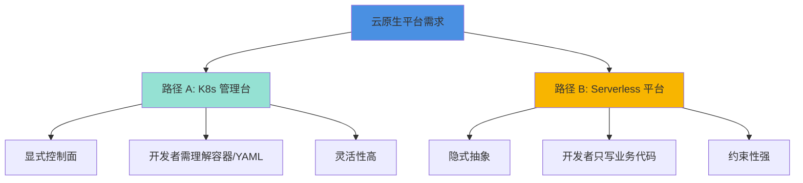
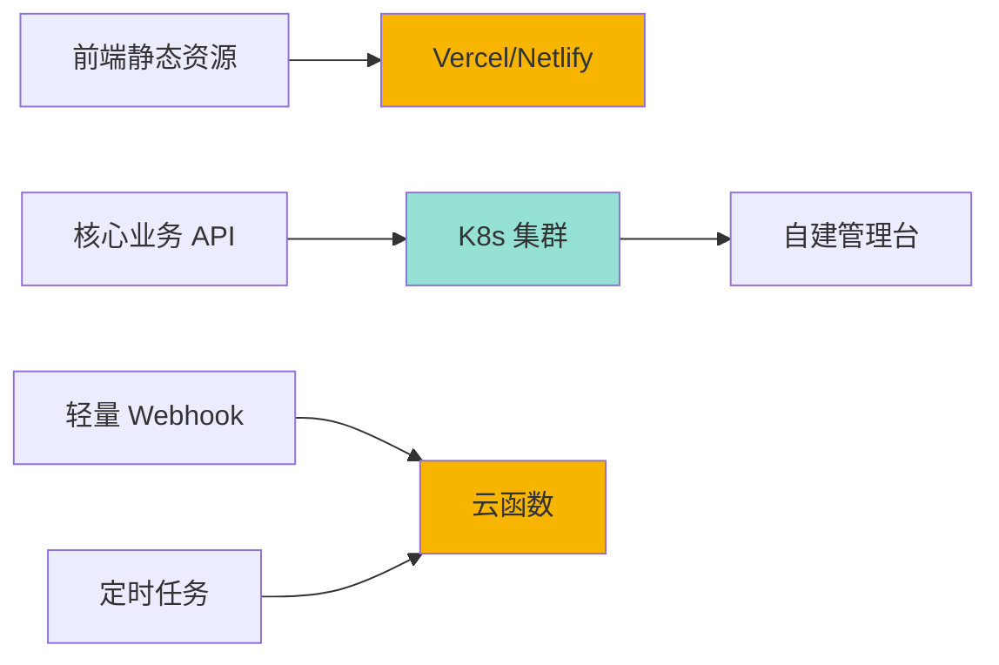

> 本文写于 2026 年 10 月，回溯 2022 年云原生平台技术路线选择的思考与权衡。

2022 年夏天，当团队决定自建云原生平台时，摆在面前的是两条截然不同的技术路线：是深度定制一个 Kubernetes 管理控制台，还是直接构建 Serverless 应用平台？这不仅是技术选型问题，更是对团队能力、业务场景、长期演进方向的综合判断。

回看当时的选择，两条路各有其合理性，也各有其代价。

<!-- more -->

## 岔路口：两种平台哲学

在讨论 K8s 管理台的产品与工程边界时（见前一篇），我们关注的是「如何管理已有的容器化应用」。但在 2022 年，另一个更根本的问题浮现：**开发者到底应该感知 Kubernetes 吗？**



### 路径 A：K8s 管理台的显式控制

这条路径的代表有 Rancher、KubeSphere、国内的 Pixiu、Kuboard 等。核心理念是：

- **保留 Kubernetes 原语**：Deployment、Service、Ingress 等概念依然存在
- **提供可视化层**：通过界面降低 YAML 编写和 kubectl 操作的门槛
- **增强运维能力**：日志聚合、监控告警、权限管理、多集群统一视图

开发者在这条路径下，依然需要理解：什么是 Pod、什么是 Namespace、什么是资源限额。平台做的是**降低操作成本**，而非**屏蔽底层概念**。

### 路径 B：Serverless 平台的隐式抽象

这条路径的代表有 Vercel、Netlify、国内的 laf、Zeabur 等。核心理念截然不同：

- **隐藏基础设施**：开发者不需要知道容器、集群、副本数
- **函数/应用为中心**：直接部署代码，平台自动处理运行时环境
- **按需付费模型**：冷启动、自动扩缩、按调用计费

开发者在这条路径下，理想状态是「像写博客一样写后端」——专注业务逻辑，基础设施全部托管。

## 技术权衡：两条路的深层差异

### 控制面 vs 数据面的边界

**K8s 管理台**需要同时处理控制面和数据面：

```yaml
# 控制面操作：创建 Deployment
apiVersion: apps/v1
kind: Deployment
metadata:
  name: api-server
spec:
  replicas: 3
  template:
    spec:
      containers:
      - name: app
        image: registry.example.com/api:v1.2.3
        resources:
          limits:
            memory: "512Mi"
            cpu: "500m"

---
# 数据面配置：Service 与 Ingress
apiVersion: v1
kind: Service
metadata:
  name: api-server
spec:
  ports:
  - port: 80
    targetPort: 8080
```

平台需要暴露控制面的操作（创建、更新、删除），也要处理数据面的配置（网络、存储、监控）。

**Serverless 平台**则试图隐藏这一切：

```javascript
// laf 风格：直接定义云函数
export default async function (ctx) {
  const { name } = ctx.query
  return { message: `Hello, ${name}!` }
}

// 开发者不需要关心：
// - 容器镜像构建
// - 副本数与扩缩容
// - 负载均衡配置
```

### YAML 地狱与心智负担

| 维度 | K8s 管理台 | Serverless 平台 |
|-----|-----------|----------------|
| **配置复杂度** | 高：Deployment、Service、ConfigMap、Secret、HPA... | 低：函数代码 + 少量环境变量 |
| **学习曲线** | 陡峭：需理解容器、编排、网络 | 平缓：专注业务代码 |
| **调试体验** | 复杂：跨多层日志（容器、K8s、应用） | 简单：函数日志直接可见 |
| **排障难度** | 高：Pod 状态、Event、资源限额... | 低：但黑盒问题难定位 |

Serverless 的最大价值在于**降低心智负担**。开发者不需要成为运维专家，就能部署生产级应用。

但代价是**失去细粒度控制**：当冷启动不可接受、需要特定网络拓扑、或要优化资源利用率时，Serverless 的抽象反而成为障碍。

### CRD/Operator：扩展性的两种实现

**K8s 管理台的扩展路径**是 CRD（Custom Resource Definition）和 Operator：

```yaml
# 定义自定义资源
apiVersion: platform.example.com/v1
kind: Application
metadata:
  name: my-app
spec:
  runtime: nodejs16
  scaling:
    minReplicas: 2
    maxReplicas: 10
  routes:
  - domain: api.example.com
    path: /v1
```

通过 CRD，可以在 Kubernetes 之上构建更高层次的抽象。但这要求：

- 团队有能力开发和维护 Operator
- 运维人员理解 CRD 的生命周期管理
- 与原生 K8s 资源共存时不产生冲突

**Serverless 平台的扩展路径**是插件和中间件：

```javascript
// laf 的云函数可以使用中间件
import { useDatabase, useStorage } from '@/cloud'

export default async function (ctx) {
  const db = useDatabase()
  const result = await db.collection('users').find()
  return result
}
```

平台提供标准化的运行时和能力注入，开发者通过组合来扩展功能。

### 多租户与资源隔离

**K8s 管理台的多租户**通常基于 Namespace：

- **优势**：原生支持、资源隔离清晰、审计日志完善
- **劣势**：租户间网络隔离复杂（NetworkPolicy）、资源配额管理精细度有限

**Serverless 平台的多租户**往往是应用层实现：

- **优势**：可以更灵活地按用户/项目/环境隔离
- **劣势**：需要自行实现计量、限流、配额管理

一个典型的矛盾场景：租户 A 的函数冷启动拖慢了租户 B 的请求——Serverless 平台需要在共享资源池和隔离性之间权衡。

## 工程边界：何时选择哪条路

### 选择 K8s 管理台的场景

适合以下团队和场景：

✅ **已有容器化实践**：团队对 Docker、Kubernetes 有一定认知基础  
✅ **需要精细控制**：对资源利用率、网络拓扑、存储方案有特殊要求  
✅ **多环境管理**：需要统一管理开发/测试/生产多个集群  
✅ **长期演进**：业务复杂度会持续增长，需要灵活扩展能力

典型案例：

- **中大型后端团队**：微服务架构，服务间依赖复杂
- **数据密集型应用**：需要精细配置存储、网络、GPU 资源
- **金融/政务场景**：对安全隔离、审计合规有严格要求

### 选择 Serverless 平台的场景

适合以下团队和场景：

✅ **快速迭代需求**：创业团队、MVP 验证阶段  
✅ **简单后端服务**：CRUD API、Webhook、定时任务  
✅ **前端工程师主导**：团队缺乏专职运维人员  
✅ **成本敏感**：流量不稳定，希望按实际使用付费

典型案例：

- **全栈 Solo 开发者**：一个人搞定前后端，没精力管理基础设施
- **营销活动后端**：流量波动大，平时几乎无流量
- **开源项目托管**：个人项目、Side Project，不想为服务器付费

### 混合路径：务实的中间地带

2022 年的选择未必是非黑即白。一些团队选择了**混合架构**：



- **前端和静态资源**：托管在 Vercel/Netlify，享受 CDN 和自动部署
- **核心业务后端**：部署在自建 K8s 集群，保留完全控制权
- **边缘场景**：Webhook、定时任务用云函数，降低维护成本

这种方案的关键是**清晰的边界划分**：哪些是核心资产（必须自建），哪些是边缘能力（可以外包）。

## 四年后的观察：演进的方向

### Serverless 的成熟与边界扩展

2022 年，Serverless 主要用于无状态函数。到 2026 年：

- **边缘计算**：Cloudflare Workers、Deno Deploy 的崛起
- **有状态 Serverless**：持久化连接、WebSocket、长时任务支持
- **全栈框架**：Next.js、Remix 等框架深度整合 Serverless
- **数据库集成**：Serverless 数据库（PlanetScale、Neon）消除最后一块基础设施

但冷启动延迟、厂商锁定依然是长期挑战。

### K8s 管理台的简化与标准化

另一方面，K8s 管理台也在朝「降低门槛」方向演进：

- **更高层抽象**：从 Helm Chart 到 KubeVela、Crossplane
- **GitOps 成熟**：ArgoCD、Flux 成为主流部署方式
- **多云统一**：跨 AWS、Azure、阿里云的统一控制面
- **FinOps 集成**：成本可视化与优化建议

但复杂度的本质并未消失，只是转移到了不同层次。

## 选择之外：组织与能力

四年后回看，技术选择的背后是**组织能力**的映射：

| 选择 | 需要的组织能力 |
|-----|-------------|
| **自建 K8s 平台** | 专职运维团队、持续投入平台开发、培训体系建设 |
| **Serverless 外包** | 业务抽象能力、供应商管理、成本控制意识 |
| **混合架构** | 架构决策能力、边界清晰、跨团队协作 |

一个残酷的事实是：选择 K8s 管理台的团队，往往低估了**平台持续演进的成本**。第一版上线只是开始，后续的迭代、培训、推广、问题响应，才是真正的挑战。

而选择 Serverless 的团队，则可能在某个时刻发现：**当你的业务规模突破平台的抽象边界时，迁移成本可能大于当初自建的成本**。

## 尾声：没有银弹，只有权衡

2022 年的那个夏天，团队最终选择了自建 K8s 管理台。原因不是技术上更优，而是：

- 团队已有 Kubernetes 经验积累
- 业务对资源控制和成本优化有明确要求
- 愿意为长期能力建设投入

但如果是今天，面对相同的场景，也许答案会不同。Serverless 生态的成熟度、边缘计算的普及、AI 原生应用的崛起，都在重新定义「平台」的边界。

技术选择没有标准答案，只有**在当时的约束条件下，最合理的权衡**。

重要的不是选择了哪条路，而是**理解每条路的代价，并为之付出相应的努力**。

---

## 扩展阅读

- [CNCF Serverless 白皮书 2022](https://github.com/cncf/wg-serverless/blob/master/whitepapers/serverless-overview/cncf_serverless_whitepaper_v1.0.pdf)
- [KubeVela：云原生应用交付的统一抽象](https://kubevela.io/docs/)
- [laf 开源项目：像写博客一样写函数](https://github.com/labring/laf)
- [Crossplane：Kubernetes 之上的控制面抽象](https://www.crossplane.io/)
- [Platform Engineering：DevOps 的下一站？](https://platformengineering.org/blog/what-is-platform-engineering)

---

*本文是「时间线回溯」系列 C 的第二篇，延续 K8s 管理台的讨论，对照 Serverless 平台的技术路线选择。所有示意图使用 Mermaid 绘制。*
