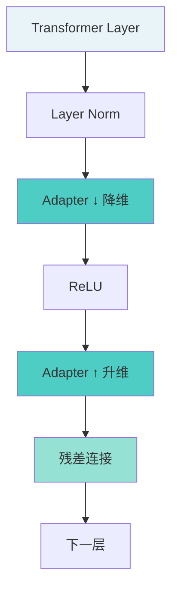
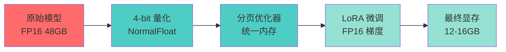
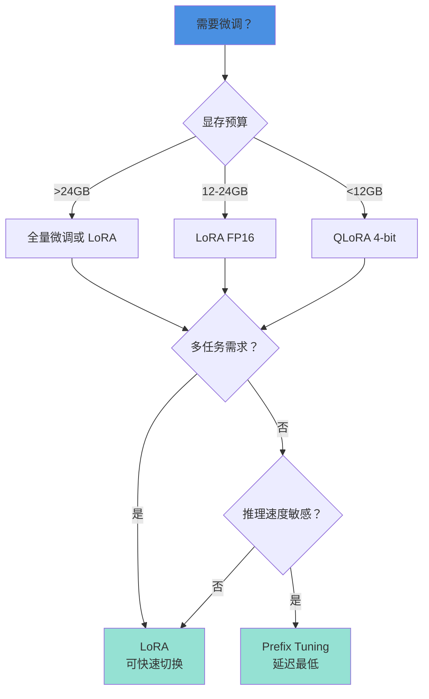

> 本文写于 2026 年 10 月，回溯 2023 年 5 月前后 ChatGLM 时代高效微调技术的工程实践与边界。

2023 年上半年，当本地知识库的热潮刚刚涌起，很快就有人发现了下一个问题：RAG 能让模型「读」到业务文档，但无法让模型真正「学会」业务规则和特定风格——6B 模型在理解复杂指令、生成结构化输出、遵循特定格式时，总是差那么一口气。

那时的技术选择很直接：微调。但全量微调一个 6B 模型需要 24GB+ 显存，这让大多数只有单张 3090 的团队望而却步。幸运的是，2023 年正是 PEFT（Parameter-Efficient Fine-Tuning）技术从学术走向工程的关键年份——LoRA、QLoRA、Prefix Tuning 等方法让我们用 1/10 的显存，在多数指令和格式任务上接近了可用标准。

三年后回头看，那些在显存和效果之间反复权衡的经验，恰好勾勒出了高效微调的工程边界。

<!-- more -->

## 问题：为什么 6B 模型需要微调

### 从 RAG 到微调的临界点

在上一篇[「本地知识库」](/2026/09/30/local-rag-knowledge-base-retrospective/)中，我们用检索增强生成（RAG）解决了知识更新的问题，但很快就碰到了 RAG 的三个天花板：

1. **格式控制难**：要求输出 JSON，模型总是多一个字段或少一个逗号
2. **风格不一致**：客服话术要温和，技术文档要严谨，单靠 Prompt 难以稳定
3. **推理能力弱**：多步骤任务（如「先分类再生成」）容易丢步骤

这些问题的共同特征是：**需要模型「内化」规则，而不是临时「检索」规则**。

### 全量微调的成本现实

2023 年全量微调 ChatGLM-6B 的硬件门槛：

| 训练方式 | 显存需求 | 训练速度 | 硬件成本 |
|---------|---------|---------|---------|
| FP32 全量微调 | ~96GB | 不可行 | 需要 4×A100 |
| FP16 全量微调 | ~48GB | 1-2 小时（1000 样本） | 需要 2×A100 或 A100-80GB |
| FP16 + Gradient Checkpointing | ~24GB | 3-4 小时 | 单张 A100 或 3090 × 2 |
| INT8 全量微调 | ~12GB | 5-6 小时 | 单张 3090 勉强可行 |

**现实困境**：大多数团队只有单张 3090（24GB），全量微调几乎不可能；云服务器 A100 的成本是 ¥20-30/小时，小规模实验都要数百元。

这就是 PEFT 技术崛起的土壤——用更少的资源完成更聪明的微调。

## 高效微调的三种思路

### 1. LoRA：在权重矩阵上开小路

LoRA（Low-Rank Adaptation）的核心直觉是：模型微调时，权重矩阵的「有效变化」其实是低秩的（可以用两个小矩阵的乘积近似）。

```python
# 传统全量微调：更新所有参数
W_new = W_original + ΔW  # ΔW 是 (d × d) 的大矩阵

# LoRA：用两个小矩阵近似 ΔW
ΔW ≈ A × B  # A 是 (d × r)，B 是 (r × d)，r << d

# 实际实现（伪代码）
class LoRALayer(nn.Module):
    def __init__(self, original_layer, rank=8):
        self.original = original_layer  # 冻结
        self.lora_A = nn.Linear(d, rank, bias=False)
        self.lora_B = nn.Linear(rank, d, bias=False)
        
    def forward(self, x):
        return self.original(x) + self.lora_B(self.lora_A(x))
```

**典型配置（2023 年实践）**：

- **Rank (r)**：通常设为 8-16，越小越省显存，但效果会下降
- **目标模块**：只对 Attention 的 Q、V 矩阵加 LoRA（约占全部参数的 30%）
- **显存占用**：仅训练 0.1%-1% 的参数，显存降低到全量微调的 1/3

### 2. Adapter：在层之间插小网络

Adapter 的思路更直接：在 Transformer 每层的输出后插入一个小型神经网络（通常是降维-激活-升维）。



**工程特点**：

- **参数量**：每层 Adapter 约 0.5M-2M 参数（总共 1%-3% 额外参数）
- **推理开销**：需要真正插入层中，推理时有额外计算（但通常 <5% 延迟）
- **适用场景**：多任务场景（可以为不同任务训练不同 Adapter）

### 3. Prefix Tuning：在输入序列前加可学习向量

Prefix Tuning 不改变模型结构，而是在输入序列前拼接一组「虚拟 tokens」，只训练这些 token 的 Embedding。

```python
# 概念示意
def prefix_tuning(input_ids, prefix_length=10):
    # prefix_embeddings: (prefix_length, hidden_dim)，可学习
    prefix_embeddings = learn_prefix()  
    
    # input_embeddings: (seq_length, hidden_dim)
    input_embeddings = embedding_layer(input_ids)
    
    # 拼接后送入模型
    full_input = torch.cat([prefix_embeddings, input_embeddings], dim=0)
    return model(full_input)
```

**实践经验**：

- **Prefix 长度**：通常 10-20 个 tokens（太长影响推理速度）
- **显存占用**：最省（只训练 Prefix 的参数）
- **效果局限**：对复杂任务效果不如 LoRA

## QLoRA：显存优化的极限探索

2023 年 5 月，华盛顿大学发布的 QLoRA 论文让单张消费级显卡微调 65B 模型成为可能。

### 核心技术点



**三大支柱**：

1. **4-bit NormalFloat (NF4)**：专为神经网络权重分布设计的量化格式
2. **Double Quantization**：连量化参数本身也量化，再省 0.5GB
3. **Paged Optimizers**：利用 NVIDIA 统一内存，显存不够时用 CPU 内存顶上

### 社区常见显存量级（示意）

| 模型 | 全量 FP16 | LoRA FP16 | QLoRA 4-bit |
|------|-----------|-----------|-------------|
| ChatGLM-6B | 48GB | 16GB | **9GB** |
| LLaMA-13B | 96GB | 32GB | **16GB** |
| LLaMA-65B | 480GB | 160GB | **48GB** |

**代价**：训练速度比 LoRA 慢 20%-30%，精度损失通常可接受，需用验证集实测。

## 显存与数据：微调的两个维度

### 显存预算表（ChatGLM-6B，batch_size=1）

| 方法 | 可训练参数比例 | 显存占用 | 适用硬件 |
|------|--------------|---------|---------|
| 全量 FP16 | 100% | ~48GB | A100-80GB |
| 全量 INT8 | 100% | ~24GB | A100-40GB / 3090×2 |
| LoRA (r=8) | ~0.3% | ~12GB | 单张 3090 |
| QLoRA (4-bit) | ~0.3% | ~6GB | 单张 2080Ti |
| Prefix (len=20) | ~0.05% | ~4GB | 单张 1080Ti |

### 数据量与效果的非线性关系

2023 年社区的经验共识：

```python
# 数据量与效果的经验曲线
效果提升 = {
    "100-500 样本": "显著（对特定任务格式、风格）",
    "500-2000 样本": "稳定（泛化到同类任务）",
    "2000-10000 样本": "边际递减（需要更多样性）",
    "10000+ 样本": "接近全量微调（但此时已无必要）"
}

# 实际建议
if 任务单一 and 格式固定:
    样本量 = 100-300  # 客服话术、格式化输出
elif 任务多样 and 需要泛化:
    样本量 = 1000-3000  # 通用指令微调
else:
    考虑其他方案  # 可能不适合微调
```

## 评估陷阱：过拟合与泛化的平衡

### 陷阱一：在训练集上看起来完美

```python
# 错误的评估方式
train_loss_curve = [3.2, 1.8, 0.9, 0.3, 0.1]  # 看起来很好！
# 但实际上...
validation_loss = 2.5  # 已经过拟合了

# 典型症状
- 模型能完美复述训练样本
- 但对新样本稍微变化就答不上来
- 输出格式固化（连标点符号都一模一样）
```

**解决方向**：

- 始终保留 10%-20% 验证集（且确保分布一致）
- 早停策略（validation loss 不再下降时停止）
- 使用 Dropout（LoRA 层也可以加 Dropout）

### 陷阱二：忽视推理速度

PEFT 方法的推理性能对比：

| 方法 | 参数加载 | 推理延迟 | 多任务切换 |
|------|---------|---------|-----------|
| 全量微调 | 完整模型（6B） | 基准速度 | 需要重新加载模型 |
| LoRA | 基座 + 适配器（总共 6.01B） | +2%-5% | **秒级切换**（只换适配器） |
| Adapter | 基座 + 适配器（6.1B） | +5%-10% | 秒级切换 |
| Prefix | 基座 + Prefix（6.001B） | +1%-3% | 瞬时切换 |

**实际选择**：如果有多任务需求（如同一个客服机器人要切换不同业务线风格），LoRA 是最佳选择。

### 陷阱三：遗忘灾难（Catastrophic Forgetting）

```python
# 场景：微调前
model("写一首诗") -> "春眠不觉晓，处处闻啼鸟..."  # 正常

# 微调后（只用了客服对话数据）
model("写一首诗") -> "您好，请问有什么可以帮您？"  # 🤦

# 原因：模型忘记了预训练阶段学到的通用能力
```

**解决方向**：

- 训练数据要多样化（不能只有单一任务）
- 降低学习率（1e-5 到 5e-5，别用 1e-4）
- 使用正则化（LoRA 的权重 decay）

## 公共工具链：2023 年的开源生态

### Hugging Face PEFT 库

```python
from peft import LoraConfig, get_peft_model

# 三行代码启用 LoRA
lora_config = LoraConfig(
    r=8,  # Rank
    lora_alpha=32,  # 缩放因子
    target_modules=["query_key_value"],  # ChatGLM 的 Attention 模块
    lora_dropout=0.1,
    bias="none"
)

model = get_peft_model(base_model, lora_config)
print(f"可训练参数：{model.num_parameters() / 1e6:.2f}M")
# 输出：可训练参数：2.36M（仅 0.4% 的全部参数）
```

### 社区微调框架

2023 年常见的 ChatGLM 微调方案：

```python
# 伪代码示意（综合多个开源项目的思路）
def train_chatglm_with_lora(
    model_name="THUDM/chatglm-6b",
    data_path="data.jsonl",
    lora_rank=8,
    batch_size=4,
    epochs=3
):
    # 1. 加载基座模型（INT8 量化）
    model = AutoModel.from_pretrained(
        model_name,
        trust_remote_code=True
    ).half().quantize(8)
    
    # 2. 注入 LoRA
    model = inject_lora(model, rank=lora_rank)
    
    # 3. 准备数据
    dataset = load_instruction_dataset(data_path)
    # 格式：{"instruction": "...", "input": "...", "output": "..."}
    
    # 4. 训练（只更新 LoRA 参数）
    trainer = Trainer(
        model=model,
        train_dataset=dataset,
        args=TrainingArguments(
            learning_rate=5e-5,
            num_train_epochs=epochs,
            per_device_train_batch_size=batch_size,
            gradient_accumulation_steps=4,  # 模拟 batch_size=16
            save_steps=100,
            logging_steps=10
        )
    )
    trainer.train()
    
    # 5. 保存 LoRA 权重（仅 10-50MB）
    model.save_pretrained("output/chatglm-lora")
```

### 数据格式的事实标准

2023 年社区逐渐统一的指令微调数据格式（Alpaca 格式）：

```json
[
  {
    "instruction": "将下列句子翻译成英文",
    "input": "今天天气很好",
    "output": "The weather is nice today."
  },
  {
    "instruction": "生成一段客服回复",
    "input": "用户问：我的订单什么时候发货？",
    "output": "您好，我马上为您查询订单物流信息，请稍等。"
  }
]
```

## 实践清单：2023 年的微调决策树



**快速决策参考**：

| 你的场景 | 推荐方案 | 样本量 | 预计训练时间 |
|---------|---------|-------|-------------|
| 客服对话（固定格式） | QLoRA (r=8) | 200-500 | 1-2 小时（3090） |
| 指令遵循（多任务） | LoRA (r=16) | 1000-3000 | 3-5 小时（3090） |
| 代码生成（特定风格） | LoRA (r=8) | 500-1500 | 2-4 小时（3090） |
| 多业务线（需切换） | LoRA + Adapter | 每业务 300-500 | 按业务累加 |

## 延伸阅读与参考资源

**核心论文（2023 年必读）**

- [LoRA: Low-Rank Adaptation of Large Language Models (2021)](https://arxiv.org/abs/2106.09685) — 微软研究院的开创性工作
- [QLoRA: Efficient Finetuning of Quantized LLMs (2023)](https://arxiv.org/abs/2305.14314) — 华盛顿大学的显存优化极限
- [Parameter-Efficient Transfer Learning for NLP (2019)](https://arxiv.org/abs/1902.00751) — Adapter 方法的起源

**开源工具（2023 年主流选择）**

- [Hugging Face PEFT](https://github.com/huggingface/peft) — 统一的 PEFT 方法库
- [bitsandbytes](https://github.com/TimDettmers/bitsandbytes) — QLoRA 依赖的量化库
- [ChatGLM-6B](https://github.com/THUDM/ChatGLM-6B) — 清华智谱的中文基座模型

**社区项目（参考思路，不背书具体实现）**

- 各类 `ChatGLM-Efficient-Tuning` / `ChatGLM-LoRA` 前缀的开源项目
- LangChain 和 LlamaIndex 的微调集成示例

**工程博客**

- [Hugging Face: PEFT Methods Explained](https://huggingface.co/docs/peft/index)
- [Sebastian Raschka: Practical Tips for LLM Finetuning](https://magazine.sebastianraschka.com/)

---

## 写在最后

2023 年的高效微调热潮，本质上是「算力约束下的智慧」——当我们无法用 8 张 A100 全量微调 65B 模型时，LoRA 和 QLoRA 让单张 3090 也能在多数任务上接近可用标准。

三年后的今天，商用 API 的微调服务已经普及（OpenAI、Claude 都支持），开源模型的基座能力也强得多（Qwen-2.5、LLaMA-3），但「参数高效」的思想并没有过时——它不仅适用于资源受限的环境，也适用于多任务快速切换、个性化定制、边缘设备部署等场景。

那些年我们在 Rank 选择上的反复实验、在显存和精度之间的艰难权衡、在评估指标上踩过的坑——这些经验不仅适用于 6B 模型，也适用于今天的 70B、400B 模型，以及未来任何需要「定制」的 AI 系统。

**工程的本质，永远是在约束中找到最优解；而优雅的工程，是让约束本身成为创新的动力。**

---

*本文所有架构图使用 Mermaid 绘制，技术方案基于 2023 年的真实实践，工具版本信息已根据 2026 年现状更新。文中提及的开源项目和论文均为公开资源。*
