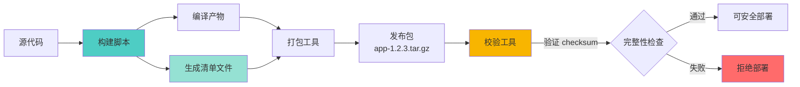
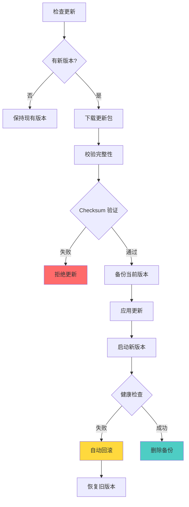

> 本文写于 2026 年 10 月，回溯 2020 年前后构建发布打包与增量更新工具链时的工程思考。当系统从「本地能跑」走向「可重复交付」，版本管理、产物校验、更新策略这些看似琐碎的工具问题，恰恰定义了工程的交付边界。

2020 年秋，在做完秒杀系统和 Netty 聊天服务端练习后，遇到了一个更务实的问题：**如何把这些「能跑的 Demo」交付给其他人？**

研途末期转后端那阵子，很多练手项目都停留在「本地 IDE 里 Run 一下」的状态。一旦涉及到部署到测试环境、打包给他人使用、或者后续迭代更新，就会陷入一堆琐碎问题：依赖缺失、配置文件路径写死、版本混乱、更新覆盖不完整……

<!-- more -->

## 一、问题边界：为什么「能跑」不等于「能交付」

### 本地开发与生产交付的鸿沟

| 维度 | 本地开发 | 生产交付 |
|------|---------|---------|
| **环境** | IDE 配置好的环境 | 全新机器，缺少依赖 |
| **路径** | 绝对路径随意写 | 需要可配置的相对路径 |
| **依赖** | 本地 Maven 仓库有缓存 | 需要明确声明所有依赖 |
| **版本** | 不关心版本号 | 必须有清晰的版本标识 |
| **更新** | 删除重装 | 需要增量更新、回滚能力 |
| **验证** | 手动测试一下 | 需要自动化校验完整性 |

2020 年那时，开源生态已经很成熟了——Python 有 `pip` + `setup.py`、Node.js 有 `npm` + `package.json`、Java 有 Maven/Gradle——但自己写的小工具、内部服务，往往没有完整的打包发布流程。

**核心矛盾**：

> 你花 80% 时间写业务逻辑，但最后 20% 的「如何交付」问题，可能消耗你另外 50% 的时间。

## 二、版本管理：语义化版本与发布清单

### 语义化版本号（Semantic Versioning）

这是开源社区的事实标准（[semver.org](https://semver.org/lang/zh-CN/)）：

```
主版本号.次版本号.修订号

示例：1.2.3
  ↓   ↓  ↓
  |   |  └─ Patch：向后兼容的问题修复
  |   └──── Minor：向后兼容的功能新增
  └──────── Major：不兼容的 API 变更
```

**实践原则**：

- **初始开发**：`0.y.z` 表示不稳定版本，API 随时可能变化
- **首次发布**：`1.0.0` 标志着公开 API 稳定
- **后续迭代**：根据变更类型递增相应位

### 发布清单（Manifest）

每个发布包应该包含一个**元数据文件**，记录这次发布的关键信息：

```json
{
  "name": "my-service",
  "version": "1.2.3",
  "build_time": "2020-10-15T14:30:00Z",
  "commit_sha": "a3f5c2d",
  "dependencies": {
    "netty": "4.1.52.Final",
    "redis-client": "3.3.0"
  },
  "files": [
    {
      "path": "bin/server.jar",
      "size": 15728640,
      "checksum": "sha256:e3b0c44298fc1c149afbf4c8996fb92427ae41e4649b934ca495991b7852b855"
    },
    {
      "path": "config/application.yml",
      "size": 512,
      "checksum": "sha256:..."
    }
  ]
}
```

**清单的作用**：

1. **版本追溯**：出问题时能快速定位是哪个版本
2. **完整性校验**：通过 checksum 验证文件是否损坏
3. **依赖审计**：清楚知道依赖了哪些第三方库
4. **增量更新**：对比新旧清单，只下载变化的文件



## 三、发布包的边界设计

### 全量包 vs 增量包

| 类型 | 内容 | 适用场景 | 优缺点 |
|------|------|---------|--------|
| **全量包** | 完整的可运行环境 | 首次安装、大版本升级 | 体积大（几十 MB），但状态确定 |
| **增量包** | 只包含变更的文件 | 日常小版本更新 | 体积小（几 KB），但依赖基线版本 |

**增量包的关键信息**：

```json
{
  "name": "my-service-patch",
  "version": "1.2.4",
  "base_version": "1.2.3",  // 必须从这个版本升级
  "type": "incremental",
  "changes": [
    {
      "action": "update",
      "path": "bin/server.jar",
      "checksum": "sha256:..."
    },
    {
      "action": "delete",
      "path": "lib/deprecated.jar"
    },
    {
      "action": "add",
      "path": "config/new-feature.yml",
      "checksum": "sha256:..."
    }
  ]
}
```

### 打包脚本示例（伪代码）

```bash
#!/bin/bash
# build-release.sh

VERSION=$1
COMMIT=$(git rev-parse --short HEAD)
BUILD_DIR="build/release-${VERSION}"

# 1. 清理旧产物
rm -rf ${BUILD_DIR}
mkdir -p ${BUILD_DIR}

# 2. 编译构建
mvn clean package -DskipTests

# 3. 收集产物
cp target/app.jar ${BUILD_DIR}/bin/
cp -r config ${BUILD_DIR}/
cp README.md ${BUILD_DIR}/

# 4. 生成 checksum
cd ${BUILD_DIR}
find . -type f -exec sha256sum {} \; > checksums.txt

# 5. 生成清单
cat > manifest.json <<EOF
{
  "version": "${VERSION}",
  "commit": "${COMMIT}",
  "build_time": "$(date -u +%Y-%m-%dT%H:%M:%SZ)"
}
EOF

# 6. 打包
cd ..
tar -czf app-${VERSION}.tar.gz release-${VERSION}/

echo "✅ 发布包已生成: app-${VERSION}.tar.gz"
```

## 四、更新策略：安全可靠的自动更新

### 更新工具的职责边界

一个合格的更新工具应该处理：



### 关键设计决策

**1. 原子性更新**

避免更新到一半程序崩溃，导致新旧版本混杂：

```python
# 错误做法：直接覆盖
shutil.copy("new_app.jar", "/opt/app/server.jar")  # 中途断电就完了

# 正确做法：原子替换
shutil.copy("new_app.jar", "/opt/app/server.jar.new")
os.rename("/opt/app/server.jar.new", "/opt/app/server.jar")  # 原子操作
```

**2. 回滚能力**

```bash
# 备份旧版本
mv /opt/app /opt/app.backup-$(date +%s)

# 解压新版本
tar -xzf app-1.2.4.tar.gz -C /opt/

# 测试新版本
/opt/app/bin/healthcheck.sh

# 如果失败，回滚
if [ $? -ne 0 ]; then
    rm -rf /opt/app
    mv /opt/app.backup-* /opt/app
    echo "❌ 更新失败，已回滚"
    exit 1
fi
```

**3. 多阶段更新**

对于复杂系统，分阶段更新可以减少风险：

| 阶段 | 操作 | 回滚点 |
|------|------|--------|
| Stage 1 | 下载并校验 | 可随时取消 |
| Stage 2 | 备份现有版本 | 可恢复备份 |
| Stage 3 | 更新配置文件 | 可回退配置 |
| Stage 4 | 替换二进制文件 | 可回滚二进制 |
| Stage 5 | 重启服务 | 可降级到旧版本 |

### 差分更新的实现思路

对于大文件（如视频编辑软件的几 GB 安装包），可以使用**二进制差分**：

```bash
# 生成差分包（使用 bsdiff 工具）
bsdiff old_app.jar new_app.jar patch.bsdiff

# 应用差分包
bspatch old_app.jar new_app.jar patch.bsdiff
```

**差分算法对比**：

| 算法 | 压缩率 | 速度 | 适用场景 |
|------|--------|------|---------|
| **bsdiff** | 高（几 MB → 几 KB） | 慢 | 二进制文件（exe、jar） |
| **rsync** | 中等 | 快 | 文本文件、配置 |
| **xdelta** | 中等 | 中等 | 通用场景 |

## 五、小工具哲学：单一职责与可组合性

2020 年那时逐渐意识到，好的工程工具应该遵循 **Unix 哲学**：

### 核心原则

1. **单一职责**：一个工具只做一件事，做好它
   - ❌ 不好：`deploy.sh` 同时负责打包、上传、部署、监控
   - ✅ 好：`build.sh`（打包）+ `upload.sh`（上传）+ `deploy.sh`（部署）+ `monitor.sh`（监控）

2. **可脚本化**：工具应该能被其他脚本调用
   - ❌ 不好：GUI 工具需要手动点击
   - ✅ 好：命令行工具，支持参数传递

3. **幂等性**：重复执行同一操作，结果一致
   ```bash
   # 幂等的部署脚本
   deploy.sh v1.2.3  # 第一次部署
   deploy.sh v1.2.3  # 再执行一次，结果相同，不会重复安装
   ```

4. **可审计**：每次操作留下日志
   ```log
   [2020-10-15 14:30:00] INFO: 开始更新到版本 1.2.4
   [2020-10-15 14:30:05] INFO: 下载完成，校验 checksum: OK
   [2020-10-15 14:30:10] INFO: 备份旧版本到 /backup/app-1.2.3
   [2020-10-15 14:30:15] INFO: 应用更新...
   [2020-10-15 14:30:20] INFO: 健康检查: PASS
   [2020-10-15 14:30:25] INFO: 更新完成
   ```

### 工具清单示例

一个完整的发布工具链可能包含：

```
tools/
├── build.sh              # 编译构建
├── generate-manifest.sh  # 生成清单文件
├── create-package.sh     # 打包（全量/增量）
├── verify-package.sh     # 校验完整性
├── upload.sh             # 上传到 CDN/对象存储
├── deploy.sh             # 部署到目标机器
├── rollback.sh           # 回滚到指定版本
└── healthcheck.sh        # 健康检查
```

每个脚本：

- **输入明确**：通过命令行参数传入版本号、路径等
- **输出可预测**：成功返回 0，失败返回非 0
- **日志清晰**：关键步骤打印日志，方便排查问题

## 六、工程清单：发布管理的最佳实践

基于 2020 年的摸索和后来的实践，总结以下清单：

### 设计阶段

- [ ] **版本策略**：采用语义化版本号，定义版本递增规则
- [ ] **包类型**：明确哪些场景用全量包，哪些用增量包
- [ ] **校验机制**：选择合适的哈希算法（SHA-256、MD5）
- [ ] **更新策略**：强制更新还是可选更新？支持跳版本吗？

### 实现阶段

- [ ] **清单生成**：自动生成包含版本、依赖、文件列表的清单
- [ ] **完整性校验**：打包后验证 checksum，部署前再次验证
- [ ] **备份机制**：更新前备份旧版本，保留最近 N 个版本
- [ ] **回滚脚本**：提供一键回滚能力，测试回滚流程

### 测试阶段

- [ ] **更新测试**：从 v1.0 → v1.1 → v1.2，测试连续更新
- [ ] **跳版本测试**：v1.0 → v1.5，测试跨版本更新
- [ ] **失败模拟**：中途断网、磁盘满、权限不足等异常场景
- [ ] **回滚验证**：更新失败后自动回滚，验证数据不丢失

### 生产运维

- [ ] **发布日志**：记录每次发布的版本、时间、操作人
- [ ] **灰度发布**：先更新 1% 用户，观察无异常再全量
- [ ] **监控告警**：更新失败率、回滚次数、健康检查失败
- [ ] **文档维护**：更新日志（Changelog）、已知问题（Known Issues）

## 七、对照开源生态的实践

在构建这些工具时，可以参考成熟的开源方案：

| 场景 | 开源参考 | 核心思想 |
|------|---------|---------|
| **Python 包管理** | pip + wheel | 标准化的包格式（.whl），元数据文件（METADATA） |
| **npm 包管理** | package.json | 依赖版本锁定（package-lock.json） |
| **Docker 镜像** | Dockerfile + 分层存储 | 增量更新（只下载变化的层） |
| **系统更新** | apt / yum | 依赖解析、事务性更新、回滚 |
| **移动应用** | Google Play 增量更新 | bsdiff 二进制差分 |

**核心共性**：

1. **清单文件**：所有工具都有元数据描述（manifest、package.json、Dockerfile）
2. **校验机制**：SHA 哈希、GPG 签名保证完整性和可信性
3. **增量更新**：大文件通过分层或差分减少传输量
4. **事务性**：更新要么全部成功，要么全部回滚

## 八、与秒杀、长连接的衔接

在前两篇文章中，我们讨论了：

- **[高并发秒杀系统](/2026/09/30/flash-sale-concurrency-engineering-boundary/)**：如何在瞬时流量下保证系统可用性
- **[Netty 长连接服务](/2026/09/30/netty-chat-server-engineering-boundary/)**：如何用有限线程服务海量连接

这两个系统「能跑」之后，下一步就是「能交付」：

- **秒杀系统**：如何打包 Redis 配置、消息队列配置，让测试环境能快速复现？
- **Netty 服务**：如何发布新版本协议，同时保证老客户端兼容性？

**答案**就是这篇文章讨论的发布包与更新工具：

- 通过**语义化版本**管理协议兼容性（Major 版本表示不兼容）
- 通过**增量更新**快速修复 Bug，而不需要重新下载几十 MB 的完整包
- 通过**校验与回滚**保证线上服务的稳定性

从「能跑」到「能交付」，这是工程成熟度的关键跃升。

## 写在最后

2020 年那时，做完几个练手项目后，最大的感触是：

> **写代码很快，但让代码可靠地运行在别人的机器上，需要额外 50% 的工程投入。**

版本号、清单文件、checksum、增量包、回滚脚本……这些看似琐碎的「小工具」，实际上定义了软件交付的边界。

没有它们，系统就永远停留在「开发机上能跑」的状态；有了它们，系统才能走向生产环境，经受真实流量的考验。

**小工具哲学**的核心是：

- 单一职责、可组合、可审计
- 自动化优于手动操作
- 每个脚本都应该是**可重复执行**的

六年后回看，这些原则依然有效——无论是容器化时代的 Kubernetes Operator，还是云原生时代的 GitOps，底层逻辑都是：**把发布和更新变成可编程、可审计、可回滚的流程。**

## 延伸阅读

**标准与规范**：

- [Semantic Versioning 2.0.0](https://semver.org/lang/zh-CN/)：语义化版本号规范
- [Keep a Changelog](https://keepachangelog.com/zh-CN/)：更新日志的最佳实践

**工具与实践**：

- [The Twelve-Factor App](https://12factor.net/zh_cn/)：现代应用的 12 要素（第十条：开发环境与线上环境等价）
- [bsdiff/bspatch 原理](http://www.daemonology.net/bsdiff/)：二进制差分更新算法
- [Python Packaging User Guide](https://packaging.python.org/)：Python 打包的完整教程

**成熟产品参考**：

- [Electron 自动更新机制](https://www.electronjs.org/docs/latest/tutorial/updates)：桌面应用的增量更新
- [Kubernetes Rolling Update](https://kubernetes.io/docs/tutorials/kubernetes-basics/update/update-intro/)：云原生应用的无缝更新

---

*本文所有示意图使用 Mermaid 绘制。代码示例为伪代码，展示核心思想而非特定语言实现。所有技术讨论基于 2020 年前后的工程实践，参考资料均来自公开文档和开源社区。*
