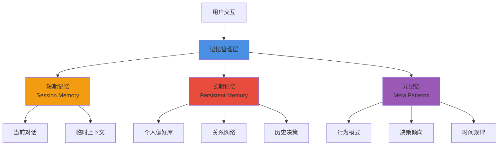
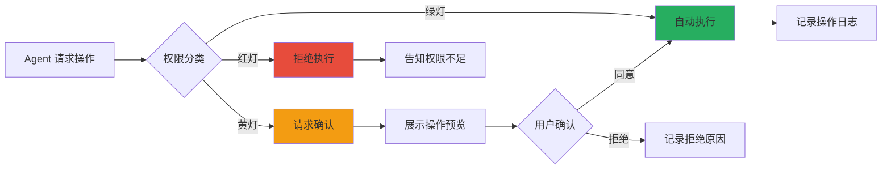
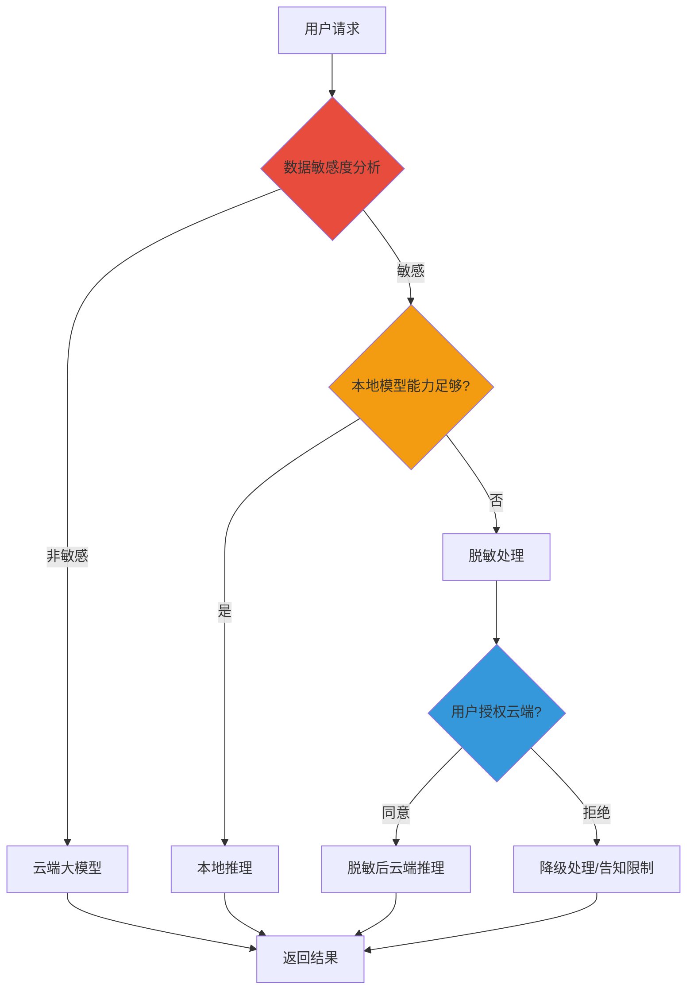

> 本文写于 2026 年 10 月，回溯 2026 年 3 月对个人数字分身产品的技术思考。讨论基于公开技术生态与开源项目，不涉及私有系统。

当 Coding Agent 在 IDE 中展现出强大的代码生成能力时，另一个问题浮现：**能否构建一个「第二个我」——持续学习、理解偏好、代理决策的个人数字分身？**

这类产品在 2025-2026 年有各种尝试名称：Second Me、Personal Agent、Digital Twin，但它们面临的工程挑战高度相似：**如何在隐私、智能、可控之间找到平衡点**。本文整理记忆层设计、人格一致性、权限边界等核心技术问题。

<!-- more -->

## 问题定义：「第二分身」与「编程助手」的本质差异

### 两类 Agent 的能力边界对比

| 维度 | Coding Agent | Second Persona Agent |
|------|-------------|---------------------|
| **任务周期** | 单次会话（分钟-小时） | 持续在线（月-年） |
| **记忆依赖** | 当前项目上下文 | 跨时间个人知识图谱 |
| **决策模式** | 生成建议，用户确认 | 在授权范围内自主执行 |
| **隐私敏感度** | 中（代码可能涉及业务逻辑） | 极高（日程、联系人、偏好） |
| **人格要求** | 工具属性，无需人格 | 需要稳定人格以建立信任 |
| **适用场景** | 垂直领域（代码、文档） | 横跨生活全场景 |

### 真实场景的技术诉求

想象这样的使用场景：

**场景 1：主动提醒与优先级排序**
- 早上 7:30，Agent 综合日历、邮件、代办事项，推送：「今天有 4 个会议，其中技术评审需要准备架构图（草稿在 Notion），建议优先处理」
- 关键技术：多源数据融合、优先级推理、时间规划

**场景 2：偏好记忆与决策代理**
- 你口述「帮我约牙医」，Agent 记住你的常去诊所、医保信息、时间偏好（下午不排满），自动完成预约并同步日历
- 关键技术：结构化记忆存储、API 集成、决策追溯

**场景 3：知识过滤与主动归档**
- 接收到论文链接，Agent 自动判断与你的研究方向关联度，若相关则归档到对应知识库并生成摘要
- 关键技术：语义匹配、知识图谱、自动化工作流

这些场景的共性：**跨时间的记忆积累 + 在用户不在场时的自主判断**。

## 核心挑战一：长期记忆的存储与召回

### 记忆层的三级架构



**短期记忆（Session Memory）**：
- 生命周期：单次会话（数小时）
- 存储：内存中的上下文窗口
- 作用：支持流畅对话，理解代词指代

**长期记忆（Persistent Memory）**：
- 生命周期：永久（除非用户删除）
- 存储：向量数据库 + 结构化数据库
- 内容类型：
  - **偏好库**：工作时段、通知风格、常用工具
  - **关系网络**：联系人、协作频率、关系强度
  - **历史决策**：过往选择与结果反馈

**元记忆（Meta Patterns）**：
- 从历史中抽象出的模式
- 例如：「用户倾向于拒绝周五下午的会议」「对 AI 论文感兴趣但跳过纯数学推导」
- 技术实现：统计分析 + 小规模模型蒸馏

### 记忆存储的技术选型

| 记忆类型 | 技术方案 | 典型工具 | 查询延迟 |
|---------|---------|---------|---------|
| 短期上下文 | 内存 KV 缓存 | Redis，本地内存 | <10ms |
| 语义检索 | 向量数据库 | Chroma，Qdrant，Milvus | 10-100ms |
| 结构化知识 | 图数据库 | Neo4j，ArangoDB | 50-200ms |
| 时间序列 | 时序数据库 | InfluxDB，Prometheus | 20-100ms |

### 记忆召回的冷启动问题

新用户的第一周，Agent 几乎没有可用记忆。如何快速建立有效的个人模型？

**可行策略**：

1. **问卷式引导**：首次使用时，通过结构化问题收集关键偏好（工作时段、常用工具、通知阈值）
2. **模板预设**：提供角色模板（程序员、学生、创业者），预填充常见偏好
3. **增量学习**：前两周高频率请求反馈（「这个提醒时机合适吗？」），快速校正
4. **外部导入**：授权读取邮件、日历历史，快速建立关系网络与时间规律

### 记忆的遗忘机制

无限累积记忆会导致：
- **噪声污染**：过时信息干扰当前决策（3 年前的工作偏好已不再适用）
- **检索效率下降**：向量库规模膨胀，召回延迟增加
- **隐私风险**：敏感历史数据长期存在

**时间衰减策略**：

```python
# 简化的记忆权重计算
def memory_weight(memory, current_time):
    age_days = (current_time - memory.timestamp).days
    
    # 基础时间衰减
    decay_factor = 0.95 ** (age_days / 30)  # 每月衰减 5%
    
    # 重要记忆减缓衰减
    if memory.importance == "high":
        decay_factor = max(decay_factor, 0.5)
    
    # 近期被访问过的记忆权重提升
    if memory.last_accessed_days < 7:
        decay_factor = min(decay_factor * 1.2, 1.0)
    
    return memory.base_weight * decay_factor
```

**主动遗忘触发条件**：
- 3 个月未被召回的低权重记忆
- 用户明确标记「不再适用」的偏好
- 敏感数据的定期清理（可配置保留期限）

## 核心挑战二：人格一致性与可预测性

### 为什么「第二分身」需要人格？

**信任的建立依赖稳定预期**。如果 Agent 的行为模式飘忽不定，用户无法信任其决策。

对比两种体验：

**无人格 Agent**：
- 今天主动提醒会议准备材料 → 明天不提醒 → 用户困惑「为什么今天不提醒？」
- 今天称呼用户「你」→ 明天改为「您」→ 缺乏连贯性

**稳定人格 Agent**：
- 固定的提醒策略（总是在会议前 15 分钟检查准备状态）
- 固定的沟通风格（简洁、直接、少用感叹号）
- 固定的决策边界（绝不替你发送邮件，总是先提醒）

### 人格的技术实现路径

**方法一：Prompt 人格设定（轻量级）**

```yaml
persona_prompt: |
  你是用户的个人助理 Agent，行为准则：
  
  1. 沟通风格：简洁、专业、少用修饰词
  2. 主动性：仅在明确场景主动提醒（会议前、任务截止前）
  3. 决策边界：只读操作可自动执行，写操作必须请求确认
  4. 优先级判断：工作 > 紧急 > 日常 > 娱乐
  5. 错误处理：遇到歧义时提出澄清问题，不猜测
```

**方法二：RLHF 微调（重量级）**

在用户反馈数据上持续微调：
- 用户点击「这个提醒很有用」→ 正样本
- 用户关闭通知 → 负样本
- 通过强化学习逐步形成稳定的决策风格

**方法三：混合策略**

- **基础人格**：通过 Prompt 设定核心行为准则（不可动态改变）
- **个性化微调**：在基础人格之上，根据用户反馈调整细节（提醒频率、通知用词）
- **人格审计**：定期检查 Agent 行为是否偏离设定，若偏离则回滚

### 人格一致性的度量指标

如何验证 Agent 的人格是否稳定？

| 指标 | 定义 | 目标值 |
|------|------|-------|
| **决策一致率** | 相同场景下做出相同决策的比例 | >90% |
| **风格一致性** | 同类通知的用词、格式相似度 | >85% |
| **用户预期偏离率** | 用户反馈「这不是我期待的行为」的比例 | <5% |
| **人格漂移速率** | 单周内行为模式变化幅度 | <2% |

## 核心挑战三：权限边界与安全隔离

### 自动执行的风险矩阵

| 操作类型 | 风险等级 | 是否允许自动执行 | 需要的保障措施 |
|---------|---------|----------------|---------------|
| 读取日历 | 低 | ✓ | 数据访问日志 |
| 搜索邮件 | 中 | ✓ | 敏感词过滤 |
| 创建提醒 | 低 | ✓ | 可撤销 |
| 发送邮件 | 高 | ✗ | 必须用户确认 |
| 删除文件 | 极高 | ✗ | 绝对禁止 |
| 支付转账 | 极高 | ✗ | 绝对禁止 |

### 三级权限模型



**绿灯操作（Read-Only + 低风险写入）**：
- 查询数据：日历、联系人、邮件、文档
- 轻量创建：提醒、笔记草稿、浏览器书签
- 特点：无副作用，可撤销

**黄灯操作（中风险写入）**：
- 发送消息：邮件、IM、评论
- 修改数据：日历事件、文档编辑、文件重命名
- 特点：有外部影响，需用户确认

**红灯操作（绝对禁止）**：
- 破坏性操作：删除、格式化、覆盖
- 金融操作：转账、支付、授权
- 系统级操作：安装软件、修改权限
- 特点：不可逆，风险极高

### 可解释性与操作追溯

**每个自动操作都应回答三个问题**：

1. **为什么（Why）**：Agent 为什么认为应该执行这个操作？
   - 示例：「检测到明天 10:00 有技术评审会议，但准备材料还在草稿状态，根据以往习惯你会提前准备」

2. **依据什么（Based on）**：决策依赖了哪些数据？
   - 示例：「依据：日历事件（技术评审-10/02 10:00）+ Notion 文档状态（草稿）+ 历史行为（过去 5 次会议均提前 1 天准备）」

3. **如何撤销（Undo）**：如果用户不满意，如何回滚？
   - 示例：「可撤销操作：删除提醒、标记此类会议不再提醒、调整提醒提前时间」

### 沙箱隔离：防御恶意插件

当 Agent 支持第三方 Skills/插件时，需要隔离机制：

**容器级隔离**：
- 每个插件运行在独立的容器中（Docker、gVisor）
- 限制资源访问（CPU、内存、网络）
- 禁止访问宿主机文件系统（除非明确授权）

**API 权限控制**：
- 插件声明所需权限（类似 Android 权限模型）
- 用户审查并授权
- 运行时监控权限使用（异常行为预警）

**示例：插件权限声明**

```json
{
  "plugin_name": "email-summarizer",
  "version": "1.2.0",
  "required_permissions": [
    "email.read",
    "calendar.read"
  ],
  "network_access": false,
  "data_retention": "session_only"
}
```

## 核心挑战四：隐私保护与本地化推理

### 云端 vs 本地的权衡

| 方案 | 推理能力 | 隐私保护 | 成本 | 适用场景 |
|------|---------|---------|------|---------|
| 纯云端 | 强（70B+） | 弱（数据上云） | 低（按 token 计费） | 非敏感任务 |
| 纯本地 | 弱（7B-13B） | 强（数据不出设备） | 高（需本地 GPU） | 敏感数据处理 |
| 混合架构 | 中（分场景调度） | 中（分级处理） | 中 | 生产环境推荐 |

### 混合推理的决策流程



**敏感度判断规则**：

```python
def classify_sensitivity(request):
    sensitive_patterns = [
        r'\b\d{11}\b',              # 手机号
        r'\b\d{15,18}\b',           # 身份证
        r'\b[A-Za-z0-9._%+-]+@',    # 邮箱
        r'密码|password|账号',       # 关键词
    ]
    
    for pattern in sensitive_patterns:
        if re.search(pattern, request):
            return "high"
    
    # 检查是否涉及联系人、日程等个人数据
    if involves_personal_data(request):
        return "medium"
    
    return "low"
```

### 脱敏技术：在保护隐私前提下利用云端能力

**策略一：实体替换**

原始请求：「帮我给张伟发邮件确认明天 3 点的会议」

脱敏后：「帮我给 [联系人 A] 发邮件确认 [明天 15:00] 的 [事件 1]」

返回结果后，本地还原实体。

**策略二：模板提取**

只把任务模式发送云端，具体数据留在本地：

- 云端：「生成一个会议确认邮件的模板」
- 本地：填充具体信息（姓名、时间、地点）

**策略三：联邦学习**

在本地训练个性化模型，只上传梯度，不上传原始数据。

## 与 Coding Agent 生态的技术借鉴

虽然 Second Persona Agent 与 Coding Agent 定位不同，但有共通的基础设施可复用：

### 可复用的组件

**MCP（Model Context Protocol）**：
- Anthropic 提出的工具调用标准化协议
- Personal Agent 连接日历、邮件、数据库时可复用 MCP Server
- 社区已有的 MCP 实现（Google Calendar、Gmail 等）可直接集成

**沙箱隔离技术**：
- Coding Agent 用于隔离代码执行的容器方案（`sandbox-runtime`，`bubblewrap`）
- Personal Agent 执行第三方插件或不可信脚本时同样需要
- 防止恶意插件窃取个人数据

**Skills / Plugin 生态**：
- 可组合的能力模块（如 `agentskills`）
- Personal Agent 的「邮件摘要」「日历管理」「知识归档」可封装为 Skill
- 社区贡献的 Skill 在两类 Agent 间复用

### 不适合直接迁移的部分

| Coding Agent 设计 | 为何不适合 Second Persona |
|------------------|-------------------------|
| 会话生命周期短 | 需要「永远在线」，跨会话记忆 |
| 单一场景（代码） | 需要跨多领域（工作、生活、学习） |
| 用户全程在场 | 需要在用户不在场时自主行动 |
| 云端推理为主 | 隐私敏感，必须支持本地优先 |
| 任务边界清晰 | 个人需求模糊，需主动澄清 |

## 开源生态与技术参考

### 长期记忆相关项目

**Mem0（Memory Layer）**：
- 开源的记忆层框架，支持向量存储 + 知识图谱
- GitHub: mem0ai/mem0
- 特点：跨会话持久化，语义检索，增量更新

**LangChain Memory**：
- LangChain 生态的记忆管理模块
- 支持多种后端（Redis，Postgres，向量数据库）
- 适合快速集成到现有 Agent 系统

**MemGPT**：
- 学术研究项目，探索大模型的长期记忆机制
- 核心思想：分层存储，按需加载
- 论文：MemGPT: Towards LLMs as Operating Systems

### 本地推理工具链

**Ollama**：
- 跨平台本地大模型推理工具
- 支持 Llama、Mistral 等开源模型
- 一键安装，适合个人用户

**MLX（Apple Silicon）**：
- Apple 官方的机器学习框架
- 针对 M 系列芯片优化
- 7B 模型可流畅运行

**llama.cpp + GGUF**：
- 量化推理引擎，降低显存需求
- GGUF 格式支持 4-bit，8-bit 量化
- 消费级硬件可运行 13B 模型

### 权限与安全参考

**浏览器扩展权限模型**：
- Chrome Extensions API 的细粒度权限设计
- 声明式权限 + 用户审查
- 可作为 Agent 权限系统的参考

**OAuth 2.0 细粒度授权**：
- Scope 最小化原则
- 用户可撤销授权
- Agent 集成第三方服务时的标准方案

## 未来方向与思考

### 1. 跨平台数据整合的困境

个人数据散落在各个平台：
- 日历在 Google Calendar
- 邮件在 Outlook / Gmail
- 聊天记录在微信 / Slack / Discord
- 笔记在 Notion / Obsidian
- 代码在 GitHub / GitLab

**技术挑战**：
- 各平台 API 限流与权限限制
- 数据格式异构（需要大量适配代码）
- 实时同步 vs 增量拉取的权衡

**可能方向**：
- 本地数据中台（用户授权后同步到本地统一存储）
- 标准化导出接口（参考 GDPR 数据可携权）
- 联邦查询（数据不移动，只在各平台执行查询并聚合结果）

### 2. 多模态感知的必要性

纯文本交互无法覆盖所有场景：
- **视觉感知**：截图、照片中的信息提取（会议白板、收据、名片）
- **语音交互**：口述指令，免打字操作
- **环境感知**：位置、时间、周边设备状态（是否在办公室、是否有会议室可用）

### 3. 信任的脆弱性

一次严重错误可能摧毁用户对 Agent 的信任：
- 错误地发送了一封邮件（发给了错误的人）
- 删除了重要的日程（以为是重复项）
- 泄露了敏感信息（插件漏洞）

**防御策略**：
- 关键操作的「二次确认」机制
- 操作预览（「我将要执行以下操作，请确认」）
- 快速撤销通道（操作后 1 分钟内可一键回滚）
- 透明的错误报告（「为什么出错」「如何避免」）

## 结语

「第二分身」类产品的核心难点不在于「能做什么」，而在于**如何在长期使用中保持智能、可信、可控**。

记忆层需要在遗忘与保留之间找到平衡，人格系统需要在一致性与适应性之间权衡，权限机制需要在自动化与安全之间划线，隐私保护需要在本地与云端之间调度。

Coding Agent 已经证明 AI 可以成为强大的工具，Second Persona Agent 的探索则是回答：**AI 能否成为可信赖的长期伙伴**。

这条路还很长，但方向已经清晰。

---

## 延伸阅读

**记忆层技术**：
- Mem0 项目文档：https://github.com/mem0ai/mem0
- MemGPT 论文：MemGPT: Towards LLMs as Operating Systems (arXiv:2310.08560)
- LangChain Memory：https://python.langchain.com/docs/modules/memory/

**本地推理方案**：
- Ollama 官网：https://ollama.com/
- Apple MLX：https://github.com/ml-explore/mlx
- llama.cpp：https://github.com/ggerganov/llama.cpp

**Agent 协议与安全**：
- Model Context Protocol (MCP)：https://modelcontextprotocol.io/
- OAuth 2.0 细粒度授权：RFC 9396
- Chrome Extensions 权限模型：https://developer.chrome.com/docs/extensions/develop/concepts/declare-permissions

*本文所有架构图使用 Mermaid 绘制。讨论基于公开文献与开源项目，不涉及未公开系统。*
