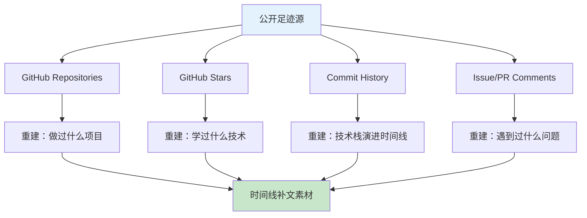

> 本文写于 2026 年 10 月，回溯 2026 年 9 月探索时间线补文（Timeline Backfill）方法时，如何通过 GitHub 公开足迹和 star 历史，重建过往技术实践的叙事逻辑与写作约定。

最近一个月集中做了十余篇技术回溯文章，写的是 2018–2020 年间的工程实践。有读者问：为什么不直接把文章日期改成当年的日期，而要用 `retrospective_of` 标记？为什么要公开承认「这是补写的」？这背后其实涉及一个更本质的问题：**如何在保持时间线真实性的同时，完成对过往经验的系统化重构**。本文记录这套时间线补文方法论的设计思路。

<!-- more -->

## 问题：为什么需要时间线补文

### 技术叙事的断层

工程师在职业生涯中会经历大量项目，但真正能及时记录下来的很少。常见的断层场景：

| 时期 | 技术实践 | 记录状态 | 断层原因 |
|------|---------|---------|---------|
| **2018–2019** | 学习目标检测、TensorFlow 1.x → 2.x 迁移 | 零散笔记、未成文 | 忙于学习和实现，无暇整理 |
| **2019–2020** | 秒杀系统并发优化、K8s 平台搭建 | 仅有内部文档 | 公司项目，不便公开 |
| **2020–2021** | 本地知识库、个人 Agent 探索 | GitHub 仓库存在但无文档 | 实验性项目，未到输出阶段 |
| **2022–2023** | 生产环境 Netty 服务、视频生成管线 | 代码可见但背景缺失 | 业务压力大，写作优先级低 |

到了 2026 年，当想要系统梳理这些经验时，面临的困境是：

- **记忆模糊**：具体技术细节、踩过的坑、当时的决策逻辑已经模糊
- **上下文丢失**：代码还在，但为什么这样设计、解决了什么问题已经不清楚
- **演进断层**：技术栈从 TensorFlow 1.x 到 2.x，从单体到 K8s，但中间的过渡过程没有记录

### 公开足迹的价值

幸运的是，作为工程师，我们留下了大量公开足迹：



**GitHub Stars 的特殊价值**：
- 每个 star 都有时间戳，反映了当时的技术关注点
- TensorFlow Object Detection API（2019 年 star）→ 回溯目标检测学习经历
- Detectron2（2019 年 star）→ 回溯两阶段检测器复现
- kubernetes/kubernetes（2020 年 star）→ 回溯 K8s 平台搭建
- langchain-ai/langchain（2023 年 star）→ 回溯本地 RAG 知识库探索

这些公开足迹构成了一条可验证的时间线，成为回溯写作的「证据链」。

## 方法：时间线补文的核心约定

### 1. 不伪造历史日期

**错误做法**：把 2026 年写的文章，日期改成 2019 年
- ❌ `date: 2019-05-20`（虚假时间戳）
- ❌ 在文章中假装「刚学完 Faster R-CNN」

**正确做法**：诚实标记真实写作时间和回溯目标
- ✅ `date: 2026-09-30`（真实写作时间）
- ✅ `retrospective: true`（声明这是回溯文章）
- ✅ `retrospective_of: 2019-05`（回溯的时间段）
- ✅ 开篇引用块明确说明「本文写于 2026 年 9 月，回溯 2019 年……」

**理由**：
1. **时间线真实性**：保持博客时间线的可信度，不制造「历史假象」
2. **认知差异透明**：2026 年写 2019 年的事，必然带有后见之明，应该公开承认
3. **方法论可复用**：其他人看到后，也知道如何补写自己的技术经历

### 2. 用 `retrospective_of` 标记回溯目标

Front Matter 约定：

```yaml
retrospective: true        # 声明这是回溯文章
retrospective_of: 2019-05  # 回溯的时间段（年-月）
date: 2026-09-30          # 真实写作日期
```

**为什么用 `YYYY-MM` 格式**：
- 回溯的是「一段时间的经历」，不是某一天
- 粒度控制在「月」级别，避免过于精确导致记忆失真
- 便于按时间段聚合：「2019 年上半年学习目标检测」vs.「2020 年下半年搭建 K8s 平台」

### 3. 公共抽象：避免私有项目名泄露

**挑战**：很多工程经验来自公司项目，但不能直接写项目名和业务细节

**解决方案**：技术边界抽象

| 私有场景 | 公共抽象 | 可公开的技术点 |
|---------|---------|--------------|
| 某电商平台秒杀系统 | 高并发秒杀系统工程边界 | Redis 限流、数据库连接池调优、压测方法 |
| 某金融公司 K8s 平台 | K8s 平台产品化工程边界 | Helm Chart 设计、RBAC 权限、日志收集 |
| 某图纸识别系统 | 示意图视觉理解边界 | 图纸检测、文本识别、管线设计 |
| 某内部 Agent 系统 | 个人 Agent 技术边界 | 工具调用、RAG 检索、安全沙箱 |

**公共抽象的原则**：
1. **去业务化**：不提公司名、产品名、具体业务指标
2. **保留技术决策**：为什么选这个技术栈、遇到什么坑、如何解决
3. **通用化表达**：「秒杀系统」比「某电商平台大促」更通用
4. **开源生态对照**：用公开的开源项目、论文、文档作为参照系

### 4. 证据链：如何证明「确实做过」

时间线补文面临的质疑：「你怎么证明 2019 年确实做过这些？」

**可用的证据链**：

#### 一级证据（最强）
- ✅ **GitHub 公开仓库**：带时间戳的 commit history
- ✅ **GitHub Stars**：当年 star 的相关开源项目
- ✅ **公开 Issue/PR**：参与过的开源社区讨论

#### 二级证据（辅助）
- ✅ **技术博客历史**：即使是零散笔记，也有发布时间
- ✅ **问答平台记录**：Stack Overflow、知乎等的提问/回答时间
- ✅ **培训证书/课程记录**：Coursera、Udacity 等的完成时间

#### 三级证据（间接）
- ⚠️ **框架版本推断**：「TensorFlow 1.15 是 2019 年 10 月发布的，我当时用的是 1.14」
- ⚠️ **技术趋势背景**：「2019 年 YOLOv3 刚流行，v4 还没出」

**在文章中引用证据的方式**：
- 链接到当年 star 的仓库：「当时学习时主要参考了 TensorFlow Object Detection API」
- 引用开源项目文档：「Detectron2 官方文档」
- 注明框架版本：「TensorFlow 1.15 的静态图机制」
- 对照技术演进：「到 2019 年中，单阶段检测器 YOLOv3 已经……」

### 5. 写作语感：后见之明的透明化

**2019 年的视角（不真实）**：
> 「我正在学习 Faster R-CNN，感觉很难……」

**2026 年的视角（真实）**：
> 「2019 年学习 Faster R-CNN 时，遇到的最大困境是显存爆炸和训练不收敛。回过头看，如果当时……」

**关键差异**：
- ✅ 明确说「回过头看」「当时」，承认时间差
- ✅ 可以用现在的认知评价当时的选择（「如果现在再做，会选择……」）
- ✅ 可以对比技术演进（「2019 年 YOLOv3 vs. 2024 年 YOLO-NAS」）
- ❌ 不假装「正在实时经历」

## 实践：系列化补文的组织方式

### 按技术领域聚类

时间线补文不是按时间顺序流水账，而是按技术领域聚类：

**计算机视觉领域**：
- 两阶段目标检测（Faster R-CNN）
- 场景文本检测与 OCR
- 图纸视觉理解

**后端工程领域**：
- 高并发秒杀系统
- Netty 聊天服务器
- K8s 平台产品化

**AI 工程领域**：
- 本地 RAG 知识库
- 个人 Agent 系统
- Coding Agent 沙箱安全

每个领域内部再按时间顺序，形成「技术演进线」。

### 方法论文章的位置

本文（时间线补文方法论）属于「元文章」：
- 不回溯具体技术实践
- 而是解释「为什么这样写」「如何保证真实性」
- 作为整个 retrospective 系列的方法论基础

### 系列标记

在每篇 retrospective 文章末尾，可以加入系列索引：

```markdown
---

*本文是 Retrospective 系列的一部分。更多回溯文章，请访问 [技术回溯系列](/tags/技术回溯/)。*
```

## 边界：什么不适合补写

### 1. 涉及商业机密的项目细节

❌ **不能写的**：
- 具体业务指标（日活、GMV、并发量）
- 内部系统架构图
- 未公开的技术方案

✅ **可以写的**：
- 技术决策逻辑（为什么选这个方案）
- 通用工程问题（显存优化、并发瓶颈）
- 公开生态对比（TensorFlow vs. PyTorch）

### 2. 记忆完全模糊的经历

如果对某段经历的记忆已经完全模糊，没有任何证据链支撑，**不要强行补写**。

**判断标准**：
- ✅ 能找到当年的 GitHub star 或 commit
- ✅ 能找到当年使用的技术栈版本号
- ✅ 能回忆起核心技术决策和踩坑经历
- ❌ 只记得「好像做过」，没有任何具体细节

### 3. 纯业务逻辑，无技术沉淀

有些项目可能投入很大，但技术上没有特别值得记录的点（比如纯 CRUD 业务开发），这种不需要强行补文。

**补文的价值判断**：
- ✅ 有技术决策权衡（A 方案 vs. B 方案）
- ✅ 有工程踩坑经验（遇到问题 → 如何解决）
- ✅ 有通用方法论（可以迁移到其他项目）
- ❌ 纯粹是「做了某个功能」，无技术深度

## 工具：如何挖掘公开足迹

### GitHub Stars 导出

```bash
# 使用 GitHub CLI 导出 star 历史
gh api user/starred --paginate | jq '.[] | {name: .full_name, starred_at: .starred_at}' > stars.json

# 按时间排序
cat stars.json | jq -s 'sort_by(.starred_at)'
```

### Commit History 分析

```bash
# 查看某个仓库的 commit 时间分布
git log --all --format="%ai" | cut -d'-' -f1-2 | sort | uniq -c

# 示例输出：
# 45 2019-05
# 67 2019-06
# 23 2020-03
```

### Wayback Machine

对于已经删除的博客文章或文档，可以尝试用 Wayback Machine 找回：
- [https://web.archive.org/](https://web.archive.org/)

## 延伸阅读

- [写给工程师的技术写作指南](https://developers.google.com/tech-writing)（Google 技术写作课程）
- [个人知识管理的时间维度](https://notes.andymatuschak.org/z4SDCZQeRo4xFEQ8H4qrSqd41aoPAVN4WBysM)（Andy Matuschak 的 Evergreen Notes）
- [GitHub 仓库 - How I Take Notes](https://github.com/readme/guides/private-documentation)（GitHub 官方博客）
- [知识工作者的时间线管理](https://www.calnewport.com/blog/)（Cal Newport Deep Work 相关）

---

*本文回溯 2026 年 9 月探索时间线补文方法时的思考过程。文中所有方法论基于个人实践经验，不涉及任何未公开系统或私有项目细节。*
