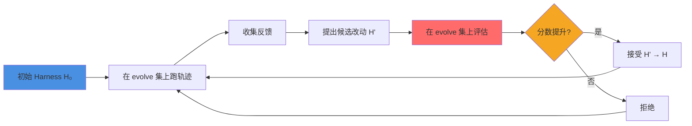

当 Agent 学会「自己改自己」，最大的风险不是改坏了，而是改「对」了——在训练集上涨了 20 分，在新任务上掉了 10 分。Agent 能力被 harness（提示、工具、控制流、记忆）放大后，让 harness 在固定评估集上反复迭代，很容易背下题目特征，而非学会通用机制。Google Research 的 **RRSI**（Regularized Recursive Self-Improvement of Agent Harnesses，arXiv:2609.24972）给出的答案不是「少改一点」，而是**正则化搜索轨迹**：提案侧退火预算、历史信用、探索未测组件；选择侧泄漏筛查、噪声地板、代价买单、结构剪枝。结果是：evolve 集最高 +14.1 分，五个 OOD 基准最高 +4.7 分，且相对无正则演化省约 30-36% 的 token。

本文从 harness 过拟合的机制出发,拆解 RRSI 的正则化设计，并给出实践者的检查清单——当你为自己的 coding agent 或个人助手自动调优时，如何避免「分数涨了、能力没涨」。

<!-- more -->

## 一、问题：Harness 自改进的过拟合陷阱

### 1.1 什么是 Harness？

现代 Agent = **冻结的骨干模型 π** + **可编辑的 Harness H**。

Harness 包含：

- **提示词**（system prompt、few-shot 示例）
- **控制流**（循环、分支、终止条件）
- **工具接口**（可调用的 API、MCP servers）
- **记忆与技能**（持久化的知识库、可复用的 skills）
- **上下文管理**（何时截断历史、何时注入新信息）

昨天的文章《Always-on 的第一性原理》讨论的是「何时动手、在谁的机器上」；今天我们关注的是：**当 harness 可以自己改自己时，如何防止它背题？**

### 1.2 递归自改进的诱惑与陷阱

**递归自改进**（RSI）的基本流程：



**陷阱**：这是在**同一个有限集合**上反复自适应优化——典型的过拟合场景。

过拟合的三种耦合行为：

1. **基准特化拟合**：harness 编码了「如果任务名包含 Terminal-Bench，则……」
2. **追逐评估噪声**：评分器本身有随机性，harness 学会了触发高分噪声的模式
3. **复杂度堆叠**：每轮都加新机制，evolve 分涨了，但机制未必更好（类似神经网络过参数化）

**文献证据**：RRSI 论文的 Figure 1（项目页可见）显示，先前方法（Meta-Harness、AHE、TTHE、HarnessX）在 evolve 集上大涨，OOD 留存很少，部分甚至**低于初始 H₀**。

### 1.3 为什么不能简单缩小可编辑空间？

直觉上，「只让 agent 改提示词、不让改工具」可以减少过拟合——但这也限制了能力上限。

RRSI 的核心主张：**不缩小可编辑空间**（prompt、控制流、config、工具、skills、memory、sub-agent 均可改），而是**正则化搜索轨迹**。

类比机器学习：L2 正则不是「减少参数数量」，而是「惩罚过大的权重」；Dropout 不是「永久删除神经元」，而是「训练时随机屏蔽」。RRSI 的正则化目标是：**让搜索过程偏向可迁移的机制，而非 evolve 特化的 hacks**。

## 二、RRSI 的正则化设计：两侧门控

RRSI 在 RSI 循环的两个关键环节加入正则化：**提案侧**（proposal）和**选择侧**（selection）。

### 2.1 提案侧正则化：控制「改什么、改多少」

#### （1）L₀ 风格退火编辑预算

每轮可提出的编辑数量 \( b_t \) 按余弦退火：

$$
b_t = \left\lceil b_{\min} + (b_{\max} - b_{\min}) \cdot \frac{1}{2} \left(1 + \cos\left(\frac{\pi t}{T}\right)\right) \right\rceil
$$

- **早期**（\( t \) 小）：\( b_t \) 接近 \( b_{\max} \)，可以捆绑多处协调改动（如「同时改提示词和工具接口以配合新能力」）
- **后期**（\( t \) 大）：\( b_t \) 趋向 \( b_{\min} \)，倾向**单次可归因的稀疏更新**

**直觉**：早期探索「宽」，后期锁定「精」——类似神经网络训练的学习率退火。

#### （2）证据感知信用分配

记录每个候选：改了哪个组件、假设是什么、diff 内容、分数/成本变化、是否被接受。

- **正证据**：被接受的改动，后续优先扩展该方向
- **负证据**：被拒绝的改动，避免在同一 evolve 集上反复重测已证伪的假设

**工程意义**：这是一个简单的「记忆」机制——但很多 RSI 基线没有，导致同样的坏主意被重复提出。

#### （3）结构化探索

如果近 \( w \) 轮进展落在噪声带 \( \delta \) 内（停滞），则把部分预算导向**本轮尚未测过的组件**。

| 轮次 | 停滞? | 预算分配策略 |
|------|-------|--------------|
| 1-5 | 否 | 自由提案（基于反馈） |
| 6-10 | 是（分数波动 < δ） | 50% 自由 + 50% 未探索组件 |
| 11+ | 否（又有进展） | 恢复自由提案 |

**直觉**：类似遗传算法的「多样性保护」——防止搜索陷入局部最优。

### 2.2 选择侧正则化：控制「接受什么」

#### （1）Leakage Critic：泄漏筛查

在全量评估前，用一个 LLM critic 检查候选改动是否：

- 显式编码任务名/实体/答案（如「if task_name == 'Terminal-Bench-2.1' then use special parser」）
- evolve 基准特化逻辑（如硬编码 evolve 集中某个具体任务的解决方案）
- 惰性冗余（如「加了一个新工具但从不调用」）

若 critic 判定为「泄漏」，直接拒绝，不进入评估。

**工程类比**：代码审查中的「magic constant」检测——你可以加常量，但不能写 `if user_id == 12345`。

#### （2）稳定性接受：噪声地板

评分器本身有随机性（例如 LLM-as-judge 的采样波动）。RRSI 先用未改动的 \( H_0 \) 重复评估，标定噪声幅度 \( \delta \)。

候选 \( H' \) 的接受条件：

$$
\hat{S}(H') \geq S^\star - \delta
$$

其中 \( S^\star \) 是当前最佳分数。

**含义**：分数提升必须**显著高于噪声**，否则可能是运气，不是真实改进。

#### （3）Ridge/L₂ 风格代价感知接受

当 \( \Delta S > \delta \)（真实提升）时，要求相对 token 成本满足：

$$
\Delta C \leq \beta_0 + \beta_1 \Delta S
$$

**含义**：多耗算力须用可测增益「买单」——不能「加了一大堆提示词和工具，分数涨 0.5 分，token 翻倍」。

#### （4）Lasso/L₁ 风格结构剪枝

近期无正增益的组件标为**删除目标**，促使保留结构变稀疏。

**直觉**：类似神经网络剪枝——定期清理「看起来有用但实际不贡献」的部分。

---

**注意**：文中 L₀/L₁/L₂ 仅为**角色类比**，并非真的优化对应范数惩罚目标。

### 2.3 一轮 RRSI 的完整流程

```mermaid
graph TD
    A[Harness H_t] --> B[Proposer: 生成候选 H']
    B --> C[Critic: 泄漏筛查]
    C --> D{通过?}
    D -->|否| E[拒绝，记录负证据]
    D -->|是| F[Evaluate: 在 evolve 上评估]
    F --> G{分数 > S* - δ?}
    G -->|否| E
    G -->|是| H{ΔC ≤ β₀ + β₁ΔS?}
    H -->|否| E
    H -->|是| I[接受 H' → H_{t+1}]
    I --> J[Pruner: 清理无用组件]
    E --> K[继续提案]
    J --> K
    
    style C fill:#FF6B6B
    style F fill:#4ECDC4
    style I fill:#4A90E2
```

## 三、实证结果：evolve 与 OOD 双赢

### 3.1 基准设置

RRSI 在 **8 个基准 / 3 个域** 上验证：

| 域 | evolve 集 | OOD 测试集 |
|----|-----------|------------|
| **编码** | Terminal-Bench 2.1 | SWE-bench Verified |
| **Agentic Workspace** | Harvey LAB evolve | Harvey LAB ID held-out、JobBench、GDPval、APEX-Agents |
| **工程设计** | EngDesign | Frontier-Eng |

- 主实验策略：**Claude Opus 4.8**
- 编码域另有 **Gemini 3.5 Flash** 独立演化

对比基线：Meta-Harness、AHE、TTHE、HarnessX（同 \( H_0 \)、同 evolve 集、同候选预算）。

### 3.2 核心数字（带 caveats）

#### 摘要级 headline

| 声明 | 来源 | Caveat |
|------|------|--------|
| evolve 最高 **+14.1 分** | 摘要；Gemini 3.5 Flash Terminal-Bench 2.1 **64.6 → 78.7** | 来自**较弱策略**，不是 Claude 主表的 +6.0 |
| 五个 OOD 最高 **+4.7 分** | 摘要；JobBench **36.0 → 40.7** | 五个 OOD = SWE/JobBench/GDPval/APEX/Frontier-Eng |
| 相对无正则演化省 **~30-36% tokens** | 摘要 30% vs Table 2 约 36% | 口径不完全一致；省的是相对**无正则演化**，不是相对 H₀ |

#### Claude Opus 4.8 主结果（相对 H₀）

| 分裂 | H₀ | RRSI | Δ |
|------|---:|-----:|---:|
| Terminal-Bench 2.1 (evolve) | 74.2 | 80.2 | **+6.0** |
| EngDesign (evolve) | — | — | **+4.9** |
| Harvey LAB (evolve) | 89.4 | 90.5 | **+1.1** |
| Harvey LAB (ID held-out) | 86.9 | 89.2 | **+2.3** |
| SWE-bench Verified (OOD) | 82.0 | 83.8 | **+1.8** |
| JobBench (OOD) | 36.0 | 40.7 | **+4.7** |
| GDPval (OOD) | 48.8 | 52.3 | **+3.5** |
| APEX-Agents (OOD) | 34.2 | 37.9 | **+3.7** |
| Frontier-Eng (OOD) | — | — | **+4.3** Medal pts（约 +24.3%） |

**观察**：所有 held-out 分裂均无回退；agentic OOD 平均 RRSI **43.6** vs H₀ **39.7**。

#### 与先验方法对比（Harvey 系，Table 1）

| 方法 | Evolve | ID held-out | OOD Avg. |
|------|-------:|------------:|---------:|
| H₀ | 89.4 | 86.9 | 39.7 |
| Meta-Harness | **93.0** | 88.5 | 39.1 |
| AHE | 91.2 | 87.8 | 38.9 |
| TTHE | 91.8 | 88.3 | 39.4 |
| HarnessX | 92.1 | 88.6 | 40.1 |
| **RRSI** | 90.5 | **89.2** | **43.6** |

**关键观察**：

- 先验方法在 evolve 上往往更高（Meta-Harness 93.0 > RRSI 90.5）
- **OOD 排名反转**：部分方法 OOD 甚至低于 H₀；RRSI 是唯一在 OOD 平均上相对 H₀ 明显高出超过 1 分的

项目页称：相对先验方法平均，held-out 上最多高出约 **22.9%**（相对表述）。

#### 消融实验（Table 2，agentic）

| 变体 | Evolve | ID held-out | OOD Avg. | Tokens/trial (m) ↓ |
|------|-------:|------------:|---------:|-------------------:|
| H₀ | 89.4 | 86.9 | 39.7 | 1.56 |
| 无正则演化 | **92.8** | 88.9 | 40.3 | **3.80** |
| 去掉提案正则 | 90.7 | 88.8 | 41.9 | 2.69 |
| 去掉接受正则 | 91.5 | 88.7 | 41.0 | 3.59 |
| **RRSI** | 90.5 | **89.2** | **43.6** | **2.42** |

**解读**：

- 去掉任一组正则 → evolve 涨、迁移降
- 两边都去掉 → evolve 最高、OOD 几乎贴回 H₀、token 最贵
- 正则化是「evolve 上略微牺牲 + OOD 上显著增益 + 成本下降」的三方平衡

### 3.3 诚实的 Caveats

1. **「最高 +14.1」来自较弱策略**：Gemini 3.5 Flash 的 evolve，不是 Claude 主表
2. **Token 节省 30% vs ~36%**：摘要 vs 表格口径不同，引用时需注明来源
3. **进化仍比裸 H₀ 更贵**：1.56 → 2.42 m tokens/trial；「更省」是相对无正则演化，不是相对基线
4. **部分指标依赖 LLM-as-judge**：agentic 域有评分偏差风险；工程域用冻结仿真器做了交叉验证
5. **超参仅在 evolve 上选定**：\( \delta, \beta_0, \beta_1, b_{\min/\max} \) 等，有效性依赖反馈质量与搜索预算

## 四、实践者检查清单：当你自动调优 Agent 时

如果你正在为自己的 coding agent、个人助手或企业 workflow agent 做自动化 harness 优化，以下是 RRSI 给出的实践建议：

### 4.1 提案阶段：控制搜索发散

| 检查项 | 具体做法 | RRSI 对应机制 |
|--------|----------|---------------|
| **限制单次编辑数量** | 早期可多处协调改，后期单次可归因 | 退火编辑预算 \( b_t \) |
| **记录失败假设** | 不要反复测同一个坏主意 | 证据感知信用分配 |
| **强制探索未动组件** | 停滞时主动测试其他部分 | 结构化探索 |
| **可视化搜索轨迹** | 画出「哪些组件被改过、何时、为何」 | （工程扩展） |

### 4.2 选择阶段：控制过拟合

| 检查项 | 具体做法 | RRSI 对应机制 |
|--------|----------|---------------|
| **筛查任务特化逻辑** | 禁止 `if task_name == '...'` 风格硬编码 | Leakage Critic |
| **标定噪声地板** | 用未改的 H₀ 重复评估，量化随机性 | 稳定性接受 \( \delta \) |
| **代价-增益联合决策** | 分数涨了但 token 翻倍？拒绝 | Ridge 风格接受 |
| **定期剪枝无用组件** | 清理「加了但不用」的工具/提示 | Lasso 风格剪枝 |

### 4.3 评估策略：evolve 与 OOD 一起看

| 场景 | 危险信号 | 应对 |
|------|----------|------|
| **evolve 涨 OOD 跌** | 已过拟合 | 加强泄漏筛查；减少 evolve 轮次 |
| **evolve 和 OOD 都涨但 token 翻倍** | 复杂度堆叠 | 启用代价感知接受；剪枝 |
| **长时间停滞** | 陷入局部最优 | 强制探索未测组件；重启 |
| **分数波动大** | 评估噪声高 | 增加 evolve 集大小；用多次采样平均 |

### 4.4 何时不该自动调优

1. **Evolve 集太小**（< 50 样本）：过拟合风险极高，正则化也救不了
2. **Evolve 与 OOD 分布差异极大**：如 evolve 是英文编码，OOD 是中文客服——学不到迁移机制
3. **评估器不可信**：如 LLM-as-judge 偏好长回复，harness 会学会「写长」而非「写对」
4. **成本不可控**：无正则演化可能让 token 开销爆炸（RRSI 可省 30-36%，但绝对值仍比 H₀ 高）

## 五、与其他 Harness 演化方法的定位

RRSI 自称贡献**正交于「改什么」**：保持开放编辑空间，改的是**搜索动力学**。

| 方法 | 核心思路 | RRSI 与之的关系 |
|------|----------|-----------------|
| **Meta-Harness** | 把 harness 工程做成可执行代码的端到端优化 | RRSI 可用 Meta-Harness 作为 proposer，加上正则化 |
| **AHE** | 可观测性驱动的 coding-agent harness 自动演化 | RRSI 的 critic/pruner 可视为更通用的可观测性约束 |
| **TTHE** | 测试时 harness 演化，权重冻结 | RRSI 同样冻结权重，但加了提案/选择正则 |
| **HarnessX** | 模块化 typed primitives + 轨迹驱动适配 | RRSI 的结构化探索可与 typed primitives 结合 |
| **HarnessCompass** | 显式泛化目标（跨任务评估） | RRSI 可与之叠加：用 Compass 作 OOD 监控 |

**实践建议**：RRSI 不是替代先前方法，而是「加一层门控」——如果你已经在用 Meta-Harness 或 AHE，可以在其基础上加上 leakage critic、代价感知接受等机制。

## 六、局限与开放问题

RRSI 论文 Limitations 部分诚实列出的限制：

1. **仅 harness 级 RSI**：骨干权重冻结，不覆盖演化中改权重
2. **仍依赖有限 evolve 集与正则超参**：效果依赖反馈信号质量与搜索预算
3. **验证范围**：虽跨多域/基准/策略，对显著不同的 agent 架构、工具生态、更长时程自改进仍需更广验证

**开放问题**（基于文意，非作者原话）：

- Critic / 噪声带 / 代价规则在**极强过拟合诱导**或**极噪 judge** 下是否仍稳健？
- 正则是否可与**显式泛化目标**（HarnessCompass）或**多样性档案**（gated semantic QD）叠加？
- 跨模型迁移（Table 4：用 Gemini 3.5 Flash 搜出的 harness 在未见过的 Gemini 3.1 Flash Lite 上仍有 +3.4）的边界在哪？
- 开源仓库是否包含完整可复现评测管线？（需自行核对 GitHub 现状）

## 七、总结

Agent harness 的递归自改进是双刃剑：做对了，能让固定模型在长程任务上提升 10-20 分；做错了，会背下评估集特征，OOD 掉分、token 开销翻倍。

RRSI 的洞见是：**不缩小可编辑空间，而是正则化搜索轨迹**。提案侧用退火预算、历史信用、强制探索；选择侧用泄漏筛查、噪声地板、代价买单、结构剪枝。结果是 evolve 与 OOD 双赢，且成本可控。

对实践者的启发：当你为 coding agent、个人助手或企业 workflow 做自动调优时，**加闸门**——筛掉任务特化逻辑、量化噪声、让增益买单、定期剪枝。不要只看 evolve 分数，要看 OOD 留存和 token 代价。

**可证伪的主张**：正则化 harness 演化可在多数场景下同时提升泛化与效率；但若 evolve 集过小、分布差异过大、或评估器不可信，正则化也救不了——此时应优先改善数据与评估，而非盲目调优。

---

## 扩展阅读

**论文与项目**：
- [RRSI: Regularized Recursive Self-Improvement of Agent Harnesses](https://arxiv.org/abs/2609.24972) - arXiv 论文
- [RRSI 项目页](https://regularized-rsi.com/) - 包含可视化结果与详细表格
- [RRSI GitHub 仓库](https://github.com/google-research/rrsi) - 开源代码（Apache 2.0）

**相关工作**（文中点名的 harness 演化基线）：
- Meta-Harness (Lee et al., 2026b) - 端到端 harness 代码优化
- AHE (Lin et al., 2026a) - 可观测性驱动的 coding-agent harness 演化
- TTHE (Nie et al., 2026) - 测试时 harness 演化
- HarnessX (Chen et al., 2026) - 模块化 typed primitives

**本博客相关文章**：
- [Always-on 的第一性原理：责任、时间、电脑与闸门](/2026/10/01/always-on-agent-harness-boundary/) - 讨论 harness 的系统属性与可运营 runtime
- [Coding Agent 的执行壳体与沙箱隔离](/2026/09/30/coding-agent-harness-and-sandbox-security/) - Harness 的工具调用、状态管理与安全边界

---

*本文基于 arXiv:2609.24972（v2, 2026-09-23）及项目页 regularized-rsi.com 公开材料整理，数字均引自原文表格，未杜撰。*
