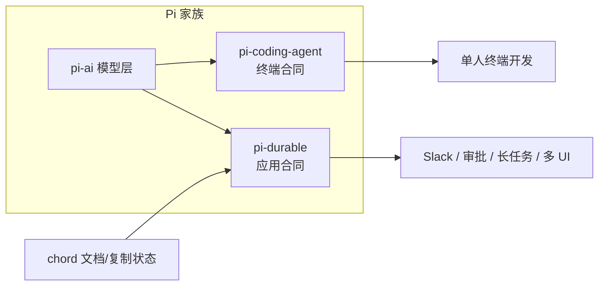
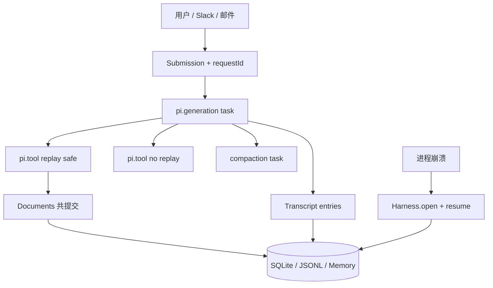

2026 年 10 月 1 日，Earendil 与 Pi 社区在发布 Pi 1.0 的同时，把实验包 **Pi Durable**（`@earendil-works/pi-durable`）推到台前。官方博客写得很克制：它**不替代**终端里的 Pi coding agent；它是另一份 harness 合同——为「跑得久、跑得散、能被多人从多种表面打断与续上」的应用而写。

前作讨论 always-on 时，结论落在「缺的是可运营 runtime，不是更长 prompt」。Pi Durable 正好把这句话拆成可安装的 TypeScript 包。本文基于 **npm 1.0.0 动手验证**（SQLite 崩溃续跑、JSONL fork + 文档、faux 模型与工具配置），对照普通 coding-agent 循环，回答一个产品问题：若你在做 WorkBuddy / Manus 类办公或个人 agent，**哪些能力是换底座才便宜，哪些继续叠在会话循环上就够**。

<!-- more -->

## 一、同一家族，两份合同

官方定义 harness 为：**存储 + 并行跑一个或多个 LLM 会话的机械装置**，再挂上工具与执行环境。会话是 transcript；agent 是模型设定 + 可用工具；一切运行中的步骤都是 **task**。

在这个定义下，Pi 家族分出两种合同：

| 维度 | Pi coding agent（终端合同） | Pi Durable（应用合同） |
|------|------------------------------|-------------------------|
| 典型表面 | 本机 / 远程机上的 TUI | 任意 JS 运行时上的应用（Slack bot、网页、Durable Object…） |
| 进程死了谁负责 | 人看一眼，再告诉它继续 | 新进程 `open` 同一 storage，`resume()` 从检查点续 |
| 会话形状 | 一条主会话为主 | 多会话并发；可在任意 entry **fork** |
| 多人 | 一人驾驶 | 多客户端 `viewState` / `watch`，可 **steer** |
| 应用状态 | 多靠磁盘文件 / 会话外自管 | **Document** 与 transcript **同一次原子 commit** |
| 与对方关系 | 产品焦点不变 | 共享 `pi-ai` 与最小主义原则；教训可回流 coding agent |

一句话：**coding agent 卖的是「在这台机器上把活干完」；Durable 卖的是「这份交互与状态在基础设施抖动后仍可对齐」**。二者同族，合同不同——这与 always-on 文里「session ≠ responsibility」是同一条裂缝的工程表述。

## 二、动手里跑通了什么（诚实账本）

环境：默认 Node 20.19.2 **不满足** `engines: >=22.19.0`；改用 Node **22.19.0** 后安装并运行。

| 包 | 版本 | 结果 |
|----|------|------|
| `@earendil-works/pi-durable` | 1.0.0 | 安装成功；核心 API 可 import |
| `@earendil-works/pi-ai` | 1.0.0 | `fauxProvider` 离线脚本 |
| `@earendil-works/chord` | 1.0.0 | `BACKGROUND_CONTEXT` |

**成功：**

1. **崩溃续跑（SQLite）** — 改编官方 `test/examples/13-recovery.ts`：自定义 `Ticker` task 数到 5，在 tick 2 后 `close` harness（模拟崩溃）。再打开同一库：`status: pending`，checkpoint `{ phase: "tick", n: 2 }`；`resume()` 后 outcome `counted to 5`。`memo` 保证重入不重复打印同一 tick。
2. **Fork + Document（JSONL，`fork: "asOf"`）** — 父会话 todos 在 fork 点之后又写入一项；fork 侧只看到 fork 时刻的列表。`requestId` 重提同一提交返回同一 submission id。`configure({ tools: { remove: [deploy] } })` 后 fork 仅剩 `search_demo`。
3. **MemoryStorage + faux 聊天** — `modelId: "faux-1"`（写成 `"faux"` 会 `unanswered`，fork 时抛 `Storage.entry() requires an entry ID`——这是本文踩过的真实坑）。

**未跑 / 限制：**

- 交互式 vacation / coding durable TUI（`packages/coding-agent/src/experimental/{vacation,durable}/main.ts`）需要 TTY 与真实模型密钥；仅确认源码公开可读。
- 未整仓 clone 构建 Pi monorepo；以 npm 发布物 + raw examples 为准。
- 官方标注 **Experimental**，API 可能随版本变。

一手材料：仓库 [earendil-works/pi](https://github.com/earendil-works/pi)、博文 [Pi Durable](https://earendil.com/posts/pi-durable/)、包 README。

## 三、对 APP 集成真正要紧的架构差

下面不谈「优雅」，只谈嵌进 Slack/邮件/日历长跑时你会不会半夜被 pager。

### 3.1 耐久与检查点

每一步（模型请求、工具调用、compaction、自定义 task）先落盘再前进。进程死于睡眠、redeploy、OOM：新进程 `Harness.open` + `resume()`。模型半截回答进 transcript 并标 aborted；工具按 `replay` 决定重跑或告诉模型 interrupted。`requestId` 把提交变成 exactly-once。

对照普通 coding loop：多数实现是「内存里的 agent loop + 可选 JSONL 聊天记录」。记录不等于可恢复的 task 图；重试常靠人按 Esc 再发一句「继续」。

### 3.2 多会话与 Fork

一个 harness 内多会话并发。Fork 在指定 entry 切开：子会话看见父历史到该点，**不复制**整棵历史。官方举例：Slack 频道 = 根会话，thread = 在 agent 回复处 fork，二者同时跑。

办公含义：频道噪声与帖内深挖不必抢同一条 inbox；权限也可分叉（见下节工具裁剪）。

### 3.3 多人与 Steer

UI 所需皆为已提交状态：`viewState` / `watch`（提交级 ops，适合套接字）。晚加入从当前视图起步。忙时提交：`whenBusy: "steer"` 插入当前工具轮之后；默认 follow-up 等本轮答完；`reject` 直接忙失败。

这是 always-on「可达性」的工程入口：**可达 ≠ 单线程独占键盘**。

### 3.4 Document 与 Transcript 共提交

`defineDoc` 的 JSON 与 entry 在同一 `commit` 里变。Fork 策略可选 `asOf` / `current` / `initial`。动手验证了 `asOf`：fork 不会偷走父会话事后追加的 todos。

办公含义：待办、工单草稿、审批单若只活在模型嘴里，崩溃后必与 transcript 漂；共提交把「说了」和「账上有」绑死。

### 3.5 可热替换的 Registry

扩展按**名字**装进进程 registry；会话只存名字。同名 `install` 即替换；进行中的调用跑完旧代码，下一跳用新代码。重启后只要再装同名扩展，pending task 可续。

办公含义：审批策略、只读模式、连接器包装可以发版热更，而不必「杀会话」。

### 3.6 工具重放语义

`replay: "safe"` —— 崩溃后可重跑（搜索、读 issue、幂等查询）。不声明 / unsafe —— 不自动重跑，模型收到 interrupted + 已提交的部分输出。部署、付款、发信默认应走后者，并自备幂等键（官方 checkout/payment 示例用 `payment-${task.id}`）。

这是 lethal trifecta 文脉下的**效果语义**：不是「多一个 tool schema」，而是「副作用在故障模型里如何被叙述」。

### 3.7 Ownership 与 Abort

Task / conversation 构成所有权树。Abort 自底向上清理。子 agent = 被 tool task 拥有的 conversation；`background: true` 的任务 Esc 不杀（适合「明天提醒」）。普通 coding agent 的 Esc 往往是「杀这一轮」——语义更窄，也更简单。

## 四、办公 Agent 视角：增益、税、何时够用

以 WorkBuddy 类（Slack/邮件/日历、长跑、多用户、审批）为参照——不评具体产品 KPI，只谈 harness 合同。

### 4.1 你换到底座时多得到什么

| 能力 | 叠在 vanilla coding loop 上 | 在 Pi Durable 合同里 |
|------|-----------------------------|----------------------|
| 崩溃后续跑 | 常自制「存消息、人工续」 | task checkpoint + `resume` + `requestId` |
| 频道 / 帖 | 多开进程或自己分片上下文 | 原生多会话 + fork |
| 审批闸门 | 外部队列 + 易重复询问 | `hook` + `memo`（重启不二次问） |
| 待办/工单 | 另一套 DB，易与对话漂移 | Document 与 transcript 同 commit |
| 多端围观 / 插话 | 自研事件总线 | `viewState` / steer inbox |
| 发版改工具 | 踢线或双写版本号 | registry 热替换，会话存名字 |

### 4.2 复杂度税（别假装没有）

1. **实验 API** — 官方明文：可能无告警变更。  
2. **运行时门槛** — Node ≥ 22.19；存储单进程属主，无跨进程锁（要水平扩展得自己做属主路由，例如一对话一 Durable Object）。  
3. **你必须设计故障语义** — 每个对外工具回答：可重放吗？幂等键是什么？abort 如何退款/撤回？  
4. **心智负担** — Chord context、ownership 树、foreground/background、compaction 与 handoff。源码量级官方称约 15k 行（无测试）；agent 可读，人要负责产品边界。  
5. **不是安全万能药** — Durable 管一致性与续跑；凭证隔离、egress 闸门（Sentinel 类）仍要外置。

### 4.3 何时普通 coding-agent harness 仍够

- 单人、短会话、人一直在键盘旁（崩溃可接受「人说继续」）。  
- 无多表面、无 thread 分叉、无「应用状态必须与 transcript 同事务」。  
- 工具副作用少，或副作用全在人肉确认的 PR/终端里。  
- 团队还在找产品形状，先用 coding agent 验证「会不会干活」，再迁合同。

辩证：**办公产品需要的 always-on，往往不是把 Claude Code 挂成 daemon，而是换一份「可嵌入、可恢复、可分叉」的合同；但过早上满 Durable，会把实验 API 与 ownership 设计税提前支付。**

## 五、与 Always-on 第一性原理的对照

| 第一性裂缝（前作） | Pi Durable 的直接把手 |
|--------------------|------------------------|
| 单位：Task vs Responsibility | Document + 长会话 + 后台 task；责任仍要产品层定义「何时算完成」 |
| 时间：空转成本 | 事件驱动提交，而非强制心跳；compaction/handoff 控上下文 |
| 空间：长寿命电脑 | storage + 可插拔 `ExecutionEnv`（工具可跑在别的机器） |
| 权限：闸门 | `beforeTool` + memo；与 Sentinel 互补，不替代 |

金句可以收成：

> Coding agent 优化的是「这一轮怎么动手指」；Durable 优化的是「手指动到一半灯灭了，账还能对齐」。Always-on 卖可达性；Durable 是可达性在应用侧的一种可检验合同。

## 六、实践者清单（给要接办公场景的人）

1. **先画副作用表**：每个工具标 `replay` 与幂等键；发信/部署/支付默认非 safe。  
2. **会话拓扑对齐产品拓扑**：频道/主会话、thread/fork、私聊/独立 conversation。  
3. **状态进 Document**：待办、审批单、沙箱句柄不要只活在 assistant 文本里。  
4. **审批用 hook+memo**：避免崩溃后重复打扰人。  
5. **属主与路由**：一存储一进程；多租户先按 conversation/user 分片。  
6. **热更扩展名稳定**：会话存的是名字；发版别随意改名导致工具蒸发。  
7. **先 faux / 示例验收故障路径**：官方 `13-recovery`、`20-inbox`、`22/23-subagent`、`24-child-tasks` 比只跑 happy path 有用。  
8. **安全另册**：Durable ≠ 拆开 lethal trifecta；egress 仍要闸门。

## 七、结语

Pi Durable 把「耐久 harness」从博客概念落成可 npm 安装的实验运行时：检查点、多会话 fork、steer、文档共提交、registry 热替换、工具重放语义、ownership abort——这些是办公 / 个人长跑 agent 嵌进 APP 时反复自造的轮子。

它不是「更强的 coding agent」，而是**另一份合同**。Vanilla coding loop 在单人短会话里仍然足够；一旦你需要崩溃可恢复、多用户插话、应用状态与 transcript 对齐，合同差额就会以运维事故的形式催债。

动手结论可复述：在 `@earendil-works/pi-durable@1.0.0` 上，SQLite 崩溃续跑与 JSONL fork/`asOf` 文档行为与文档描述一致；交互式 vacation demo 未在本环境完整跑通。实验标签仍在——适合架构验证与小工具，接入核心办公链路前请自备兼容层与故障演练。

---

## 扩展阅读

**一手：**
- [Pi Durable（Earendil）](https://earendil.com/posts/pi-durable/)
- [earendil-works/pi](https://github.com/earendil-works/pi) · [`packages/durable` README](https://github.com/earendil-works/pi/blob/main/packages/durable/README.md)
- npm：[`@earendil-works/pi-durable`](https://www.npmjs.com/package/@earendil-works/pi-durable) · [`pi-ai`](https://www.npmjs.com/package/@earendil-works/pi-ai) · [`chord`](https://www.npmjs.com/package/@earendil-works/chord)

**本博客相关：**
- [Always-on 的第一性原理：责任、时间、电脑与闸门](/2026/10/01/always-on-agent-harness-boundary/)
- [RRSI：Agent Harness 的正则化进化](/2026/10/02/rrsi-harness-regularized-evolution/)
- [Coding Agent 的执行壳体与沙箱隔离](/2026/09/30/coding-agent-harness-and-sandbox-security/)

---

*本文基于 2026-10-02（Asia/Shanghai）对 npm `@earendil-works/pi-durable@1.0.0` 的安装与脚本验证，以及 earendil.com / GitHub 公开材料整理。未编造产品 KPI；交互式 vacation TUI 未完整跑通已在文中标明。*
