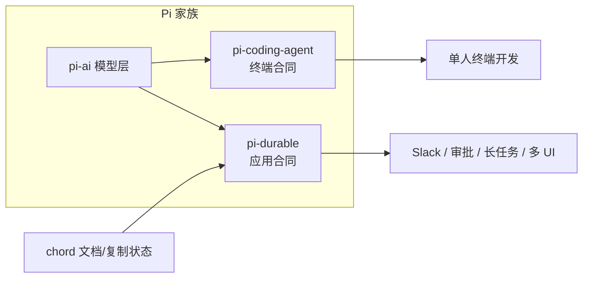
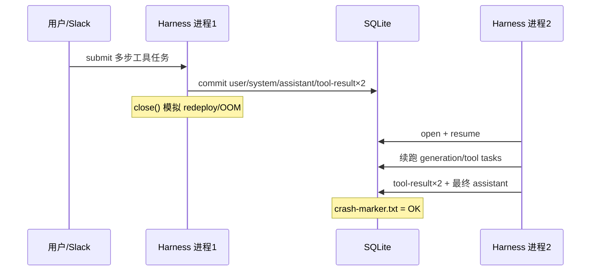
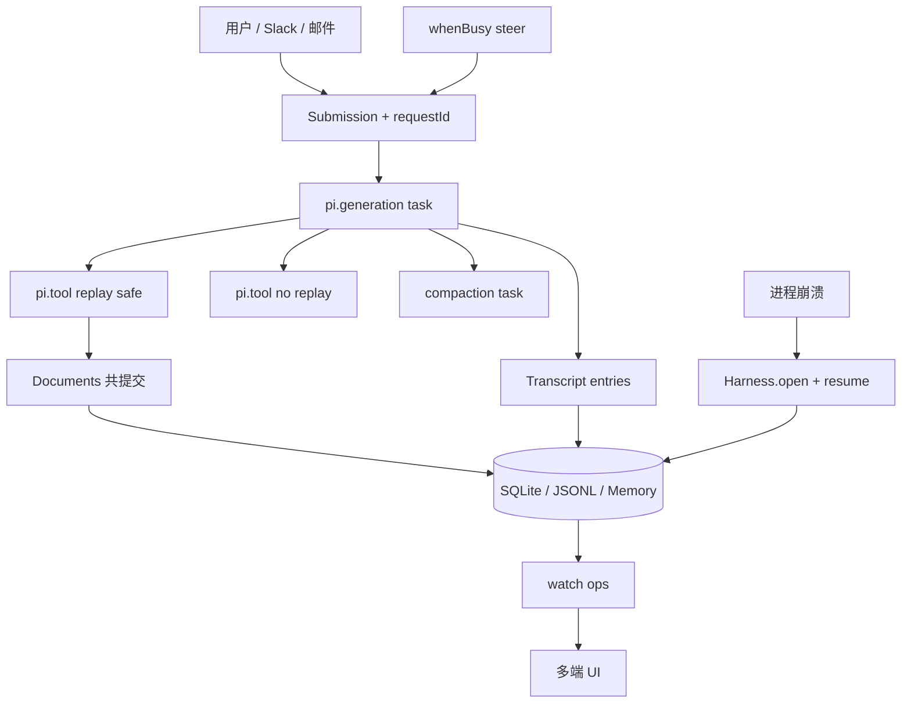

2026 年 10 月 1 日，Earendil 与 Pi 社区在发布 Pi 1.0 的同时，把实验包 **Pi Durable**（`@earendil-works/pi-durable`）推到台前。官方博客写得很克制：它**不替代**终端里的 Pi coding agent；它是另一份 harness 合同——为「跑得久、跑得散、能被多人从多种表面打断与续上」的应用而写。

前作讨论 always-on 时，结论落在「缺的是可运营 runtime，不是更长 prompt」。Pi Durable 正好把这句话拆成可安装的 TypeScript 包。本文不是 README 复述：它基于 **2026-10-02（Asia/Shanghai）第二轮加深动手**——把阿里云 Token Plan 的 **`qwen3.8-flash`** 同时接到 **OpenAI chat-completions** 与 **Anthropic Messages** 两条线，在 `@earendil-works/pi-durable@1.0.0` 上跑通：

1. 真实多轮 CodingTools 写文件并 `node` 验算；
2. **工具轮中途** `close` 模拟崩溃，再 `resume` 写完标记文件；
3. 真实模型下的 **fork + Document `asOf` + `whenBusy:"steer"` + `watch`**。

第一轮只用 `fauxProvider` 的验证仍然有效，但不够回答产品问题。办公 Agent（WorkBuddy / Manus 类）夜里被 pager 叫醒的，从来不是「能不能 mock 出一个 ticker」，而是「模型正在 bash/写盘时进程没了，账还能不能对齐」。

<!-- more -->

## 一、同一家族，两份合同

官方定义 harness 为：**存储 + 并行跑一个或多个 LLM 会话的机械装置**，再挂上工具与执行环境。会话是 transcript；agent 是模型设定 + 可用工具；一切运行中的步骤都是 **task**。

在这个定义下，Pi 家族分出两种合同：

| 维度 | Pi coding agent（终端合同） | Pi Durable（应用合同） |
|------|------------------------------|-------------------------|
| 典型表面 | 本机 / 远程机上的 TUI | 任意 JS 运行时上的应用（Slack bot、网页、Durable Object…） |
| 进程死了谁负责 | 人看一眼，再告诉它继续 | 新进程 `open` 同一 storage，`resume()` 从检查点续 |
| 会话形状 | 一条主会话为主 | 多会话并发；可在任意 entry **fork** |
| 多人 | 一人驾驶 | 多客户端 `viewState` / `watch`，可 **steer** |
| 应用状态 | 多靠磁盘文件 / 会话外自管 | **Document** 与 transcript **同一次原子 commit** |
| 与对方关系 | 产品焦点不变 | 共享 `pi-ai` 与最小主义原则；教训可回流 coding agent |

一句话：**coding agent 卖的是「在这台机器上把活干完」；Durable 卖的是「这份交互与状态在基础设施抖动后仍可对齐」**。二者同族，合同不同——这与 always-on 文里「session ≠ responsibility」是同一条裂缝的工程表述。

## 二、加深动手：真实模型账本（诚实）

环境：默认 Node 20.19.2 **不满足** `engines: >=22.19.0`；改用 Node **22.19.0**。包版本：`pi-durable` / `pi-ai` / `chord` 均为 **1.0.0**。模型：**`qwen3.8-flash`**（Token Plan 北京）。

### 2.1 两条协议，哪条能进 pi-ai

| 路径 | baseUrl 怎么写 | 结果 |
|------|----------------|------|
| Chat completions | `.../compatible-mode/v1` | **通**：`complete` 回 `PONG`；带 tools 时 `finish_reason=tool_calls` |
| Anthropic Messages（推荐） | `.../apps/anthropic`（**去掉**尾部 `/v1/messages`） | **通**：同样可工具调用（`stop_reason=tool_use`） |
| Anthropic 把完整 `/v1/messages` 当作 baseUrl | 原样粘贴网关文档里的 messages URL | **败**：pi-ai / SDK 会再拼一层路径，`stop=error`、空 content |
| 内置 `qwenTokenPlanCnProvider()` | 目录里已有 `qwen3.8-flash`，chat 基址同上 | **通**（把 chat key 映到 `QWEN_TOKEN_PLAN_CN_API_KEY`） |

网关还会吐 **thinking 块**（Anthropic `content: [{type:thinking},{type:text}]`）或 chat 侧的 `reasoning_content`。只读 `content[0].text` 会误判「模型没说话」——办公 UI 必须只渲染 text / tool 卡片，否则用户会看到思维链噪声。

**结论：** 双栈都能干活；接 Anthropic 兼容面时 **baseUrl 要剥掉 `/v1/messages`**。这是本轮相对第一轮「只读了文档」才拿到的、会直接堵上线的细节。

### 2.2 真实多轮 CodingTools（非 faux）

Harness 安装官方 `CodingTools`（bash/read/write/edit）+ `NodeExecutionEnv`，任务：列目录 → 读 `src/notes.txt` → 写根目录 `sum.mjs`（`export function add`）→ `node` 动态 import 验算打印 `5` → 回复 DONE。

| 协议 | 耗时（约） | 工具结果条数 | 产物 |
|------|------------|--------------|------|
| chat-completions | 20s | 4 | `sum.mjs` 正确，验算通过 |
| anthropic-messages（strip） | 11s | 4 | 同上 |

Transcript 形态两边一致：`pi.user → pi.system → (pi.assistant ↔ pi.tool-result)×n → pi.assistant`。`harness.usage` 能按 `provider/model` 汇总 token（本目录 cost 字段为 0，**不编造计费 KPI**）。

这证明：Durable 不是只能跑官方 `Ticker` 示例；**同一套 registry + env** 能挂真实工具环，且两条厂商协议可互换——办公产品常要「中国区网关 / 多协议兜底」，合同层应该吃 `Models` 集合，而不是写死某一家 SDK。

### 2.3 工具轮中途崩溃，再 resume（真实模型）

第一轮用自定义 `Ticker` task 证明了 checkpoint；办公场景更狠的是：**模型已经开始调工具**时进程没了。

做法：提交「ls → read seed → 写 `crash-marker.txt=OK` → cat → DONE」；在落盘 **2 条** `pi.tool-result`、标记文件尚未出现时 `harness.close()`；再打开同一 SQLite，`resume()`，挂回同一 `conversationId`。约 30 秒内 transcript 增至 4 条 tool-result，**`crash-marker.txt` 内容为 `OK`**，无需人工再发「继续」。

对照普通 coding loop：多数实现是「内存 agent loop + 可选 JSONL 聊天记录」。记录不等于可恢复的 **task 图**；重试常靠人按 Esc 再发一句「继续」。本轮差额第一次用**真实模型 + CodingTools**量出来，而不是 faux 剧本。

### 2.4 Fork、`asOf` Document、Steer、Watch（真实模型）

在同一会话里：

- `requestId` 重提 → **同一 submission id**（exactly-once 入口）。
- 父会话在 answer 之后写入 todos `parent-only followup`；于 answer entry **fork**（`fork: "asOf"`）→ 父见两项，子**只见** fork 前的 `investigate deploy`。
- 子会话用工具写出 `fork-note.txt=FORKED`。
- 父会话提交「`sleep 3` 再写 `slow.txt`」后，约 0.7s 再以 `whenBusy: "steer"` 插入纠正 → 得到 `steer.txt=STEERED` / `STEER-ACK`，且 **`slow.txt` 不存在**（steer 挤掉了睡眠计划）。
- `watch()` 挂上后本轮收到 **71** 批 Chord ops；视图键为 `conversation` / `entries` / `docs`。

这四件事对应办公里四类事故：**重复点击、频道与帖状态串味、用户插话改主意、多端围观要增量同步**。第一轮 faux fork 只能证明 API 形状；本轮证明真实工具副作用也会按会话边界落下。

### 2.5 官方 vacation / durable TUI：装不上就说装不上

GitHub 上 `packages/coding-agent/src/experimental/{vacation,durable}/main.ts` 可读：薄封装 `openDurable` + TUI（`--continue`）。但 npm `@earendil-works/pi-coding-agent@1.0.0` 的 `files` **显式排除** `dist/experimental`。因此：**不能**假装「npm install 就能演示 vacation」；本轮证据站在已发布的 `pi-durable` + 自写脚本上。交互式 TUI 仍需 monorepo 构建或上游改发布物——这不是能力否定，是**发布边界**诚实账。

## 三、对 APP 集成真正要紧的架构差

下面不谈「优雅」，只谈嵌进 Slack/邮件/日历长跑时你会不会半夜被 pager。

### 3.1 耐久与检查点

每一步（模型请求、工具调用、compaction、自定义 task）先落盘再前进。进程死于睡眠、redeploy、OOM：新进程 `Harness.open` + `resume()`。模型半截回答进 transcript 并标 aborted；工具按 `replay` 决定重跑或告诉模型 interrupted。`requestId` 把提交变成 exactly-once。

本轮补充：**中途已有 tool-result 时 resume 仍能把后续 write 跑完**——这比「自定义 task 数到 5」更接近 bot 真相。

### 3.2 多会话与 Fork

一个 harness 内多会话并发。Fork 在指定 entry 切开：子会话看见父历史到该点，**不复制**整棵历史。官方举例：Slack 频道 = 根会话，thread = 在 agent 回复处 fork，二者同时跑。

办公含义：频道噪声与帖内深挖不必抢同一条 inbox；权限也可分叉（`configure({ tools: { remove: [...] } })` 在第一轮已验证）。

### 3.3 多人、Steer、Watch

UI 所需皆为已提交状态：`viewState` / `watch`（提交级 ops，适合套接字）。晚加入从当前视图起步。忙时提交：`whenBusy: "steer"` 插入当前工具轮之后；默认 follow-up 等本轮答完；`reject` 直接忙失败。

本轮 steer 让「正在 sleep 的慢任务」让路给纠正指令，且慢路径文件未写出——这是 always-on「可达性」的工程入口：**可达 ≠ 单线程独占键盘**。

### 3.4 Document 与 Transcript 共提交

`defineDoc` 的 JSON 与 entry 在同一 `commit` 里变。Fork 策略可选 `asOf` / `current` / `initial`。真实模型下再次验证 `asOf`：fork 不会偷走父会话事后追加的 todos。

办公含义：待办、工单草稿、审批单若只活在模型嘴里，崩溃后必与 transcript 漂；共提交把「说了」和「账上有」绑死。

### 3.5 可热替换的 Registry

扩展按**名字**装进进程 registry；会话只存名字。同名 `install` 即替换；进行中的调用跑完旧代码，下一跳用新代码。重启后只要再装同名扩展，pending task 可续。

### 3.6 工具重放语义

`replay: "safe"` —— 崩溃后可重跑（搜索、读 issue、幂等查询）。不声明 / unsafe —— 不自动重跑，模型收到 interrupted + 已提交的部分输出。部署、付款、发信默认应走后者，并自备幂等键。

CodingTools 默认碰的是会话 `ExecutionEnv` 下的本地文件——**本地写盘 ≠ 已设计好的对外副作用**。接邮件/日历前仍要单独画 replay 表。

### 3.7 Ownership 与 Abort

Task / conversation 构成所有权树。Abort 自底向上清理。子 agent = 被 tool task 拥有的 conversation；`background: true` 的任务 Esc 不杀。普通 coding agent 的 Esc 往往是「杀这一轮」——语义更窄，也更简单。

## 四、办公 Agent（WorkBuddy 视角）：增益、税、何时够用

以 WorkBuddy 类（Slack/邮件/日历、长跑、多用户、审批）为参照——**不评具体产品 KPI**，只谈 harness 合同；论据来自上一节真实跑数。

### 4.1 你换到底座时多得到什么

| 能力 | 叠在 vanilla coding loop 上 | 在 Pi Durable 合同里 | 本轮证据 |
|------|-----------------------------|----------------------|----------|
| 崩溃后续跑 | 常自制「存消息、人工续」 | task checkpoint + `resume` + `requestId` | 中途 2 条 tool-result 后 close，resume 写出 OK 标记 |
| 频道 / 帖 | 多开进程或自己分片上下文 | 原生多会话 + fork | 真实模型 fork；子写出 `FORKED`，父 todos 不回灌 |
| 用户插话 | 忙则丢或粗暴取消 | `whenBusy: "steer"` / follow-up / reject | steer 写出 `STEERED`，`slow.txt` 未出现 |
| 待办/工单 | 另一套 DB，易与对话漂移 | Document 与 transcript 同 commit | `asOf` 父二项 / 子一项 |
| 多端围观 | 自研事件总线 | `viewState` / `watch` ops | 单次跑 71 批 ops |
| 多协议模型网关 | 各写一套 adapter | `createProvider` / 内置 catalog 挂进同一 `Models` | chat 与 anth-strip 双通；full URL 踩坑 |
| 发版改工具 | 踢线或双写版本号 | registry 热替换，会话存名字 | API 层验证（第一轮 + README） |

### 4.2 复杂度税（别假装没有）

1. **实验 API** — 官方明文：可能无告警变更。  
2. **运行时门槛** — Node ≥ 22.19；存储单进程属主，无跨进程锁（要水平扩展得自己做属主路由，例如一对话一 Durable Object）。  
3. **你必须设计故障语义** — 每个对外工具回答：可重放吗？幂等键是什么？abort 如何退款/撤回？本地 `write` 成功不代表发信成功。  
4. **心智负担** — Chord context、ownership 树、foreground/background、compaction 与 handoff；`snapshot(Doc, id)` / `fork(entryId, …)` / JSONL `open(..., context)` 都有脚枪点。  
5. **不是安全万能药** — Durable 管一致性与续跑；凭证隔离、egress 闸门（Sentinel 类）仍要外置。  
6. **发布物缺口** — 想演示官方 vacation TUI，npm coding-agent 当前直接砍掉 experimental；评估「开箱体验」时不要把博客截图当成 install 路径。

### 4.3 何时普通 coding-agent harness 仍够

- 单人、短会话、人一直在键盘旁（崩溃可接受「人说继续」）。  
- 无多表面、无 thread 分叉、无「应用状态必须与 transcript 同事务」。  
- 工具副作用少，或副作用全在人肉确认的 PR/终端里。  
- 团队还在找产品形状，先用 coding agent 验证「会不会干活」，再迁合同。

辩证：**办公产品需要的 always-on，往往不是把 Claude Code 挂成 daemon，而是换一份「可嵌入、可恢复、可分叉」的合同；但过早上满 Durable，会把实验 API 与 ownership 设计税提前支付。**

### 4.4 若把 WorkBuddy 往这份合同上靠：可执行映射

1. **Slack channel → root conversation；thread → fork(at agent answer)**，thread 内 Document 用 `asOf`，避免帖内 todos 污染频道账本。  
2. **用户追加消息**：默认 follow-up；明确「改主意/纠偏」按钮走 `steer`；只读围观走 `watch` ops，不要轮询全量 transcript。  
3. **Redeploy / sleep**：存储按 conversation 分片属主；启动路径必须 `resume()`，并用本轮同类脚本做发布门禁（先 faux recovery，再真实模型 mid-tool）。  
4. **模型网关**：`Models` 集合同时挂 chat 与 anth-strip；配置校验禁止把 messages 完整 URL 当作 Anthropic `baseUrl`。  
5. **对外副作用工具**（发信、改日历、下单）：默认非 `replay:safe`，幂等键进 memo；与 Durable 的本地 CodingTools 分开注册。  
6. **UI 渲染**：剥离 thinking / `reasoning_content`；只展示 text 与工具卡片。

## 五、与 Always-on 第一性原理的对照

| 第一性裂缝（前作） | Pi Durable 的直接把手 | 本轮可指认的现象 |
|--------------------|------------------------|------------------|
| 单位：Task vs Responsibility | Document + 长会话 + 后台 task | todos 与 transcript 同事务；责任「何时算完成」仍要产品定义 |
| 时间：空转成本 | 事件驱动提交；compaction/handoff | steer 打断 sleep，避免空等跑完错误计划 |
| 空间：长寿命电脑 | storage + 可插拔 `ExecutionEnv` | SQLite 跨进程续；工具 cwd 随 conversation |
| 权限：闸门 | `beforeTool` + memo；与 Sentinel 互补 | 本轮未替代 egress；只证明一致性层 |

> Coding agent 优化的是「这一轮怎么动手指」；Durable 优化的是「手指动到一半灯灭了，账还能对齐」。Always-on 卖可达性；Durable 是可达性在应用侧的一种可检验合同。

## 六、实践者清单

1. **先画副作用表**：每个工具标 `replay` 与幂等键；发信/部署/支付默认非 safe。  
2. **会话拓扑对齐产品拓扑**：频道/主会话、thread/fork、私聊/独立 conversation。  
3. **状态进 Document**：待办、审批单、沙箱句柄不要只活在 assistant 文本里。  
4. **审批用 hook+memo**：避免崩溃后重复打扰人。  
5. **属主与路由**：一存储一进程；多租户先按 conversation/user 分片。  
6. **热更扩展名稳定**：会话存的是名字；发版别随意改名导致工具蒸发。  
7. **故障演练分级**：faux `13-recovery` → 真实模型 mid-tool close/resume → 注入「发信类」unsafe 工具看 interrupted 叙述。  
8. **网关脚枪清单**：Anthropic baseUrl 剥 `/v1/messages`；UI 丢 thinking；`requestId` 防抖。  
9. **安全另册**：Durable ≠ 拆开 lethal trifecta；egress 仍要闸门。

## 七、结语

Pi Durable 把「耐久 harness」从博客概念落成可 npm 安装的实验运行时。加深动手之后，可以更硬地说：

- **双协议真实模型**能驱动 CodingTools 完成非平凡写文件任务；  
- **工具轮中途崩溃**可以靠 SQLite `resume` 续到产物落地；  
- **fork / asOf / steer / watch** 在真实副作用下行为与文档一致；  
- **官方 vacation TUI 不在 npm 发布物里**，评估时勿把仓库截图当成安装路径。

它不是「更强的 coding agent」，而是**另一份合同**。Vanilla coding loop 在单人短会话里仍然足够；一旦你需要崩溃可恢复、多用户插话、应用状态与 transcript 对齐，合同差额就会以运维事故的形式催债。实验标签仍在——适合架构验证与小工具；接入核心办公链路前请自备兼容层、网关校验与分级故障演练。

---

## 扩展阅读

**一手：**
- [Pi Durable（Earendil）](https://earendil.com/posts/pi-durable/)
- [earendil-works/pi](https://github.com/earendil-works/pi) · [`packages/durable` README](https://github.com/earendil-works/pi/blob/main/packages/durable/README.md)
- npm：[`@earendil-works/pi-durable`](https://www.npmjs.com/package/@earendil-works/pi-durable) · [`pi-ai`](https://www.npmjs.com/package/@earendil-works/pi-ai) · [`chord`](https://www.npmjs.com/package/@earendil-works/chord)

**本博客相关：**
- [Always-on 的第一性原理：责任、时间、电脑与闸门](/2026/10/01/always-on-agent-harness-boundary/)
- [RRSI：Agent Harness 的正则化进化](/2026/10/02/rrsi-harness-regularized-evolution/)
- [Coding Agent 的执行壳体与沙箱隔离](/2026/09/30/coding-agent-harness-and-sandbox-security/)

---

*本文基于 2026-10-02（Asia/Shanghai）对 npm `@earendil-works/pi-durable@1.0.0` 的加深验证：Token Plan `qwen3.8-flash` 双协议、CodingTools 多轮、中途崩溃续跑、fork/steer/watch。未编造产品 KPI；官方 vacation TUI 因 npm 排除 experimental 未安装跑通，已在文中标明。详细命令与原始结果见同日笔记 `pi-durable-deep-hands-on-2026-10-02.md`。*
