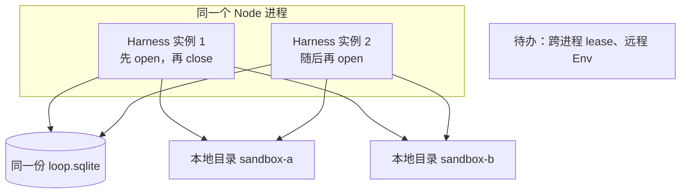
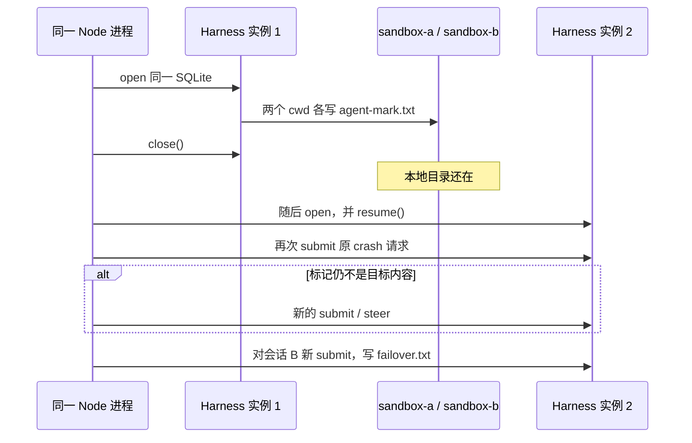

2026 年 10 月 1 日，Earendil 与 Pi 社区在 Pi 1.0 之外发布实验包 **Pi Durable**（`@earendil-works/pi-durable`）。官方定义保持克制：它不替代终端里的 coding agent，而是另一份应用合同——存储、并行会话、带检查点的 task，再挂一个可替换的 **ExecutionEnv**。

常驻个人 Agent 要回答的是：人不在键盘旁时，对话循环死了，账本和工作区文件还能不能对上。两池远程化（独立 Loop 进程 + 远程沙箱）是一份**设计提案**。公开仓库 [cFireworks/pi-durable-personal-agent](https://github.com/cFireworks/pi-durable-personal-agent) 在提交 [`e39da9ba`](https://github.com/cFireworks/pi-durable-personal-agent/commit/e39da9badfb723b8f0fda91d0407209905c8468f) 里落地的，是更窄的一块：

> **单进程、双 Harness 实例、双本地目录的恢复原型。**

脚本在 [`demos/isolation.mjs`](https://github.com/cFireworks/pi-durable-personal-agent/blob/e39da9badfb723b8f0fda91d0407209905c8468f/demos/isolation.mjs)。交接文档把跨进程 lease 和远程 Env 列在待办里，见 [`docs/handoff-csunleaf-axonfire.md`](https://github.com/cFireworks/pi-durable-personal-agent/blob/e39da9badfb723b8f0fda91d0407209905c8468f/docs/handoff-csunleaf-axonfire.md)。本文按这份源码收窄结论，不新增实测数字。脚本打印 `DEMO OK` 只说明断言走到了退出码 0，不单独证明某一类故障已经覆盖。

<!-- more -->

## 一、先分开三种寿命

个人 always-on 不是「把终端 coding agent 挂成永不退出的进程」。设计时把三种寿命拆开，避免用一次本地 `close()` 同时证明三件事：

| 寿命 | 里面放什么 | 死了或重建时希望发生什么 |
|------|------------|--------------------------|
| Loop 计算 | 跑 Harness 的那个进程 | 可以换掉；会话 id 与未完成 task 留在 storage |
| Env 计算 | 真正执行 bash / read / write 的地方 | 可以和 Loop 不同机、不同发布节奏 |
| 持久工作区与账本 | 目录或卷上的文件，加上 SQLite / 其他 storage | 比上面两者都长；重建计算单元时默认还在 |

Pi Durable 的接口允许第三列以后做成远程 Env：Harness 在一台机器上，工具通过 ExecutionEnv 跑到别处，接口故意留小。提交 `e39da9ba` **没有**实现这个远程侧。`env()` 里返回的是 `new NodeExecutionEnv({ cwd: sandbox.path })`，路径来自会话 Document。注释里写了以后可以换成远程句柄，代码路径没有换成。

官方示例 [`29-sandbox-per-conversation`](https://github.com/earendil-works/pi/blob/a13d35a742c6ef8462812a28fbe1d8c8b7431c32/packages/durable/test/examples/29-sandbox-per-conversation.ts) 同样是「每个会话一个目录」的示例，不是托管容器环境。本仓库脚本和它同一族：目录映射，外加一份 SQLite 上的受控关闭再打开。

## 二、两池是设计选项，不是这次实验的结论

交接文档的实现清单把两件事标成未做：

1. **Lease router**：一个 worker 独占一块 storage；它死后另一个进程拿到租约再 `resume()`。验收要求是两个 worker **进程**加共享租约，而不是只在进程内 `close()`。
2. **Remote env stub**：Loop 与 Env 分开到「杀掉 Loop 不会杀掉远端文件系统」。验收要求标记文件仍然按会话分开，并且 README 写明替换点。

因此「微服务 Loop 池 + 远程沙箱池」在这篇文章里只作为提案。A+Env（Loop 计算与 Env 计算分开扩缩、分开权限、分开发版）在你**已经需要**这些边界时可以当候选。当前实验没有比较同进程、持久卷、胖容器的成本，不足以把它写成默认最优架构。

| 方案 | 适合什么时候考虑 | 这份公开脚本覆盖到哪 |
|------|------------------|----------------------|
| A+Env：Loop 与 Env 分开 | 扩缩、权限或发版节奏必须拆开 | 未覆盖。Env 仍是本机 `NodeExecutionEnv` |
| 同一部署单元、持久卷留盘 | 希望重建容器时工作区还在 | 未覆盖。持久卷可以让盘比容器长，见 [Docker volume 生命周期](https://docs.docker.com/engine/storage/volumes/#a-volumes-lifecycle) |
| Loop 与 Env 绑在同一生命周期 | 运维模型要简单 | 未作为对照实验 |

本地 cwd 也不否定「工具可以在另一台机器」这句接口合同。它只说明：**这次没有跑那台机器。**

## 三、脚本实际做了什么

[`demos/isolation.mjs`](https://github.com/cFireworks/pi-durable-personal-agent/blob/e39da9badfb723b8f0fda91d0407209905c8468f/demos/isolation.mjs) 从头到尾是一个 Node 进程。`worker-1` 与 `worker-2` 是函数 `openLoopWorker()` 的两次调用：第一次 `Harness.open` 同一份 `run/loop.sqlite`，`close()` 之后，**同一个脚本**里再 `open` 一次。没有第二个操作系统进程，没有远程 Env。

`package.json` 的 `engines.node` 为 `>=22.19.0`。该提交的 lock 把 `@earendil-works/pi-durable`、`pi-ai`、`chord` 锁在 **1.0.0**（依赖范围写成 `^1.0.0`）。`npm run demo` 走 faux，不需要密钥；`npm run demo:chat` 才读 `PI_DURABLE_CHAT_API_KEY`，走 OpenAI chat-completions，模型 id 写的是 `qwen3.8-flash`。本文不报告新的耗时或 token。

### 3.1 可以留下的证据：会话映射到不同本地目录

阶段 1 为会话 A、B 各建一个目录（`sandbox-a`、`sandbox-b`），并写入同名文件 `agent-mark.txt`。脚本要求 A 的内容是 `ALICE-OK`、B 的内容是 `BOB-OK`，并且 A 里不能出现 `BOB-OK`。这条断言支持一句话：

**不同会话可以映射到不同的本地工作目录，同名标记不会串到另一个 cwd。**

这是目录映射。它不产生 seccomp、用户隔离或出站限制。下文第 4 节单独写这一点，避免和「安全沙箱」混用。

同一阶段里，用同一个 `requestId` 再 `submit` 一次，脚本比较两次 submission id 是否相同。范围是**这一次会话里的提交准入**。它不证明发信、付款或其他外部副作用只发生一次。外部动作要自己的幂等键，以及「结果待核对」：请求发出后、本地账本还没写下的窗口仍然存在。

### 3.2 受控 close / reopen：烟测，不是故障注入

阶段 2 调用的是 `harness.close()`。faux 分支先等 80 毫秒再关闭。日志字符串写了 “simulating OOM/redeploy”，操作本身不是 `SIGKILL`，也不是一次真实 OOM。chat 分支在循环里看会话上的 `ToolResultEntry` 条数；计数函数取出的是该会话最多 50 条历史，**包含阶段 1 已经完成的工具结果**。因此「条数 ≥ 1」不能证明本次 `crashReq` 的工具已经启动。若 `crash-resume.txt` 在关闭前就已经在磁盘上，脚本会打印 “finished before crash window” 然后照样 `close()`。超时也会关闭。

阶段 3 在同一进程打开第二个 Harness，调用 `resume()`，然后对会话 A **再次 `submit` 同一条 crash 请求**。若 `crash-resume.txt` 的内容还不是 `RESUMED`，脚本再发一条新的 `submit`（`whenBusy: "steer"`，另一个 `requestId`）。会话 B 的 `failover.txt=WORKER2` 来自重新打开之后的**又一次新提交**，不是原任务自己切到另一个进程。

退出条件是：目录标记正确，且 `crash-resume.txt === "RESUMED"`，且 `failover.txt === "WORKER2"`。满足就打印 `DEMO OK`。

请把两类成功分开，不要从退出码反推故障模型：

| | 含义 | 这份脚本的退出码能否单独证明 |
|--|------|------------------------------|
| （a）原任务恢复 | 关闭前已经开始的那次工具调用，在没有新的 `submit` / `steer` 的情况下做完 | 不能。成功路径上允许再提交，也允许关闭前标记已经写好 |
| （b）补发之后成功 | 重新打开后，新的 `submit` 或 `steer` 把文件写成目标内容 | 源码允许这条路径走到 `DEMO OK`。没有随仓库附上的运行日志时，不能从绿的退出码判断这次走的是（a）还是（b） |

把这次实验叫成「中途工具崩溃恢复」「无需新输入的自动续跑」或「完整 failover」，都越过了源码。可以叫它：**受控 close/reopen 烟测，外加重新打开后的再次提交。**

## 四、cwd 隔离不是安全沙箱

两个目录里的同名标记值得保留，因为它回答「会话有没有指到不同的本地工作目录」。默认的 `NodeExecutionEnv` 仍在这台机器的文件系统上执行。不同路径写出不同文件，不包含这些保证：

- 进程、用户或系统调用隔离
- 凭证看不到彼此
- 出站网络被闸门拦住
- 一个会话的历史对另一个人不可见

Durable 在这里提供的是存储上的检查点，以及按会话挑选 `cwd` 的挂钩。发信、改日历、下单这类副作用要单独规定 `replay` 与幂等键；本地 `write` 返回成功，只说明这个文件写过。

## 五、网关笔记：工具向的接通经验，不是办公后端背书

公开脚本的可选 chat 路径只配置了 chat-completions 基址 `https://token-plan.cn-beijing.maas.aliyuncs.com/compatible-mode/v1`。它没有 Anthropic 分支。

另有一项**作者此前本地脚本的观察**（不在 `e39da9ba` 的 demo 里，本文不把它当成新跑出来的数字）：用 pi-ai 的 Anthropic 兼容客户端时，`baseUrl` 应停在 `.../apps/anthropic`，去掉文档里粘贴的尾部 `/v1/messages`，否则客户端会再拼一层路径。这条只作为接 SDK 时的路径笔记。

阿里云帮助中心写明：[Token Plan 仅限 Claude Code、Codex 等 AI 工具交互式使用，不能用于后端服务](https://help.aliyun.com/zh/model-studio/base-url)。协议能返回工具调用，不能推出「适合做常驻办公后端」。办公数据放不放上这种套餐，是数据治理问题，本文不下这个结论，也不把一次 chat 接通写成生产建议。

## 六、实践时按什么验收

1. 画三列寿命：Loop 计算、Env 计算、持久工作区与账本。一张图里不要只画一个「池」。
2. 两进程 lease、远程 Env 以交接文档的待办为准。在那两项有验收之前，架构评审写「设计提案」。
3. A+Env 仅在扩缩、权限或发版边界已经是需求时列入候选，不写成本次实验选出的默认架构。
4. 会话 Document 可以记下沙箱句柄；今天的脚本只存本地 `path`。
5. `requestId` 的相同 submission id，按「同一会话的提交准入」验收。外部副作用另表：可重放吗、幂等键是什么、结果是否已核对。
6. 声称「原任务自己恢复」之前，先排除：关闭前文件是否已经写好；历史里的 tool-result 是否来自上一阶段；重新打开后有没有新的 `submit` / `steer`。
7. `close()` 只做烟测。`SIGKILL`、OOM、第二进程抢租约，各自要单独的实验。
8. 两个 cwd 的同名文件用来做映射回归，不用来宣称安全沙箱。
9. 网关路径按第 5 节记笔记；UI 若收到 thinking / `reasoning_content`，不要把它当成给用户看的正文。这是渲染约定，不是本次 demo 的输出。

## 七、结语

Pi Durable 对常驻个人 Agent 有用的部分，是一份可以嵌进应用的合同：storage、会话、检查点，以及可替换的 ExecutionEnv。提交 `e39da9ba` 把其中一块做成了能读源码的原型：一个进程里先后两个 Harness，两份本地目录，同名标记按会话分开，同一会话里 `requestId` 可以回到同一个 submission id，并且可以做受控的 `close()` 再打开。

远程两池、跨进程租约、原任务在无新输入时的恢复，都还在交接文档的待办或未区分的成功路径里。人盯着的短会话，继续用终端 coding agent 往往就够。要 redeploy 不丢账、多会话不串目录，先把上面三列寿命和验收表写出来，再决定要不要上 A+Env。实验标签仍在。

---

## 扩展阅读

**一手：**

- [Pi Durable（Earendil）](https://earendil.com/posts/pi-durable/)
- [earendil-works/pi](https://github.com/earendil-works/pi) · [`packages/durable` README](https://github.com/earendil-works/pi/blob/main/packages/durable/README.md) · 示例 [`29-sandbox-per-conversation`](https://github.com/earendil-works/pi/blob/a13d35a742c6ef8462812a28fbe1d8c8b7431c32/packages/durable/test/examples/29-sandbox-per-conversation.ts)
- 本文对读的脚本：[`demos/isolation.mjs` @ `e39da9ba`](https://github.com/cFireworks/pi-durable-personal-agent/blob/e39da9badfb723b8f0fda91d0407209905c8468f/demos/isolation.mjs)
- 待办与本文口径对齐：[`docs/handoff-csunleaf-axonfire.md`](https://github.com/cFireworks/pi-durable-personal-agent/blob/e39da9badfb723b8f0fda91d0407209905c8468f/docs/handoff-csunleaf-axonfire.md)
- npm：[`@earendil-works/pi-durable`](https://www.npmjs.com/package/@earendil-works/pi-durable)
- [阿里云 Base URL：Token Plan 的适用范围](https://help.aliyun.com/zh/model-studio/base-url)

**本博客相关：**

- [Always-on 的第一性原理：责任、时间、电脑与闸门](/2026/10/01/always-on-agent-harness-boundary/)
- [RRSI：Agent Harness 的正则化进化](/2026/10/02/rrsi-harness-regularized-evolution/)
- [Coding Agent 的执行壳体与沙箱隔离](/2026/09/30/coding-agent-harness-and-sandbox-security/)

---

*本文依据 2026-10-02 公开提交 `e39da9badfb723b8f0fda91d0407209905c8468f` 的源码与交接文档，收窄此前稿件的证据边界。没有新的运行数字；密钥未写入正文。`DEMO OK` 按脚本退出条件理解，不解释成中途崩溃自动恢复或远程两池已验证。*
