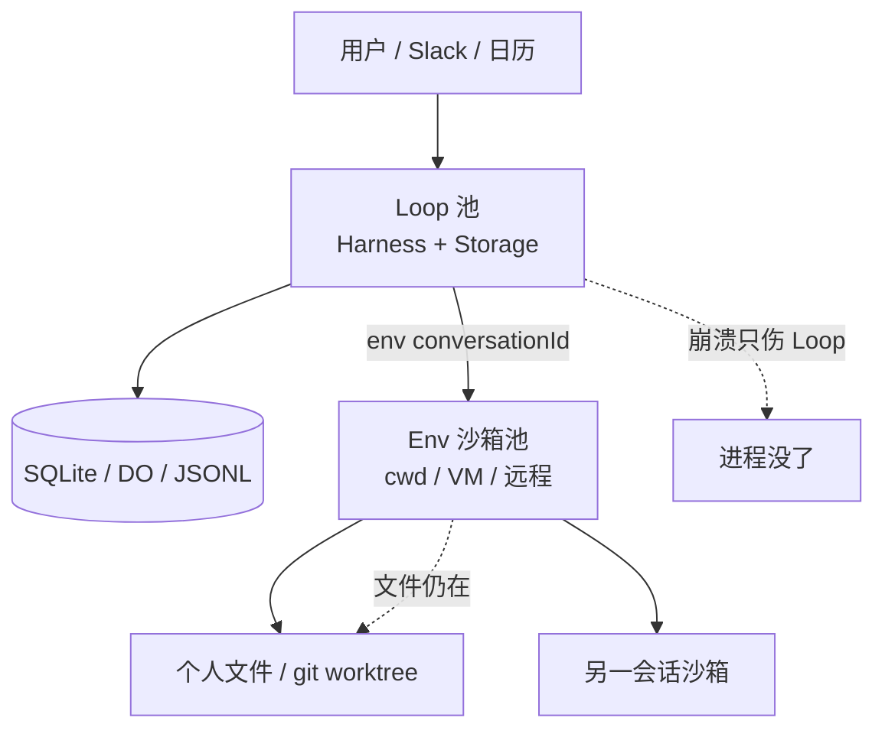
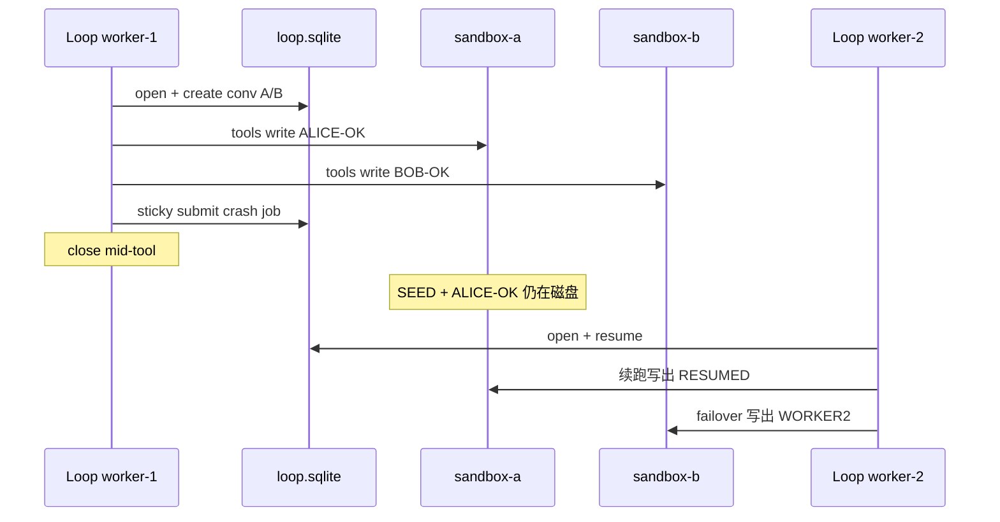

2026 年 10 月 1 日，Earendil 与 Pi 社区在 Pi 1.0 之外，把实验包 **Pi Durable**（`@earendil-works/pi-durable`）推到台前。官方定义很克制：它**不替代**终端里的 coding agent；它是另一份 harness 合同——存储 + 并行跑会话的机械装置，再挂上工具与**执行环境（ExecutionEnv）**。

前作谈 always-on 时，裂缝写在「session ≠ responsibility」「缺的是可运营 runtime」。本文把那句话收成一个**可安装、可崩溃演练**的产品问题：

> **如何用 Pi Durable 实现一台常驻个人 Agent：Loop（对话/任务调度）与沙箱（工具落盘与副作用边界）是否应该拆成两个池？拆得开吗？**

答案不是 PPT。2026-10-02（Asia/Shanghai）我们在 `@earendil-works/pi-durable@1.0.0` 上做了一份 landing demo（目录名 `pi-durable-isolation-demo`）——用阿里云 Token Plan 的 **`qwen3.8-flash`**（chat-completions）跑通双沙箱隔离、sticky `requestId`、Loop 进程中途 `close`、第二 worker failover，而沙箱目录上的文件仍在。本文以这份证据为中心；更深的双协议 / fork / steer 账本见同日笔记，不在此重复编造数字。

<!-- more -->

## 一、常驻个人 Agent 要什么合同

个人 always-on 不是「把 Claude Code 挂成 daemon」。从第一性原理拆四件事：

| 裂缝 | 个人 Agent 的日常表现 | 合同上要什么 |
|------|----------------------|--------------|
| 责任（Task vs Responsibility） | 「帮我盯邮箱 / 改仓库」跨小时、跨进程 | Document + 长会话；责任完成条件由产品定义 |
| 时间 | 人不在键盘旁；redeploy / OOM 仍发生 | 每步 checkpoint；`resume()`；sticky `requestId` |
| 空间 | 工具要写文件、跑命令；机器会换 | 可插拔 `ExecutionEnv`；沙箱寿命 ≥ Loop 寿命 |
| 闸门 | 凭证与 egress | Durable **不管** lethal trifecta；闸门外置 |

Pi coding agent 的合同是：**人在一台机器上看着，死了再说继续**。常驻个人 Agent 的合同是：**Loop 可以死，账与盘不能对不齐**。Pi Durable 官方原文已经把裂缝画开：Harness 跑在一台机器上，工具可以通过 ExecutionEnv 跑在另一台——接口刻意留小。

## 二、两种池化：Loop 池 vs 沙箱池

微服务直觉会问：要不要「一个 Agent 一个容器」？在 Durable 的词汇里，更干净的拆法是**两个池、两种寿命**。

### 2.1 Loop 池（调度与账本）

- 职责：打开 storage、`submit` / `resume`、跑 generation / tool **任务图**、对外暴露 sticky 会话。
- 寿命：宜短、宜多、可随时杀。Redeploy 是常态。
- 约束：官方明确——**一份 storage 同一时刻一个进程属主**，无跨进程锁。水平扩展 = 按 conversation/user **路由属主**（例如一对话一 Durable Object），不是多写者抢同一 SQLite。

### 2.2 沙箱池（ExecutionEnv）

- 职责：给 `bash` / `read` / `write` / `edit` 一个 `cwd`（或远程等价物）。
- 寿命：宜跟「个人工作区」走——常比 Loop worker 长。Loop 挂了，目录/容器还应在。
- 接口：`env({ conversationId, cwd, read }) → ExecutionEnv | undefined`。本地今天是 `NodeExecutionEnv({ cwd })`；远程实现同一接口即可（官方博客原话）。

### 2.3 三种拼法（取舍，无 KPI）

| 方案 | 做法 | 好处 | 税 |
|------|------|------|----|
| **A+Env 沙箱（推荐）** | Loop 池与 Env 池分离；会话 Document 记沙箱句柄 | Loop 可杀；盘可留；多会话 cwd 隔离；远程可替换 | 要自己做属主路由 + 沙箱回收策略 |
| B 同进程同 cwd | Harness 与工具共一台工作目录 | 实现最快 | Redeploy = 丢现场；多会话易串盘 |
| C 一用户一胖容器 | Loop+Env 绑死在同一生命周期 | 运维模型简单 | 扩 Loop 必须扩沙箱；冷启动重；不符合「工具可在另一台机器」的合同 |

**推荐 A+Env：** 个人 Agent 的「常驻」应落在**沙箱与 storage 的寿命**上，而不是落在某一个 Node 进程永不退出的幻觉上。

## 三、Landing demo：隔离是否可行

演示目录：`pi-durable-isolation-demo`。依赖钉死 `@earendil-works/pi-durable@1.0.0` / `pi-ai@1.0.0` / `chord@1.0.0`。Node **≥ 22.19.0**。

### 3.1 结构

1. **Loop worker** 打开 `run/loop.sqlite`（模拟 loop 微服务属主）。
2. 每会话一个 `Sandbox` Document（`path`）；`env` 按 `conversationId` 构造 `NodeExecutionEnv({ cwd: path })`。
3. 两个 cwd：`sandboxes/sandbox-a`、`sandboxes/sandbox-b`。
4. sticky `requestId` 提交；worker-1 `close()` 模拟崩溃；worker-2 打开**同一**库 `resume()`，沙箱路径不变。

官方示例 `29-sandbox-per-conversation` 用 MemoryStorage + faux 证明「每会话一目录」；本 demo 补上 **SQLite + 真实崩溃/failover + 可选真实模型**，更接近常驻个人 Agent。

### 3.2 真实模型结果（诚实账）

环境：Token Plan 北京；`PI_DURABLE_CHAT_API_KEY`（**不打印密钥**）；base `.../compatible-mode/v1`；模型 `qwen3.8-flash`。

| 检查项 | 结果 |
|--------|------|
| A 沙箱标记 | `agent-mark.txt = ALICE-OK` |
| B 沙箱标记 | `agent-mark.txt = BOB-OK` |
| 标记交叉污染 | 无 |
| sticky `requestId` | 重提同一 submission id |
| 中途 `close` | 已有 tool-result，且 `crash-resume.txt` 尚未写出 |
| worker-2 resume | `crash-resume.txt = RESUMED` |
| failover 写 B | `failover.txt = WORKER2`，B 的 cwd 未改 |
| 墙钟 | 约 37s（单次跑；**不是** SLA） |

同目录 `node demo-isolation.mjs faux` 可无密钥复现隔离与 failover 形状。

**结论（可行性）：** 在已发布的 1.0.0 上，**Loop 与 Env 沙箱按微服务边界拆开是可行的**——不是概念图，是可跑脚本。远程 Env 未在本机起容器，但接口位已留；把 `NodeExecutionEnv` 换成 RPC/SSH Env 不改变 Harness 合同。

### 3.3 这不是安全沙箱

务必写进架构评审：cwd 隔离 ≠ seccomp/egress。Durable 保证的是**一致性与续跑**；凭证隔离、出站闸门仍要 Sentinel 类外置。本地 `write` 成功也不等于「已发信」。

## 四、和个人 always-on 的映射

把 demo 直接映射成产品骨架（仍无 KPI）：

1. **用户 ↔ root conversation**；每个长期工作区一个 Env 句柄（Document）。  
2. **Slack/HTTP 入口只打到 Loop 池**；用 `requestId` 做 exactly-once，避免手机双击变双任务。  
3. **发布 Loop 镜像时只滚 Loop**；沙箱卷/目录按用户保留；启动路径强制 `resume()`。  
4. **多会话并行**：研究帖 fork 出子会话时，给子会话**新沙箱**（官方 `fork: "initial"` 的 Sandbox doc），避免帖内脚本污染主工作区。  
5. **对外副作用工具**（发信、下单）默认非 `replay: "safe"`，与 CodingTools 分注册。  
6. **UI**：`watch` ops 推增量；渲染时丢掉 thinking / `reasoning_content`（网关常见噪声）。

此前加深动手还验证过：工具轮中途崩溃可 resume、`whenBusy:"steer"`、fork/`asOf` Document、chat 与 Anthropic strip 双协议——那些是**同一合同上的其他条款**。对「能不能拆 Loop/Env」而言，isolation demo 是更直接的证据；其余条款说明办公/个人表面（插话、分叉、多协议）也接得上。

## 五、复杂度税（别假装没有）

1. **实验 API** — 可能无告警变更；钉版本。  
2. **Node ≥ 22.19**；storage 单属主。  
3. **沙箱回收** — 谁付磁盘？闲置多久删？fork 是否克隆卷？合同不管，产品要管。  
4. **故障语义** — 每个对外工具回答：可重放吗？幂等键？  
5. **npm 发布边界** — 官方 vacation TUI 在 monorepo experimental；`pi-coding-agent` npm **排除** experimental。评估「开箱」时不要把仓库截图当 install 路径；本证据站在已发布 `pi-durable`。

辩证：**常驻个人 Agent 需要的不是永不退出的进程，而是「Loop 可抛、账可续、盘可留」；过早上满 ownership/Chord 心智，会把实验税提前支付——所以先跑 isolation demo，再迁核心链路。**

## 六、实践者清单

1. 先画 **Loop / Env** 寿命令：哪边可以杀，哪边必须留。  
2. 会话 Document 存沙箱句柄；`env` 只读已提交快照。  
3. sticky `requestId` + 启动必 `resume()`。  
4. 双会话至少两个 cwd，上线前跑 isolation 脚本当门禁。  
5. 副作用表：`replay` / 幂等键；发信默认 unsafe。  
6. 属主路由：一存储一进程；按 conversation 分片。  
7. 安全另册：Durable ≠ 拆开 lethal trifecta。  
8. 网关：Anthropic `baseUrl` 去掉尾部 `/v1/messages`；UI 丢 thinking。

## 七、结语

Pi Durable 给常驻个人 Agent 的，不是「更强模型」，而是一份**可嵌入的应用合同**：Loop 负责耐久任务图，ExecutionEnv 负责工具落点。Isolation demo 表明：**微服务式 Loop + 沙箱池在 1.0.0 上跑得通**——双 cwd 不串盘，Loop 崩溃后第二 worker 能续，沙箱文件还在。

推荐默认架构是 **A+Env 沙箱**：Loop 池可扔，Env 池按个人工作区留。Vanilla coding loop 在人盯着的短会话里仍然够用；一旦你要 redeploy 不丢现场、多会话不串盘、多表面 sticky 提交，合同差额就会以运维事故催债。实验标签仍在——适合架构验证与个人 Agent 骨架；接核心链路前自备兼容层、沙箱回收与分级故障演练。

---

## 扩展阅读

**一手：**
- [Pi Durable（Earendil）](https://earendil.com/posts/pi-durable/)
- [earendil-works/pi](https://github.com/earendil-works/pi) · [`packages/durable` README](https://github.com/earendil-works/pi/blob/main/packages/durable/README.md) · 示例 `29-sandbox-per-conversation`
- npm：[`@earendil-works/pi-durable`](https://www.npmjs.com/package/@earendil-works/pi-durable)

**本博客相关：**
- [Always-on 的第一性原理：责任、时间、电脑与闸门](/2026/10/01/always-on-agent-harness-boundary/)
- [RRSI：Agent Harness 的正则化进化](/2026/10/02/rrsi-harness-regularized-evolution/)
- [Coding Agent 的执行壳体与沙箱隔离](/2026/09/30/coding-agent-harness-and-sandbox-security/)

---

*本文基于 2026-10-02（Asia/Shanghai）对 npm `@earendil-works/pi-durable@1.0.0` 的 isolation landing demo：Token Plan `qwen3.8-flash` chat 栈双沙箱 + sticky + crash resume + worker failover。未编造产品 KPI；密钥未写入正文。复现见 `pi-durable-isolation-demo/README.md`；补充笔记 `pi-durable-deep-hands-on-2026-10-02.md` §10。*
