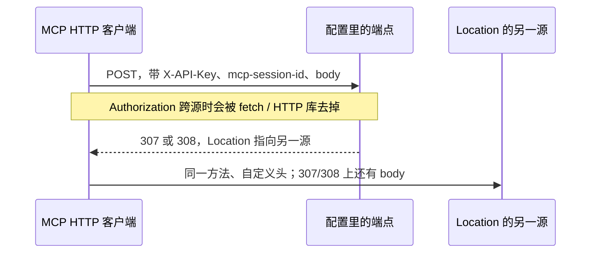

你给 MCP 的 HTTP 客户端配了 `X-API-Key`，端点写在配置里，已经用了半年。某一天上游回了 307，`Location` 指向一个你早就不续费的域名。`npm audit` 打印 `found 0 vulnerabilities`。自定义头、`mcp-session-id`，以及 307/308 上的请求体（里面可以有 `refresh_token` 和 `client_secret`），已经到了另一个源。

Python SDK 的公告把账算在你信任的端点上：服务器如果本来就是恶意的，它直接就能收到请求，重定向帮不上额外的忙。便宜的路径是这个端点自己把流量送走。同一窗口里还有一条高分、触发面窄得多的实验性 Task 隔离问题。更值得单独写的是分发：仓库公告已经公开的时候，全局漏洞库和 `npm audit` 可以同时是 0。

<!-- more -->

## 三条公告，两套时钟

2026-10-02 20:42–20:54 UTC（北京时间 10 月 3 日 04:42–04:54），下面三条的 `published_at` 落在这个窗口里。数据来自 [typescript-sdk](https://github.com/modelcontextprotocol/typescript-sdk) 与 [python-sdk](https://github.com/modelcontextprotocol/python-sdk) 的仓库 `security-advisories` API。三条的 `cve_id` 都是空的。

| 公告 | 包与受影响范围 | 修复版本 | CVSS 3.1 | CWE |
|------|----------------|----------|----------|-----|
| [GHSA-6prh-2h8m-c8cw](https://github.com/modelcontextprotocol/typescript-sdk/security/advisories/GHSA-6prh-2h8m-c8cw) | `@modelcontextprotocol/sdk` `< 1.32.0`（公告正文：截至 1.31.0 的全部 1.x）；`@modelcontextprotocol/client` `2.0.0`–`2.2.0` | sdk **1.32.0**，client **2.3.0** | 6.5，中<br>`AV:N/AC:H/PR:N/UI:N/S:U/C:H/I:L/A:N` | CWE-200 |
| [GHSA-5h93-6whr-6q8j](https://github.com/modelcontextprotocol/python-sdk/security/advisories/GHSA-5h93-6whr-6q8j) | `mcp` `1.8.0`–`1.29.1`，以及 `2.0.0`–`2.1.1` | **1.30.0** / **2.2.0** | 5.9，中<br>`AV:N/AC:H/PR:N/UI:N/S:U/C:H/I:N/A:N` | CWE-200 |
| [GHSA-22jm-h49p-29qw](https://github.com/modelcontextprotocol/typescript-sdk/security/advisories/GHSA-22jm-h49p-29qw) | `@modelcontextprotocol/sdk` `1.24.0`–`1.31.0`。2.x 包不受影响 | **1.32.0**（公告建议优先停用该功能） | 8.6，高<br>`AV:N/AC:L/PR:N/UI:N/S:U/C:H/I:L/A:L` | CWE-639、CWE-862 |

报告者登录名也在公告的 credits 里：TypeScript 重定向是 `nickelsec`，Python 重定向是 `dodge1218` 与 `nickelsec`，Task 是 `cipher-creator`。

修复进包的时间和公告发布时间不是同一天，这是第一条独立于「有个洞」的事实。

- Python 的同源重定向限制随 [v1.30.0](https://github.com/modelcontextprotocol/python-sdk/releases/tag/v1.30.0) 和 [v2.2.0](https://github.com/modelcontextprotocol/python-sdk/releases/tag/v2.2.0) 在 2026-09-07 发布（PyPI 上传时间分别是 14:34Z 和 16:06Z）。对应 PR [#3448](https://github.com/modelcontextprotocol/python-sdk/pull/3448)、[#3397](https://github.com/modelcontextprotocol/python-sdk/pull/3397) 在 9 月 4–5 日合并。公告是 10 月 2 日才公开的。
- TypeScript 的 1.x 修复在 [1.32.0](https://github.com/modelcontextprotocol/typescript-sdk/releases/tag/1.32.0)（GitHub Release 2026-10-02 17:28Z，npm 上 `1.32.0` 的发布时间 17:32Z）。2.x 客户端在 [@modelcontextprotocol/client@2.3.0](https://github.com/modelcontextprotocol/typescript-sdk/releases/tag/%40modelcontextprotocol/client%402.3.0)（17:43Z）。重定向 PR [#2902](https://github.com/modelcontextprotocol/typescript-sdk/pull/2902) / [#2901](https://github.com/modelcontextprotocol/typescript-sdk/pull/2901) 9 月 30 日已合并，但 9 月 28 日发出的 1.31.0 / client 2.2.0 赶不上。Task 修复是 PR [#2925](https://github.com/modelcontextprotocol/typescript-sdk/pull/2925)，10 月 2 日合并后进了 1.32.0。

所以「公告日」只告诉你披露日。Python 用户如果 9 月 7 日跟过 release note 里的 behaviour change，代码已经挡住跨源跳转；只盯 CVE 编号的人，到 10 月 4 日仍然没有 CVE 可盯。

这和本站前两篇沙箱文章不是同一层。沙箱讨论的是 Agent 进程、文件系统和网络隔离。这里是 MCP **客户端传输**把密钥交给重定向目标，以及安全公告**进不进**扫描器用的漏洞库。stdio 客户端不在重定向的影响面里。

## 平台会剥掉 Authorization，不会剥你的自定义头

两边公告对 `Authorization` 的说法一致。TypeScript：当前运行时里，`fetch` 在跨源时已经丢掉 `Authorization`。Python：单独的 `Authorization` bearer 不会因此泄漏，HTTP 库在跨源重定向时会去掉它。

这是 Fetch 标准的行为，不是 SDK 的发明。2026-09-21 更新的 Fetch 活标准把 CORS non-wildcard request-header name 定义成与 `Authorization` 大小写不敏感匹配的那一个头；HTTP 重定向算法里，当前 URL 的源和 `Location` 的源不同时，就从请求头列表删掉这类头。旁边的注释写的是：一旦初始请求之后看见另一个源，`Authorization` 就被移除。

`X-API-Key`、`mcp-session-id` 不在这张删除名单上。307 和 308 在 [RFC 9110](https://www.rfc-editor.org/rfc/rfc9110.html#section-15.4.8) 里要求自动重定向时不改方法（[308](https://www.rfc-editor.org/rfc/rfc9110.html#section-15.4.9) 同理），请求体还在。301/302/303 经常被客户端改成 GET 并丢掉 body，所以公告把请求体泄漏单独写在 307/308 上。OAuth 的 token 请求正好是这种带 body 的 POST：`refresh_token`、`client_secret` 会跟着走。



Python 公告给出的威胁模型可以原句引用：

> Anyone able to make an endpoint you trust redirect elsewhere (a stale redirect to a lapsed domain, a misrouted proxy rule, redirect logic an attacker can influence) could capture that material. A server that is itself malicious gains nothing this way; it already receives your requests directly.

谁该对号入座，以公告正文为准。

| | 重定向（TS / Python） | 实验性 Task（仅 TS 1.x） |
|--|----------------------|-------------------------|
| 受影响 | TS：`StreamableHTTPClientTransport`、`SSEClientTransport`、SDK 的 OAuth（如 `auth()`）。Python：`streamable_http_client`（2.x 上把 `http(s)` URL 交给 `Client` 也算）、`streamablehttp_client`、`sse_client`、带 HTTP 参数的 `ClientSessionGroup`、内部的 `create_mcp_http_client`，以及 SDK 自带的、修复前会跟随任意重定向的默认客户端。自己传入且 `follow_redirects=True` 的客户端也算 | HTTP 服务端把 `taskStore` 传给了 `McpServer` 或 `Server`，且多个客户端共用一个 `InMemoryTaskStore` |
| 不受影响 | 两边的 stdio 客户端。Python 公告还写明：MCP 服务端本身不受这条影响；你传入的客户端如果把 `follow_redirects` 留在默认的 `False`，也不受影响 | 从未传入 `taskStore`。`@modelcontextprotocol` 的 2.x 包不在这条范围里 |
| 泄漏或越权的材料 | 自定义头（公告举例 `X-API-Key`）、`mcp-session-id`；307/308 上的 body，包括 OAuth 的 `refresh_token` 与 `client_secret` | 别的客户端的 task：列出、读取、取消 |

两边 CVSS 都给了 `AC:H`（攻击复杂度高），完整性分量却不一致：TypeScript 是 `I:L`，Python 是 `I:N`。文字里的泄漏面几乎一样。排优先级时读影响范围，不要只比 6.5 和 5.9。

## 修复只跟随同源，逃生口会把旧行为请回来

1.32.0 的升级说明和 client 2.3.0 的 release note 把新规则写清楚了：只跟随留在同一源里的重定向（同样的 scheme、host、port；同一 host 上从 http 升到 https，且用默认端口），并且保持方法（307/308，或任意状态码下的 GET）。其它重定向不跟随。浏览器里页面看不到重定向目标，所以默认情况下重定向的请求直接失败，除非你打开逃生口。Python 1.30.0 / 2.2.0 是同一条边界。公告写明跨源失败时 2.x 抛 `MCPError`、1.x 抛 `httpx.HTTPStatusError`；v2.2.0 的 release note 另补了一句，SSE 连接失败时是 `httpx2.HTTPStatusError`。尾部斜杠这种同源跳转继续可用，不必为了它打开「跟随所有重定向」。

合法地跨主机跳转（例如 TLS 终结在另一台机器上）的做法是把**最终 URL** 写进配置。用逃生口换连通性，等于把公告修掉的路径打开。

TypeScript 的逃生口是传输选项 `redirectPolicy: 'follow'`。1.32.0 的 `StreamableHTTPClientTransportOptions` 里，默认是 `'same-origin'`；`'follow'` 把重定向交回 `fetch`，也就是修复前的行为。我对照了 1.31.0 的源码：那里还没有 `redirectPolicy` 这个字段，它是修复的一部分，不是旧版本上的缓解开关。

暂时不能升级时，公告给的做法是传入一个拒绝重定向的 `fetch`。1.31.0 的 Streamable HTTP 和 SSE 传输都有 `fetch` 选项，所以这条在受影响版本上可用：

```ts
import { StreamableHTTPClientTransport } from '@modelcontextprotocol/sdk/client/streamableHttp.js';

// 升级到 1.32.0 之前的止血。redirect: 'error' 让这一跳失败，而不是跟着 Location 走。
const transport = new StreamableHTTPClientTransport(new URL(process.env.MCP_URL!), {
  fetch: (url, init) => fetch(url, { ...init, redirect: 'error' }),
  requestInit: {
    headers: { 'X-API-Key': process.env.MCP_API_KEY ?? '' }
  }
});
```

升级之后，不要把 `requestInit.redirect = 'error'` 当成已经盖住 OAuth。1.32.0 的类型注释写明：消息 POST 和 DELETE 会把 `'error'` / `'manual'` 原样交给 `fetch`，OAuth 只在 `redirectPolicy` 为 `'follow'` 时才读这个字段。client 2.3.0 的 release note 把传输自己的 GET 也算进会传递该字段的请求，OAuth 仍然默认不读它。真正的开关是 `redirectPolicy`。

Python 的不对称更值得在 code review 里写下来。修复前，SDK 默认客户端跟随任意重定向；你自己传入的客户端只有 `follow_redirects=True` 才会跟。修复后的 release note 说：你传进去的 `httpx.AsyncClient` 上的 `follow_redirects` **不再**被 MCP 请求使用。也就是说，升级之后仅仅写下 `follow_redirects=True`，并不会把洞请回来。

会把洞请回来的，是公告放在「unsupported」折叠区里的那种客户端：`send()` 里无视参数，强制 `follow_redirects=True`。公告明确说这会恢复本次修复掉的行为，并建议改成配置最终 URL。评审时把下面这种覆写当成和 `redirectPolicy: 'follow'` 同级的安全开关，而不是普通的 HTTP 调参。

```python
import httpx  # 2.x 公告示例里对应的是 httpx2.AsyncClient

class FollowRedirectsAnyway(httpx.AsyncClient):
    """会跟随任意源。这是在放弃 SDK 的同源限制。"""

    async def send(self, request, *, follow_redirects=False, **kwargs):
        return await super().send(request, follow_redirects=True, **kwargs)
```

## 高分的 Task 问题，触发面窄，而且功能已被标成弃用

[GHSA-22jm-h49p-29qw](https://github.com/modelcontextprotocol/typescript-sdk/security/advisories/GHSA-22jm-h49p-29qw) 的分数是 8.6，高于两条重定向。触发条件也写在公告第一屏：只有 HTTP 服务端把 `taskStore` 传给 `McpServer` 或 `Server` 才相关。实验性 tasks 让共用一个 `InMemoryTaskStore` 的客户端可以列出、读取、取消彼此的 task。公告给出的分诊命令是：

```bash
grep -ri taskstore --exclude-dir=node_modules .
```

没有命中就不受这条影响。

PR [#2925](https://github.com/modelcontextprotocol/typescript-sdk/pull/2925) 补充了一个实现细节：`TaskStore` 的方法本来就有可选的 `sessionId`，签名没改；`InMemoryTaskStore` 之前不用它，1.32.0 开始用。别的 session 来取，结果和未知 task id 一样；`listTasks` 只翻本 session 的页。因此升级的行为变化也包括：新 session 够不到自己上一节会话留下的 task。公告的原话是，客户端新开一个 session 之后，到不了更早的 task。如果有人靠 task id 跨重连接着查，升级会改变这件事。

公告同时说实验性 tasks 已弃用，2026-07-28 规范用重新设计的扩展替换了它们，最好的处理是停用。1.32.0 修了隔离，但继续把 `taskStore` 留在生产路径上，等于把一条已标弃用的实验 API 留在多租户边界上。暂时不能升级时，去掉 `taskStore`，或每个 session 一个 `InMemoryTaskStore`。自定义的 store 如果继续忽略 `sessionId`，PR 描述的修复不会自动落到你的实现上；「一个 session 一个 store」这条缓解仍然适用。

Python 在 2026-06-05 发过同类问题，不是同一条公告：[GHSA-hvrp-rf83-w775](https://github.com/modelcontextprotocol/python-sdk/security/advisories/GHSA-hvrp-rf83-w775)（[CVE-2026-52870](https://github.com/advisories/GHSA-hvrp-rf83-w775)，CVSS 7.6，向量里是 `PR:L`）。`server.experimental.enable_tasks()` 的默认处理函数不看 session，其它已连接客户端可以观察、读结果、取消，并取走排队消息。修复是 `mcp` 1.27.2（范围 `1.23.0`–`1.27.1`），`run_task()` 生成的 id 带上每 session 的不透明标记；显式指定的 id 仍可按 id 访问，但不会被列出来。分诊是 `grep -r enable_tasks`。那条已经有 CVE，也进了全局库，下面拿它当对照。TypeScript 这条到写作时还没有 CVE。

## 扫描器是 0，是因为库里没有这条记录

2026-10-04 我按公开接口核对了分发，而不是只看仓库页面。

| 渠道 | 对这三条新公告 | 对照（已审阅的旧问题） |
|------|----------------|------------------------|
| `GET /repos/.../security-advisories/{GHSA}` | 三条都是 `published`，正文、范围、CVSS 如上 | 同一接口也能拿到 GHSA-hvrp-rf83-w775 |
| `GET /advisories/{GHSA}`（全局 GitHub Advisory Database） | 三条都是 **404** | GHSA-hvrp-rf83-w775 返回 200，`github_reviewed_at` 为 2026-07-16，CVE-2026-52870 |
| OSV `GET /v1/vulns/{GHSA}` 与按版本 `POST /v1/query` | 三条 404。`@modelcontextprotocol/sdk@1.31.0`、`@modelcontextprotocol/client@2.2.0`、`mcp@1.29.1`、`mcp@2.1.1` 的查询结果都是 0 条 | `mcp@1.27.1` 能查到 GHSA-hvrp-rf83-w775 等已入库记录 |
| `npm audit`（npm 10.9.7，Node 22.14.0，audit report v2） | 只依赖 `@modelcontextprotocol/sdk@1.31.0` 的 lockfile，`vulnerabilities.total` 为 **0** | 同样的命令钉在 `1.25.1`：`total` 为 1、级别 high，via 里是已入库的跨客户端泄漏（[GHSA-345p-7cg4-v4c7](https://github.com/advisories/GHSA-345p-7cg4-v4c7) / CVE-2026-25536）和 ReDoS（[GHSA-8r9q-7v3j-jr4g](https://github.com/advisories/GHSA-8r9q-7v3j-jr4g) / CVE-2026-0621） |

`npm audit` 查询的是 GitHub Advisory Database，这是 [GitHub 自己的说明](https://github.blog/security/supply-chain-security/github-advisory-database-now-powers-npm-audit/)。仓库公告要经过审阅，才会变成带生态系统和受影响版本、可供告警的全局记录。Dependabot alerts 的文档同样写的是消费已审阅公告。我没有打开某个仓库的 Dependabot 收件箱，因此只断言写作当天这三条不在全局库和 OSV 里：只跑 `npm audit`、只查 OSV 的门禁看不到它们。

1.25.1 的对照说明扫描器没有坏，它能报出已经入库的问题。Python 那条 Task 公告从仓库发布（2026-06-05）到全局库的 `github_reviewed_at`（2026-07-16）隔了 41 天，而且当时已经有 CVE。这次到 10 月 4 日仍没有 CVE，全局接口仍是 404。窗口以后会不会合上，要再查一次接口。在合上之前，空的 CVE feed 不能当成「客户端 SDK 这周没有这件事」。要看的页面是两个仓库的 `/security-advisories`。

可以自己复现 npm 这一侧：

```bash
mkdir /tmp/mcp-audit && cd /tmp/mcp-audit
printf '%s\n' '{"name":"mcp-audit","private":true,"dependencies":{"@modelcontextprotocol/sdk":"1.31.0"}}' > package.json
npm install --package-lock-only --ignore-scripts
npm audit
# 2026-10-04、npm 10.9.7：total 0
```

## 清单：先分清你是客户端还是那个共享的 store

按角色做，避免把 8.6 的实验功能误当成所有人的紧急项，也避免把 6.5 的客户端问题留在「等 CVE」里。

**HTTP / SSE / OAuth 客户端**

1. 1.x TypeScript 升到 `@modelcontextprotocol/sdk@1.32.0` 或更新。2.x 客户端升到 `@modelcontextprotocol/client@2.3.0` 或更新。Python 1.x 升到 `mcp` 1.30.0 或更新，2.x 升到 2.2.0 或更新。两条主版本线不要混成一句 `>=1.30.0`：钉在 2.1.1 的环境不会被 1.30.0 这条下限带上去。
2. 升级后如果连不上，先看是不是跨主机重定向。把端点改成 `Location` 的最终 URL。不要为了恢复连通性去设 `redirectPolicy: 'follow'`。
3. 不能升级时：TypeScript 用拒绝重定向的 `fetch`；Python 传入 `follow_redirects` 保持默认 `False` 的客户端（`streamable_http_client` 的 `http_client=`，`sse_client` / `streamablehttp_client` 的 `httpx_client_factory=`）。公告写明 `ClientSessionGroup` 没有对应参数。
4. 若重定向可能已经落到你不控制的主机，轮换当时带着的 API key 和 `client_secret`，并撤销 token。公告把轮换限定在这个条件上，不是要求所有安装都轮换。stdio-only 的部署不在这条泄漏路径上。

**把 `taskStore` 交给服务端的人**

1. 跑公告里的 `grep -ri taskstore --exclude-dir=node_modules .`。没有命中就可以把 8.6 从本次清单划掉。
2. 有命中：优先删除。还要实验性 tasks 的，升到 1.32.0，并确认没有把一个 `InMemoryTaskStore` 挂在所有 session 上。自定义 store 要真正使用 `sessionId`。
3. 升级说明要通知调用方：新 session 看不到旧 session 的 task。

**看门禁的人**

1. 把 `redirectPolicy: 'follow'` 和「`send()` 里强制跟随重定向」当成安全相关 diff，和关掉 TLS 校验同一级，而不是风格问题。修复前的 Python 代码还要看 `follow_redirects=True`，因为那时它确实会跟。
2. CI 继续跑 `npm audit` / OSV。依赖里出现这两个 SDK 时，再看仓库的 Security Advisories。只等全局库，会把客户端密钥留在「扫描是绿的」那几天里。
3. 记下核对日期。本文的 404 和 `total: 0` 是 2026-10-04 的观察。公告入库之后 `npm audit` 应当开始报；在那之前，绿的结果不覆盖这三条。

## 客户端默认值也是安全边界

Python 的重定向 PR 把历史写清楚了：尾部斜杠和托管平台的 307 让默认客户端跟随任意 `Location`。省下的配置变成了自定义头的传递策略。只用 Bearer 测过重定向的人，会以为平台已经把凭证拿掉；`X-API-Key` 不在 Fetch 那张删除名单上。

Task 是另一类默认值。`sessionId` 在签名里，`InMemoryTaskStore` 曾经不用它。8.6 描述的是「用了，并且多人共享一个 store」；弃用说明描述的是「它不该继续当多租户边界」。grep 决定你读哪一句。

仓库公告、全局库、CVE、OSV、`npm audit` 是五套时钟。参考 SDK 这种被大量客户端间接依赖的包，披露后的前几天往往只有第一套在走。把 `0 vulnerabilities` 写进发布说明之前，先问这句问的是哪一套。

## 结语

十月这三条公告里，重定向的教训是：跨源时平台保的是 `Authorization`，你的自定义头和 307/308 的 body 要靠客户端自己停下来。Task 的教训是：实验性的共享存储要先问它认不认识 session，认不出来就删掉。审计的教训是：仓库 `/security-advisories` 已经写了受影响版本，全局库和 `npm audit` 仍可以是 0。

今天可以做的事就三件：HTTP 客户端升到公告写的版本，或在升级前拒绝重定向；grep 一次 `taskstore`；如果跳转可能出过你的控制域，轮换那批密钥。

---

## 扩展阅读

**公告与修复版本（一手来源）**

- [GHSA-6prh-2h8m-c8cw](https://github.com/modelcontextprotocol/typescript-sdk/security/advisories/GHSA-6prh-2h8m-c8cw) — TypeScript 跨源重定向
- [GHSA-5h93-6whr-6q8j](https://github.com/modelcontextprotocol/python-sdk/security/advisories/GHSA-5h93-6whr-6q8j) — Python 跨源重定向
- [GHSA-22jm-h49p-29qw](https://github.com/modelcontextprotocol/typescript-sdk/security/advisories/GHSA-22jm-h49p-29qw) — TypeScript 实验性 Task 未绑定 session
- [GHSA-hvrp-rf83-w775 / CVE-2026-52870](https://github.com/advisories/GHSA-hvrp-rf83-w775) — Python 早先的 Task 越权，已进入全局库
- [typescript-sdk 1.32.0](https://github.com/modelcontextprotocol/typescript-sdk/releases/tag/1.32.0)、[@modelcontextprotocol/client 2.3.0](https://github.com/modelcontextprotocol/typescript-sdk/releases/tag/%40modelcontextprotocol/client%402.3.0)
- [python-sdk v1.30.0](https://github.com/modelcontextprotocol/python-sdk/releases/tag/v1.30.0)、[v2.2.0](https://github.com/modelcontextprotocol/python-sdk/releases/tag/v2.2.0)

**协议与平台行为**

- [Fetch：HTTP redirect fetch](https://fetch.spec.whatwg.org/#http-redirect-fetch) 与 [CORS non-wildcard request-header name](https://fetch.spec.whatwg.org/#cors-non-wildcard-request-header-name)（活标准，本文核对的页面标注 Last Updated 21 September 2026）
- [RFC 9110 §15.4.8 307](https://www.rfc-editor.org/rfc/rfc9110.html#section-15.4.8)、[§15.4.9 308](https://www.rfc-editor.org/rfc/rfc9110.html#section-15.4.9)
- [MCP 规范 2026-07-28](https://modelcontextprotocol.io/specification/2026-07-28) — 公告所称替换实验性 tasks 的规范修订

**漏洞库为什么会和仓库公告不一致**

- [GitHub Advisory Database 如何驱动 npm audit](https://github.blog/security/supply-chain-security/github-advisory-database-now-powers-npm-audit/)
- [About the GitHub Advisory Database](https://docs.github.com/en/code-security/concepts/vulnerability-reporting-and-management/github-advisory-database)
- [OSV API](https://google.github.io/osv.dev/post-v1-query/)

---

*GHSA、CVSS、版本范围和引文核对于 2026-10-04：仓库 security-advisories API、Release、npm/PyPI 发布时间、Fetch 标准、OSV 与全局 Advisory API。`npm audit` 在 npm 10.9.7、Node 22.14.0 上跑 lockfile。全局库日后若审阅入库，扫描结果会变，公告里的影响面不变。*

## 讨论

你的 MCP HTTP 客户端把密钥放在哪种头里？门禁如果只看 `npm audit` 的退出码，这两个 SDK 仓库的 Security Advisories 页面由谁在看？欢迎对照自己的 lockfile 把结论留在评论里。
