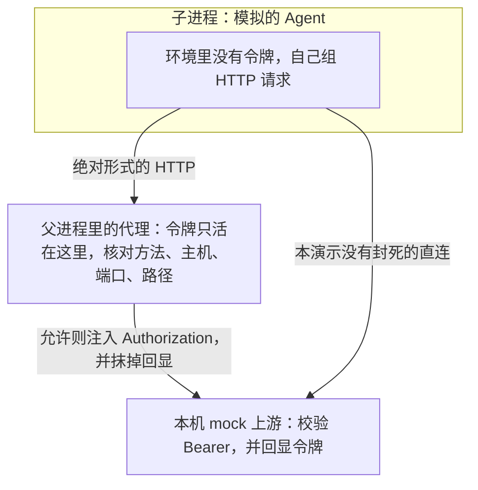

Agent 要在仓库里待三个小时：拉起 Postgres，跑 `docker compose`，改完再把测试跑完。只许执行一条命令的隔离，会在第一分钟撞上「这里没有 Docker」。给它一台 Linux，任务就能往下走。2026 年 9 月底到 10 月初，Docker 和 Modal 把这件事写成了可以打开的产品页。

电脑补上的是兼容性。三个小时里会把仓库、令牌和内网一起卷进去的，是这台电脑拿着谁的密钥、能连哪些地址。长任务把沙箱从关一条命令的牢房换成 Agent 住进去的电脑之后，要单独记账的边界是凭证注入和出站策略。

<!-- more -->

## 两家都在交一台电脑

隔离怎么选、harness 和沙箱各管哪一段，本站已经写过。[执行壳体与沙箱隔离](https://cfireworks.github.io/2026/09/30/2026-09-30-coding-agent-harness-and-sandbox-security/)把循环和隔离拆开，[沙箱边界](https://cfireworks.github.io/2026/10/01/2026-10-01-agent-sandbox-security-boundary/)画过技术对照，里面有一张密钥代理的示意图，那张图没有跑过代理。[Always-on 的第一性原理](https://cfireworks.github.io/2026/10/01/2026-10-01-always-on-agent-harness-boundary/)写过 Muse 的 Sentinel：凭证不进模型上下文，出站由另一侧代发。[Pi Durable](https://cfireworks.github.io/2026/10/03/2026-10-03-pi-durable-office-agent-harness/)把本地目录映射说清楚了：那是工作区寿命，不是安全沙箱。这篇接在后面。上一篇沙箱文章里的启动时间表，本文不沿用，那些数字不是这次测的。

两则一手公告把「住进去的电脑」说具体了。

[Modal 的 VM Sandboxes](https://modal.com/blog/vm-sandboxes-agent-computers) 在 2026-10-01 由 Amit Prasad 宣布一般可用。Sandbox 原来跑在 gVisor 上。新运行时用一个参数切换：

```python
sb = modal.Sandbox.create(app=app, runtime="vm")
```

公告写明 gVisor 仍是默认。两边共用同一套 API、`modal.Image`、exec 与文件系统接口，以及按量价格。要换上去的理由写得很直：Agent 要跑 Docker 栈、本地数据库、开发服务器、图形环境和移动模拟器，还要动 Linux 内核。原话是 agents just want a computer。实现从 Rust 的 Cloud Hypervisor 做起，上面加了宿主文件系统、懒加载镜像、内存突发和快照。API 故意保持容器的形状，现有调用不用改写。公告里的示例用 `docker:dind` 跑 `docker run hello-world`，`uname` 的示例输出写成 `Linux modal 7.2.6`。那是他们贴出来的输出，我没有在 Modal 上复现。

同一页的客户故事都是整机里再套一层。公告称 Linear 的每条 Coding Session 都跑在 VM Sandbox 上，并在里面用 cgroup 和 network namespace 分开 agent、dev server 和自己的进程。Modal 引用 Legora：为了在沙箱里跑 Docker，他们做过网络和 FUSE 绕行，换到 VM 后删掉了。Snorkel 的仿真每次要一台完整的机器，里面跑多个容器。「超过 2000 万台 VM」和亚秒冷启动是 Modal 写在公告里的数字，不是我的测量。

[Docker Cloud Sandboxes](https://www.docker.com/blog/introducing-cloud-sandboxes-start-on-your-laptop-finish-in-the-cloud/) 在 2026-09-24 由 Timir Karia 和 Srini Sekaran 发布。今年早些时候的 Docker Sandboxes 已经是 microVM：自己的内核，自己的 Docker 守护进程，和宿主机隔开。Cloud Sandboxes 是同一套 microVM，跑在 Docker 托管的计算上。`sbx move my-project --to cloud` 抓下文件系统，在另一侧重建。会话默认 1 小时，最长 24 小时。暂停不计费，卷、出站、公开镜像和 Kit 也不计费，推理可自带模型密钥。计算按秒。公告五档：Micro $0.07/小时（1 vCPU / 2 GiB），默认 Small $0.14（2 vCPU / 4 GiB），Medium $0.28（4 vCPU / 8 GiB），Large $0.56（8 vCPU / 16 GiB），XL $1.12（16 vCPU / 32 GiB）。需要 `sbx` 0.45.1 或更新，按量计划在 Personal 和 Pro。本机 Sandbox 仍免费，不要求 Docker Desktop。本机和云的密钥、模板、网络策略分开存。

公告把长任务需要的三样东西写成 Kit、MCP 网关、密钥和网络策略。Kit 是预置沙箱，点名 Claude Code、Codex、Copilot、Antigravity、Open Code 和 Hermes，例如 `sbx --cloud run claude`。密钥那句是本文要拆开的：代理按请求注入，Agent 看不到密钥本身。网络策略集中定义可访问的端点。企业向的集中治理，公告写的是即将通过 Docker AI Governance 提供。

我没有在这台机器上安装或登录 `sbx`，也没有调用 Modal。产品行为以下面核对过的文档为准。演示只覆盖我自己写的那个代理。

## 隔离层还在，下一行账在出站

四档隔离回答能不能碰到宿主。整机多出来的是进去之后像不像一台开发机。这是两笔账。

| 维度 | 共享内核的容器 | gVisor | microVM（Docker Sandboxes） | 整机 VM（Modal `runtime="vm"`） |
|------|----------------|--------|------------------------------|--------------------------------|
| 边界 | 宿主内核上的 namespace、cgroup、seccomp | 用户态内核拦截系统调用 | 每个沙箱自己的 Linux 内核 | 每个沙箱自己的内核，公告写明从 Cloud Hypervisor 做起 |
| 兼容 | 普通进程顺；Docker-in-Docker、FUSE、冷门内核特性常常要绕 | Modal 把它留作默认，并写明撞上用户态的墙再换 VM | 沙箱内另起一份 Docker Engine，本机文档写明碰不到宿主引擎 | 公告的目标就是 Docker、FUSE 和冷门内核特性 |
| 冷启动和密度 | 这次没有测量 | 这次没有测量。Modal 称 VM 运行时延续原来的亚秒冷启动，这是厂商陈述 | 9 月 24 日的公告没有给冷启动或单机密度 | 同上。2000 万台 VM 是 Modal 对早期客户的陈述 |
| 进去之后能造成的伤害 | 逃到宿主的门槛相对低；能力还受镜像限制 | 逃逸要先经过 gVisor；里面仍然缺一整台机器 | 逃逸要经过 hypervisor；里面已经是一台带 Docker 的 Linux | 逃逸同样要经过虚拟化层；里面更接近开发者的电脑，能做的事更多 |

前三行能从公告和 [Docker 隔离层文档](https://docs.docker.com/ai/sandboxes/security/isolation/)对出来。最后一行是判断。这次没有对照压测，表里没有毫秒。

什么时候整机是多余的，按工作负载判断：

- 一条 `pytest` 或 `npm test`，不需要 Docker，不需要 FUSE。gVisor 或带 seccomp 的容器已经把宿主隔开。整机多付的是一个用不上的内核。
- 担心的是它删掉宿主文件。microVM 或容器回答的就是这件事。再换一台更像笔记本的 VM，进去之后能调用的工具变多，宿主那一侧的门槛仍是虚拟化层。
- 评测只依赖一个语言运行时，跑几分钟。为了「和线上开发环境一致」去开 Docker-in-Docker，买的是兼容性。爆炸半径会跟着 Compose 里的数据库和内网一起变大。

Modal 的建议和这个判断同向：现有工作负载继续留在 gVisor，碰到 Docker、FUSE 或冷门内核特性再切 `runtime="vm"`。Docker 把 microVM 同时放在本机和云上，云上的机器不上睡眠。机器放在哪，不决定密钥在哪。

## 我跑的代理，和文档里的代理

10 月 1 日那篇里的密钥代理是一张概念图：Agent 请求 push，代理核对仓库白名单，再用真实密钥执行。下面这次把同一类边界用标准库跑通，并对照 Docker 现在写进文档的行为。演示比那张图窄，只有 HTTP，没有 git。也比产品窄：没有 microVM，没有强制的网络命名空间。



代理握着令牌 `demo-token-not-a-real-secret`。这是写在脚本里的假字符串，不是任何一家的密钥。允许的只有 `GET 127.0.0.1:<上游端口>/v1/issues`。查询字符串不参与判断。命中之后代理自己写 `Authorization`，入站请求里如果已经有这个头，会被盖掉。上游若把令牌写进响应体，代理先替换成 `[redacted]` 再交回去。没命中的请求在打开上游套接字之前就回 403。子进程的环境是重新组装的，只有 `PATH`、`HOME`、`LANG`、`PROXY` 和 `UPSTREAM`。

脚本不实现 `CONNECT`，也没有跟随 `Location` 的分支。这两条是读代码就能看见的缺口，不是另一次实验的结论。真实的 HTTPS 出站常常走 `CONNECT` 或透明代理，这次覆盖不到。重定向会把已经注入的 `Authorization` 带到下一跳，[前天那篇 MCP 公告](https://cfireworks.github.io/2026/10/04/2026-10-04-mcp-sdk-redirect-audit-blind-spot/)写的就是跨源时谁还带着头。这次没有发 302。

### 脚本

Python 3.12.3，只依赖标准库。我执行的命令是：

```bash
python3 /tmp/secret_proxy_demo.py
```

```python
#!/usr/bin/env python3
"""最小出站密钥代理。令牌只存在于本进程，子进程环境里没有它。"""

from __future__ import annotations

import hashlib
import json
import os
import socket
import subprocess
import sys
import threading
from http.server import BaseHTTPRequestHandler, ThreadingHTTPServer
from urllib.parse import urlsplit

TOKEN = "demo-token-not-a-real-secret"
TOKEN_FP = hashlib.sha256(TOKEN.encode()).hexdigest()[:12]


class Upstream(BaseHTTPRequestHandler):
    hits = 0

    def do_GET(self):
        self._reply()

    def do_POST(self):
        self._drain()
        self._reply()

    def _drain(self):
        n = int(self.headers.get("Content-Length", "0") or 0)
        if n:
            self.rfile.read(n)

    def _reply(self):
        Upstream.hits += 1
        auth = self.headers.get("Authorization", "")
        if auth != f"Bearer {TOKEN}":
            status, body = 401, {
                "error": "missing or wrong authorization",
                "auth_present": bool(auth),
            }
        else:
            status, body = 200, {
                "ok": True,
                "method": self.command,
                "path": self.path,
                "auth_fp": TOKEN_FP,
                # 故意把密钥回显出来，代理必须先抹掉再交给 Agent。
                "echo_authorization": auth,
            }
        raw = json.dumps(body, ensure_ascii=False).encode()
        self.send_response(status)
        self.send_header("Content-Type", "application/json")
        self.send_header("Content-Length", str(len(raw)))
        self.send_header("Connection", "close")
        self.end_headers()
        self.wfile.write(raw)

    def log_message(self, fmt, *args):
        return


class Proxy(BaseHTTPRequestHandler):
    allow_port = 0
    log: list[str] = []

    def do_GET(self):
        self._proxy()

    def do_POST(self):
        self._proxy()

    def _read_body(self) -> bytes:
        n = int(self.headers.get("Content-Length", "0") or 0)
        return self.rfile.read(n) if n else b""

    def _proxy(self):
        body = self._read_body()
        parts = urlsplit(self.path)
        host, port, path = parts.hostname, parts.port, parts.path or "/"
        forward = path + (f"?{parts.query}" if parts.query else "")
        inbound_auth = self.headers.get("Authorization")
        reason = None
        if self.command != "GET":
            reason = "method not allowlisted"
        elif host != "127.0.0.1" or port != Proxy.allow_port:
            reason = "host not allowlisted"
        elif path != "/v1/issues":
            reason = "path not allowlisted"
        if reason:
            Proxy.log.append(
                f"DENY {self.command} {forward} host={host}:{port} ({reason})"
            )
            self._send(403, {"error": "denied", "reason": reason})
            return
        upstream = socket.create_connection(("127.0.0.1", port), timeout=2)
        try:
            req = (
                f"{self.command} {forward} HTTP/1.1\r\n"
                f"Host: 127.0.0.1:{port}\r\n"
                f"Authorization: Bearer {TOKEN}\r\n"
                f"Content-Length: {len(body)}\r\n"
                "Connection: close\r\n\r\n"
            ).encode() + body
            upstream.sendall(req)
            data = b""
            while True:
                chunk = upstream.recv(4096)
                if not chunk:
                    break
                data += chunk
        finally:
            upstream.close()
        head, _, raw_body = data.partition(b"\r\n\r\n")
        status = int(head.split()[1])
        redacted = raw_body.replace(TOKEN.encode(), b"[redacted]")
        Proxy.log.append(
            "ALLOW "
            f"{self.command} {forward} -> {status} "
            f"inbound_auth={inbound_auth is not None} "
            f"stripped_echo={redacted != raw_body}"
        )
        self._send_raw(status, redacted)

    def _send(self, status: int, obj: dict):
        self._send_raw(status, json.dumps(obj, ensure_ascii=False).encode())

    def _send_raw(self, status: int, raw: bytes):
        self.send_response(status)
        self.send_header("Content-Type", "application/json")
        self.send_header("Content-Length", str(len(raw)))
        self.send_header("Connection", "close")
        self.end_headers()
        self.wfile.write(raw)

    def log_message(self, fmt, *args):
        return


AGENT = r"""
import os, socket

proxy_host, proxy_port = os.environ["PROXY"].split(":")
proxy_port = int(proxy_port)
upstream = os.environ["UPSTREAM"]

def exchange(host, port, request):
    s = socket.create_connection((host, port), timeout=2)
    s.sendall(request)
    data = b""
    while True:
        chunk = s.recv(4096)
        if not chunk:
            break
        data += chunk
    s.close()
    head, _, body = data.partition(b"\r\n\r\n")
    status = head.split()[1].decode()
    return status, body.decode()

def via_proxy(method, url, extra_headers="", body=b""):
    host = url.split("/")[2]
    req = (
        f"{method} {url} HTTP/1.1\r\n"
        f"Host: {host}\r\n"
        f"{extra_headers}"
        f"Content-Length: {len(body)}\r\n"
        "Connection: close\r\n\r\n"
    ).encode() + body
    print(f"--- via proxy {method} {url}")
    print("agent_request_has_authorization", b"Authorization" in req)
    status, text = exchange(proxy_host, proxy_port, req)
    print("status", status)
    print("body", text)

print("API_TOKEN_in_env", "API_TOKEN" in os.environ)
names = sorted(k for k in os.environ if "TOKEN" in k.upper() or "SECRET" in k.upper())
print("tokenish_env", names)

via_proxy("GET", upstream + "/v1/issues")
via_proxy("GET", upstream + "/v1/admin")
via_proxy("POST", upstream + "/v1/issues", body=b"{}")
via_proxy("GET", "http://127.0.0.1:9/latest/meta-data/")
via_proxy("GET", upstream + "/v1/issues?note=workspace-secret-note")
via_proxy(
    "GET",
    upstream + "/v1/issues",
    extra_headers="Authorization: Bearer attacker-supplied\r\n",
)

print("--- direct", upstream + "/v1/issues")
uhost = upstream.split("://", 1)[1].split("/", 1)[0]
host, port = uhost.split(":")
req = (
    f"GET /v1/issues HTTP/1.1\r\nHost: {uhost}\r\n"
    "Content-Length: 0\r\nConnection: close\r\n\r\n"
).encode()
print("agent_request_has_authorization", b"Authorization" in req)
status, text = exchange(host, int(port), req)
print("status", status)
print("body", text)
"""


def main():
    upstream = ThreadingHTTPServer(("127.0.0.1", 0), Upstream)
    Proxy.allow_port = upstream.server_address[1]
    proxy = ThreadingHTTPServer(("127.0.0.1", 0), Proxy)
    threading.Thread(target=upstream.serve_forever, daemon=True).start()
    threading.Thread(target=proxy.serve_forever, daemon=True).start()
    env = {
        "PATH": os.environ.get("PATH", ""),
        "HOME": "/tmp",
        "LANG": "C.UTF-8",
        "PROXY": f"127.0.0.1:{proxy.server_address[1]}",
        "UPSTREAM": f"http://127.0.0.1:{upstream.server_address[1]}",
    }
    print("python", sys.version.split()[0])
    print("upstream", env["UPSTREAM"])
    print("proxy", env["PROXY"])
    print("expected_auth_fp", TOKEN_FP)
    proc = subprocess.run(
        [sys.executable, "-c", AGENT],
        env=env,
        text=True,
        capture_output=True,
    )
    print("--- agent stdout ---")
    print(proc.stdout, end="" if proc.stdout.endswith("\n") else "\n")
    if proc.stderr.strip():
        print("--- agent stderr ---")
        print(proc.stderr, end="" if proc.stderr.endswith("\n") else "\n")
    print("--- proxy log ---")
    for line in Proxy.log:
        print(line)
    print("--- checks ---")
    print("agent_exit", proc.returncode)
    print("upstream_hits", Upstream.hits)
    print("token_in_agent_stdout", TOKEN in proc.stdout)
    print("token_in_agent_stderr", TOKEN in proc.stderr)
    print("token_in_proxy_log", any(TOKEN in line for line in Proxy.log))
    print("fp_in_allowed_bodies", proc.stdout.count(f'"auth_fp": "{TOKEN_FP}"'))


if __name__ == "__main__":
    main()
```

### 这次的输出

端口是 `bind` 到 0 之后由内核分配的，换一次运行就会变。下面是这一次的完整标准输出：

```text
python 3.12.3
upstream http://127.0.0.1:43255
proxy 127.0.0.1:36151
expected_auth_fp 83980909d354
--- agent stdout ---
API_TOKEN_in_env False
tokenish_env []
--- via proxy GET http://127.0.0.1:43255/v1/issues
agent_request_has_authorization False
status 200
body {"ok": true, "method": "GET", "path": "/v1/issues", "auth_fp": "83980909d354", "echo_authorization": "Bearer [redacted]"}
--- via proxy GET http://127.0.0.1:43255/v1/admin
agent_request_has_authorization False
status 403
body {"error": "denied", "reason": "path not allowlisted"}
--- via proxy POST http://127.0.0.1:43255/v1/issues
agent_request_has_authorization False
status 403
body {"error": "denied", "reason": "method not allowlisted"}
--- via proxy GET http://127.0.0.1:9/latest/meta-data/
agent_request_has_authorization False
status 403
body {"error": "denied", "reason": "host not allowlisted"}
--- via proxy GET http://127.0.0.1:43255/v1/issues?note=workspace-secret-note
agent_request_has_authorization False
status 200
body {"ok": true, "method": "GET", "path": "/v1/issues?note=workspace-secret-note", "auth_fp": "83980909d354", "echo_authorization": "Bearer [redacted]"}
--- via proxy GET http://127.0.0.1:43255/v1/issues
agent_request_has_authorization True
status 200
body {"ok": true, "method": "GET", "path": "/v1/issues", "auth_fp": "83980909d354", "echo_authorization": "Bearer [redacted]"}
--- direct http://127.0.0.1:43255/v1/issues
agent_request_has_authorization False
status 401
body {"error": "missing or wrong authorization", "auth_present": false}
--- proxy log ---
ALLOW GET /v1/issues -> 200 inbound_auth=False stripped_echo=True
DENY GET /v1/admin host=127.0.0.1:43255 (path not allowlisted)
DENY POST /v1/issues host=127.0.0.1:43255 (method not allowlisted)
DENY GET /latest/meta-data/ host=127.0.0.1:9 (host not allowlisted)
ALLOW GET /v1/issues?note=workspace-secret-note -> 200 inbound_auth=False stripped_echo=True
ALLOW GET /v1/issues -> 200 inbound_auth=True stripped_echo=True
--- checks ---
agent_exit 0
upstream_hits 4
token_in_agent_stdout False
token_in_agent_stderr False
token_in_proxy_log False
fp_in_allowed_bodies 3
```

输出里能对上的事实如下。子进程环境没有令牌，stdout、stderr 和代理日志里也没有令牌原文，所以这段日志可以整段贴出来。三次 200 的 `auth_fp` 都是 `83980909d354`，与 `expected_auth_fp` 相同。指纹是令牌 SHA-256 的前 12 位十六进制。上游只有在 Bearer 等于代理那枚令牌时才返回这个指纹，因此这三次是注入成功。回显被换成 `Bearer [redacted]`。三条 403 分别卡在路径、方法、主机端口。`upstream_hits` 为 4，等于三次放行加一次直连。拒绝发生在连接上游之前。

带 `note=workspace-secret-note` 的 GET 返回 200，查询串出现在上游看到的路径里，指纹仍是真令牌。允许列表只看路径，查询字符串跟着出去了。Agent 自带的 `Bearer attacker-supplied` 没有被原样转发：上游仍是 200，指纹不变，回显也被抹掉。直连上游得到 401。子进程没有令牌，这条套接字也没进代理。上游若只收下数据、不校验身份，直连会成功，代理日志里不会有记录。

### 文档里写明、这次没有跑到的部分

Docker 的注入在本机和云上是两套。本机文档 [Manage credentials](https://docs.docker.com/ai/sandboxes/configuration/credentials/)：宿主上的 HTTP/HTTPS 代理拦截沙箱出站，按 Kit 声明的服务改写认证头。真值留在宿主。代理托管打开时，沙箱里看到的是哨兵，文档举例 `proxy-managed`。Kit 可以把 OAuth 的 `passthrough` 设为 `true`，真令牌的响应会进沙箱，文档写明这会削弱凭证隔离。

本机 [隔离层](https://docs.docker.com/ai/sandboxes/security/isolation/) 写了五层：hypervisor、网络、沙箱内的 Docker Engine、工作区、凭证代理。出站 TCP 经过宿主上的代理。转发代理和透明代理都执行网络策略，只有转发代理为 AI 服务注入凭证。UDP 默认关闭，ICMP 被阻断。这和我的脚本不同：我的 Agent 可以自己选择直连；文档要求本机沙箱的 TCP 先过代理。文档同时写了几条代理盖不住的路。SSH agent 转发默认开启，私钥留在宿主，沙箱里的进程仍然可以请它签名。`--clone` 让宿主仓库不被改写；仓库以只读方式挂进去，包括未跟踪文件和被 `.gitignore` 排除的文件，`.env` 对 Agent 仍可读。本地 stdio MCP 服务器跑在宿主上，不在 microVM 里；它若再去起容器，用的是宿主的 Docker。

云上是另一套存储。[Authenticate cloud agents](https://docs.docker.com/ai/sandboxes/cloud/credentials/) 写明 `sbx secret`、`sbx --cloud secret` 和 Docker Agentic Platform 的网页入口互不相通。`sbx --cloud secret` 放进云端密钥库，不进沙箱文件系统。账户范围是默认，同一 Docker 账户里的云沙箱都能用这枚密钥；沙箱范围的密钥优先，而且要在创建前写好。OAuth 不能放到沙箱范围。自定义密钥用 `--host` 指定精确的 DNS 名，不带协议、端口和路径，不支持 IP 和通配符。默认行为是云代理给发往该主机的请求加上 `Authorization: Bearer`，不要求请求里先放一个占位符；`--header` 可以换成别的头。和这次演示相比，差别在允许列表的粒度：我拒绝了错误的路径和方法，云上这条注入认的是主机。

[本机和云的差异](https://docs.docker.com/ai/sandboxes/cloud/local-vs-cloud/)写明，云网络策略不复制本机规则。HTTP 方法和路径限制（文档称 L7）在云沙箱上不支持。本机若有这类规则，`sbx move` 会警告并要求确认。`sbx move` 拷贝文件系统快照，不拷贝托管密钥，也不把本机策略带过去。写进沙箱文件里的凭证会跟着快照走。交互式登录若把凭证写进了沙箱，移动之前要自己清掉。[云网络策略](https://docs.docker.com/ai/sandboxes/cloud/network-policy/)放在账户和单个沙箱两级，匹配到的拒绝优先于允许。规则匹配网络目的地。方法和路径不在这套语法里。

公告里的原句是：Prompt injections can't touch secrets your agents never had in the first place。读环境变量、读文件，读不到没放进去的那枚托管密钥，这一点和文档一致。提示注入仍然可以让 Agent 去调用允许的端点，由代理把密钥附上。允许的若是 `api.github.com:443` 这样一整台主机，路径和查询都由 Agent 写，密钥的权限就是爆炸半径。这次演示把允许列表收到一个路径，查询字符串照样带出去了。

## 可以现在就收紧的地方

按工作负载选隔离，按调用收密钥。更重的 VM 回答不了「这枚令牌能打哪些 URL」。

1. 先写工作负载要不要 Docker、FUSE 或冷门内核特性。不要这些，就留在 gVisor 或带 seccomp 的容器。Modal 把 gVisor 留作默认，和这条一致。
2. 托管密钥留在宿主或云端密钥库。环境变量、镜像，以及任何会被 `sbx move` 打进快照的文件，都不适合放长时令牌。用过交互式登录，移动前先按厂商的登出步骤删掉沙箱里的凭证文件。
3. 允许列表写到方法、主机和路径。只写主机，等于把这枚密钥在那台主机上的权限交给 Agent。Docker 云上的文档明确不做 L7。补法在令牌侧：范围收到这一次任务，能用短时凭证就不用长时令牌，写操作另设人工确认。
4. 出站要强制经过代理。Agent 被配置成会去访问代理，只说明它这次合作了。还留着一条直连套接字时，代理是自愿的中间人。上面的 401 就是这条缝：直连没有令牌，所以上游拒绝了；换一个不校验身份的接收端，数据会直接送出。
5. 注入 `Authorization` 的代理在跨源重定向上停住。平台的 `fetch` 会在跨源时丢掉这个头。自己写的代理若把同一枚头拷到 `Location` 上，就把 [前天那篇](https://cfireworks.github.io/2026/10/04/2026-10-04-mcp-sdk-redirect-audit-blind-spot/) 里的路径重新打开。
6. 响应回到 Agent 之前抹掉回显。日志记允许或拒绝，不记令牌原文。
7. SSH agent 转发、只读挂载里的 `.env`、跑在宿主上的 stdio MCP，本机文档各自写了一条。要收紧就单独关。

## 电脑会更便宜，策略仍要写到路径

Modal 写下一步仍保持容器形状的 API，同时去做 VM 才有的原语，并把 VM 做得更弹性。弹性解决密度和冷启动。令牌范围还是要人写。Docker 把本机和云做成同一条命令能搬的 microVM，搬的是文件系统。策略和托管密钥留在各自的存储里，这是 [差异文档](https://docs.docker.com/ai/sandboxes/cloud/local-vs-cloud/) 里的设计。企业向的集中治理，9 月 24 日的公告写的是即将到来。我核对的云策略文档，能配置的是账户级和沙箱级的目的地规则。

长任务会继续要一台真电脑。电脑里面能碰到的东西会跟着 Docker、数据库和浏览器一起变多。hypervisor 把宿主保住之后，剩下的事故看起来会很合法：一次被允许的 `GET`，查询字符串里带着仓库笔记，头上附着一枚 Agent 从来没见过的令牌。

## 结语

三个小时的任务需要一台电脑。Modal 用一个运行时旗标给了 VM，Docker 用同一套 microVM 把它从笔记本搬到了不休眠的云上。隔离层继续负责出不去宿主。凭证注入和出站允许列表负责出去的时候带着什么、去了哪里。代理让 Agent 读不到令牌。允许列表里的每一次调用，仍然是这枚令牌能做的事。

今天可以做的就一件：把准备交给长任务的那枚令牌写成一张表，列出方法、主机和路径。表上如果只有主机名，先把令牌换成只够这一次任务的范围，再决定要不要整机。

---

## 扩展阅读

**这一周的产品页**

- [Modal：VM Sandboxes: Full computers for agents](https://modal.com/blog/vm-sandboxes-agent-computers)（Amit Prasad，2026-10-01）
- [Docker：Introducing Cloud Sandboxes](https://www.docker.com/blog/introducing-cloud-sandboxes-start-on-your-laptop-finish-in-the-cloud/)（Timir Karia、Srini Sekaran，2026-09-24）

**Docker 文档（本机与云是两套）**

- [Isolation layers](https://docs.docker.com/ai/sandboxes/security/isolation/)
- [Manage credentials](https://docs.docker.com/ai/sandboxes/configuration/credentials/)
- [Authenticate cloud agents](https://docs.docker.com/ai/sandboxes/cloud/credentials/)
- [Compare local and cloud sandboxes](https://docs.docker.com/ai/sandboxes/cloud/local-vs-cloud/)
- [Manage cloud network policy](https://docs.docker.com/ai/sandboxes/cloud/network-policy/)

**本站相关文章**

- [Coding Agent 的执行壳体与沙箱隔离](https://cfireworks.github.io/2026/09/30/2026-09-30-coding-agent-harness-and-sandbox-security/)
- [Coding Agent 的沙箱边界：隔离、权限与失败模式](https://cfireworks.github.io/2026/10/01/2026-10-01-agent-sandbox-security-boundary/)
- [Always-on 的第一性原理：责任、时间、电脑与闸门](https://cfireworks.github.io/2026/10/01/2026-10-01-always-on-agent-harness-boundary/)
- [常驻个人 Agent：Pi Durable 的本地目录映射与受控恢复](https://cfireworks.github.io/2026/10/03/2026-10-03-pi-durable-office-agent-harness/)
- [MCP SDK 十月公告：重定向与 npm audit 盲区](https://cfireworks.github.io/2026/10/04/2026-10-04-mcp-sdk-redirect-audit-blind-spot/)

---

*公告与文档核对于 2026-10-05。演示在 Python 3.12.3 上执行 `python3 /tmp/secret_proxy_demo.py`，上游端口 43255，代理端口 36151。没有运行 `sbx`，没有调用 Modal。*

## 讨论

你交给长任务的那枚令牌，允许列表写到了主机，还是写到了方法和路径？云上的策略如果只能写目的地，短时凭证和人工确认放在哪一层？欢迎拿自己的出站规则对一下。
