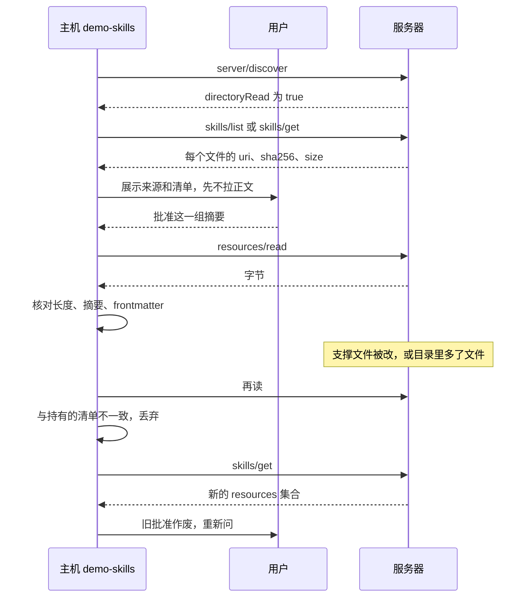

退款服务器的 `tools/list` 里已经有 `check_refund`，描述只有一句：金额不超过 200 才接受。模型更容易做错的是顺序，没看策略就调工具，或者策略已经改了还按旧的走。这段话写进 `server/discover` 的 `instructions`，长流程放不下；写成仓库里的 `SKILL.md`，又和服务器各发各的版本。SEP-2640 让同一条 MCP 连接把技能目录也送出来。我按现行规范跑了一个手写服务器。摘要对上，只说明清单和刚读到的字节是同一份；人点下去的那次批准，在文件集合变了之后就不算数。

<!-- more -->

## 说明书原先不在这条连接上

本站写过两头。[可安装技能](https://cfireworks.github.io/2026/09/30/agent-skills-why-installable-skills-matter/)谈的是本机目录里的 `SKILL.md`。[协议和技能的边界](https://cfireworks.github.io/2026/10/01/2026-10-01-agent-protocols-skills-boundary/)里，MCP 管工具怎么调，技能管工作流怎么写。两边都还没走到第三种放法：工具服务器自己把说明书发出去。

2026-09-13 21:27:51 UTC，[PR #2640](https://github.com/modelcontextprotocol/modelcontextprotocol/pull/2640) 合并，[SEP 页面](https://modelcontextprotocol.io/seps/2640-skills-extension)标的状态是 Final。扩展标识是 `io.modelcontextprotocol/skills`。我对照的正文是 [stable 规范](https://skills.extensions.modelcontextprotocol.io/specification/stable/skills)，写在基础协议 `2026-07-28` 上。SEP 页面写明 Final 文本是当时接受下来的设计记录，之后的改动以现行规范为准。PR 开篇仍写着 archive distribution。合并后的文本把整包归档拿掉了，技能只按单个资源去读。

[决策记录](https://github.com/modelcontextprotocol/ext-skills/blob/main/docs/decisions.md)里 2026-07-16 那条把 v1 的范围写清楚了。`skill://index.json` 换成 `skills/list`。原先一个技能一条摘要，支撑文件不在摘要里；v1 改成每个文件一条 `sha256` 加字节长度。`resources/directory/read` 留下，但要服务器显式打开 `directoryRead`，默认是 false。Kin Lane 9 月 22 日的[文章](https://apievangelist.com/2026/09/22/skills-over-mcp-is-final-and-now-it-needs-servers/)把旧草案说成「只摘要了 SKILL.md」。决策记录的原话是整份技能一条摘要、支撑文件没有摘要，没有写那条摘要的输入就是 `SKILL.md` 单文件。同一篇把逐文件摘要说成技能从此可以信任。规范的小节标题是 Digests Are Not a Trust Anchor：摘要没有签名，和正文来自同一台服务器，对上只证明这两样彼此一致。文章里那组目录统计（提供者数量、握手成功率）我没有重跑，这里不引用。

## 主机要做的核对

服务器在 `server/discover` 的 `capabilities.extensions` 里声明这个扩展。声明了，就必须实现 `skills/list` 和 `skills/get`，并且声明 `resources`。`directoryRead: true` 时才必须实现 `resources/directory/read`；客户端不许对没开这个开关的服务器去调它。技能文件走普通的 `resources/read`。`skill://` 是建议用的 scheme，主机不能靠 scheme 判断一个资源是不是技能。别的 scheme 也可以。技能目录在 URI 里的那一段，最后一截必须等于 frontmatter 的 `name`。`skill://refund-check/SKILL.md` 里这一截是 `refund-check`，不是文件名 `SKILL.md`。

技能格式交给 [Agent Skills 规范](https://agentskills.io/specification)：目录根上有 `SKILL.md`，frontmatter 至少有 `name` 和 `description`，`name` 和目录名一致。`skills/list` 允许为空或只返回一部分。空列表的意思是这一页没列出来，已知 URI 时仍然走 `skills/get`。找不到则返回 JSON-RPC `-32602`。

`resources` 要么是完整文件清单，每项带 `uri`、`digest`、`size`，要么是字符串 `"dynamic"`。清单是主机核对的对象，也是用户批准所绑定的对象。读到的字节长度或 SHA-256 对不上，或者 frontmatter 逐字段对不上，主机不得使用这份内容。正在按这份技能行动时，清单外的文件同样按核对失败处理。要用新文件，先 `skills/get`。集合变了，多一个、少一个或某一条摘要变了，原先持久化的批准作废，重新问人。`"dynamic"` 没有可绑定的集合。主机可以拒绝加载，也不许拿一次旧批准去覆盖服务器眼下给出的正文。

还有几条和摘要无关。进模型上下文时带上服务器身份，这个身份是主机自己起的标签，不是 `serverInfo.name`。远程技能不能悄悄盖住同名的本机技能。`allowed-tools` 这种会放宽权限的字段，MCP 来源上默认忽略，除非用户对这一份技能单独批准。嵌套技能要另一次同意。单份技能的上限是 512 个文件、合计 16,777,216 字节。这是规范写给主机的接受下限，不是我测出来的容量。



## 三种放法

| 维度 | 本机安装的技能 | Skills over MCP | 工具 description |
|------|----------------|-----------------|------------------|
| 正文在哪 | 自己的目录，通常进版本库 | 当前连接的服务器，按文件用 `resources/read` | 工具上的短描述 |
| 怎么发现 | 扫目录 | `skills/list` 允许为空；`skills/get` 按 URI | `tools/list` |
| 变更之后 | 你拉取或改文件才变 | 持久批准绑在当时的 `{uri, digest}` 集合上，集合一变就作废 | 下次列表就是新的，协议没有内容绑定 |
| 摘要证明什么 | 你核对过的那次提交 | 清单和读到的字节一致。服务器或中间人可以把两样一起换掉 | 不覆盖步骤正文 |
| 会不会在本机执行 | 看宿主怎么对待 `scripts/` | 没有逐技能的明确批准，就不能因此在本机执行 | 调用发生在服务器上 |
| 我会在什么时候用 | 要跑脚本、要离线、正文要走代码评审 | 说明书必须和这台服务器的工具一起更新 | 一句话够用，没有步骤 |

## 跑一次 stdio

官方 SDK 到写作这天还没发出这套方法。TypeScript [#2818](https://github.com/modelcontextprotocol/typescript-sdk/pull/2818) 仍是 draft，Python [#3485](https://github.com/modelcontextprotocol/python-sdk/pull/3485)、Go [#1238](https://github.com/modelcontextprotocol/go-sdk/pull/1238)、C# [#1864](https://github.com/modelcontextprotocol/csharp-sdk/pull/1864) 都还开着。`typescript-sdk` 的 main 上没有技能协议文件。`python-sdk` 的 main 上能搜到的 `SKILL.md` 是仓库给代理用的测试规范，里面没有 `skills/list`。我解压了 npm 上的 `@modelcontextprotocol/sdk@1.32.1`（该版本的发布时间是 2026-10-05 11:47:50Z）、`@modelcontextprotocol/server@2.3.1` 和 `@modelcontextprotocol/client@2.3.1`，三个包里都搜不到 `skills/list`。

演示因此是 Python 3.12.3 的标准库。[stdio 传输](https://modelcontextprotocol.io/specification/2026-07-28/basic/transports/stdio)在这一版里是一行一个 JSON-RPC，没有 `Content-Length`，也没有 `initialize`。能力从 `server/discover` 来。脚本在 `demos/mcp-skills-stdio/`。Hexo 只发布 `source/`，这个目录不会进页面。我执行的命令是：

```bash
python3 demos/mcp-skills-stdio/client.py
```

服务器读一个技能目录。`refund-check` 有 `SKILL.md` 和 `references/policy.md`，清单带摘要。`live-note` 的文件是静态的，服务器故意把 `resources` 标成 `"dynamic"`，用来走「不能做内容绑定」那一支。这不是一份会随请求变化的生成正文。工具 `check_refund` 把上限 200 写在自己的代码里。客户端把来源记成 `demo-skills`，服务器自报的名字是 `refund-tools`。frontmatter 里的 `allowed-tools: check_refund` 只被记下来，不授予。

客户端对读到的字节自己算摘要。下面两段就是跑过的 `client.py`：

```python
def digest_of(data: bytes) -> str:
    return "sha256:" + hashlib.sha256(data).hexdigest()
```

```python
skill_body = session.request(
    "resources/read", {"uri": "skill://refund-check/SKILL.md"}
)["result"]["contents"][0]["text"]
skill_bytes = skill_body.encode("utf-8")
skill_meta = by_uri["skill://refund-check/SKILL.md"]
skill_digest = digest_of(skill_bytes)
frontmatter = parse_frontmatter(skill_body)
require(skill_digest == skill_meta["digest"], "skill digest")
require(len(skill_bytes) == skill_meta["size"], "skill size")
require(frontmatter == refund["frontmatter"], "frontmatter")
```

临时副本里随后多了一个 `references/extra.md`，又往 `policy.md` 末尾追加了 `Tampered.\n`。持有的旧清单不含新文件，所以目录列表里出现它也不会交给模型。追加之后再读，摘要和长度都对不上，正文丢弃。重新 `skills/get`，集合从 2 个文件变成 3 个，批准作废。同一时刻 `check_refund(500)` 仍然拒绝。技能正文改了，工具的上限留在服务器代码里。

这次标准输出没有删行：

```text
discover directoryRead=true serverInfo.name=refund-tools host_label=demo-skills
instructions=Refund workflow: skill://refund-check/SKILL.md. Confirm with skills/get before loading.
skills/list live-note=dynamic refund-check=2
skills/get refund-check skill://refund-check/SKILL.md size=247 sha256:37735062a5b047fe7e4bf8bc47f77ab8e9bed897d51b835b17637a5d972f56ac skill://refund-check/references/policy.md size=86 sha256:e7ade1ad0575f0c11b4ab755030c5f33a45c23119218056e99cd7d4835639f55
approval origin=demo-skills files=2 allowed-tools=check_refund granted=false
resources/read SKILL.md bytes=247 digest=sha256:37735062a5b047fe7e4bf8bc47f77ab8e9bed897d51b835b17637a5d972f56ac match=true frontmatter_match=true
resources/read policy.md bytes=86 digest=sha256:e7ade1ad0575f0c11b4ab755030c5f33a45c23119218056e99cd7d4835639f55 match=true
directory/read references policy.md
skills/get missing error=-32602 message=No skill is served at skill://missing/SKILL.md
skills/get live-note resources=dynamic approval=declined
tools/call check_refund amount=150 text=allowed: 150 is within the hard cap of 200
tools/call check_refund amount=500 text=refused: 500 exceeds the hard cap of 200
directory/read after add extra.md,policy.md extra_in_held=false surfaced=false
resources/read policy.md after tamper bytes=96 digest=sha256:e53dd66e9e991a3188c013c0490077883591b212daae8d032a0c690c811833b8 held=sha256:e7ade1ad0575f0c11b4ab755030c5f33a45c23119218056e99cd7d4835639f55 mismatch=true discarded=true
skills/get after change files=3 approval_revoked=true
tools/call check_refund amount=500 after tamper text=refused: 500 exceeds the hard cap of 200
```

`SKILL.md` 的 247 字节和 `policy.md` 的 86 字节，我用同一台机器上的 `hashlib.sha256` 对仓库里的原文件又算了一次，和上面的摘要一致。追加之后的 96 字节只存在于客户端的临时目录里。

## 批准管的是变没变

谁来点：主机上的用户，按技能点，不按「已经连上这台服务器」点。连上本身不让技能正文变成权威。`resources/read` 只负责把字节运过来，读到了也不等于技能已经加载。

内容变了的时候，持有的条目还在，新字节对不上就丢掉。刷新之后集合不同，旧的持久批准作废。上面的 `extra.md` 是目录列表跑在清单前面，`Tampered.` 是同一个 URI 换了摘要。两条都要重新问人。主机不必轮询，下次读会失败。

这和 [前天那篇 SDK 公告](https://cfireworks.github.io/2026/10/04/2026-10-04-mcp-sdk-redirect-audit-blind-spot/)是相邻的两笔账。那篇核对的是 HTTP 客户端在跨源重定向上把自定义头，以及 307/308 的请求体，交到另一个源。技能摘要签不住这一跳。规范自己也写了：路径上的中间人可以把条目和正文一起改掉，对得上的摘要发现不了。技能正文比一次远程工具调用多出来的地方，是服务器写的字会进模型上下文，还可以指使模型去用宿主这边的执行工具。这次没有做宿主执行，所以没有跑「批准前拦截一条 bash」。`allowed-tools` 只是被忽略。`live-note` 因为 `"dynamic"` 被拒绝绑定。

本机技能仍然更合适的场合：目录里有要在宿主执行的脚本；正文要和仓库一起评审；要离线；服务器把 `resources` 标成 `"dynamic"`；你控制不了这台服务器，或者它和一份已经在用的本机技能同名。工具描述够用时，也不必为了一句话走整套批准。

SDK 还没合并的这段时间，自己写的服务器得把上面的主机规则做进客户端。Inspector [2.6.0](https://github.com/modelcontextprotocol/inspector/releases/tag/2.6.0)（2026-09-09）的发布说明里有 SEP-2640 的摘要核对；同一则说明的 phase 3 写了 CLI、TUI 和 `resources/directory/read`。这次的篡改序列没有走 Inspector。

## 结语

工具和说明书可以走同一条连接，版本不容易再各写各的。能留下来的批准是当时那一组 `uri` 和 `digest`，不是服务器自己报的名字。摘要对上，说明你批准的那一版还在。它不说明这一版当初就该被批准。

---

## 扩展阅读

- [Skills 扩展 stable 规范](https://skills.extensions.modelcontextprotocol.io/specification/stable/skills)
- [SEP-2640](https://modelcontextprotocol.io/seps/2640-skills-extension)（Final，PR 合并于 2026-09-13 21:27:51 UTC）
- [ext-skills 决策记录](https://github.com/modelcontextprotocol/ext-skills/blob/main/docs/decisions.md)，其中 2026-07-16 的 v1 范围
- [Agent Skills 规范](https://agentskills.io/specification)
- [2026-07-28 stdio 传输](https://modelcontextprotocol.io/specification/2026-07-28/basic/transports/stdio)
- [Kin Lane：Skills Over MCP Is Final](https://apievangelist.com/2026/09/22/skills-over-mcp-is-final-and-now-it-needs-servers/)（目录统计未复现；信任和旧摘要两句见正文）
- [可安装技能为什么重要](https://cfireworks.github.io/2026/09/30/agent-skills-why-installable-skills-matter/)
- [Agent 协议与技能的工程边界](https://cfireworks.github.io/2026/10/01/2026-10-01-agent-protocols-skills-boundary/)
- [MCP SDK 十月公告：重定向与 npm audit 盲区](https://cfireworks.github.io/2026/10/04/2026-10-04-mcp-sdk-redirect-audit-blind-spot/)

## 讨论

你会让哪一台服务器下发技能正文，哪一份仍然只留在仓库里？脚本、离线，还是「这台服务器我也不完全信任」，哪一条会让你停在本机安装？
