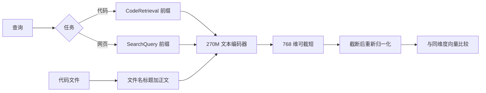

给 coding agent 做本地代码检索，换一个嵌入模型只是半步。2026-10-06，Google DeepMind 发布 EmbeddingGemma 2：Apache 2.0，文本、代码、图像、视频和音频进同一个 768 维空间，只做文本时大约 270M 参数。我在没有 GPU 的机器上加载了文本编码器，用五段短代码做检索。四种前缀组合的第一名都没变。代码检索前缀配上文件名标题，分差拉得最大；截到 128 维之后第一名还在，分差明显变小。

<!-- more -->

## 昨天发布的模型

[发布说明](https://blog.google/innovation-and-ai/technology/developers-tools/embeddinggemma-2/)的日期是 2026-10-06。权重在 [Hugging Face 的 `google/embeddinggemma-2`](https://huggingface.co/google/embeddinggemma-2)，模型卡也写在 [Gemma 文档](https://ai.google.dev/gemma/docs/embeddinggemma/model_card_2)。仓库没有门禁，许可证是 Apache 2.0。

模型卡把规模写成：文本 270M（130M transformer 加 140M embedder），视觉编码器 170M，音频编码器 300M，合计 740M。输出 768 维，均值池化，上下文 8192 token。同一份卡上的加载表是：只开文本 270M，文本加视觉 440M，文本加音频 570M，四模态 740M。四种配置投影到同一个空间。文本查询要和图片比，得把视觉编码器也加载上。我这次只加载了文本。

代码基准我没有重跑。模型卡上的 MTEB Code v1（Mean Task，NDCG@10）是 78.68，EmbeddingGemma 1 是 68.76。发布说明把这个差写成 9.92 分。(78.68 − 68.76) / 68.76 = 14.4%，和模型卡里「大约 14%」是同一组数。多语言文本 MTEB v2 是 61.36 对 61.15。截断之后的官方分数如下，来源仍是模型卡。

| 维度 | 压缩 | MTEB 多语言 v2 | MTEB Code v1 | MMEB v2 总体 |
|------|------|----------------|--------------|--------------|
| 768 | 1:1 | 61.36 | 78.68 | 59.01 |
| 512 | 1:1.5 | 61.17 | 77.24 | 58.38 |
| 256 | 1:3 | 60.41 | 76.18 | 56.24 |
| 128 | 1:6 | 57.89 | 71.41 | 45.65 |

256 维的代码分数是 768 维的 76.18 / 78.68 = 96.8%。128 维的代码分数落到 71.41，多模态总体从 59.01 落到 45.65。模型卡把 128 维放在纯文本初筛，并要求多模态先在自己的数据上验证。存储按 bfloat16、每维 2 字节算：一百万条 768 维是 1.536×10^9 字节，128 维是 2.56×10^8 字节。[开发者指南](https://developers.googleblog.com/embeddinggemma-2-the-developer-guide/)写成大约 1.5 GB 和 250 MB，和这两个整数的取整一致。

## 查询和代码用不同前缀

文本要加任务前缀，图像、视频、音频不加。不对称检索里，查询和文档各用一条。我加载模型后读到的字符串是：

- `CodeRetrieval`：`task: code retrieval | query: `
- `SearchQuery`：`task: search result | query: `
- `Document`：`title: none | text: `

模型卡写明，`prompt_name="Document"` 会带上 `title: none`。有文件名时要自己写成 `title: auth.py | text: `，再把代码交给 `encode`。[推理文档](https://ai.google.dev/gemma/docs/embeddinggemma/inference-embeddinggemma-with-sentence-transformers)里的北极光例子用的是 `SearchQuery` 配 `Document`，那是网页和文档检索。代码检索的名字是 `CodeRetrieval`。



## 五段代码上的实测

环境是 Python 3.12.3、sentence-transformers 6.1.0、transformers 5.19.0、torch 2.14.1。`torch.cuda.is_available()` 为 false。模型卡要求 bfloat16 或 float32，并写明 float16 会得到 NaN 或静默变差的向量。这台机器没有 CUDA，我用的是 CPU 上的 float32。Hub 文件树里 `model.safetensors` 是 1488.9 MB。

```python
model = SentenceTransformer(
    "google/embeddinggemma-2",
    device="cpu",
    model_kwargs={"torch_dtype": torch.float32},
    config_kwargs={"vision_config": None, "audio_config": None},
)
```

文本指南的安装行是 `sentence-transformers` 和 `transformers`。在 6.1.0 上，视觉和音频配置都设成 `None` 之后，初始化仍会构造 `EmbeddingGemma2Processor`。缺 Pillow 时第一次失败，补上之后又缺 torchvision。我装了 Pillow 和 torchvision 0.29.1 才加载成功。加载后的参数量是 271002624，进度条是 413 个张量。推理文档里完整模型的示例进度条是 1376，并打印过 744371488 个参数。我没有在这台机器上再加载完整模型，271002624 只对应当次的文本配置。

语料是五段短代码，用来看前缀，不是一个仓库的召回率。`auth.py` 用 `hmac.compare_digest` 比较摘要，`retry.py` 做指数退避，`embed_store.py` 截断后再除以 L2 范数，`config.py` 读 YAML。`bytes_note.py` 的注释里写了 truncating embedding dimensions，函数只返回 `rows * dim * 2`，用来当干扰项。正文和下面这段一致。

`model.similarity` 算的是余弦。英文截断那条、带文件名的编码就是这样跑的：

```python
docs = [
    ("auth.py",
     "def passwords_match(supplied: str, stored_hex: str, key: bytes) -> bool:\n"
     "    import hmac, hashlib\n"
     "    digest = hmac.new(key, supplied.encode(), hashlib.sha256).hexdigest()\n"
     "    return hmac.compare_digest(digest, stored_hex)\n"),
    ("retry.py",
     "def backoff(attempt: int, base: float = 0.2, cap: float = 8.0) -> float:\n"
     "    import random\n"
     "    delay = min(cap, base * (2 ** attempt))\n"
     "    return delay * (0.5 + random.random())\n"),
    ("embed_store.py",
     "def truncate_unit(vector, dim: int):\n"
     "    import numpy as np\n"
     "    head = np.asarray(vector[:dim], dtype=np.float32)\n"
     "    norm = np.linalg.norm(head)\n"
     "    return head / norm\n"),
    ("config.py",
     "def load_yaml(path: str) -> dict:\n"
     "    import yaml\n"
     "    with open(path, encoding='utf-8') as handle:\n"
     "        return yaml.safe_load(handle)\n"),
    ("bytes_note.py",
     "# Search note: truncating embedding dimensions saves memory.\n"
     "# This function only reports storage. It does not normalize.\n"
     "def report_bytes(dim: int, rows: int = 1_000_000) -> int:\n"
     "    return rows * dim * 2\n"),
]

query = "re-normalize a vector after truncating embedding dimensions before cosine similarity"
query_emb = model.encode(query, prompt_name="CodeRetrieval")
doc_embs = [
    model.encode(text, prompt=f"title: {name} | text: ")
    for name, text in docs
]
scores = model.similarity(query_emb, doc_embs)[0]
```

另外三条查询是英文「compare two password digests in constant time」、中文「怎么用常数时间比较密码摘要」、中文「指数退避的重试等待时间怎么算」。每种查询还有三种对照：文档前缀改成 `prompt_name="Document"`（也就是 `title: none`），查询改成 `prompt_name="SearchQuery"`，以及查询和文档都不加前缀。一条查询加五段代码，在这台 CPU 上大约 0.45 到 0.62 秒。768 维的第一名和与第二名的分差如下。

| 查询 | 代码检索 + 文件名 | 代码检索 + title none | 网页搜索前缀 | 不加前缀 |
|------|-------------------|----------------------|--------------|----------|
| 英文密码 | auth.py，差 0.0940 | auth.py，差 0.0850 | auth.py，差 0.0851 | auth.py，差 0.0619 |
| 中文密码 | auth.py，差 0.0292 | auth.py，差 0.0152 | auth.py，差 0.0143 | auth.py，差 0.0080 |
| 英文截断 | embed_store.py，差 0.1097 | embed_store.py，差 0.0688 | embed_store.py，差 0.0776 | embed_store.py，差 0.1052 |
| 中文重试 | retry.py，差 0.0646 | retry.py，差 0.0497 | retry.py，差 0.0556 | retry.py，差 0.0415 |

第一名一次都没翻。五段又短又好分，说明不了前缀能把召回从错救回对。分差还能看。中文密码那条，文件名标题把分差从 0.0080 拉到 0.0292，网页搜索前缀停在 0.0143。干扰项更直接：同样是 `CodeRetrieval`，标题写成 `title: embed_store.py` 时目标 0.8327、干扰项 0.7230；改成 `title: none` 后干扰项升到 0.7443，分差从 0.1097 收到 0.0688。注释里的 truncating embedding dimensions 在没有文件名时更像一条文档。

截断只在「代码检索 + 文件名」上做了，`truncate_dim` 取 768、256、128，并设 `normalize_embeddings=True`。第一名仍然没变。英文密码的分差从 0.0940（768）到 0.0874（256），再到 0.0224（128）。中文密码在 128 维只剩 0.0077，第二名从 `bytes_note.py` 换成 `retry.py`。这和模型卡同方向：128 维把代码 NDCG 从 78.68 打到 71.41。我的样例只把分差压扁了，还没压到翻车。

归一化单独看了英文截断这条的前 128 维。切片后查询的 L2 范数是 0.601，五段文档大约 0.588 到 0.600。余弦会再除一次范数，所以直接拿切片算余弦，顺序和 `truncate_dim=128` 相同，最高仍是 0.8820。同一组切片做点积，最高只有 0.3117，顺序也没变。模型卡说跳过归一化会悄悄搞坏排名。这五条上排名没坏，分数变了。向量库若用点积，阈值却按单位向量上的 0.7 来设，五条会一起掉到阈值下面。

推理文档里，一对无关英文句子在不加任务前缀时的余弦是 0.6880。我这里中文密码的正确命中是 0.6935。过了 0.7 说明不了检对了，差一点不到 0.7 也说明不了检丢了。阈值要在自己的库上标定。

## 本地索引可以先定这四条

1. 只搜代码时，用 `vision_config=None` 和 `audio_config=None`。这次进内存的是 271002624 个参数。
2. 查询用 `prompt_name="CodeRetrieval"`。每个块写成 `title: 相对路径 | text: `，再接上代码。`prompt_name="Document"` 会变成 `title: none`。
3. 维度先留 768。存储紧了再试 256，用自己的查询集看第一名和分差。128 维留作初筛，后面用更长的向量或交叉编码器重排。查询和库必须同一维度。
4. 有 GPU 且支持 bfloat16 时再用 bfloat16。这台机器测的是 float32。

视觉和音频先留着不加载。模型卡写，已经用文本配置算好的向量，以后可以和完整模型嵌入的图片直接比，文本侧不用重算。那是文档里的设计。我没有拿图片做过这个对照。

这段代码只负责决定哪一段进上下文。agent 拿错文件时，后面的生成会把错误讲得很顺。前缀和标题便宜，评测集才贵。开发者指南里还有一个更大的演示：用 270M 文本配置嵌入 Hugging Face transformers 仓库，再用 Gemma 4 26B A4B 和 Pi 的 harness 去查。那条链路、设备上的显存，以及图像和音频检索，我都没有复现。训练数据截止日期，模型卡写的是 2025 年 1 月。新 API 不会因为编码器「懂代码」就出现在索引里。

模型卡还写了，EmbeddingGemma 2 没有做生成模型那种对齐。检索到什么、过滤什么，由使用方决定。

## 结语

EmbeddingGemma 2 给本地代码检索一个能放在 CPU 上跑的开源编码器，也把以后的图片和音频留在同一套坐标里。我跑通的范围更窄：文本配置、五段代码、四种前缀、三种维度。第一名都对，只能说明样例容易。先改代码检索前缀和文件名标题，再决定要不要把 768 维截到 128。

---

## 扩展阅读

- [EmbeddingGemma 2 发布说明](https://blog.google/innovation-and-ai/technology/developers-tools/embeddinggemma-2/)
- [开发者指南](https://developers.googleblog.com/embeddinggemma-2-the-developer-guide/)
- [sentence-transformers 推理文档](https://ai.google.dev/gemma/docs/embeddinggemma/inference-embeddinggemma-with-sentence-transformers)
- [模型卡](https://ai.google.dev/gemma/docs/embeddinggemma/model_card_2)
- [google/embeddinggemma-2](https://huggingface.co/google/embeddinggemma-2)

## 讨论

你给 coding agent 做仓库索引时，块是按函数切，还是按文件切？文件名放进 `title:` 之后，评测集上的分差有没有变？
