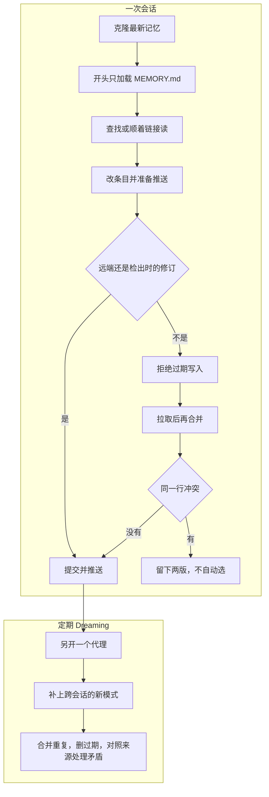

两次会话同时在改同一条偏好。一个写下「CI 也用 bun」，一个写下「CI 改回 npm」。记忆若只活在这一次对话的上下文里，后写上的那句会把前一句盖住，看不出谁在什么时候改的。Cognition 在 2026-10-05 给 Devin 加上 Memory and Dreaming，并把格式开源成 Agent Memory Repo：记忆是一个 Git 仓库，文件是 Markdown。

审计、回滚，以及两次写入对不上，这些是仓库本来就会做的。难的是有目的地忘掉。Dreaming 要能删一句，这句就得带着出处和日期。两条意思相反的句子，Git 合并不会替你选。

<!-- more -->

## 开场只放一份短索引

[Devin 的博客](https://devin.ai/blog/memory-and-dreaming)把记忆放在个人的 Memory Drive 里：一个持久的 Git 仓库，里面是 Markdown。笔记按仓库、项目或题目分文件。短的 `MEMORY.md` 放通用偏好和一份索引。会话开始时放进上下文的是这份 `MEMORY.md`。整个档案留在仓库里，要用的时候再搜、再读，用的是它读代码的同一套工具。

每个会话有自己的 checkout。改完就提交，把别的会话已经写下的更新合并回来，再写回那份持久仓库。博客写明，同步进行到一半时，如果另一个会话已经保存，修订检查会拒绝这次过期写入，以便对着新版本重试。冲突的修改要摆出来，不能悄悄覆盖。

整理是另一条流程。博客里的 Dreaming 是每天一次的后台会话：合并重叠的笔记，去掉临时细节，补上当时没写下来的教训，并删掉没有任何会话使用过的过期记录。来源和写明了的偏好留着。写下来的是短笔记，每条链回学到它的那次会话。在 devin.ai 上，它属于每个组织里的你个人，入口是 Customize → Memory。

开源规范写的是仓库格式和会话循环。产品博客另外写了修订检查，以及每天一次的整理。仓库是 [AgentMemoryRepo/agentmemoryrepo](https://github.com/AgentMemoryRepo/agentmemoryrepo)，许可证是 MIT。2026-10-08 我读的是 main 上的 [README](https://github.com/AgentMemoryRepo/agentmemoryrepo/blob/main/README.md) 和 [SPEC.md](https://github.com/AgentMemoryRepo/agentmemoryrepo/blob/main/SPEC.md)，以及[规范页](https://cognition.com/agent-memory-repo)。格式对得上的有三条。

- 条目是一行一个 bullet。元数据可选，写在行尾，形如 `[source: ...; added: YYYY-MM-DD]`。键是开放的。规范推荐 `source`（学到它的那次会话）和 `added`（`YYYY-MM-DD`）。
- `MEMORY.md` 是入口。每次会话开头都加载它，所以要短：只放每次都需要的内容，再加上到其他文件的链接。
- 交叉链接写成 `[[path]]`，路径从记忆仓库的根算起。Markdown 省略 `.md`，其他扩展名保留，例如 `[[metrics/autocomplete_keep_rate.sql]]`。

会话循环在 README 里是四步：Clone、Grep、Update、Push。规范页把第二步写成 Search。两边的页面我都在当天看过原文。要做的事相同：先查找，或顺着链接走，不要把整个仓库放进提示。Dreaming 在规范里是另一个定期运行的代理，做两件事：从多次会话里看出新的模式，写成新条目；收拾旧的，合并重复、删除过期条目、对照 source 处理矛盾。

规范页和 README 的例子已经不完全一样。规范页上，新会话会 grep 到 `projects/autocomplete.md`。README 写的是先读 `MEMORY.md`，那句 autocomplete 就在这份索引里。SPEC.md 说格式部分对照规范页，循环和例子看 README。按这个格式写实现时，先钉住你读的那一版。

README 里的试用技能不会在启动时自动加载，也不包含排好时间的 Dreaming。那次试用的记忆仓库留在本机，不配置远程。产品里的「每天整理一次」，开源仓库没有替你跑。

## 和另外两种放法比

单文件规则，比如 `CLAUDE.md`、`AGENTS.md`、Cursor rules，人能直接改，diff 也看得到。开场时整份文件进入上下文。两个人同时改，靠的是你们自己有没有加锁。向量记忆，比如 mem0 这一类，把句子嵌进向量库，下次按相似度取回几条。取回的成本低。一句已经过期的话，只要还像当前的问题，仍会被取回来。

| 维度 | 单文件规则 | 向量记忆 | Agent Memory Repo |
|------|------------|----------|-------------------|
| 人读原文 | 一份文件 | 通常是取回的片段 | 仓库里的 Markdown |
| 审计和回滚 | 这份文件自己的历史 | 要另外记日志 | `git log`、`git revert` |
| 多会话一起写 | 后写的盖住先写的 | 各家自己加锁 | 各自 checkout，过期的推送会被拒绝 |
| 开场要付的上下文 | 整份文件 | 几次相似度查询 | 短的 `MEMORY.md`，其余再读 |
| 怎样忘掉一条 | 人去删句子 | 像，不等于还有效 | 要有日期和出处；合并不判断语义 |

第三列的「过期推送会被拒绝」，来自 Devin 博客的修订检查，再加上 Git 自己的非快进拒绝。规范没有写修订号比对。它写的是：两个代理改了同一行时，第二次 push 被拒绝，那个代理先读两版，再写成一句。



上面是一次会话：博客的修订检查，加上规范里的「同一行就拒绝」。下面是规范写的两件事。每天一次只出现在产品博客里，规范写的是 periodically。这次运行没有模型，也没有会话记录，所以没有做「补上新模式」。

## 三次机械检查

脚本在 `demos/agent-memory-dream/`。种子按规范排了一份小仓库：`MEMORY.md`、三篇题目笔记，以及一个只为了让链接落地的 `metrics/keep_rate.sql`。查询没有执行。`pref` 是我加的开放键，规范没有规定它。没有这个键，脚本只认正文完全相同的重复，不会把「用 npm」和「用 bun」看成同一条偏好。

整理按这个顺序做。

1. 同一文件里正文相同的 bullet 收成一条。留下较晚的 `added`，每条 `source` 都保留。规范里的多个来源是多个 `[source: ...]`。
2. 只有同一个 `pref` 才比较日期。组里有一条没有合法的 `added`，整组留下。最新那天对应两种正文，整组留下。只有最新那天只剩一种正文时，更早的删掉。
3. `[[path]]` 没有扩展名就找 `path.md`，有扩展名就找这个文件。断链只报告，不补文件。

然后提交。`source` 写的是 `example.com` 上的示例地址，我没有去抓那些页面。规范要求对照来源处理矛盾。这次比的是日期。

日期这一关写在这里。缺日期，或者最新那天有两种说法，就跳过这一组，不删行：

```python
if any(added_day(entry) is None for entry in group):
    notes.append(f"undated pref={pref} kept={len(group)}")
    continue
newest = max(added_day(entry) or "" for entry in group)
bodies = {entry.body for entry in group if added_day(entry) == newest}
if len(bodies) > 1:
    notes.append(f"same-date pref={pref} date={newest} kept={len(group)}")
    continue
```

推送前先对修订。会话记下检出时的提交。它若已经不是远端的顶端，就拒绝，并且仍去试一次 push，让 Git 把 non-fast-forward 打出来。`require` 那两行是这次演示在核对拒绝确实发生了。

```python
def push_or_reject(cwd: Path, base: str) -> str:
    tip = remote_tip(cwd)
    if tip != base:
        print(f"revision check reject checkout={short(base)} remote={short(tip)}")
        pushed = git(cwd, "push", "origin", "HEAD:main", check=False)
        print(pushed.stderr, end="" if pushed.stderr.endswith("\n") else "\n")
        require(pushed.returncode != 0, "stale push was accepted")
        require("non-fast-forward" in pushed.stderr, "push was not a non-fast-forward")
        return "rejected"
    git(cwd, "push", "origin", "HEAD:main")
    print(f"push ok {short(rev(cwd))}")
    return "pushed"
```

我执行的命令是：

```bash
python3 demos/agent-memory-dream/run_demo.py
```

环境是 Python 3.12.3。仓库建在 `/tmp/agent-memory-dream-demo`，连续两次运行的提交号相同。下面是一次完整的标准输出，没有删行。

```text
python 3.12.3
root /tmp/agent-memory-dream-demo
== dream ==
seed 275e659
duplicate tooling/package-manager.md kept=2026-10-04 sources=2 dropped_lines=1 body=安装依赖用 bun，锁文件是 bun.lock
undated pref=comments kept=2
same-date pref=indent date=2026-10-05 kept=2
superseded pref=package-manager kept=2026-10-04 dropped=2
superseded pref=reply-language kept=2026-10-06 dropped=1
link [[metrics/keep_rate.sql]] -> metrics/keep_rate.sql ok count=2
link [[tooling/editor]] -> tooling/editor.md ok count=1
link [[tooling/missing]] -> tooling/missing.md MISSING count=1
link [[tooling/package-manager]] -> tooling/package-manager.md ok count=2
link [[tooling/ports]] -> tooling/ports.md ok count=1
commit e412581 dream
diff --git a/MEMORY.md b/MEMORY.md
index d245818..e430da3 100644
--- a/MEMORY.md
+++ b/MEMORY.md
@@ -2,5 +2,3 @@
 
-- 回复用中文短句 [source: https://example.com/sessions/1; added: 2026-09-01; pref: reply-language]
 - 回复改用英文 [source: https://example.com/sessions/4; added: 2026-10-06; pref: reply-language]
-- 包管理器用 npm [source: https://example.com/sessions/2; added: 2026-09-12; pref: package-manager]
 
diff --git a/tooling/package-manager.md b/tooling/package-manager.md
index d25f247..b412425 100644
--- a/tooling/package-manager.md
+++ b/tooling/package-manager.md
@@ -2,4 +2,2 @@
 
-- 安装依赖用 npm，锁文件是 package-lock.json [source: https://example.com/sessions/2; added: 2026-09-12; pref: package-manager]
-- 安装依赖用 bun，锁文件是 bun.lock [source: https://example.com/sessions/5; added: 2026-10-03; pref: package-manager]
-- 安装依赖用 bun，锁文件是 bun.lock [source: https://example.com/sessions/6; added: 2026-10-04; pref: package-manager]
+- 安装依赖用 bun，锁文件是 bun.lock [source: https://example.com/sessions/5] [source: https://example.com/sessions/6] [added: 2026-10-04; pref: package-manager]
== sessions ==
drive 54178f4
A append tooling/ports.md
push ok 8cdb7cf
B insert MEMORY.md
revision check reject checkout=54178f4 remote=8cdb7cf
To /tmp/agent-memory-dream-demo/drive.git
 ! [rejected]        HEAD -> main (non-fast-forward)
error: failed to push some refs to '/tmp/agent-memory-dream-demo/drive.git'
Merge made by the 'ort' strategy.
 tooling/ports.md | 1 +
 1 file changed, 1 insertion(+)
clean merge push ok 7a5dbc4
both at 7a5dbc4
A replace tooling/package-manager.md
push ok 1e5f55c
B replace tooling/package-manager.md
revision check reject checkout=7a5dbc4 remote=1e5f55c
To /tmp/agent-memory-dream-demo/drive.git
 ! [rejected]        HEAD -> main (non-fast-forward)
error: failed to push some refs to '/tmp/agent-memory-dream-demo/drive.git'
Auto-merging tooling/package-manager.md
CONFLICT (content): Merge conflict in tooling/package-manager.md
Automatic merge failed; fix conflicts and then commit the result.

# 包管理

<<<<<<< HEAD
- CI 改回 npm，锁文件是 package-lock.json [source: https://example.com/sessions/8; added: 2026-10-07; pref: package-manager]
=======
- CI 也用 bun，锁文件仍是 bun.lock [source: https://example.com/sessions/7; added: 2026-10-07; pref: package-manager]
>>>>>>> origin/main
UU tooling/package-manager.md
checks passed
```

整理那次提交是 `e412581`。bun 的两行收成一行，来源留下 sessions/5 和 sessions/6，日期用 2026-10-04。npm 的两句，一句在 `MEMORY.md`，一句在题目文件里，都比这一天早，删了。回复语言留下 2026-10-06 的英文。缩进的两条都是 2026-10-05，正文不同，记了 `same-date`，两行都在。注释有一条没有日期，记了 `undated`，两行都在。`[[tooling/missing]]` 对不上文件。

`ports.md` 里还有一句「今天下午开发服务器在 3001」，日期是 2026-10-02。产品博客会把这种临时细节清掉。我没有「哪些会话用过这条」的记录，规范也没有给出怎样判定「今天下午」已经过期，所以这句留着。日期说明它是哪一天写下的，不说明事实已经失效。

会话从整理后的树各拿出一份 checkout。A 往端口文件加了一行，推送成功，驱动从 `54178f4` 到 `8cdb7cf`。B 在 `MEMORY.md` 加了另一行。修订检查拒绝，Git 返回 non-fast-forward。这两处不在同一行，合并是干净的。`7a5dbc4` 上两句都在。

接着两个人改同一行，`added` 都写成 2026-10-07。A 推到 `1e5f55c`。B 再次被拒绝。合并停在冲突标记上，状态是 `UU tooling/package-manager.md`，没有提交。Git 不知道 bun 和 npm 哪一句算数。把标记拿掉再跑上面的日期规则，同一天两种正文也只会记 `same-date`，不会选边。这次没有对冲突文件再跑 dream。

## 可以先写进仓库的四条

1. `MEMORY.md` 只放每次会话都要看到的句子，加上索引。题目放进别的文件，用 `[[path]]` 指过去。
2. 每条都写 `source` 和 `added`。要让机器认出「这是同一条偏好」，加一个稳定的键。规范没有规定键名，这里用的是 `pref`。没有日期的矛盾不要自动删。
3. 过期写入先拒绝，再拉取。不同行的合并可以收下。同一行留下两版，读完再写一条。不要把当时位于 HEAD 的那一版当成答案。
4. 排期的 Dreaming 要自己跑。开源试用不包含它。补上新的模式，得去读会话记录，这次脚本没有做。删掉「没有任何会话使用过」的记录，也得有使用日志。这条写在产品博客里，规范的清理清单里没有。

## 结语

Git 让记忆能被查看、能被退回，也让两次会话一起写的时候把冲突露出来。它不会因为一句已经过时就把那句忘掉。Dreaming 要做的是后面这件事。出处和日期都在，删除才说得清。日期是同一天，或者根本没写日期，就停下来让人看。

---

## 扩展阅读

- [Memory and dreaming: how Devin learns from working with you](https://devin.ai/blog/memory-and-dreaming)（Cognition，2026-10-05）
- [Agent Memory Repo 规范页](https://cognition.com/agent-memory-repo)
- [SPEC.md](https://github.com/AgentMemoryRepo/agentmemoryrepo/blob/main/SPEC.md)
- [仓库 README](https://github.com/AgentMemoryRepo/agentmemoryrepo/blob/main/README.md)（MIT）

---

*规范页、README、SPEC.md 与 Devin 博客核对于 2026-10-08。演示在 Python 3.12.3 上执行 `python3 demos/agent-memory-dream/run_demo.py`，连续两次提交号一致。没有调用 Devin，也没有安装试用技能。*

## 讨论

你的长期记忆里，一条偏好靠什么键和另一条对上？没有 `added` 的旧句子，整理时留下，还是删掉？
