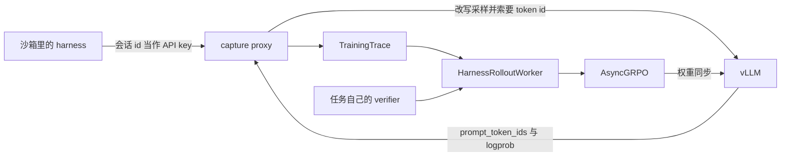

要训的是已经在仓库里跑着的那个 coding agent：它自己规划、自己压上下文、自己决定停。Trainer 若改成每轮自己采样、自己解析工具、再把结果喂回去，梯度更新的是这条复刻出来的循环。Sergio Paniego 在 2026-08-05 的文章里把前一种叫 loop-owning。2026 年 10 月的更新写明，OpenCode、Pi、Claude Code、Codex 和 mini-swe-agent 现在都走 OpenEnv 里的 Harbor，训练脚本是 TRL 的 `async_grpo_harbor`。我核对的是 2026-10-08 两个仓库的 main，博客正文里那块还带着 `train_turn_fn` 的示例，对不上这一天的代码。

<!-- more -->

## 两份文档都叫 Harbor

同一天的 TRL 里有两条接线，名字都带 Harbor。

[Harbor 集成文档](https://huggingface.co/docs/trl/harbor)写的是 `trl.experimental.harbor.HarborEnv`，示例在 `examples/grpo_harbor`。TRL 自己驱动每一轮，工具方法再 `exec` 进沙箱。同一页写明，目前只支持这种外部 agent。装在容器里的 agent 用自己的模型跑完，事后只交一条轨迹，trainer 拿不到策略 token 和 logprob。

[OpenEnv 文档的 “Training on harnesses”](https://huggingface.co/docs/trl/openenv)写的是另一条。`openenv harbor serve` 把 Harbor 的任务和沙箱端起来，`--harness` 选择已经装好的 agent。`HarnessRolloutWorker` 在 `harness_adapter=None` 时不采样每一轮，等 agent 自己跑完，再读 `fetch_training_trace()`。示例是 [`examples/async_grpo_harbor`](https://github.com/huggingface/trl/tree/main/examples/async_grpo_harbor)，2026-10-08 的提交 `ed8cc2f` 上，默认 harness 是 `mini-swe-agent`，沙箱默认 `e2b`。

| 维度 | `HarborEnv` / `grpo_harbor` | `async_grpo_harbor` |
|------|-----------------------------|---------------------|
| 谁拥有循环 | TRL | 安装好的 harness |
| token 从哪来 | trainer 对 vLLM 的当次采样 | capture proxy 记下的引擎 id |
| 装好的 Claude Code、Codex、OpenCode | 该页写明这条路径拿不到策略 token | `--harness` 选择 |
| 当前示例 | `examples/grpo_harbor` | `examples/async_grpo_harbor/async_grpo_harbor.py` |

8 月那篇文章的更新指向的是第二列。只打开第一份 Harbor 文档，会得出「装好的 agent 训不了」。两句话在同一份 TRL main 上都在，说的是两套代码。



OpenEnv 在 0.9.0 将删掉单独的 `opencode_env` 和 `pi_env`。我读到的 [OpenCode 环境页](https://huggingface.co/docs/openenv/environments/opencode)把替代写成 `openenv harbor serve`，再加上 `HarborSessionFactory(..., harness="opencode")`。`envs/opencode_env` 在 2026-10-08 的 main `b6fa103` 上还在，页首已经标了弃用。

## 代理记下的是引擎已经编好的 id

`src/openenv/core/harness/capture/server.py` 的模块说明把原因写在转发之前：引擎为了服务这次请求，自己把 prompt 编成 `prompt_token_ids` 交回来。下一轮的 prompt 就是到这一步为止的那套编码，工具结果也在里面。代理不去本地套 chat template。

同目录的 `contract.py` 记着一次他们自己的测量：Qwen3.5-4B 上 28 个真实回合，本地把 `request` 再渲染一遍，和引擎的 prompt id 一次都没对上，第一次权重更新就把训练打崩了。这是注释里的测量，我没有重跑。

我在这份 OpenEnv 上跑了它自己的测试，没有 GPU：

```bash
cd /tmp/OpenEnv
PYTHONPATH=src python3 -m pytest \
  tests/envs/test_capture_inprocess_trace.py \
  tests/envs/test_harbor_capture_validate.py \
  tests/envs/test_harbor_capture_graph.py \
  -q --disable-warnings
```

环境是 Python 3.12.3、pytest 9.1.1、pytest-asyncio 1.4.0。输出是 `38 passed in 1.10s`。这份 OpenEnv 的 `pyproject.toml` 设了 `asyncio_mode`。没装 pytest-asyncio 时，同一组测试是 `38 passed, 2 warnings`，警告来自 pytest 不认识这两个配置项。`test_capture_inprocess_trace.py` 用一个假引擎保证下一轮的 prompt 等于上一轮的 prompt 拼上 completion，再断言 `to_trace_entries` 保留这个前缀。

接着我把 `CaptureServer` 指到本机一个假的 vLLM。假引擎用自己的表编码：开头一个 id `1`，并把字符对 `te` 合成 `7`。Harness 发来的 `top_p` 是 0.8。四次调用到达引擎时，`top_p` 都是 1.0，同时带上 `return_token_ids=true`、`logprobs=true`、`top_logprobs=0`。未登记的 key 得到 401，正文是 `unknown API key; register a session via POST /sessions`。这次的 session id 是 `sf72f1fee2ecd987cd6fa0a5f`，下次会变。

四次调用里，第三次把用户句子改成 `fix the tests`，第四次是没有工具的 `title`。图上是 `n_turns=4`、`n_roots=3`。`/sessions/{id}/trace_entries` 只返回 3 条。前两条的 prompt 满足精确前缀：第二条的开头等于第一条的 prompt 接上它的 completion。改写后的那句接不上去，单独成根，因为调用带了工具，仍然留在训练条目里。`title` 留在图里，不进这 3 条。`export.py` 写的是：这一次 rollout 里已经有带工具的路径时，没有工具的路径标成 auxiliary。我没有再测「整次 rollout 都没有工具」的那一支，源码说那种情况下工具不再用来区分，活着的路径都算 agent。

`capture/`、`envs/harbor_env` 里的 Python，以及 `src/openenv/cli/commands/harbor.py`，相对 TRL 示例钉住的 OpenEnv `86a180e`（2026-09-30，PR #1280）diff 是空的。变过的是 `envs/harbor_env/README.md`。示例 README 仍要求训练端把 `PYTHONPATH` 指到该修订的 `OpenEnv/envs`，因为那个修订的 wheel 不打包 `harbor_env.harness`。

当前训练脚本的两个地址是 `--server` 和 `--vllm-url`。Trainer 与 vLLM 的权重同步留在 `--vllm-url`。沙箱里的 harness 拿着的是 capture 会话 id，请求打到 `openenv harbor serve` 的代理端口，示例里这个端口是 `--capture-port`。服务器再按这次 rollout 的 `llm_url` 转到同一个 vLLM。8 月文章把这两个地址写成 `vllm-url` 和 `sandbox-vllm-url`，并写明远程沙箱到不了 trainer 那台机器的 localhost。10 月的示例把沙箱那一侧收进 Harbor 服务器。我没有另开一台沙箱去连 localhost。

## 掩码决定哪一个 token 吃梯度

`HarnessRolloutWorker` 在 loop-owning 模式里调用 `session.fetch_training_trace()`。`envs/harbor_env/harness.py` 开头的示例还写着 `fetch_proxy_trace()`。两个方法都在。当前 TRL 的 worker 用的是前者，返回带校验的 `TrainingTrace`。`openenv.md` 写明这个 API 没有 `train_turn_fn`，也没有 `agent_turn_fn`。辅助调用和被丢掉的重试由生产端排除，选择写进 `loss_mask`。

掩码覆盖 prompt 加 completion。Prompt 位置是 0。Completion 里可以夹 0。示例 README 的数字是 prompt `[10, 11]`、completion `[12, 13, 14]`、mask `[0, 0, 1, 0, 1]`，训练 12 和 14，13 留在上下文里。文档页用的是 `[20, 21, 22]`，形状相同。Worker 里的切片是：

```python
list(turn.loss_mask[len(turn.prompt_token_ids) :])
```

这就是交给 TRL `TurnRecord` 的 completion 掩码。损坏的捕获会让 worker 停下来。传输失败仍是不可计分，奖励用 `None`，不记成 0。

奖励和校验是两笔账。示例里的 `harbor_reward` 先取 verifier 的 `env_reward`。正确性达到 1.0 才加上 `0.3 * clip(1 - n/15, 0, 1)`。做对以前，少调工具不加分。多 harness 指南里的 LFM 实验把这项加成的上限写成 0.1。我读到的脚本是 0.3、预算 15。两组数字都在公开材料里，系数对不上，抄的时候要看你对齐的是哪一版。

指南还写了他们的结果：同一套 LFM2.5-2.6B 权重，在他们的测试集上 Mini-SWE-Agent 解出 62%，Claude Code 解出 33%；四个 harness 一起训，从大约 42% 到 step 1000 的 54.2%。这些是指南里的数。我没有 H100，也没有重跑。

## 本机能核对的那一段

仓库里的缩小演示是 `demos/harness-capture-rows/run_demo.py`。Hexo 只发布 `source/`。它用标准库起一个假引擎和一层代理，规则只覆盖上面核对过的几条：复制引擎的 id、把 `top_p` 改成 1.0、未知 key 返回 401、精确前缀才连边、有工具的 rollout 里不训练无工具的那次调用、掩码的 completion 切片，以及示例里的 0.3 / 15 奖励。假引擎的编码表和我打向 `CaptureServer` 的那次相同，三条训练记录的 prompt id 一致。代理进程里没有调用那个编码函数。

```bash
python3 demos/harness-capture-rows/run_demo.py
```

Python 3.12.3。连续两次输出相同。

```text
python 3.12.3
session rollout-1 rollout_type train level tokens
unknown_key 401 unknown API key; register a session via POST /sessions
engine_saw [{"top_p": 1.0, "return_token_ids": true, "logprobs": true, "top_logprobs": 0}, {"top_p": 1.0, "return_token_ids": true, "logprobs": true, "top_logprobs": 0}, {"top_p": 1.0, "return_token_ids": true, "logprobs": true, "top_logprobs": 0}, {"top_p": 1.0, "return_token_ids": true, "logprobs": true, "top_logprobs": 0}]
graph n_turns=4 n_roots=3 n_entries=3
turn 0 prompt=[1, 134, 137, 152, 64, 148, 136, 133, 64, 7, 147, 148] completion=[143, 139] logprobs=[-0.25, -0.5] trained=[143, 139] naive_equal=False
turn 1 prompt=[1, 134, 137, 152, 64, 148, 136, 133, 64, 7, 147, 148, 143, 139, 97, 147, 147, 133, 146, 148, 137, 143, 142, 101, 146, 146, 143, 146] completion=[132, 143, 142, 133] logprobs=[-0.25, -0.5, -0.75, -1.0] trained=[132, 143, 142, 133] naive_equal=False
turn 2 prompt=[1, 134, 137, 152, 64, 148, 136, 133, 64, 7, 147, 148, 147] completion=[132, 143, 142, 133] logprobs=[-0.25, -0.5, -0.75, -1.0] trained=[132, 143, 142, 133] naive_equal=False
turn1_extends_turn0 True
rewrite_extends_turn0_end False
readme_mask trained=[12, 14] context=[13]
bad_mask prompt tokens must remain context
reward_weight 0.3 tool_budget 15
reward wrong correctness=0.0 tools=2 value=0.0000
reward correct_short correctness=1.0 tools=0 value=1.3000
reward correct_at_budget correctness=1.0 tools=15 value=1.0000
reward correct_3 correctness=1.0 tools=3 value=1.2400
reward correct_12 correctness=1.0 tools=12 value=1.0600
reward unscored correctness=None tools=1 value=None
checks passed
```

`naive_equal=False` 来自另一套编码：同一段文本，去掉开头的 id `1`，也不把 `te` 合成 `7`。这套 id 和引擎交回来的 `prompt_token_ids` 对不上。第二条 prompt 的前 14 个 id 正好是第一条的 prompt 接上 `[143, 139]`，也就是 `ok` 的编码。`fix the tests` 多出来的 `s` 让它接不上这一段，所以 `rewrite_extends_turn0_end` 是 False。

全对的两组，工具数 3 和 12，奖励是 1.2400 和 1.0600。正确性都是 1，组内还能分开，靠的是那 0.3 的效率项。错的那组是 0，两次工具调用没有把分加上去。`None` 保持不可计分。

这次没有跑的部分：

- 没有执行 `async_grpo_harbor.py` 的 `trainer.train()`，没有 vLLM，没有 NCCL 权重同步
- 没有 H200、H100，没有 E2B、Daytona 或 Modal
- 没有跑 `openenv harbor serve`，那需要任务数据集和沙箱凭证
- 没有安装 Claude Code、Codex、OpenCode 或 mini-swe-agent
- 没有跑 TRL 的 `tests/experimental/test_openenv_tito.py`，那条路径要装 TRL 和它的训练依赖
- 指南里的通过率、工具调用下降，以及 8 月文章里 Qwen3-8B 从大约 0.27 到 0.71 的 10 步奖励，都没有复现

## 接到自己的 harness 之前

1. 先看你打开的是哪一页。`HarborEnv` 适合 trainer 自己握着循环、工具只是沙箱里的命令。线上那个 Claude Code 或 Codex，走 `async_grpo_harbor` 和 `openenv harbor serve`。
2. 采样和权重更新用同一个 vLLM。示例要求 `--logprobs-mode processed_logprobs`、`--return-tokens-as-token-ids`，以及 NCCL 的 `--weight-transfer-config`。Harness 自己带的 `top_p` 会在捕获层被改成 1.0。截断之后的 logprob 和 trainer 按全词表重算的 logprob 对不上，重要性比值从第一步就偏了。
3. 一个 GRPO 组用同一个 harness。指南里的多 harness 实验是组与组之间换，组内八条轨迹比的是动作。`async_grpo_harbor.py` 的 `--harness` 是整次运行一个值。
4. 服务器的 `MAX_CONCURRENT_ENVS` 至少是 `--max-inflight` 再加 1。示例 README 写，factory 还占着一条连接读任务元数据。
5. 历史被 harness 改写时，精确前缀断掉，新的根仍可训练，多行共享这一次 rollout 的奖励。Claude Code 在指南里平均变成大约八行，是他们的统计。行数变多会改掉看见的 token 量，步数不再是公平的比较单位。
6. 奖励里的效率项只在做对之后加上。系数看你对齐的脚本。当前示例是 0.3，指南里的 LFM 运行写的是至多 0.1。

## 结语

上线用的 harness 会压缩上下文、修补工具调用、改掉空白。这些都发生在模型看见下一轮 prompt 之前。Capture proxy 保存的是引擎当时返回的 id 和 logprob，训练行再按 `loss_mask` 决定哪些位置吃梯度。复刻一条循环，更新的是复刻本身。

---

## 扩展阅读

- [Training a coding agent with the OpenCode harness](https://huggingface.co/blog/sergiopaniego/trl-openenv-harness-training)（Sergio Paniego，2026-08-05，2026-10 更新指向 Harbor）
- [The ultimate guide to multi-harness RL](https://fineenvs-multi-harness-rl.hf.space/the-ultimate-guide-to-multi-harness-rl.pdf)（Kolavi 等，2026-09-24 发布，2026-10-01 更新）
- [TRL OpenEnv 文档](https://huggingface.co/docs/trl/openenv) 与 [Harbor 文档](https://huggingface.co/docs/trl/harbor)
- [examples/async_grpo_harbor](https://github.com/huggingface/trl/tree/ed8cc2f4337fb9b7b1429db31009ad3577cd5b98/examples/async_grpo_harbor)（TRL `ed8cc2f`，2026-10-08）
- [OpenEnv capture server](https://github.com/huggingface/OpenEnv/blob/b6fa1033acebdcc4d1e5c65d322593615395b5e9/src/openenv/core/harness/capture/server.py)（`b6fa103`，2026-10-08）

---

*TRL `ed8cc2f` 与 OpenEnv `b6fa103` 核对于 2026-10-09。OpenEnv 测试命令见正文，`38 passed in 1.10s`。演示在 Python 3.12.3 上执行 `python3 demos/harness-capture-rows/run_demo.py`，连续两次输出一致。没有跑 GRPO，没有启动 vLLM。*

## 讨论

你的 harness 会在回合中途改写历史吗？改写之后，新的根应该和原来的链共享同一次 verifier 奖励，还是分开计分？
