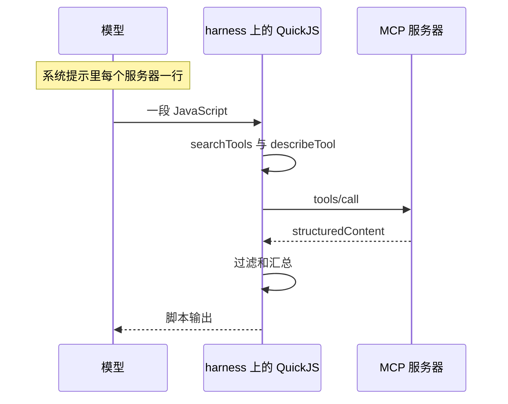

接上几台 MCP 之后，模型还没读到问题，工具的名字、说明和 inputSchema 已经躺在提示里。再接一台，这段再长一截。上下文的开销跟着能力清单走，不跟着这一次真正要做的事走。

Pi 默认把 MCP 的暴露设成 `codemode`。系统提示里每个服务器一行。schema 留在 harness 这一侧的 QuickJS 里：模型写一段脚本，脚本用 `searchTools`、`describeTool`、`describeNamespace` 把要用的工具找出来，调用，过滤，再把短结果交回去。

<!-- more -->

## 清单变长的时候，问题并没有变长

[Earendil 在 2026-09-29 的信](https://earendil.com/posts/you-said-no-mcp/)里写过他们原先的态度：Pi 不支持 MCP。信里把态度改了。改的理由有两层。一层是他们给 Pi 加了一个解释器，这套改动也方便接 Jev 这类模型。另一层是 MCP 仍然难组合。很多服务器还在为「把工具倒进上下文」的 harness 返回文本，用文本去省 token。他们希望 MCP 更接近带发现能力的 OpenAPI：工具返回结构化数据，靠文档和描述被找到。

同一方向，Anthropic 在 2025-11-04 的[工程笔记](https://www.anthropic.com/engineering/code-execution-with-mcp)里写了两笔账：工具定义先占满窗口，中间结果再占一轮。他们举的做法是把 MCP 服务器铺成文件树，代理按需去读某个 `getDocument.ts`。文中那个例子写着 token 从 150,000 降到 2,000，并写成 98.7%。这是他们文里的例子，我没有重跑。那套代码假设有文件系统。文中轮询 Slack 的片段调用了 `setTimeout`。

Pi 的发布说明里另有一对数字，对象不同。[Pi 1.0.0](https://pi.dev/changelog/releases/1.0.0) 写：默认工具加上打开的 codemode，一次 GPT-5.6 请求从大约 5,300 token 降到 3,300。特性条目里的说法是大约少 40%。同一则说明把原因写在 Codemode 自己的描述上：全局名字每条一行，`models` 的 API 改指到文档，已声明的工具用一行说明脚本怎么调用、调用结果是什么，系统提示里的 codemode 指引和 MCP 服务器段落更短。[heise 2026-10-03 的报道](https://www.heise.de/en/news/Coding-Agent-Pi-More-space-in-the-prompt-less-ballast-11474748.html)转述了发布说明，并写明这是送出的上下文有多大，不是回答质量。我没有用 GPT-5.6 的分词器重测这对数。它量的是说明变短，不是某一份 MCP 清单被藏起来。

清单那笔账要单独算。下面的脚本用 Pi 设置页写明的估算：`codemode.inlineBudget` 的单位是字符数除以 4。

## 脚本跑在 harness 上

[Armin Ronacher 2026-10-06 的文章](https://lucumr.pocoo.org/2026/10/6/codemode/)把进程分成两侧。一侧是 brain，也就是 harness，跑在一台受信任的机器上。另一侧是 hands，bash 和工具真正执行的地方。Pi 把后者叫做 execution environment。本站 [10 月 3 日那篇](/2026/10/03/2026-10-03-pi-durable-office-agent-harness/)写的是这一侧：本地目录映射，以及受控的 close / reopen。Codemode 在另一侧。它跑在 harness 上，用来编排工具调用，状态进会话记录，不进那一侧的文件系统。

[Codemode 文档](https://pi.dev/docs/latest/codemode)写的运行环境是 QuickJS 沙箱。脚本是一个 async 函数的函数体，顶层可以 `await` 和 `return`。沙箱没有 Node API，没有文件系统，没有网络，没有定时器。出去的路只有 `tools` 和 `models`。Armin 写的是 QuickJS 跑在 WASM 里，并限制内存。文档里的内存上限是 256 MB，用尽抛 `InternalError: out of memory`。我没有拆这个运行时，也没有看到 WASM 二进制。



工具输入是原始 JavaScript，不是 JSON，也不是 Markdown 代码块。结果以 `Script completed` 或 `Script failed` 开头，带上耗时和输出。失败前已经发出的工具调用不会撤销。脚本不能再启动另一个 codemode。一个永远不会完成、又没有未完成工具调用的 Promise 会立刻失败，因为没有定时器。

`searchTools(query, { limit?, namespace? })` 用 BM25 排序，默认 `limit` 是 8，返回 `{ name, description }`。`describeTool(name)` 返回描述和 TypeScript 声明。`describeNamespace(name)` 返回命名空间的描述、说明和工具名。`ALL_TOOLS` 是全部可调用工具的名字和描述。文档没有公布 BM25 的 k1、b 和分词器。

MCP 工具在脚本里解析成 `CallToolResult`，带 `isError` 和 `structuredContent`。名字里不能做 JavaScript 标识符的字符换成 `_`，所以 `mcp__dev-radius__search` 在脚本里是 `tools.mcp__dev_radius__search`。直接给模型的文本结果超过 20 KB 时，中间会被截掉；脚本拿到的是完整结果。`bash` 给模型看的是 2000 行或 50 KB，给脚本的 `output` 可以到 1 MiB。这些上限我没有用真实工具去顶。

`store(key, value)` 把小段 JSON 留在会话里，成功的脚本才会追加一条 `codemode-store`。单值最多 262144 个字符的 JSON，全部加起来最多 1048576。恢复会话时，一条分支只看得到自己这条路径上写下的值。Armin 同时写了：进行中的脚本要怎样做耐久快照，还没定，JavaScript 也未必是最合适的组合语言。那是另一件事，和 10 月 3 日那篇的租约、远程 Env 不是同一层。

分类器和图像模型也从这条路进去。`models.classify()` 和 `models.generateImages()` 用会话自己的凭证，文档写明每个脚本同时最多四个这样的调用，多出来的排队。Armin 另外写：工具执行的并发也限制在四个，其余排队。并发上限我只在文档里看到分类器和图像模型这一句，工具执行那句只看到他的文章。两边我都没有跑。

### 两套都叫 deferred 的开关

[0.99.0 的发布说明](https://pi.dev/changelog/releases/0.99.0)把 codemode、tool search 和 MCP 收成内置扩展。[0.99.2](https://pi.dev/changelog/releases/0.99.2)把默认的 `codemode` 暴露移出 codemode 的描述：描述不再随服务器连接而变，服务器改到系统提示的 `mcp_servers` 段，一行摘要。脚本用 `searchTools()` 和 `describeNamespace()` 去找。`codemode-deferred` 从这一版起是 `codemode` 的别名。第一发提示只等待带 `direct` 工具的服务器，其余在后台连。

[现行 MCP 文档](https://pi.dev/docs/latest/mcp)把暴露分成四档。我 2026-10-10 读的是 latest，没有钉某一次提交。

| 暴露 | 模型看得到什么 | Pi 会打开什么 |
|------|----------------|---------------|
| `codemode`（默认） | 不声明，也不写进 codemode 的描述。脚本用 `searchTools`、`describeTool` 或 `ALL_TOOLS` | 有这种服务器连上时打开 codemode |
| `deferred` | 等 `tool_search` 载入匹配之后，下一次模型调用才声明 | 打开 `tool_search` |
| `direct` | 像内置工具一样声明，脚本里也能调 | 第一发提示会等它，最多 10 秒 |
| `hidden` | 注册了，调用不到 | 不因此打开 codemode 或 `tool_search` |

`codemode` 或 `deferred` 的服务器会出现在系统提示的 `mcp_servers` 段里：怎么调用，加上配置的 `description` 的一行；没写 `description` 时，连上之后用服务器 instructions 的第一行。这段变了，Pi 把新的一段追加到对话里，不去改已经发出的工具声明，这样前面的消息还能用缓存。`describeNamespace()` 接受 `mcp__dev-radius`、`mcp__dev_radius`、`dev-radius` 或 `dev_radius`。

Codemode 文档里还有一句：`deferred` 暴露的工具不列进描述，其中包含默认 `codemode` 暴露的 MCP 工具。这句话里的 deferred，指的是「描述里不列」。它比设置值 `exposure: "deferred"` 宽。后者是另一档：`tool_search` 把工具声明出来，模型直接调。两档的工具，脚本都能调，`tool_search` 也都能载入。载入的工具记在会话里，留在那条分支上。

已列出的声明共用 3000 的估算 token，设置项是 `codemode.inlineBudget`。估算就是字符数除以 4。设成 0 时只列命名空间。`codemode.mode` 默认 `on`：已经声明给模型的工具保持声明，描述里补一行「脚本里怎么调」。`only` 把这些工具从模型面前拿开，改列在 codemode 的描述里。默认的 MCP 暴露不占这 3000，因为它们根本不列。

没有 MCP 时，codemode 默认关着。[命令行文档的 Enable codemode](https://pi.dev/docs/latest/cli)写的是在 `~/.pi/agent/settings.json` 或项目的 `.pi/settings.json` 里加 `"defaultTools": ["+codemode"]`，`read`、`bash`、`edit`、`write` 还在。一次运行可以用 `pi --tools +codemode`。有 `codemode` 暴露的服务器连上时，Pi 会自己打开它。不想自动打开，在 `mcpServers` 旁边设 `autoEnableCodemode: false`。

每次 MCP 调用仍走 Pi 的工具管线。权限扩展看得到，要不要确认由那些扩展决定。从脚本发出的调用带 codemode 的调用号，字段是 `parentToolCallId`。沙箱没有网络，调用还是从这里出去。

## 三种放法

| 维度 | 全量声明 | Pi 默认 `codemode` | 服务器里再包一层 code |
|------|----------|---------------------|------------------------|
| 提示里有什么 | 每个工具的名字、说明、inputSchema | 每个服务器一行，写明怎么到达工具 | Armin 的例子里是一个 `execute` |
| schema 何时出现 | 会话一开始就在 | 脚本里 `describeTool`，进的是沙箱 | 在服务器那一侧，外层拿到文本 |
| 中间结果 | 每次调用回到模型 | 留在脚本里，`return` 或 `text()` 才回去 | 留在内层，再作为文本回到外层脚本 |
| 代码跑在哪 | 模型的工具调用循环 | harness 上的 QuickJS | 服务器进程里的另一段代码 |
| 内层能不能调用这次会话的其他工具 | 能调用已经声明的 | 能调用这次会话可调用的工具 | 看不见外层的 `tools` |
| 我什么时候用 | 工具少，而且几乎每次都直接调 | 工具多，要先搜、再组合、再过滤 | harness 自己还不会编排的时候 |

第三列来自 Armin 对 Cloudflare 式 MCP 的描述。他把 Codemode 这个名字归给 Cloudflare。Anthropic 的笔记也把 Cloudflare 的叫法写成 Code Mode。我没有另读 Cloudflare 的产品页。Armin 贴出的形状是：外层脚本调用 `tools.mcp__cloudflare__execute`，参数里再塞一段 JavaScript，返回的文本再用 `JSON.parse`。内层代码调不了外层工具。他把它叫做暂时的拐杖，并写了双层 JSON 转义会让小模型糊涂。

## 六台合成服务器

脚本在 `demos/pi-codemode-deferred-mcp/run_demo.py`。Hexo 只发布 `source/`，这个目录不会进页面。它用标准库模拟上面几条合同，不安装 Pi。

清单是我编的 6 台服务器、每台 6 个工具：linear、sentry、github、docs、billing、slack。每个工具的 schema 都额外带了 `cursor`、`pageSize`、`locale`，用来给单工具一个看得见的地板。这三项不是 Linear 或 Sentry 的真实字段。一行说明是脚本自己的句子，格式是 `- 名字 (codemode): 描述`。Pi 的系统提示原文我没有抓到，只按文档里的「一行摘要」来排。

token 用字符数除以 4：

```python
def est_tokens(text: str) -> float:
    """Pi settings: estimated tokens are characters / 4."""
    return len(text) / 4
```

```python
def one_line(item: dict, exposure: str = "codemode") -> str:
    return f"- {item['name']} ({exposure}): {item['description']}"
```

全量声明是每个工具一行 JSON：`name`、`description`、`inputSchema`。这是这种客户端的一种排法，不是某家产品提示词的原文。

发现用的是这份语料上的 Okapi BM25，`k1=1.5`，`b=0.75`，分词是 `[a-z0-9_]+`，默认只留 8 条。文档说 Pi 用 BM25，没有给出这三项，所以名次不是 Pi 的名次。查询是 `list open linear issues`。脚本要求第一名是 `mcp__linear__list_issues`，否则直接失败。

调用是进程内的假数据：24 条 issue，每条 3 句评论。四名 worker 按余数领任务，在这一个进程里顺序执行。Earendil 信里的例子是 `Promise.all` 四个 worker 共用一个游标，那是他们页面上的压缩回放，我没有跑。标记词是 `frustrating`、`stuck`、`pain`，写在评论里。这不是 Jev。

```python
def flagged(issue: dict) -> bool:
    blob = " ".join(issue["comments"]).lower()
    return any(marker in blob for marker in MARKERS)
```

另一支把同一批 issue 写成散文。`limit=5` 的探测仍是 JSON。满批是散文，`json.loads` 会失败。这是 Armin 写的「探测 5 条和满批形状不一致」在本地的替身，不是某台线上服务器的记录。

嵌套那一支只做编码：一段内层 JavaScript，`json.dumps` 成 `{"code": ...}`，再把这段文本 `json.dumps` 一次。Codemode 的工具输入是原始 JavaScript，外层脚本本身不是 JSON。第二层编码量的是「code 字符串再进一次 JSON」。没有启动两层解释器，内层也没有真的去调外层工具。

```python
wire = json.dumps({"code": inner}, ensure_ascii=False)
twice = json.dumps(wire, ensure_ascii=False)
```

`inlineBudget` 那一节把我写的 TypeScript 形状声明按服务器顺序往 3000 里放，放不下就停，不回头挑更短的。这不是 Pi 的排版器。默认暴露下列进 codemode 描述的 MCP 声明数，脚本印的是 0。

我执行的命令是：

```bash
python3 demos/pi-codemode-deferred-mcp/run_demo.py
```

环境是 Python 3.12.3。连续两次的标准输出都是 4601 字节，`cmp` 相同。下面是一次完整输出，没有删行。

```text
python 3.12.3
scope simulation=contract pi=false quickjs=false mcp_transport=false network=false
estimator characters/4 source=pi settings codemode.inlineBudget
search bm25 k1=1.5 b=0.75 limit=8 corpus=this file only pi_ranker=false
== inventory ==
servers=6 tools=36
dump_all chars=18802 tokens=4700.50
dump_without_shared_fields chars=7651 tokens=1912.75
shared_fields_delta_tokens=2787.75
dump_over_one_line=42.06 bare_over_one_line=17.12
one_line chars=447 tokens=111.75
- linear (codemode): Linear issues, comments, and projects for one workspace.
- sentry (codemode): Sentry organizations, projects, and unresolved issues.
- github (codemode): GitHub issues, pull requests, and commits for one repository.
- docs (codemode): Product documentation and API reference pages.
- billing (codemode): Invoices, usage records, and the current subscription.
- slack (codemode): Workspace channels, users, and recent messages.
server linear tools=6 dump_chars=3448 tokens=862.00
server sentry tools=6 dump_chars=3168 tokens=792.00
server github tools=6 dump_chars=3252 tokens=813.00
server docs tools=6 dump_chars=2957 tokens=739.25
server billing tools=6 dump_chars=2946 tokens=736.50
server slack tools=6 dump_chars=3026 tokens=756.50
== connect status ==
dump_tokens 4700.50 -> 5416.75 delta=716.25
one_line_tokens 111.75 -> 129.75 delta=18.00
bare_dump_tokens 1912.75 -> 2165.00 delta=252.25
dump_delta_over_line_delta=39.79
bare_delta_over_line_delta=14.01
added_line=- status (codemode): Public status page incidents for the same product.
codemode_description_listed_mcp_decls=0 exposure=codemode
== inline budget ==
budget=3000 order=server_then_tool
mcp_decls_fitting=27 of 36 leftover=69.75
after_four_builtins fitting=30 of 40 leftover=80.75
== script ==
searchTools query='list open linear issues' hits=8
1. 5.776 mcp__linear__list_issues | List open Linear issues for a team, with identifier and title.
2. 2.943 mcp__github__list_issues | List GitHub issues in a repository.
3. 2.758 mcp__sentry__list_issues | List unresolved Sentry issues in a project.
4. 2.346 mcp__linear__list_comments | List comments on one Linear issue.
5. 2.346 mcp__linear__list_projects | List Linear projects in the workspace.
6. 1.678 mcp__linear__get_issue | Fetch one Linear issue by identifier.
7. 1.678 mcp__linear__search_issues | Search Linear issue titles by keyword.
8. 1.572 mcp__linear__create_comment | Add a comment to a Linear issue.
describeTool mcp__linear__list_issues chars=590 tokens=147.50
/** List open Linear issues for a team, with identifier and title. */
declare function mcp__linear__list_issues(args: {
  /** Team key, for example Pi. */
  team: string;
  /** Workflow state name. Use open for the backlog. */
  state?: string;
  /** Maximum issues to return. */
  limit?: number;
  /** Opaque pagination cursor returned by the previous page. */
  cursor?: string;
  /** Page size. The server may cap this and say so in the result. */
  pageSize?: number;
  /** BCP 47 language tag for human-readable fields in the result. */
  locale?: string;
}): Promise<CallToolResult>;
describeNamespace mcp__linear description='Linear issues, comments, and projects for one workspace.' tools=list_issues,list_comments,get_issue,search_issues,create_comment,list_projects
list_issues structured compact chars=1646 tokens=411.50
worker 0 issues=6 ids=PI-1000,PI-1004,PI-1008,PI-1012,PI-1016,PI-1020 comment_chars=1134
worker 1 issues=6 ids=PI-1001,PI-1005,PI-1009,PI-1013,PI-1017,PI-1021 comment_chars=1171
worker 2 issues=6 ids=PI-1002,PI-1006,PI-1010,PI-1014,PI-1018,PI-1022 comment_chars=1134
worker 3 issues=6 ids=PI-1003,PI-1007,PI-1011,PI-1015,PI-1019,PI-1023 comment_chars=1172
intermediate_chars=6257 tokens=1564.25
return chars=330 tokens=82.50
return_over_intermediate=0.0527
{
  "total": 24,
  "counts": {
    "flagged": 5,
    "calm": 19
  },
  "flagged": [
    "PI-1000 TUI stays on Working after Esc",
    "PI-1005 High CPU during long sessions",
    "PI-1011 Update command from the TUI",
    "PI-1017 Sign-in URL wraps and is hard to open",
    "PI-1022 First prompt waits on direct tools only"
  ]
}
== text shape ==
probe limit=5 json_ok count=5 chars=348 tokens=87.00
full batch prose json_ok=false error=Expecting value chars=4712 tokens=1178.00
== nested encoding ==
inner_js chars=151 tokens=37.75
once_json chars=170 tokens=42.50
twice_json chars=187 tokens=46.75
twice_head="{\"code\": \"async () => {\\n  const r = await cloudflare.request({ method: \\\"GET\\\", path: \\\"/accounts\\\" });\\n  return r.result.ma
inner_calls_outer_tools=false modeled_only=true
checks passed
```

拿掉三项共用字段之后，36 个工具的 schema 是 1912.75，六行说明是 111.75，比值 17.12。加上那三项，schema 到 4700.50，比值 42.06，其中 2787.75 来自这三项。再接一台 status，不带共用字段时 schema 增加 252.25，一行说明增加 18.00，比值 14.01。带上共用字段时 schema 增加 716.25。默认暴露下，codemode 描述里列出的 MCP 声明数是 0，所以多接一台不会把工具声明推进那 3000 的预算。

若把我写的 MCP 声明按顺序塞进这 3000，36 条里放下 27 条，剩下 69.75。先放四条内置工具的声明，再放 MCP，40 条里放下 30 条，剩下 80.75。这是「假如这些声明被列出来」的容量。Codemode 页把默认 MCP 暴露算进不列描述的那一类，描述因此不随服务器连接变化。设置页对 `only` 的写法是：脚本能调用的工具都列进描述，内置工具从模型面前拿开。两句一起读，不随连接变化这一条把默认 MCP 留在列表外。脚本印出的列出条数是 0。

脚本路径上，`list_issues` 的紧凑 JSON 是 411.50。四个 worker 的评论加在一起，中间结果 1564.25。回到外面的 JSON 是 82.50，字符数是中间结果的 0.0527。24 条里 5 条评论含标记词。`limit=5` 的 JSON 是 87.00，能解析。满批散文是 1178.00，解析失败。若脚本只能把散文交回去，模型看到的是 1178.00，而不是 82.50。

嵌套编码从 151 个字符到 170，再到 187。`twice_head` 里引号变成了 `\\\"`。这段内层很短，字符只多了 36。Armin 说的麻烦是模型得把转义写对，以及内层看不见外层工具。后一件事这次只印了 `inner_calls_outer_tools=false`。

## 配置时按哪几档想

1. 给服务器写 `description`。这一行进系统提示，也参与工具搜索的排序，`describeNamespace()` 会把它返回去。不写的话，连上之后用服务器 instructions 的第一行。
2. 默认就是 `codemode`。工具多、要在脚本里组合和过滤时，留在这一档。某个工具几乎每次都直接调，把服务器或那一个工具的暴露设成 `direct`。`toolExposure` 可以只改个别工具。
3. 名叫 `deferred` 的那一档走 `tool_search`，匹配从下一次调用起直接声明。它和脚本里的 `searchTools` 都能到达未声明的工具。两套发现叠在同一次会话里时，先决定你要的是「脚本里过滤」，还是「声明之后直接调」。
4. `inlineBudget` 默认 3000，按字符数除以 4。0 只列命名空间。默认的 MCP 工具不占这个预算。`mode` 保持 `on` 时，内置工具仍直接声明；改成 `only` 时，模型只能从脚本里摸到它们。
5. 没有 MCP 也要编排几次调用、过滤一大段输出，就加 `"+codemode"`。不想让 MCP 自动打开它，设 `autoEnableCodemode: false`。
6. 服务器侧尽量给稳定的 `structuredContent`。Armin 点名 MCP 的 `outputSchema`。探测用的条数和满批用的条数，返回同一套字段。

## 三处容易混

服务器里再包一层 code，是 harness 还不会编排时的办法。harness 自己有了 QuickJS 之后，外层脚本还得把另一段 JavaScript 塞进工具参数。内层看不见这次会话的 `tools`，也看不见 `models`。上面那段 151 字符的内层，第二层 JSON 多出 36 个字符，转义已经出现在 `twice_head` 里。工具一多，模型先要写对引号和反斜杠。

只返回文本的服务器，是按「全部倒进提示」来省 token 的。Earendil 把这件事写成 MCP 服务器侧还没跟上。脚本拿到散文，就做不了字段过滤。上面的满批是 1178.00，解析失败；结构化返回是 82.50。形状还会变：5 条是 JSON，24 条改成散文。先探测再放大，会在放大的那一次断掉。

QuickJS 和 ExecutionEnv 是两条边界。QuickJS 没有文件系统、网络和定时器，工具调用仍然经过 harness 的权限管线。ExecutionEnv 是 bash、读文件、写文件跑的地方。10 月 3 日那篇写的是本地 cwd 映射和受控的 close / reopen。这篇的 QuickJS 在 harness 上编排，不执行那一侧的 shell。Anthropic 笔记里用目录发现工具，轮询片段里有 `setTimeout`。Pi 的脚本没有文件系统，也没有定时器。文档写明：等不到结果、又没有未完成工具调用的 Promise，会立刻失败。

另外三条界限也写在文档里。脚本不能再开一个 codemode。失败前发出的工具调用不会撤销。`store` 只在脚本成功时写入会话，上限是单值 262144 字符、合计 1048576 字符的 JSON。虚拟机 256 MB，大结果要在脚本里先聚合，不要堆在数组里。

## 结语

能力清单可以继续加。提示里跟着加的，是一行服务器说明，加上脚本交回来的那一小段。schema 和中间的 JSON 留在 harness 的 QuickJS 里。服务器若还在说散文，脚本只能把散文再交回去，清单省下的 token 会在结果里长回来。嵌在 MCP 服务器里的第二层 code，是外层还不会编排时的拐杖。外层有了自己的沙箱之后，它变成一段看不见外层工具的内层代码，再加一次 JSON 转义。

---

## 扩展阅读

- [You Said No MCP!](https://earendil.com/posts/you-said-no-mcp/)（Earendil，2026-09-29）
- [Codemode](https://pi.dev/docs/latest/codemode)（2026-10-10 读到的 latest）
- [MCP Servers](https://pi.dev/docs/latest/mcp)，其中 Control tool exposure
- [Enable codemode](https://pi.dev/docs/latest/cli)（命令行文档中的这一节）
- [Settings](https://pi.dev/docs/latest/settings)里的 `codemode.inlineBudget` 与 `codemode.mode`
- [Pi 0.99.0](https://pi.dev/changelog/releases/0.99.0)、[Pi 0.99.2](https://pi.dev/changelog/releases/0.99.2)、[Pi 1.0.0](https://pi.dev/changelog/releases/1.0.0)
- [What is Codemode](https://lucumr.pocoo.org/2026/10/6/codemode/)（Armin Ronacher，2026-10-06）
- [heise：Coding Agent Pi](https://www.heise.de/en/news/Coding-Agent-Pi-More-space-in-the-prompt-less-ballast-11474748.html)（2026-10-03，转述 1.0.0 的 5300 与 3300）
- [Code execution with MCP](https://www.anthropic.com/engineering/code-execution-with-mcp)（Anthropic，2025-11-04；150,000 与 2,000 是文中例子）
- [常驻个人 Agent：Pi Durable 的本地目录映射与受控恢复](/2026/10/03/2026-10-03-pi-durable-office-agent-harness/)

---

*Codemode 文档、MCP 文档、命令行文档、设置页，以及 0.99.0、0.99.2、1.0.0 的发布说明，核对于 2026-10-10，文档页是 latest，没有钉提交。演示在 Python 3.12.3 上执行 `python3 demos/pi-codemode-deferred-mcp/run_demo.py`，连续两次标准输出一致。没有安装 Pi，没有 QuickJS，没有 MCP 连接，没有 OAuth，没有用模型分词器重测 5300 和 3300。*

## 讨论

你现在的 MCP 服务器，返回的是稳定的 `structuredContent`，还是一段会随条数改写的文本？harness 已经能在脚本里过滤的话，服务器上那个 `execute(code)` 还留着吗？
