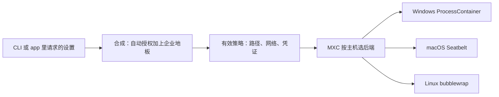

工作目录在 `/work/app`。仓库根上还有 `README.md`，旁边是 `.env`，家目录里有一份云凭证。Agent 要跑测试、读仓库、推分支。上一篇记的是云上的整机：进去之后像一台电脑，凭证注入和出站另记一笔。笔记本上的这一笔更早就要写清。哪些路径能读、能写，出站和本机网络各开哪一扇，Git 和 `gh` 的凭证进不进这次执行。

2026-10-07，GitHub 把 Copilot 的本地沙箱标成一般可用。Copilot CLI、Copilot app，以及使用 Agent Host 的 VS Code 会话都能用，含在 Copilot 席位里，不另收费。Microsoft eXecution Container（MXC）把同一份沙箱策略交给 Windows、macOS、Linux 上各自的原生控制。要核对的是合成之后的有效策略：自动授权加上只能收紧的企业地板。

<!-- more -->

## 一般可用的是本地这一半

[10 月 7 日的 changelog](https://github.blog/changelog/2026-10-07-local-sandboxing-for-github-copilot-now-generally-available/)（Allison，2026-10-07T08:46:17-07:00）把范围写在这三处客户端上。Copilot 发起的工具和命令，按开发者或组织定的策略，限制文件系统、网络、凭证和其他系统能力。本地沙箱由 MXC 驱动。同一则列出可以做的事：限制能读能改的文件和目录；控制互联网、本地网络、Git 凭证和 GitHub CLI 凭证；在支持的地方把沙箱用到本地工具和服务，包括本地 MCP 和语言服务器；用企业托管设置要求打开沙箱，并执行开发者不能放宽的策略。

模型那一句要单独留下。原文是：Model execution and tool isolation are separate concerns. Sandbox policies apply to tool execution regardless of which model Copilot uses. 策略打在工具执行上。这次会话选哪个模型，不改变这张策略打在谁身上。

[10 月 9 日的周报](https://github.blog/changelog/2026-10-09-github-copilot-weekly-releases-october-5/)（Allison，2026-10-09T15:58:23-07:00）把同一范围又说了一遍：本地沙箱已在 CLI、Copilot app 和 VS Code Agent Host 会话里一般可用，含在 Copilot 里，不另收费。同一周的 CLI 条目是另一件事。`/model` 可以发现本机 Ollama 上的模型。周报没有写 Ollama 的推理跑在沙箱里。这和 7 日那句「模型执行和工具隔离分开」对得上，两边都没有把推理放进沙箱策略。

往前两步，写下来的范围不一样。

| 日期 | 当时的本地沙箱 |
|------|----------------|
| 2026-06-02 | [公开预览](https://github.blog/changelog/2026-06-02-cloud-and-local-sandboxes-for-github-copilot-now-in-public-preview/)（Allison）。`/sandbox enable` 限制该会话里 Copilot 发起的 shell。公告写明这一版聚焦 shell，并把它当成更宽的 CLI 隔离的地基。基于 MXC，含在标准席位里。企业可通过 Intune 等 MDM 集中执行 |
| 2026-09-23 | [Copilot app 公开预览](https://github.blog/changelog/2026-09-23-local-sandboxing-in-the-github-copilot-app/)（Allison）。按项目配置，只覆盖本地仓库和工作树。文件系统是额外的读写、只读和拒绝。网络是出站和本地两项。凭证是 Git 与 GitHub CLI。有效策略可以比项目请求更严。操作系统执行不了所请求的策略时，沙箱 shell 报错，不裸跑 |
| 2026-10-07 | 一般可用。CLI、app、使用 Agent Host 的 VS Code 会话。本地 MCP 和语言服务器在支持处可进沙箱 |

云沙箱在我 2026-10-11 读到的 [About 页](https://docs.github.com/en/copilot/concepts/security-governance-and-network-settings/about-cloud-and-local-sandboxes) 上仍标着公开预览。`copilot --cloud` 仍要实验功能开关。文档写它跑在 GitHub 托管的临时 Linux 里，底层是 Azure Container Apps Sandboxes。计费表三行：计算 $0.000024 / 秒，内存 $0.000003 / GiB·秒，停止会话的快照存储 $0.005 / GiB·月。这是页面上的标价。我没有开过云会话。本地沙箱写的是含在标准席位里，不另收费。

[上一篇](https://cfireworks.github.io/2026/10/05/2026-10-05-agent-computer-egress-credential-boundary/) 记的是 Modal 的 VM 和 Docker 的云上 microVM。进去之后像一台电脑，要守的是凭证注入和出站。笔记本上的 Copilot 会话先要有一张策略面：路径、网络、Git 和 `gh` 凭证，以及合成后的有效策略。

## 一份策略，落在轻的那一头

About 页把隔离放在一条谱上。强的一头是完整的 hypervisor 或容器，轻的一头是操作系统级的进程和文件系统约束。本地沙箱目前站在轻的一头。它限制进程能读、能写、能连到的网络。文档写明命令不跑在单独的虚拟机或容器里。要评估这个强度够不够，页面指向 [microsoft/mxc](https://github.com/microsoft/mxc)。

我 2026-10-11 读的是该仓库 main 上的提交 `c6f301d53a1430c4c921a05c57af838f7392348f`（提交时间 2026-10-09T21:35:15Z，许可证 MIT）。README 写 MXC 是沙箱化的代码执行系统，后端从操作系统原生的进程沙箱一直到完整虚拟机，外面是同一套约束模型和类型化 SDK。默认后端和 Copilot 文档点名的后端并列在下面。

| 平台 | MXC README 的默认后端 | Copilot 文档点名的实现 |
|------|----------------------|------------------------|
| Windows 11 | `processcontainer`。schema 写它在运行时按主机能力和 `--experimental` 落到 AppContainer 或 BaseContainer | [配置页](https://docs.github.com/en/copilot/how-tos/cloud-and-local-sandboxes/configuring-local-sandbox-settings)要求 BaseContainer 这一档。Windows 11 25H2 加 KB5124010，或 26H1 加 KB5124006 |
| Linux | `bubblewrap` | bubblewrap。`bwrap` 0.5.0 或更新，且在 PATH 上。策略允许出站时，About 页还要求 `slirp4netns`、util-linux 2.35 起的 `unshare` 与 `nsenter`、iptables 家族，以及 `/dev/net/tun` |
| macOS | `seatbelt`。schema 写需要 macOS 15 或更新 | Seatbelt。About 页写用 macOS 15（Sequoia）或更新。更老的系统 CLI 不拦，但后端没在那里测过 |

[schema.md](https://github.com/microsoft/mxc/blob/c6f301d53a1430c4c921a05c57af838f7392348f/docs/schema.md) 里，抽象值 `"process"` 解析成 Windows 的 `processcontainer`、Linux 的 `bubblewrap`、macOS 的 `seatbelt`。同一张表还有 `"vm"` 和 `"microvm"`。README 把 `windows_sandbox`、`microvm`、`hyperlight`、`isolation_session` 标成实验。Copilot 的 About 页没有说本地沙箱走这些更重的后端，并写明不在单独的虚拟机或容器里跑命令。我没有反编译 Copilot，也没有看到它提交给 MXC 的 JSON。文档点名的三个后端，和 MXC 把 `"process"` 解析到的三个名字对得上。Copilot 有没有传入 `--experimental`、有没有锁在 BaseContainer，要看调用参数。这次没有那些参数。

三边的网络并不一样严。配置文档写：macOS 和 Linux 上，沙箱把出站连接限制到本地代理，不理会代理环境变量的程序不能改走直连。Windows 上，代理和主机规则依赖程序自己遵守代理设置。忽略代理的程序可以直连，从而绕过主机规则。Linux 上，bubblewrap 不能为沙箱里拉起的进程单独开关本地网络，包括 shell 和本地 MCP、语言服务器。本地网络这项仍然管得到进程内的操作，例如 web 请求和远程 MCP 连接。这台机器的 PATH 上没有 `bwrap`。我没有安装它来冒充一次 Copilot 沙箱。



## 请求的设置，和合出来的有效策略

CLI 在每个沙箱进程起来之前解析有效策略，用当前目录、环境、设置和自动授权。[文件系统策略](https://docs.github.com/en/copilot/concepts/agents/copilot-cli/understanding-local-sandboxing)写明默认拒绝：没有明确授权的路径不能用。授权分三档：读写、只读、拒绝。

Include working directory 默认开着。这是 CLI 文件系统设置里的一项。开着时，当前工作目录是读写。在 Git 仓库里还会加上文档里的 Git 授权：仓库的 `.git` 读写，工作目录之上的仓库其余部分只读。工作目录自己仍是读写，因为重叠时更具体的路径赢。关掉这个开关，这些自动授权全部拿掉。配置页写明，关掉之后 `status`、`add`、`commit`、`diff` 会失败，除非手动把 `.git` 加回去。企业管理员可以把这个开关关掉并锁上。

app 的项目设置写的是另一句默认值：沙箱会话对工作区和当前工作目录有读写。那里的列表是额外读写、额外只读和拒绝。我读到的 app 小节没有把「子目录读写、仓库其余部分只读」再写一遍。下面的解析器采用 CLI 这套自动授权。不要把两句默认值当成同一句话。

只读和读写重叠时，更具体的路径赢。拒绝优先于两种授权。app 写的是：更具体的拒绝目录，在更宽的父目录仍有读或写时，仍然拒绝。父目录被拒绝、子目录另给一条更长的授权，两页都没有给例子。解析器按「更长的路径赢，同样长时拒绝优先」处理。这次输出里的拒绝都比对应的授权更长。那条没给例子的组合，只记在输出的 `overlap` 一行里。

企业托管设置朝更严的方向合，不靠「后写的来源覆盖先写的来源」。文件系统策略写：和大多数单一来源说了算的设置不同，沙箱策略把当时生效的每个来源合在一起。服务器托管、MDM、文件型托管设置彼此之间，以及和你自己的设置之间，都朝更严走。必须打开的开关保持打开，拒绝路径累加，允许你授权的路径只能变窄。网络页对主机规则写了同一方向：企业规则只能收窄允许列表，不能放宽。`/sandbox` 里被管住的项标成 `(managed)`，改不动。

凭证在 CLI 里默认开着，进沙箱的是占位符。本地代理只在发往批准过的 HTTPS 目的地的请求头里放上真凭证。Git 保留原来的主机、端口和仓库路径。`gh` 只用在 `github.com`、`api.github.com` 和 `uploads.github.com`。上一篇那个代理是我自己写的 HTTP。这里的代理行为来自文档，这次没有跑 Copilot。

还有两处文档把「进程被操作系统看住」收窄了。About 页写，CLI 自带的文件读写工具跑在 CLI 进程里面。操作系统沙箱看不到这些调用，于是这些工具自己按策略做检查，用词是 best-effort。远程 MCP 不在本机，没有本地子进程可沙箱，文件系统策略约束不到它们。Sandbox MCP servers 开着时，从 CLI 出去的连接仍可以被网络策略限制。本地 MCP 和语言服务器默认跑在沙箱里，除非托管策略要求保持这样。CLI 的 Sandbox MCP servers 和 Sandbox LSP servers 默认开着。

`/sandbox policy` 打出来的才是有效策略：自动授权、你的设置和托管限制合完之后的路径、网络和能力。后面可以加一条命令，例如 `/sandbox policy npm install`，只看它会拿到的开发工具访问，不真的运行。我没有 Copilot 席位。下面没有伪造这段输出。

## 用标准库合了一遍

脚本在 `demos/copilot-local-sandbox-policy/run_demo.py`。它只编码上面核对过的规则。开发工具目录、PATH、包管理缓存没有建模。那些授予随命令和项目变化，文档说要看 `/sandbox policy` 的 Dev tools 一节。

布尔值的地板是：托管要求关掉时结果为关；否则留下请求里的值。请求已经是关，地板不会把它打开。

```python
def tighten_bool(requested: bool, force_off: bool) -> bool:
    if force_off:
        return False
    return requested
```

场景用的是虚构路径。工作目录 `/work/app`，仓库根 `/work`。请求把 `/work/shared-notes` 设为读写，把 `/opt/vendor-sdk` 和 `/home/dev/.aws` 设为只读，拒绝 `/work/app/secrets`。出站开，本地网络关，Git 和 `gh` 凭证都开。本地网络这次是请求里关掉的。CLI 文档的默认是出站开、本地网络关；app 文档的默认是两项都开。企业地板要求沙箱开着、禁止绕过，允许授权的前缀只有 `/work` 和 `/opt/vendor-sdk`，另外拒绝 `/work/.env`，并强制关掉出站和 Git 凭证。`gh` 没有被强制关掉。

路径判定取匹配规则里最长的那条。读取在读写或只读上通过，写入只在读写上通过。没有匹配就是默认拒绝。

操作系统那三行是按文档印出来的决定，不是这台机器上的沙箱。配置页写：应用可以先收下设置，等第一次沙箱 shell 启动时再检查操作系统能不能执行。执行不了，shell 以 unsupported-platform 或 unsupported-policy 失败，不裸跑。Windows 上如果当前能力保证不了拒绝路径，命令失败，不会在拒绝路径仍可访问的情况下运行，也不会去掉沙箱运行。About 页另外写了一支。主机根本不支持沙箱时，仅来自用户偏好的开启会在当次会话关掉，并说明命令和服务将不带沙箱运行。保存的 `sandbox.enabled` 不变。在这种主机上 `/sandbox enable` 会被拒绝。托管设置把 `sandbox.enabled` 和 `sandbox.failIfUnavailable` 都设为 true 时，CLI 在执行不了沙箱的情况下阻止该会话的模型请求和工具执行。

我执行的命令是：

```bash
python3 demos/copilot-local-sandbox-policy/run_demo.py
```

环境是 Python 3.12.3。连续两次标准输出一致。`effective_sha256_12` 是这份有效策略的规范 JSON 做 SHA-256 之后的前 12 位，脚本自己算的。下面是一次完整输出。

```text
python 3.12.3
demo copilot-local-sandbox-policy
resolver_only yes
copilot_cli no
mxc_spawn no
os_sandbox no
== requested ==
sandbox_enabled on
include_working_directory on
cwd /work/app
repo_root /work
read_write /work/shared-notes
read_only /opt/vendor-sdk,/home/dev/.aws
deny /work/app/secrets
outbound_internet on
local_network off
git_credentials on
gh_credentials on
== managed floor ==
require_sandbox on
allow_bypass off
lock_include_working_directory_off off
grant_prefixes /work,/opt/vendor-sdk
deny_paths /work/.env
force_outbound_off on
force_local_network_off off
force_git_credentials_off on
force_gh_credentials_off off
== effective ==
sandbox_enabled on
include_working_directory on
outbound_internet off
local_network off
git_credentials off
gh_credentials on
allow_bypass off
dropped_grants /home/dev/.aws
rule read_only /opt/vendor-sdk source=user
rule read_only /work source=automatic
rule deny /work/.env source=managed
rule read_write /work/.git source=automatic
rule read_write /work/app source=automatic
rule deny /work/app/secrets source=user
rule read_write /work/shared-notes source=user
note sandbox required stays on
note managed deny added /work/.env
note automatic read_write /work/app
note automatic read_write /work/.git
note automatic read_only /work
note outbound tightened off
note git_credentials tightened off
note user local_network off stays off
effective_sha256_12 3170acf23677
overlap more_specific_path_wins deny_breaks_equal_length_tie
== commands ==
ALLOW read /work/app/src/main.py via automatic /work/app read_write
ALLOW write /work/app/src/main.py via automatic /work/app read_write
ALLOW read /work/README.md via automatic /work read_only
DENY write /work/README.md via automatic /work read_only
ALLOW read /work/.git/HEAD via automatic /work/.git read_write
ALLOW write /work/.git/index via automatic /work/.git read_write
DENY read /work/app/secrets/token via user /work/app/secrets deny
DENY read /work/.env via managed /work/.env deny
DENY read /home/dev/.aws/credentials via deny-by-default
DENY network outbound host=registry.npmjs.org via outbound off
DENY network local host=127.0.0.1 via local_network off
DENY git push via git_credentials off + outbound off
DENY gh pr create via outbound off
== cannot loosen ==
loosen_attempt sandbox off, outbound on, local_network on, git on, drop user deny, add /tmp/outside-grant-ceiling
loosen_result sandbox on outbound off local_network on git off user_deny_secrets off managed_deny_env on dropped yes
tighten_attempt gh_credentials off
tighten_result gh off
session_opt_out allow_bypass=off -> refused saved_policy_unchanged
== include locked off ==
include_working_directory off
DENY read /work/.git/HEAD via deny-by-default
DENY read /work/app/src/main.py via deny-by-default
== launch decisions ==
case denied_path_unsupported
mode simulated_documented_decision
host_supports_sandbox yes
can_enforce_denied_paths no
command read /work/app/src/main.py
path_policy ALLOW
result error unsupported-policy
executed no
ran_unsandboxed no
case user_preference_unsupported_host
mode simulated_documented_decision
host_supports_sandbox no
fail_if_unavailable no
managed_require_sandbox no
result session_sandbox_off
commands_run_without_sandbox yes
saved_enabled_unchanged yes
sandbox_enable_on_this_host refused
case managed_fail_if_unavailable
mode simulated_documented_decision
host_supports_sandbox no
fail_if_unavailable yes
managed_require_sandbox yes
result block_model_and_tool_execution
executed no
ran_unsandboxed no
checks passed
```

请求里的出站和 Git 凭证是开的，有效策略里都是关。`gh` 仍是开。`/home/dev/.aws` 不在企业允许授权的前缀里，被丢掉，读凭证文件走默认拒绝。`/work/app` 的读写比仓库根的只读更长，源码能写。`/work/README.md` 能读不能写。`.git` 能写。`/work/app/secrets` 比 `/work/app` 更长，拒绝赢。`/work/.env` 是企业加上的拒绝。

`git push` 同时卡在 Git 凭证和出站。`gh pr create` 只卡在出站，凭证开关还开着。文档里的真凭证还要经过代理和批准的主机。解析器只看这两个布尔值，没有模拟代理。

放宽那一次把沙箱关掉、出站和 Git 凭证打开、删掉用户自己的 secrets 拒绝，并多要 `/tmp/outside-grant-ceiling`。地板把沙箱、出站和 Git 凭证留在原处。用户自己的拒绝可以拿掉，企业的 `/work/.env` 还在。新路径被丢掉。本地网络没有被企业强制关掉，所以这次请求可以把它重新打开。再把 `gh` 关掉，结果是关：用户还能往更严走。`allow_bypass` 是关，会话级退出被拒绝，保存的策略不动。这是文档里托管要求沙箱且不允许绕过时的方向。若有效策略允许绕过，文档写 `/sandbox disable` 只关掉当前会话，不放宽保存的策略。这次地板不允许绕过，解析器没有走那一支，也没有去调 CLI。

Include working directory 被锁上之后，自动的工作目录和 `.git` 授权都没了。读源码和读 `HEAD` 都变成默认拒绝。这和配置页写的 Git 操作会失败，是同一条规则。

启动三行都标了 `simulated_documented_decision`。第一行：路径策略本来允许读源码，主机却执行不了拒绝路径，结果仍是 unsupported-policy，不执行，也不裸跑。第二行：主机不支持沙箱，又只有用户偏好，当次会话关掉沙箱，命令不带沙箱运行。第三行：托管要求加上 `failIfUnavailable`，模型和工具执行被挡住。第二行说明，机器上没有沙箱支持时，用户偏好那一支会落到不带沙箱运行。文档把「执行不了你请求的拒绝」和「主机不支持，且只是用户想开」分成两支。

## 对设置可以先做的核对

1. 核对有效策略。CLI 里用 `/sandbox policy`。保存下来的设置只是输入。app 的 Configured policy summary 反映选中的文件夹、网络和凭证。文档写明它不确认沙箱正在运行，也不列出每一条限制。
2. 敏感文件用更具体的拒绝。工作目录授权打开之后，仓库里工作目录以外的文件在 CLI 这套规则下默认可读。`.env` 要单独拒绝。
3. 出站、本地网络、Git、`gh` 四项分开关。用不到的先关。企业地板只能再收紧。用户自己关过、而地板没有强制关掉的项，用户仍可以重新打开。
4. 期望操作系统执行不了拒绝路径时，命令不启动。主机根本没有沙箱支持、又要避免用户偏好那一支不带沙箱运行，文档写的是托管设置里的 `sandbox.failIfUnavailable`。
5. 内置文件工具是软件核对。远程 MCP 不进本地文件系统沙箱。Windows 上忽略代理的程序可以绕过主机规则。这三句都在文档里。解析器没有覆盖。

## 结语

本地沙箱一般可用之后，笔记本上的 Agent 多了一张可以要求、可以收紧、也可以打出来看的策略。MXC 负责把这张策略交到三个操作系统的原生控制上。文档把它放在隔离谱比较轻的一头：限制读写和网络，命令仍在本机进程里。云上的整机和出站仍然是上一篇的账。这边要先对的，是工作目录打开之后还剩哪些路径，以及出站和凭证哪几项已经被地板关掉。

---

## 扩展阅读

- [Local sandboxing for GitHub Copilot now generally available](https://github.blog/changelog/2026-10-07-local-sandboxing-for-github-copilot-now-generally-available/)（Allison，2026-10-07）
- [GitHub Copilot weekly releases — October 5](https://github.blog/changelog/2026-10-09-github-copilot-weekly-releases-october-5/)（Allison，2026-10-09）
- [About cloud and local sandboxes for GitHub Copilot](https://docs.github.com/en/copilot/concepts/security-governance-and-network-settings/about-cloud-and-local-sandboxes)
- [Configuring local sandbox settings](https://docs.github.com/en/copilot/how-tos/cloud-and-local-sandboxes/configuring-local-sandbox-settings)
- [Understanding filesystem policies for local sandboxing](https://docs.github.com/en/copilot/concepts/agents/copilot-cli/understanding-local-sandboxing)
- [Using local sandboxing](https://docs.github.com/en/copilot/how-tos/cloud-and-local-sandboxes/using-local-sandboxing)
- [Cloud and local sandboxes now in public preview](https://github.blog/changelog/2026-06-02-cloud-and-local-sandboxes-for-github-copilot-now-in-public-preview/)（Allison，2026-06-02）
- [Local sandboxing in the GitHub Copilot app](https://github.blog/changelog/2026-09-23-local-sandboxing-in-the-github-copilot-app/)（Allison，2026-09-23）
- [microsoft/mxc](https://github.com/microsoft/mxc) 提交 `c6f301d`（MIT）
- [给 Agent 一台电脑后，守凭证与出站](https://cfireworks.github.io/2026/10/05/2026-10-05-agent-computer-egress-credential-boundary/)

---

*changelog、Copilot 文档与 microsoft/mxc 的 README、schema.md 核对于 2026-10-11。演示在 Python 3.12.3 上执行 `python3 demos/copilot-local-sandbox-policy/run_demo.py`，连续两次输出一致，有效策略摘要 `3170acf23677`。没有运行 Copilot CLI，没有调用 MXC，没有安装 bwrap，没有伪造 `/sandbox policy`。*

## 讨论

工作目录授权打开之后，仓库根上你还会单独拒绝哪些路径？企业把出站关掉之后，`gh` 凭证那一项在有效策略里还开着吗？
