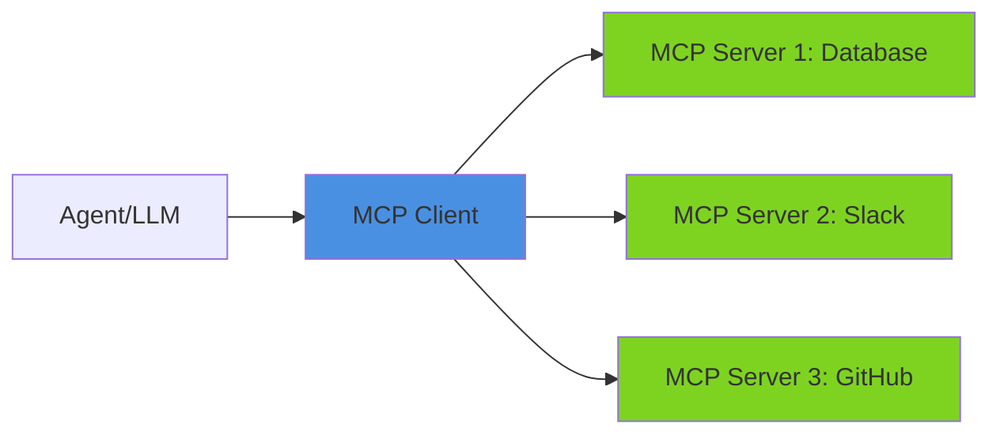
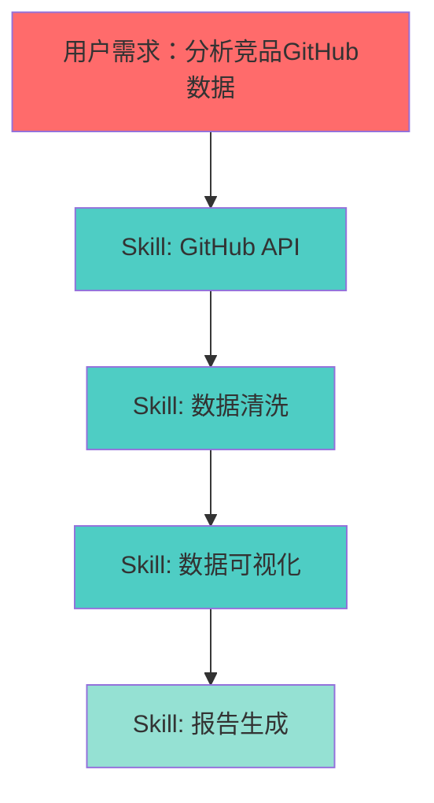
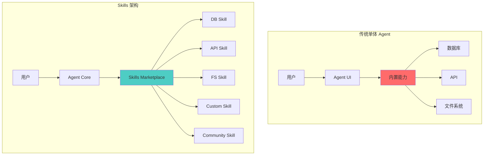
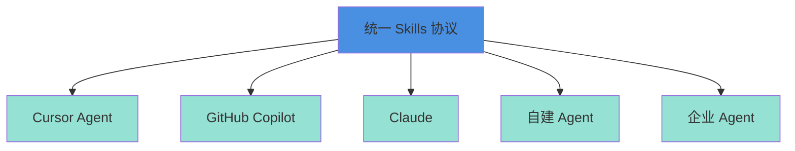

当我们谈论 AI Agent 时，大多数人想到的是「又一个带聊天框的产品」。但真正让 Agent 从玩具变成工具的，不是更花哨的 UI，而是**可扩展的技能系统**。

今天我们来深入聊聊 Agent Skills 和 AG-UI 协议，以及它们为什么是 Agent 生态的关键基础设施。

<!-- more -->

## 问题：Agent 的「技能危机」

### 现状的三个困境

目前的 AI Agent 产品面临三个核心问题：

1. **封闭的能力边界**：每个 Agent 产品都在重复造轮子，各自实现数据库连接、API 调用、文件操作等基础能力
2. **碎片化的生态**：用户需要在不同的 Agent 产品间切换，无法复用已有的配置和工作流
3. **缺乏专业深度**：通用 Agent 难以满足垂直领域的专业需求（如医疗诊断、法律咨询、金融分析）

让我们用一个对比表来看看传统方案 vs. Skills 协议的差异：

| 维度 | 传统 Agent 架构 | Skills 协议架构 |
|------|----------------|----------------|
| **能力扩展** | 产品内置，厂商控制 | 社区贡献，用户安装 |
| **专业深度** | 浅层通用能力 | 可深度定制垂直能力 |
| **生态协作** | 封闭孤岛 | 开放互通 |
| **更新速度** | 依赖版本发布 | 即时安装更新 |
| **用户控制** | 被动接受 | 主动选择 |

### 真实案例：为什么 ChatGPT Plugins 难以普及

ChatGPT 曾推出 Plugins 系统，但遇到两个致命问题：

1. **发现困难**：用户不知道有哪些 Plugin，也不知道什么场景该用哪个
2. **调用不稳定**：Agent 经常「忘记」调用 Plugin，或者调用错误的 Plugin

这不是技术问题，而是**协议设计问题**。

## 解决方案：从 MCP 到 Skills

### MCP（Model Context Protocol）：基础设施层

Anthropic 提出的 MCP 协议解决了「Agent 如何调用外部工具」的标准化问题：



MCP 的核心价值：
- **标准化接口**：统一的工具描述和调用协议
- **安全沙箱**：隔离的执行环境
- **状态管理**：上下文和会话的持久化

### AG-UI（Agent-UI）：交互增强层

但 MCP 只解决了「能力调用」，没有解决「用户体验」。AG-UI 在 MCP 之上增加了：

1. **Rich Components**：不只是文本，还有表单、图表、交互式组件
2. **Workflow Hints**：告诉 Agent 什么时候该用什么技能
3. **User Confirmation**：敏感操作的二次确认机制

```typescript
// AG-UI Skills 定义示例
{
  "skill_id": "database_query",
  "trigger_patterns": ["查询数据库", "执行SQL", "数据分析"],
  "ui_components": {
    "input": {
      "type": "code_editor",
      "language": "sql",
      "schema_autocomplete": true
    },
    "output": {
      "type": "data_table",
      "allow_export": true,
      "enable_visualization": true
    }
  },
  "safety": {
    "require_confirmation": true,
    "read_only_preview": true
  }
}
```

### Skills Protocol：组合的力量

Skills 协议的最大创新在于**可组合性**：



一个复杂任务可以分解为多个 Skill 的组合，每个 Skill 专注做好一件事。

## 技术深入：Skills 的实现机制

### 1. Skill Discovery（技能发现）

传统的「搜索 Plugin」模式已被证明失败。Skills 协议采用**语义匹配**：

```python
# Skill 注册时提供语义元数据
skill_metadata = {
    "name": "PostgreSQL查询助手",
    "semantic_tags": [
        "数据库查询",
        "SQL执行",
        "数据分析",
        "报表生成"
    ],
    "example_queries": [
        "查询最近7天的用户增长",
        "分析订单转化率",
        "统计各地区销售额"
    ],
    "capability_embedding": embedding_vector  # 用 LLM 生成的语义向量
}

# Agent 运行时自动匹配
user_query = "帮我看看上周新增了多少用户"
matched_skill = semantic_search(user_query, available_skills)
# 返回：PostgreSQL查询助手 (匹配度: 0.89)
```

### 2. Skill Composition（技能编排）

多个 Skill 如何协作？通过**数据流管道**：

```yaml
# 工作流定义
workflow: "竞品分析报告"
steps:
  - skill: github_stars_fetcher
    output: raw_data
  
  - skill: data_cleaner
    input: ${raw_data}
    output: cleaned_data
  
  - skill: trend_analyzer
    input: ${cleaned_data}
    output: insights
  
  - skill: report_generator
    input: ${insights}
    template: competitive_analysis
    format: markdown
```

### 3. Safety & Permissions（安全与权限）

Skills 不是黑盒，每个操作都要明确权限：

```json
{
  "permissions": {
    "network": {
      "allowed_domains": ["api.github.com"],
      "rate_limit": "100/hour"
    },
    "filesystem": {
      "read": ["/data/cache"],
      "write": ["/data/output"]
    },
    "sensitive_actions": {
      "database_write": "require_confirmation",
      "email_send": "require_confirmation",
      "payment": "disabled"
    }
  }
}
```

## 对比：传统方案 vs. Skills 架构

### 架构对比图



### 开发体验对比

**传统方式：为 Agent 添加新能力**

```python
# 需要修改 Agent 核心代码
class Agent:
    def __init__(self):
        self.tools = {
            "database": DatabaseTool(),
            "api": APITool(),
            # 每次添加新能力都要改这里
            "new_tool": NewTool()  # 需要重新发布版本
        }
```

**Skills 方式：安装新技能**

```bash
# 用户自己安装，无需等待产品更新
agent skills install github-analyzer
agent skills install pdf-parser
agent skills install custom-workflow
```

## 实践建议：如何拥抱 Skills 生态

### 对于 Agent 产品开发者

1. **优先支持 MCP 协议**：确保你的 Agent 能调用标准 MCP Servers
2. **开放 Skills 接口**：允许用户和社区贡献 Skills
3. **提供 Skills Playground**：让用户可以测试和调试 Skills

```typescript
// 推荐的 Skills SDK 接口设计
class SkillSDK {
  // 注册新技能
  register(skill: SkillDefinition): void
  
  // 技能调用
  async execute(skillId: string, input: any): Promise<any>
  
  // 技能组合
  compose(skills: string[]): Workflow
  
  // 权限管理
  requestPermission(permission: Permission): Promise<boolean>
}
```

### 对于企业和开发者

1. **不要重复造轮 Agent**：先看看有没有现成的 Skill 能解决问题
2. **贡献垂直领域 Skill**：把你的专业知识封装成可复用的 Skill
3. **建立 Skills 库**：团队内部共享和复用 Skills

### 对于用户

1. **学会「组装」Agent**：像搭积木一样组合 Skills
2. **参与社区**：分享你发现的好用 Skills
3. **自定义工作流**：把重复性工作封装成 Skills

## 未来展望：Skills 生态的想象空间

### 1. Skills Marketplace

类似 VS Code Extensions 或 Chrome Web Store：

- 开发者发布 Skills，用户一键安装
- 社区评分和评论系统
- 付费 Skills 和订阅模式

### 2. Skills as Code

把工作流写成代码，版本管理：

```yaml
# .agent-skills.yml
version: 1.0
skills:
  - id: postgres-query
    version: ^2.0.0
  - id: slack-notifier
    version: ~1.5.0
  - id: custom-reporter
    source: ./local-skills/reporter

workflows:
  daily-report:
    trigger: cron(0 9 * * *)
    steps:
      - postgres-query
      - custom-reporter
      - slack-notifier
```

### 3. 跨 Agent 平台的 Skills

Skills 协议应该是**平台无关**的：

- Cursor 的 Skills 可以在 Copilot 里用
- ChatGPT 的 Skills 可以在本地 Agent 里用
- 企业私有 Skills 可以在任何支持协议的 Agent 里用



## 结语

AI Agent 的未来不是「谁的聊天框更好看」，而是「谁的技能生态更繁荣」。

就像智能手机的价值不在于手机本身，而在于 App Store；Agent 的价值也不在于 LLM 本身，而在于 Skills Marketplace。

**可安装的技能，才是 Agent 真正的护城河。**

---

## 扩展阅读

- [Anthropic MCP 协议文档](https://modelcontextprotocol.io/)
- [Cursor Skills 开发指南](https://docs.cursor.com/skills)
- [AG-UI 规范草案](https://github.com/ag-ui/spec)

## 讨论

你认为 Skills 协议最大的挑战是什么？欢迎在 GitHub Issues 里讨论。

---

*本文所有示意图使用 Mermaid 绘制，代码示例基于主流 Skills 协议实现。*
