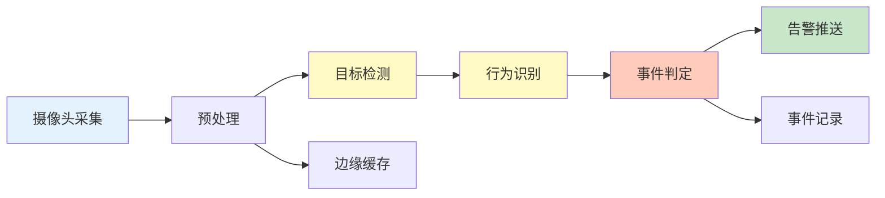
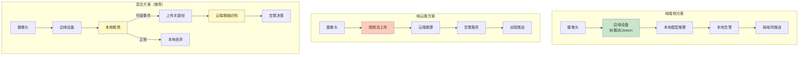

> 本文写于 2026 年 9 月，回溯 2025 年初在视觉检测应用于看护与安全场景时的工程实践与思考。

当计算机视觉遇到婴儿看护、老人跌倒检测、异常行为识别等真实场景时，我们面对的不仅是算法精度问题，更是**隐私保护、实时性、误报容忍度**之间的复杂权衡。本文记录了在这类场景中构建视觉检测系统的工程考量。

<!-- more -->

## 问题定义：看护场景的特殊性

视觉检测在安防、工业质检等领域已有成熟应用，但**看护与安全场景**有其独特挑战：

### 三大核心矛盾

1. **实时性 vs. 隐私保护**
   - 看护场景需要持续监控，但用户对隐私高度敏感
   - 云端处理响应快但数据需上传；端侧处理保护隐私但算力受限

2. **高敏感度 vs. 低误报**
   - 婴儿翻身、老人跌倒等事件不能漏报，但频繁误报会导致「狼来了」效应
   - 场景复杂度高：光照变化、遮挡、多人干扰

3. **通用方案 vs. 个性化需求**
   - 不同家庭的监控区域、告警阈值、行为模式差异大
   - 需要在通用检测能力和个性化适配间找到平衡

### 典型应用场景对比

| 场景类型 | 检测目标 | 延迟要求 | 误报容忍度 | 隐私敏感度 |
|---------|---------|---------|-----------|-----------|
| 婴儿看护 | 翻身、哭闹、异常姿态 | < 3s | 低（误报影响休息） | 极高 |
| 老人看护 | 跌倒、长时间静止 | < 5s | 极低（漏报危险） | 高 |
| 公共安全 | 异常聚集、可疑行为 | < 10s | 中（人工复核） | 中 |
| 智能家居 | 人员在家状态 | < 30s | 高（辅助功能） | 高 |

从这个对比可以看出，**看护场景往往同时要求低延迟、低误报和高隐私**，这在技术上是最具挑战性的组合。

## 检测管线：从采集到告警的完整链路

一个完整的视觉检测系统由以下模块组成：



### 2.1 视频采集与预处理

**关键决策：采样率与分辨率**

在实际部署中，并非越高越好：

- **帧率选择**：婴儿/老人看护场景中，3-5 FPS 通常足够捕捉缓慢动作，无需 30 FPS
- **分辨率权衡**：640x480 对于姿态检测已经足够；更高分辨率带来的精度提升不足以弥补算力消耗

```python
# 典型预处理流程伪代码
def preprocess_frame(raw_frame):
    # 降采样：减少计算量
    frame = resize(raw_frame, target_size=(640, 480))
    
    # ROI 提取：只处理关键区域（如婴儿床区域）
    roi = extract_roi(frame, predefined_region)
    
    # 光照归一化：应对日夜变化
    normalized = normalize_illumination(roi)
    
    # 隐私保护：可选的边缘化处理
    if privacy_mode:
        normalized = edge_detection(normalized)  # 只保留轮廓
    
    return normalized
```

### 2.2 检测与识别模型

**模型选型：精度与速度的平衡**

| 模型类型 | 典型代表 | 推理速度(端侧) | 适用场景 |
|---------|---------|--------------|---------|
| 轻量级检测 | MobileNet-SSD | ~50ms/frame | 实时检测，对精度要求不高 |
| 中等模型 | YOLOv5s | ~100ms/frame | 平衡方案，适合大多数场景 |
| 姿态估计 | OpenPose Lite | ~200ms/frame | 跌倒检测等需要姿态信息 |
| 行为识别 | TSM (Temporal) | ~300ms/clip | 连续动作识别（如挣扎） |

在 2025 年初的实践中，我们采用了**分层检测策略**：

1. **粗筛层（高频）**：轻量级检测判断是否有人/婴儿出现（5 FPS）
2. **精细层（触发式）**：检测到目标后启动姿态/行为分析（仅在必要时）
3. **决策层（低频）**：综合多帧信息判断是否触发告警（1 次/秒）

### 2.3 事件判定与告警

**避免「狼来了」：告警逻辑设计**

单纯的阈值判断会导致大量误报。更可靠的方案是**时序窗口 + 置信度累积**：

```python
class EventDetector:
    def __init__(self):
        self.event_buffer = []  # 滑动窗口
        self.window_size = 15   # 15 帧 ≈ 3秒
        self.alert_threshold = 0.7
    
    def update(self, detection_result):
        # 添加当前帧的检测结果
        self.event_buffer.append(detection_result)
        
        # 维持窗口大小
        if len(self.event_buffer) > self.window_size:
            self.event_buffer.pop(0)
        
        # 计算窗口内的平均置信度
        avg_confidence = sum(self.event_buffer) / len(self.event_buffer)
        
        # 只有持续高置信度才触发告警
        if avg_confidence > self.alert_threshold:
            return self.trigger_alert()
        
        return None
```

这种设计的核心思想是：**真实事件会持续存在，偶然误检会迅速消失**。

## 端侧 vs. 云端：隐私与性能的抉择

这是看护场景最敏感的架构决策。

### 3.1 三种部署架构对比



**实际对比**：

| 维度 | 纯端侧 | 纯云端 | 混合方案 |
|------|-------|-------|---------|
| 隐私保护 | ★★★★★ | ★☆☆☆☆ | ★★★★☆ |
| 实时性 | ★★★★☆ | ★★☆☆☆ | ★★★★☆ |
| 算法精度 | ★★★☆☆ | ★★★★★ | ★★★★☆ |
| 网络依赖 | ★★★★★（无需） | ★☆☆☆☆（强依赖） | ★★★☆☆（弱依赖） |
| 成本 | 中（一次性硬件） | 低（按用量付费） | 中（混合） |

### 3.2 混合方案的隐私保护实践

即使采用混合方案，也需要严格的隐私保护措施：

1. **最小化上传原则**：只上传检测框区域，不上传完整画面
2. **数据脱敏**：对人脸区域打码或仅提取关键点
3. **用户控制**：提供明确的「仅本地模式」开关
4. **数据生命周期**：云端数据自动 7 天过期删除

```python
# 隐私保护的上传策略
def privacy_aware_upload(frame, detection_bbox):
    # 只裁剪检测区域
    cropped = crop_region(frame, detection_bbox)
    
    # 人脸模糊化
    if contains_face(cropped):
        cropped = blur_faces(cropped)
    
    # 压缩降质（进一步减少信息泄露）
    compressed = jpeg_compress(cropped, quality=70)
    
    # 加密传输
    encrypted = aes_encrypt(compressed, user_key)
    
    return encrypted
```

## 误报与漏报：产品边界的权衡

在工程实践中，我们发现**不同场景对误报/漏报的容忍度完全不同**：

### 4.1 婴儿看护场景

**核心矛盾**：父母希望「睡得安心」，但又不能被频繁误报打扰。

我们的策略：

- **白天模式**：较高灵敏度，允许一定误报（父母可以快速确认）
- **夜间模式**：提高告警阈值，减少误报（避免影响睡眠）
- **学习模式**：记录用户反馈，逐步适应环境

实际数据（2025年1-2月内测）：

- 初始误报率：15-20 次/天
- 优化后误报率：2-3 次/天（可接受范围）
- 漏报率：< 1%（通过冗余检测降低）

### 4.2 跌倒检测场景

**生命安全优先**：宁可误报 10 次，不能漏报 1 次。

技术措施：

- **多模融合**：视觉 + 声音检测（摔倒往往伴随声响）
- **冗余告警**：同时推送给多个联系人
- **降级策略**：网络故障时启用本地蜂鸣器

### 4.3 告警疲劳问题

当误报率过高时，用户会逐渐忽视告警——这是最危险的状态。

应对方案：

```yaml
# 告警优先级分级
alerts:
  critical:  # 立即推送 + 响铃
    - 跌倒检测
    - 长时间无响应
  warning:   # 推送通知
    - 异常姿态
    - 活动区域改变
  info:      # 仅记录，不推送
    - 日常活动统计
    - 睡眠质量分析
```

## 工程检查清单

基于上述实践，总结以下检查清单供类似项目参考：

### 架构设计阶段

- [ ] 明确隐私保护的底线（端侧优先 or 云端可接受？）
- [ ] 评估目标硬件的算力（树莓派 4B / Jetson Nano / 云端？）
- [ ] 设计降级方案（网络故障时如何继续工作？）
- [ ] 规划数据生命周期（本地保留多久？云端保留多久？）

### 模型选型阶段

- [ ] 在目标硬件上实测推理速度（而非只看论文数据）
- [ ] 准备场景相关的测试集（通用数据集往往不够）
- [ ] 验证不同光照/角度下的鲁棒性
- [ ] 评估模型更新策略（如何 OTA？）

### 产品化阶段

- [ ] 设计用户可调节的敏感度设置
- [ ] 提供清晰的告警原因说明（为什么触发告警？）
- [ ] 建立用户反馈机制（误报/漏报标注）
- [ ] 制定告警疲劳的监控指标（如何判断用户开始忽略告警？）

### 隐私合规阶段

- [ ] 明确告知用户数据采集范围
- [ ] 提供「仅本地模式」开关
- [ ] 实现数据导出与删除功能
- [ ] 准备隐私政策与合规文档

## 延伸阅读与参考

以下是在该领域实践中参考的相关资源：

### 学术论文

- [Real-time Fall Detection Using Pose Estimation](https://arxiv.org/abs/2008.07648) - 基于姿态估计的跌倒检测
- [Privacy-Preserving Action Recognition](https://openaccess.thecvf.com/content/CVPR2021/papers/Wu_Privacy-Preserving_Action_Recognition_CVPR_2021_paper.pdf) - 隐私保护的行为识别

### 开源项目

- [OpenPose](https://github.com/CMU-Perceptual-Computing-Lab/openpose) - 实时多人姿态估计
- [YOLOv5](https://github.com/ultralytics/yolov5) - 适合边缘部署的目标检测
- [MediaPipe](https://google.github.io/mediapipe/) - Google 的轻量级视觉方案

### 硬件平台

- [NVIDIA Jetson Nano](https://developer.nvidia.com/embedded/jetson-nano-developer-kit) - 入门级边缘 AI 设备
- [Raspberry Pi 4](https://www.raspberrypi.org/) + Coral TPU - 低成本方案
- [Intel NUC](https://www.intel.com/content/www/us/en/products/details/nuc.html) - x86 边缘计算方案

### 隐私标准

- [GDPR 合规指南](https://gdpr.eu/) - 欧盟数据保护标准
- [ISO/IEC 27001](https://www.iso.org/isoiec-27001-information-security.html) - 信息安全管理

## 总结

视觉检测在看护与安全场景的应用，本质上是**技术能力与用户信任**的平衡艺术。单纯追求算法精度不足以构建可落地的产品，必须同时考虑：

1. **隐私保护**：端侧优先，最小化数据采集
2. **实时性**：分层检测，按需触发精细分析
3. **可靠性**：时序窗口判定，降低误报率
4. **可控性**：用户可调节敏感度，明确告警原因

这些原则不仅适用于婴儿/老人看护，也可推广到更多垂直场景（宠物监护、工厂安全等）。未来随着边缘算力提升和隐私计算技术成熟，更多创新应用将成为可能。

---

*本文基于 2025 年初的工程实践回溯整理，部分技术细节已做泛化处理以保护隐私。*
